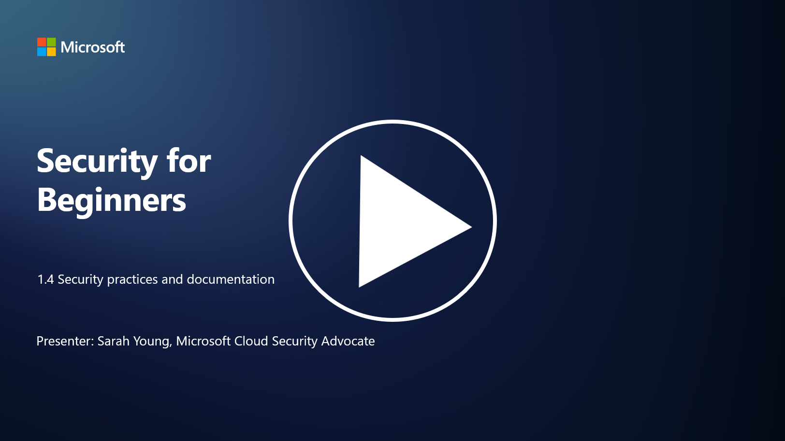

# Security practices and documentation 

You may have heard the phrases “security policy”, “security standard”, etc. used before, but the reality is that many cybersecurity professionals don’t use them properly, so in this section we will explain what each of these phrases mean and why an organization would utilize these.

## Introduction

In this lesson, we’ll cover:

 - What is a security policy?
   
 - What is a security standard?

   

 - What is a security baseline?

   

 - What is a security guideline?
 - What is a security procedure?

   

 - What are laws and regulations in the context of cybersecurity?

These terms are often used in the context of cybersecurity to define different levels of security documentation and practices within an organization. Let's clarify each term:

## What is a security policy?

A security policy is a high-level document that outlines an organization's overarching security goals, principles, and guidelines. It provides a framework for making security-related decisions and sets the tone for the organization's security posture. Security policies typically cover topics such as acceptable use of resources, data protection, access control, incident response, and more. A policy is is solution and technology independent. An example of a security policy that many would be familiar with would be an organization’s acceptable use policy.

## What is a security standard?

A security standard is a more detailed and specific document that provides guidelines and requirements for implementing security controls and measures within an organization. Standards are more concrete and technical than policies, offering specific instructions and recommendations for configuring and maintaining systems, networks, and processes to meet security goals. An example of a security standard would be _“All internal data must be encrypted at rest and in transit.”_

## What is a security baseline?

A security baseline is a set of minimum security configuration that is considered essential for a particular system, application, or environment at a point in time. It defines a starting point for security that should be implemented across all relevant instances. Security baselines help ensure consistency and a certain level of security throughout an organization's IT infrastructure. An example of a security baseline would be _“Azure VMs must not have direct Internet access”._

## What is a security guideline?

A security guideline is a document that offers recommendations and guidance when a specific security standard does not apply. Guidelines attempt to deal with the “gray areas” that arise when a standard does not cover, or only partially covers a matter.

## What is a security procedure?

A security procedure is a detailed step-by-step guide that outlines the specific actions and tasks that need to be performed in order to execute a security-related process or task. Procedures are practical and actionable documents that provide a clear sequence of actions to follow during incident response, system maintenance, user onboarding, and other security-related activities. An example of a security procedure would be “_When a P1 security incident is generated by Microsoft Sentinel, the security operations center (SOC) must immediately inform the on-call security manager and send the details of the incident to them_.”

In summary, these terms represent different levels of documentation and guidance within an organization's cybersecurity framework. Security policies set the high-level goals, standards provide detailed requirements, baselines establish minimum security configurations, guidelines offer best practices, and procedures offer actionable steps for security processes.

## What are laws/regulations in the context of cybersecurity?

Laws and regulations refer to legal frameworks established by governments and regulatory bodies to define and enforce rules, standards, and requirements for securing digital systems, data, and information. These laws and regulations vary by jurisdiction and focus on different aspects of cybersecurity, including data protection, privacy, incident reporting, and the security of critical infrastructure. Here are a few examples of cyber security-related laws and regulations: e.g. General Data Protection Regulation (GDPR), Health Insurance Portability and Accountability Act (HIPAA), California Consumer Privacy Act (CCPA), Payment Card Industry Data Security Standard (PCI DSS).

## Further reading

[Information Security Policy Templates | SANS Institute](https://www.sans.org/information-security-policy/)

[Compliance with Cybersecurity and Privacy Laws and Regulations | NIST](https://www.nist.gov/mep/cybersecurity-resources-manufacturers/compliance-cybersecurity-and-privacy-laws-and-regulations)
