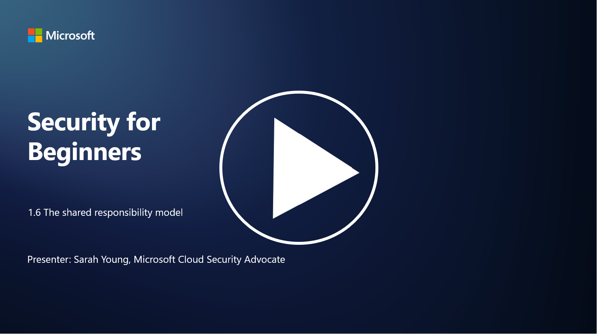

# The shared responsibility model

Shared responsibility is a newer concept in IT that came into being with the advent of cloud computing. From a cybersecurity perspective, it is critical to understand who is providing which security controls so that there are no gaps in defense.

## Introduction

In this lesson, we’ll cover:

 - What is shared responsibility in the context of cybersecurity?
   
 - What is the difference in shared responsibility for security controls
   between IaaS, PaaS and SaaS?

   

 - Where can you find out what security controls your cloud platform is 
   providing?

   
 

 - What is “trust but verify”?

## What is shared responsibility in the context of cybersecurity?

Shared responsibility in cybersecurity refers to the distribution of security responsibilities between a cloud service provider (CSP) and its customers. In cloud computing environments, such as Infrastructure as a Service (IaaS), Platform as a Service (PaaS), and Software as a Service (SaaS), both the CSP and the customer have roles to play in ensuring the security of the data, applications, and systems. 

## What is the difference in shared responsibility for security controls between IaaS, PaaS and SaaS?

The division of responsibilities typically depends on the type of cloud service being used:

 - **IaaS (Infrastructure as a Service)**: The CSP provides the foundational infrastructure (servers, networking, storage), while the customer is responsible for managing the operating systems, applications, and security configurations on that infrastructure.
   
   
 - **PaaS (Platform as a Service):** The CSP offers a platform on which customers can build and deploy applications. The CSP manages the underlying infrastructure, and the customer focuses on application development and data security.

   

 - **SaaS (Software as a Service)**: The CSP provides fully functional applications accessible over the internet. In this case, the CSP is responsible for the application's security and infrastructure, while the customer manages user access and data usage.

Understanding shared responsibility is crucial because it clarifies which security aspects are covered by the CSP and which ones the customer needs to address. It helps prevent misunderstandings and ensures that security measures are implemented holistically.

## Where can you find out what security controls your cloud platform is providing?

To find out what security controls your cloud platform is providing, you need to refer to the cloud service provider's documentation and resources. These include:

 - **CSP’s website and documentation**: the CSP’s website will have    information about the security features and controls offered as part of their services. CSPs usually offer detailed documentation that explains their security practices, controls, and recommendations.  This might include whitepapers, security guides, and technical documentation.
   
 - **Security Assessments and Audits**: most CSPs get their security controls assessed by independent security experts and organizations. These reviews can provide insights into the quality of the CSP’s security measures. Sometimes this leads to the CSP getting a security compliance certificate (see next bullet point).
 - **Security compliance certifications**: most CSPs obtain certifications such as ISO:27001, SOC 2, and FedRAMP, etc. These certifications demonstrate that the provider meets specific security and compliance standards.

Remember that the level of detail and the availability of information may vary between cloud providers. Always ensure that you are consulting official and up-to-date resources provided by the cloud service provider to make informed decisions about the security of your cloud-based assets.

## What is “trust but verify”?

In the context of using a CSP, third-party software or other IT security service, an organization might initially trust the provider's claims about security measures. However, to truly ensure the safety of their data and systems, they would verify these claims through security assessments, penetration testing and a review of the external party’s security controls before fully integrating the software or service into their operations. All individuals and organizations should seek to trust but verify the security controls that they are not responsible for.

## Shared responsibility within an organization
Remember, shared responsibility for security within an organization for different teams also needs to be taken into account. The security team will rarely implement all the controls themselves and will need to collaborate with operations teams, developers and other parts of the business to implement all the security controls needed to keep an organization secure.

## Further reading
- [Shared responsibility in the cloud - Microsoft Azure | Microsoft Learn](https://learn.microsoft.com/azure/security/fundamentals/shared-responsibility?WT.mc_id=academic-96948-sayoung)
- [What is shared responsibility model? – Definition from TechTarget.com](https://www.techtarget.com/searchcloudcomputing/definition/shared-responsibility-model)
- [The shared responsibility model explained and what it means for cloud security | CSO Online](https://www.csoonline.com/article/570779/the-shared-responsibility-model-explained-and-what-it-means-for-cloud-security.html)
- [Shared Responsibility for Cloud Security: What You Need to Know (cisecurity.org)](https://www.cisecurity.org/insights/blog/shared-responsibility-cloud-security-what-you-need-to-know)

