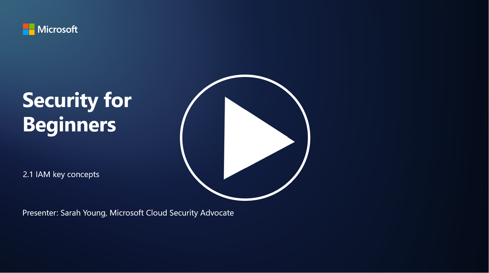

# IAM key concepts 

Have you ever logged into a computer or a website? Of course you have! That means you’ve already used identity controls in your day-to-day life. Identity and access management (IAM) is a key pillar of security, we’ll learn more about it in the next few lessons.

**Introduction**

In this lesson, we’ll cover:

 - What do we mean by identity and access management (IAM) in the
   context of cybersecurity? 
   
 - What is the principle of least privilege?
   
 - What is segregation of duties?
 - What is authentication and authorization?

## What do we mean by identity and access management (IAM) in the context of cybersecurity?

Identity and Access Management (IAM) refers to a set of processes, technologies, and policies that are implemented to ensure that the right individuals have the appropriate access to resources within an organization's digital environment. IAM involves managing digital identities (users, employees, partners) and their access to systems, applications, data, and networks. The primary goal of IAM is to enhance security, streamline user access, and ensure compliance with organizational policies and regulations. IAM solutions typically encompass user authentication, authorization, identity provisioning, access control, and user lifecycle management (making sure accounts get deleted when they are no longer being used).

## What is the principle of least privilege?

The principle of least privilege is a fundamental concept that advocates granting users and systems only the minimum privileges necessary to perform their intended tasks or roles. This principle helps to limit the potential damage that can occur in case of a security breach or insider threat. By adhering to the principle of least privilege, organizations reduce the attack surface and minimize the risk of unauthorized access, data breaches, and accidental misuse of privileges. In practice, this means that users are granted access only to the specific resources and functionalities required for their job roles, and no more. For example, if you just need to read a document, it would be excessive for you to be granted full admin privileges to said document.

## What is segregation of duties?

Segregation of duties is a principle aimed at preventing conflicts of interest and reducing the risk of fraud and errors by distributing critical tasks and responsibilities among different individuals within an organization. In the context of cybersecurity, segregation of duties involves ensuring that no single individual has control over all aspects of a critical process or system. The goal is to create a system of checks and balances that prevents any single person from having the capability to perform both the setup and approval stages of a process. For example, in financial systems, this might dictate that the person who enters transactions into the system should not be the same person who approves those transactions. This reduces the risk of unauthorized or fraudulent actions going undetected.

## What is authentication and authorization?

Authentication and authorization are two fundamental concepts in cybersecurity that play a crucial role in ensuring the security and integrity of computer systems and data. They are often used in conjunction to control access to resources and protect sensitive information.

**1.  Authentication**: Authentication is the process of verifying the identity of a user, system, or entity attempting to access a computer system or specific resource. It ensures that the claimed identity is genuine and accurate. Authentication methods typically involve the use of one or more of the following factors:
    
    a. Something you know: This includes passwords, PINs, or other secret knowledge that only the authorized user should possess.
    
    b. Something you have: This involves physical tokens or devices like smart cards, security tokens, or mobile phones used to confirm the user's identity.
    
    c. Something you are: This refers to biometric factors like fingerprints, facial recognition, or retinal scans that are unique to an individual.
    

Authentication mechanisms are used to confirm that a user is who they claim to be before allowing access to a system or resource. It helps prevent unauthorized access and ensures that only legitimate users can perform actions within a system.

**2.  Authorization**: Authorization is the process of granting or denying specific permissions and privileges to authenticated users or entities once their identity has been verified. It determines what actions or operations a user is allowed to perform within a system or on specific resources. Authorization is often based on predefined policies, access control rules, and roles assigned to users.

Authorization can be thought of as answering the question, "What can an authenticated user do?" It involves defining and enforcing access control policies to protect sensitive data and resources from unauthorized access or modification.

**In summary:**

-   Authentication establishes the identity of users or entities.
-   Authorization determines what actions and resources authenticated users are allowed to access or manipulate.

## Further reading

- [Describe identity concepts - Training | Microsoft Learn](https://learn.microsoft.com/training/modules/describe-identity-principles-concepts/?WT.mc_id=academic-96948-sayoung)
- [Introduction to identity - Microsoft Entra | Microsoft Learn](https://learn.microsoft.com/azure/active-directory/fundamentals/identity-fundamental-concepts?WT.mc_id=academic-96948-sayoung)
- [What is Identity Access Management (IAM)? | Microsoft Security](https://www.microsoft.com/security/business/security-101/what-is-identity-access-management-iam?WT.mc_id=academic-96948-sayoung)
- [What is IAM? Identity and access management explained | CSO Online](https://www.csoonline.com/article/518296/what-is-iam-identity-and-access-management-explained.html)
- [What is IAM? (auth0.com)](https://auth0.com/blog/what-is-iam/)
- [Security+: implementing Identity and Access Management (IAM) controls [updated 2021] | Infosec (infosecinstitute.com)](https://resources.infosecinstitute.com/certifications/securityplus/security-implementing-identity-and-access-management-iam-controls/)
- [least privilege - Glossary | CSRC (nist.gov)](https://csrc.nist.gov/glossary/term/least_privilege)
- [Security: The Principle of Least Privilege (POLP) - Microsoft Community Hub](https://techcommunity.microsoft.com/t5/azure-sql-blog/security-the-principle-of-least-privilege-polp/ba-p/2067390?WT.mc_id=academic-96948-sayoung)
- [Principle of least privilege | CERT NZ](https://www.cert.govt.nz/it-specialists/critical-controls/principle-of-least-privilege/)
- [Why is separation of duties required by NIST 800-171 and CMMC? - (totem.tech)](https://www.totem.tech/cmmc-separation-of-duties/)
