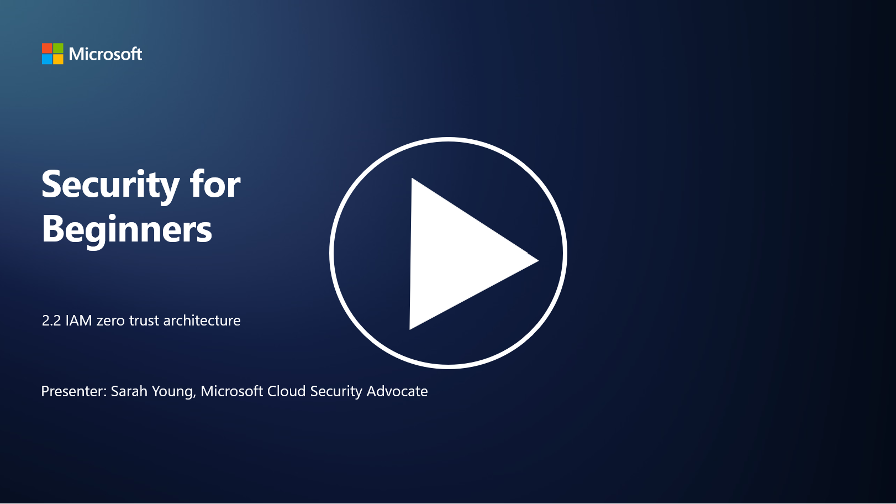

# IAM zero trust architecture

Identity is a key part of implementing a zero trust architecture and building a perimeter for any IT environment. In this section we’ll explore why it’s important to use identity controls to implement zero trust.

## Introduction

In this lesson, we’ll cover:

 - Why do we need to use identity as our perimeter in modern IT
   environments?
   
 - How does this differ from traditional IT architectures?

   
   

 - How is identity used to implement a zero trust architecture?

## Why do we need to use identity as our perimeter in modern IT environments?

In modern IT environments, the traditional concept of a physical perimeter (using tools such as firewalls and network boundaries) as the primary line of defense against cyber threats is becoming less effective due to the increasing complexity of technology, the rise of remote work, and the adoption of cloud services. Instead, organizations are shifting towards using identity as the new perimeter. This means that security revolves around verifying and managing the identity of users, devices, and applications attempting to access resources, regardless of their physical location.

Here's why using identity as the perimeter is crucial in modern IT environments:

**Remote Workforce**: With remote work and mobile devices becoming the norm, users can access resources from various locations and devices. The traditional perimeter approach doesn't work when users are no longer confined to a physical office.

**Cloud and Hybrid Environments**: Organizations are increasingly adopting cloud services and hybrid environments. Data and applications are no longer solely located within an organization's premises, making traditional perimeter defenses less relevant.

**Zero Trust Security**: The concept of zero trust security assumes that no entity, whether inside or outside the network, should be automatically trusted. Identity becomes the foundation for verifying access requests, irrespective of where they originate.

**Threat Landscape**: Cyber threats are evolving, and attackers are finding ways to bypass traditional perimeter defenses. Phishing, social engineering, and insider threats often exploit human vulnerabilities rather than trying to breach network perimeters.

**Data-Centric Approach**: Protecting sensitive data is paramount. By focusing on identity, organizations can control who accesses what data, reducing the risk of data breaches.

## How does this differ from traditional IT architectures?

Traditional IT architectures relied heavily on perimeter-based security models, where firewalls and network boundaries played a significant role in keeping threats out. The main differences between traditional and identity-centric approaches are:

|      Aspect                 |      Traditional IT Architectures                                                                  |      Identity-Centric Approach                                                                             |
|-----------------------------|----------------------------------------------------------------------------------------------------|------------------------------------------------------------------------------------------------------------|
|     Focus                   |     Perimeter Focus: Relied on perimeter defenses like firewalls and   access control.             |     Focus on Identity Verification: Shift from network boundaries to verifying   user/device identity.     |
|     Location                |     Location Dependency: - Security tied to physical office locations and   network boundaries.    |     Location Independence: Security not tied to specific locations; access   from anywhere.                |
|     Trust Assumption        |     Assumed Trust: Assumed trust within the network perimeter for   users/devices.                 |     Zero Trust Approach: Trust is never assumed; access is verified based   on identity and context.       |
|     Device Consideration    |     Device Diversity: Assumed devices within the network perimeter were   secure.                  |     Device Awareness: Consider device health and security posture,   regardless of location.               |
|     Data Protection         |     Data Protection: Focused on securing network perimeters for data   protection.                 |     Data-Centric Protection: Focus on controlling data access based on   identity and data sensitivity.    |
|                             |                                                                                                    |                                                                                                            |

## How is identity used to implement a zero trust architecture?

In a zero trust architecture, the fundamental principle is to never automatically trust any entity, regardless of whether it is inside or outside the network perimeter. Identity plays a central role in implementing a zero trust approach by enabling continuous verification of entities attempting to access resources. Modern identity security controls allow every user, device, application, and service seeking access to resources must be thoroughly identified and authenticated before access is granted. This involves verifying their digital identity through methods such as username/password combinations, multi-factor authentication (MFA), biometrics, and other strong authentication mechanisms.

## Further reading

- [Securing identity with Zero Trust | Microsoft Learn](https://learn.microsoft.com/security/zero-trust/deploy/identity?WT.mc_id=academic-96948-sayoung)
- [Zero Trust Principles and Guidance for Identity and Access | CSA (cloudsecurityalliance.org)](https://cloudsecurityalliance.org/artifacts/zero-trust-principles-and-guidance-for-iam/)
- [Zero Trust Identity Controls - Essentials Series - Episode 2 - YouTube](https://www.youtube.com/watch?v=fQZQznIKcGM&list=PLXtHYVsvn_b_gtX1-NB62wNervQx1Fhp4&index=13)
