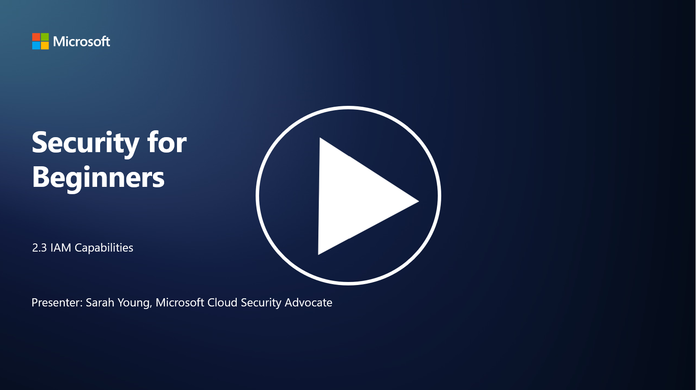

# IAM Capabilites

In this section, we’ll cover more details about the core tools and capabilities that are used in identity security.

## Introduction

In this lesson, we’ll cover:

 - What is a directory service?
      
     
    
 - What kind of capabilities can be used to secure identities?
>
>        Multi-Factor Authentication (MFA)
> 
>        Single Sign-On (SSO)
> 
>        Role-Based Access Control (RBAC)
> 
>        Adaptive Authentication
> 
>        Biometric Authentication
> 
>        Privileged Access Management (PAM)
> 
>        Identity Governance and Administration (IGA)
> 
>        Behavioral Analytics

## What is a directory service?

A directory service is a specialized database that stores and manages information about network resources, including users, groups, devices, applications, and other objects. It serves as a centralized repository of identity and access-related data, allowing organizations to manage and control user authentication, authorization, and other security-related tasks efficiently.

Directory services play a crucial role in modern IT environments by providing a foundation for identity and access management (IAM) solutions. They facilitate secure access to resources, enforce access policies, and simplify administrative tasks. One of the most well-known directory services is Microsoft Active Directory, but there are other solutions like LDAP (Lightweight Directory Access Protocol) directories that serve similar purposes.

Key functions and features of a directory service in the context of cybersecurity include:

 - **User Authentication**: Directory services validate user credentials (such as usernames and passwords) to ensure that only authorized users can access the network and its resources.
 - **User Authorization**: They determine the level of access each user has based on their role, group membership, and other attributes. This ensures that users can access only the resources they are entitled to.
 - **Group Management**: Directory services allow administrators to organize users into logical groups, simplifying access control management. Permissions can be assigned to groups rather than individual users.
 - **Password Policies**: They enforce password complexity and expiration rules, enhancing the security of user accounts.
 - **Single Sign-On (SSO)**: Some directory services support SSO, enabling users to access multiple applications and services with a single set of credentials.
 - **Centralized User Management**: Directory services centralize user information, making it easier to manage user accounts, profiles, and attributes from a single location.
 - **Auditing and Logging**: They can record user authentication and access activities, aiding in security audits and compliance efforts.

## What kind of capabilities can be used to secure identities?

**Multi-Factor Authentication (MFA)**

MFA requires users to provide multiple forms of verification before granting access. This typically includes something the user knows (password), something the user has (smartphone or security token), and something the user is (biometric data like fingerprint or facial recognition).

**Single Sign-On (SSO)**

SSO allows users to access multiple applications and systems with a single set of credentials. This improves user experience and reduces the risk associated with managing multiple passwords.

**Role-Based Access Control (RBAC)**

RBAC assigns permissions based on predefined roles. Users are granted access based on their roles within an organization.

**Adaptive Authentication**

Adaptive authentication assesses risk factors such as location, device, time of access, and user behavior to dynamically adjust the level of authentication required. If a request seems suspicious, additional authentication steps may be triggered.

**Biometric Authentication**

Biometric authentication uses unique biological characteristics such as fingerprints, facial features, voice patterns, and even behavioral traits like typing speed for identity verification.

**Privileged Access Management (PAM)**

PAM focuses on securing access to critical systems and data by enforcing strict controls on privileged accounts. It includes features like just-in-time access and session monitoring.

**Identity Governance and Administration (IGA)**

IGA solutions manage user identities and their access to resources throughout their lifecycle. This includes onboarding, provisioning, role-based access control, and deprovisioning.

**Behavioral Analytics**

Behavioral analytics monitors user behavior and establishes baseline patterns. Deviations from the norm can trigger alerts for further investigation.

# Further reading
- [Azure Active Directory fundamentals documentation - Microsoft Entra | Microsoft Learn](https://learn.microsoft.com/azure/active-directory/fundamentals/?WT.mc_id=academic-96948-sayoung)
- [What is Azure Active Directory? - Microsoft Entra | Microsoft Learn](https://learn.microsoft.com/azure/active-directory/fundamentals/whatis?WT.mc_id=academic-96948-sayoung)
- [Manage your multi-cloud identity infrastructure with Microsoft Entra - YouTube](https://www.youtube.com/watch?v=9qQiq3wTS2Y&list=PLXtHYVsvn_b_gtX1-NB62wNervQx1Fhp4&index=18)

