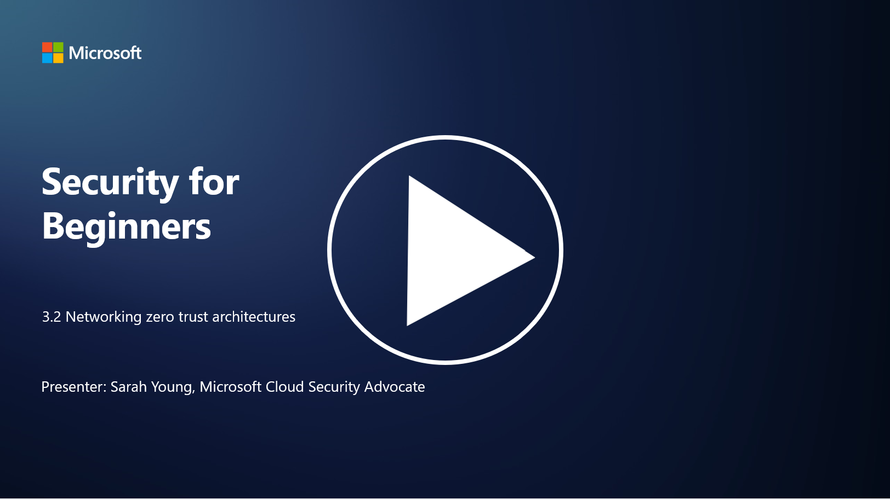

# Networking zero trust architectures

The network provides a crucial layer in zero trust controls, in this lesson we will learn more about this:

 - What is network segmentation? 
 - How does network segmentation help implement zero trust? 
  - What is end-to-end encryption?

## What is network segmentation?

Network segmentation is the practice of dividing a network into smaller, isolated segments or subnetworks. Each segment is isolated from the others, and access between segments is controlled and restricted based on specific security policies. Network segmentation is used to improve security by containing the impact of potential breaches and limiting lateral movement for attackers within the network.

By implementing network segmentation, an organization can create "zones" that separate different types of users, applications, and data. This reduces the attack surface and minimizes the potential damage caused by a security incident. Network segmentation can be achieved through technologies like virtual LANs (VLANs), firewalls, and access controls.

## How does network segmentation help implement zero trust? 

Network segmentation aligns closely with the principles of the Zero Trust model. In a Zero Trust architecture, network segmentation helps enforce the principle of "least privilege" by ensuring that users and devices have access only to the specific resources and services they need to perform their tasks. By segmenting the network into smaller zones, organizations can implement strict access controls, isolate critical assets, and prevent lateral movement of attackers.

Network segmentation also aids in enforcing identity-based access controls, where users and devices are thoroughly authenticated and authorized before accessing specific segments. This prevents unauthorized access to sensitive resources and mitigates the potential impact of compromised credentials.

## What is end-to-end encryption?

End-to-end (E2E) encryption is a security measure that ensures that data remains encrypted throughout its entire journey from the sender to the recipient. In this process, data is encrypted at the sender's end, and only the recipient possesses the decryption key to unlock and read the data. The encryption and decryption processes occur at the endpoints, making it extremely difficult for unauthorized parties, including service providers and intermediaries, to access the plaintext data.

E2E encryption provides a high level of confidentiality and security for data transmission, even if the data passes through various intermediary systems or networks. It is commonly used in secure messaging apps, email services, and other communication platforms to protect sensitive information from interception and unauthorized access.

This encryption method ensures that even if attackers manage to gain access to the data in transit, they would only see encrypted content that is meaningless without the decryption key. End-to-end encryption plays a crucial role in safeguarding user privacy and protecting sensitive information from being exposed to unauthorized parties.

## What is SASE?

SASE stands for "Secure Access Service Edge," and it is a cybersecurity framework and architecture that combines network security and wide-area networking (WAN) capabilities into a single cloud-based service. SASE is designed to provide secure and scalable access to network resources, applications, and data for remote and mobile users while simplifying network management and reducing the complexity of traditional network and security architectures.

Key characteristics and components of SASE include:

1.  **Cloud-Based:** SASE is delivered as a cloud service, which means that security and networking functions are provided from the cloud rather than relying on traditional on-premises hardware and appliances.
    
2.  **Integration of Security and Networking:** SASE integrates various security services such as secure web gateways (SWG), firewall as a service (FWaaS), data loss prevention (DLP), zero-trust network access (ZTNA), and WAN optimization with wide-area networking capabilities. This integration helps streamline security and networking operations.
    
3.  **Zero Trust:** SASE operates on the principle of zero trust, which means that it enforces strict access controls and least-privilege access policies. Users and devices are not trusted by default, and they must be authenticated and authorized before accessing resources.
    
4.  **Identity-Centric:** SASE focuses on user and device identities as the basis for access control. Identity and context-based policies are used to determine access permissions, and these policies adapt dynamically based on user behavior and context.
    
5.  **Scalability and Flexibility:** SASE can scale easily to accommodate a large number of users and devices, making it suitable for organizations with diverse and evolving networking and security needs.
   

SASE is particularly relevant in the modern era of remote work and cloud adoption, as it provides a comprehensive and agile approach to securing and managing network access. It helps organizations adapt to changing security and networking requirements while maintaining a strong focus on user-centric and zero-trust security models.

## Further reading

- [What Is Network Segmentation? - Cisco](https://www.cisco.com/c/en/us/products/security/what-is-network-segmentation.html#~benefits)
- [What Is Micro-Segmentation? - Cisco](https://www.cisco.com/c/en/us/products/security/what-is-microsegmentation.html)
- [Implementing Network Segmentation and Segregation | Cyber.gov.au](https://www.cyber.gov.au/resources-business-and-government/maintaining-devices-and-systems/system-hardening-and-administration/network-hardening/implementing-network-segmentation-and-segregation)
- [What Is Network Segmentation and Why It Matters | CompTIA](https://www.comptia.org/blog/security-awareness-training-network-segmentation)
- [Network Segmentation: Concepts and Practices (cmu.edu)](https://insights.sei.cmu.edu/blog/network-segmentation-concepts-and-practices/)
- [Secure networks with Zero Trust | Microsoft Learn](https://learn.microsoft.com/security/zero-trust/deploy/networks?WT.mc_id=academic-96948-sayoung)
- [What is end-to-end encryption? | IBM](https://www.ibm.com/topics/end-to-end-encryption)
- [What Is End-to-End Encryption, and Why Does It Matter? (howtogeek.com)](https://www.howtogeek.com/711656/what-is-end-to-end-encryption-and-why-does-it-matter/)
-  [Definition of Secure Access Service Edge (SASE) - Gartner Information Technology Glossary](https://www.gartner.com/en/information-technology/glossary/secure-access-service-edge-sase)
- [What Is Secure Access Service Edge (SASE)? | Microsoft Security](https://www.microsoft.com/security/business/security-101/what-is-sase?WT.mc_id=academic-96948-sayoung)
