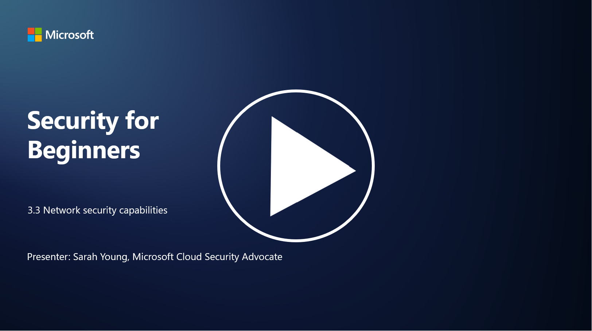

# Network security capabilities

In this lesson we’ll learn about the following capabilities that can be used to secure a network:

 - Traditional firewalls
 - Web application firewalls
 - Cloud security groups
 - CDN
 - Load balancers
 - Bastion hosts
 - VPNs
 - DDoS protection

## Traditional Firewalls

Traditional firewalls are security devices that control and monitor incoming and outgoing network traffic based on predefined security rules. They act as a barrier between a trusted internal network and untrusted external networks, filtering traffic to prevent unauthorized access and potential threats.

## Web Application Firewalls

Web Application Firewalls (WAFs) are specialized firewalls designed to protect web applications from various attacks, such as SQL injection, cross-site scripting, and other vulnerabilities. They analyze HTTP requests and responses to identify and block malicious traffic targeting web applications.

## Cloud security groups

Security groups are a fundamental network security feature provided by cloud service providers. They act as virtual firewalls that control inbound and outbound traffic to and from cloud resources, such as virtual machines (VMs) and instances. Security groups allow organizations to define rules that determine which types of traffic are allowed and denied, adding an additional layer of defense to cloud deployments.

## Content Delivery Network (CDN)

A Content Delivery Network is a distributed network of servers located in various geographical locations. CDNs help improve the performance and availability of websites by caching content and serving it from servers that are closer to the user. They also provide some level of protection against DDoS attacks by distributing traffic across multiple server locations.

## Load Balancers

Load balancers distribute incoming network traffic across multiple servers to optimize resource utilization, ensure high availability, and improve application performance. They help prevent server overload and maintain efficient response times, enhancing the resilience of the network.

## Bastion Hosts

Bastion hosts are highly secure and isolated servers that provide controlled access to a network from an external, untrusted network (such as the internet). They serve as entry points for administrators to access internal systems securely. Bastion hosts are typically configured with strong security measures to minimize the attack surface.

## Virtual Private Networks (VPNs)

VPNs create encrypted tunnels between a user's device and a remote server, ensuring secure and private communication over potentially insecure networks like the internet. VPNs are commonly used to provide remote access to internal networks, allowing users to access resources as if they were physically on the same network.

## DDoS protection tooling

DDoS (Distributed Denial of Service) protection tools and services are designed to mitigate the impact of DDoS attacks, where multiple compromised devices flood a network or service to overwhelm it. DDoS protection solutions identify and filter out malicious traffic, ensuring that legitimate traffic can still reach its intended destination.

## Further reading

- [What Is a Firewall? - Cisco](https://www.cisco.com/c/en/us/products/security/firewalls/what-is-a-firewall.html#~types-of-firewalls)
- [What Does a Firewall Actually Do? (howtogeek.com)](https://www.howtogeek.com/144269/htg-explains-what-firewalls-actually-do/)
- [What is a Firewall? How Firewalls Work & Types of Firewalls (kaspersky.com)](https://www.kaspersky.com/resource-center/definitions/firewall)
- [Network security group - how it works | Microsoft Learn](https://learn.microsoft.com/azure/virtual-network/network-security-group-how-it-works)
- [Introduction to Azure Content Delivery Network (CDN) - Training | Microsoft Learn](https://learn.microsoft.com/training/modules/intro-to-azure-content-delivery-network/?WT.mc_id=academic-96948-sayoung)
- [What is a content delivery network (CDN)? - Azure | Microsoft Learn](https://learn.microsoft.com/azure/cdn/cdn-overview?WT.mc_id=academic-96948-sayoung)
- [What Is Load Balancing? How Load Balancers Work (nginx.com)](https://www.nginx.com/resources/glossary/load-balancing/)
- [Bastion hosts vs. VPNs · Tailscale](https://tailscale.com/learn/bastion-hosts-vs-vpns/)
- [What is VPN? How It Works, Types of VPN (kaspersky.com)](https://www.kaspersky.com/resource-center/definitions/what-is-a-vpn)
- [Introduction to Azure DDoS Protection - Training | Microsoft Learn](https://learn.microsoft.com/training/modules/introduction-azure-ddos-protection/?WT.mc_id=academic-96948-sayoung)
- [What Is a DDoS Attack? | Microsoft Security](https://www.microsoft.com/security/business/security-101/what-is-a-ddos-attack?WT.mc_id=academic-96948-sayoung)

