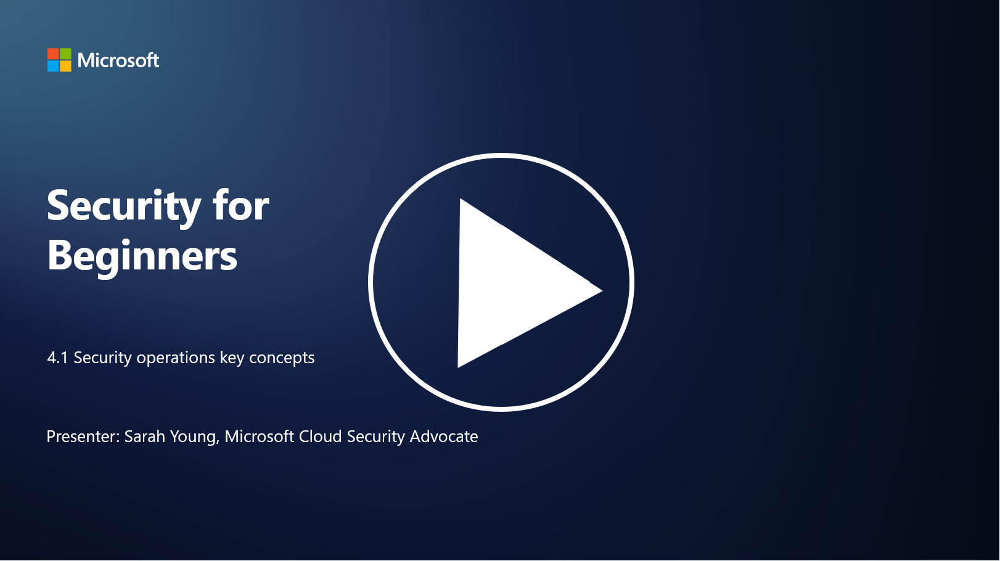

# Security operations key concepts

Security operations are a critical component of an organization’s overall security function. In this lesson, we’ll learn more about this:

 - What is a security operations function within a business?
   
 -  What kind of form can security operations take?
   
   - How does security operations differ from traditional IT operations?

## What is a security operations function within a business?

A security operations function within a business refers to a dedicated team or department responsible for monitoring, detecting, investigating, and responding to cybersecurity threats and incidents. The primary goal of a security operations function is to ensure the confidentiality, integrity, and availability of an organization's digital assets by proactively identifying and mitigating security risks and responding effectively to security incidents.

## What kind of form can security operations take?

Security operations can take various forms depending on the size and complexity of the organization. Some common forms include:

**Security Operations Center (SOC):** A centralized team responsible for 24/7 monitoring, analysis, and response to security events. SOCs often use advanced tools and technologies to identify and respond to threats in real time.

**Incident Response Team:** A specialized team focused on responding to security incidents and breaches. They conduct investigations, coordinate response efforts, and facilitate recovery.

**Threat Hunting Team:** A team that proactively searches for signs of advanced threats and hidden vulnerabilities that may not be detected by traditional security tools.

**Red Team/Blue Team:** The red team simulates attacks to identify vulnerabilities, while the blue team defends against those attacks. Both teams work together to improve security measures.

**Managed Security Services Provider (MSSP):** Some organizations outsource their security operations to third-party providers specializing in security monitoring and incident response.

## How does security operations differ from traditional IT operations?

Security operations and traditional IT operations are related but distinct functions:

**Focus:** IT operations focus on managing and maintaining the organization's IT infrastructure, ensuring its functionality and availability. Security operations, on the other hand, prioritize identifying and mitigating security risks and responding to incidents.

**Responsibilities:** IT operations handle tasks like system maintenance, software updates, and user support. Security operations handle threat detection, incident response, vulnerability management, and security monitoring.

**Timeliness:** IT operations emphasize immediate system availability and performance. Security operations focus on identifying and remediating threats, which may not always align with immediate availability.

**Skillset:** Security operations require specialized skills in threat analysis, incident response, and cybersecurity tools. IT operations require expertise in system administration, network management, and application support.

## Incident response workflow

The NIST Cybersecurity Framework Core Functions lists five overarching functions that should be performed continuously as part of an organization’s operational environment to reduce cybersecurity risk. 

It is important to appreciate that these activities should exist as part of a bigger circle that plugs into and aligns with an organization’s wider cybersecurity processes. 

**Note:** You can read more about the NIST Cybersecurity Framework at [https://www.nist.gov/cybersecurity](https://www.nist.gov/cybersecurity)

## Further reading

- [Security operations | Microsoft Learn](https://learn.microsoft.com/security/operations/overview?WT.mc_id=academic-96948-sayoung)
- [Implementing security operations processes | Microsoft Learn](https://learn.microsoft.com/security/operations/?WT.mc_id=academic-96948-sayoung)
- [What is a security operations center (SOC)? | Microsoft Security](https://www.microsoft.com/security/business/security-101/what-is-a-security-operations-center-soc?WT.mc_id=academic-96948-sayoung)
- [What Is a Security Operations Center | Cybersecurity | CompTIA](https://www.comptia.org/content/articles/what-is-a-security-operations-center)

