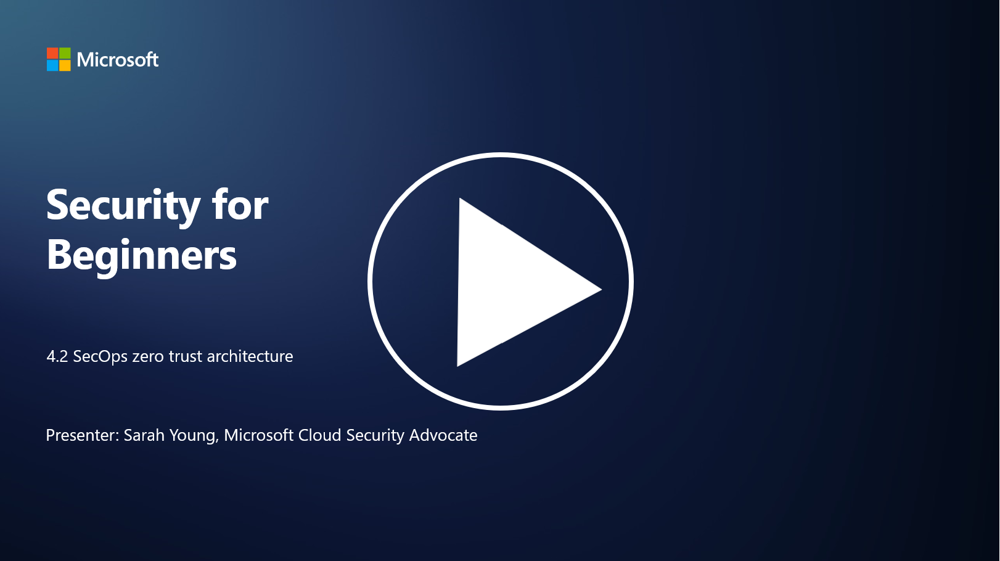

# SecOps zero trust architecture

Security operations forms two parts of zero trust architecture and in this lesson we will learn about both:

- How must IT architectures be built to allow centralized log collection?

- What are the best practices for security operations in modern IT environments?

## How must IT architectures be built to allow centralized log collection?

Centralized log collection is a critical component of modern security operations. It allows organizations to aggregate logs and data from various sources, such as servers, applications, network devices, and security tools, into a central repository for analysis, monitoring, and incident response. Here are some best practices for building IT architectures to support centralized log collection:

1. **Log Source Integration**:

- Ensure that all relevant devices and systems are configured to generate logs. This includes servers, firewalls, routers, switches, applications, and security appliances.

- Configure log sources to forward logs to a centralized log collector or management system.

2. **Select the right SIEM (Security Information and Event Management) tool**:

- Choose a SIEM (Security Information and Event Management) solution that aligns with your organization's needs and scale.

- Ensure the chosen solution supports log collection, aggregation, analysis, and reporting.

3. **Scalability and Redundancy**:

- Design the architecture for scalability to accommodate a growing number of log sources and increased log volume.

- Implement redundancy for high availability to prevent disruptions due to hardware or network failures.

4. **Securely transport logs**:

- Use secure protocols like TLS/SSL or IPsec for transporting logs from sources to the centralized repository.

- Implement authentication and access controls to ensure only authorized devices can send logs.

5. **Normalization**:

- Standardize log formats and normalize data to ensure consistency and ease of analysis.

6. **Storage and Retention**:

- Determine the appropriate retention period for logs based on compliance and security requirements.

- Store logs securely, protecting them from unauthorized access and tampering.

## What are the best practices for security operations in modern IT environments?

In addition to centralized log collection, here are some best practices for security operations in modern IT environments:

1. **Continuous Monitoring**: Implement continuous monitoring of network and system activities to detect and respond to threats in real time.

2. **Threat Intelligence**: Stay informed about emerging threats and vulnerabilities by leveraging threat intelligence feeds and services.

3. **User Training**: Conduct regular security awareness training for employees to mitigate risks associated with social engineering and phishing attacks.

4. **Incident Response Plan**: Develop and test an incident response plan to ensure a swift and effective response to security incidents.

5. **Security Automation**: Leverage security automation and orchestration tools to streamline incident response and repetitive tasks.

6. **Backup and Recovery**: Implement robust backup and disaster recovery solutions to ensure data availability in case of data loss or ransomware attacks.
   
## Further reading

- [Microsoft Security Best Practices module: Security operations | Microsoft Learn](https://learn.microsoft.com/security/operations/security-operations-videos-and-decks?WT.mc_id=academic-96948-sayoung)
- [Security operations - Cloud Adoption Framework | Microsoft Learn](https://learn.microsoft.com/azure/cloud-adoption-framework/secure/security-operations?WT.mc_id=academic-96948-sayoung)
- [What is Security Operations and Analytics Platform Architecture? A Definition of SOAPA, How It Works, Benefits, and More (digitalguardian.com)](https://www.digitalguardian.com/blog/what-security-operations-and-analytics-platform-architecture-definition-soapa-how-it-works#:~:text=All%20in%20all%2C%20security%20operations%20and%20analytics%20platform,become%20more%20efficient%20and%20operative%20with%20your%20security.)

