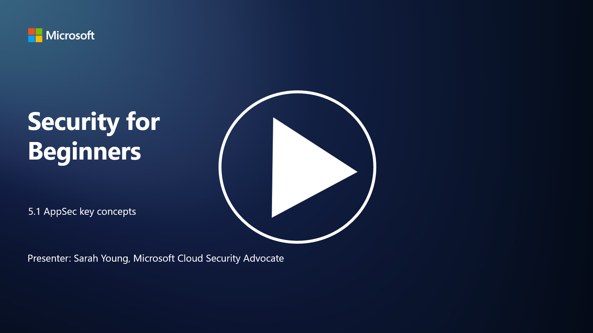

# AppSec key concepts

Application security is a security specialization in it’s own right. In this part of the course we will look more into application security.

## Introduction

In this lesson, we’ll cover:

- What is application security?

- What are the key concepts/principles of application security?

## What is application security?

Application security, often abbreviated as "AppSec," refers to the practice of protecting software applications from security threats, vulnerabilities, and attacks. It encompasses the processes, techniques, and tools used to identify, mitigate, and prevent security risks throughout the development, deployment, and maintenance lifecycle of an application.

Application security is critical because applications are common targets for cyberattacks. Malicious actors exploit vulnerabilities and weaknesses in software to gain unauthorized access, steal data, disrupt services, or execute other malicious activities. Effective application security helps ensure the confidentiality, integrity, and availability of an application and its associated data.

## What are the key concepts/principles of application security?

Key concepts and principles that underpin application security include:

1. **Secure by Design**:

- Security should be integrated into the application's design and architecture from the beginning, rather than being added as an afterthought.

2. **Input Validation**:

- All user inputs should be validated to ensure they conform to expected formats and are free from malicious code or data.

3. **Output Encoding**:

- Data sent to the client should be properly encoded to prevent vulnerabilities like cross-site scripting (XSS).

4. **Authentication and Authorization**:

- Authenticate users and authorize their access to resources based on their roles and permissions.

5. **Data Protection**:

- Sensitive data should be encrypted when stored, transmitted, and processed to prevent unauthorized access.

6. **Session Management**:

- Secure session management ensures user sessions are protected from hijacking and unauthorized access.

7. **Secure Dependencies**:

- Keep all software dependencies up to date with security patches to prevent vulnerabilities.

8. **Error Handling and Logging**:

- Implement secure error handling to avoid revealing sensitive information and ensure secure logging practices.

9. **Security Testing**:

- Regularly test applications for vulnerabilities using methods like penetration testing, code reviews, and automated scanning tools.

10. **Secure Software Development Lifecycle (SDLC)**:

- Integrate security practices into every phase of the software development lifecycle, from requirements to deployment and maintenance.

## Further reading

- [SheHacksPurple: What is Application Security? - YouTube](https://www.youtube.com/watch?v=eNmccQNzSSY)
- [What Is Application Security? - Cisco](https://www.cisco.com/c/en/us/solutions/security/application-first-security/what-is-application-security.html#~how-does-it-work)
- [What is application security? A process and tools for securing software | CSO Online](https://www.csoonline.com/article/566471/what-is-application-security-a-process-and-tools-for-securing-software.html)
- [OWASP Cheat Sheet Series | OWASP Foundation](https://owasp.org/www-project-cheat-sheets/)
