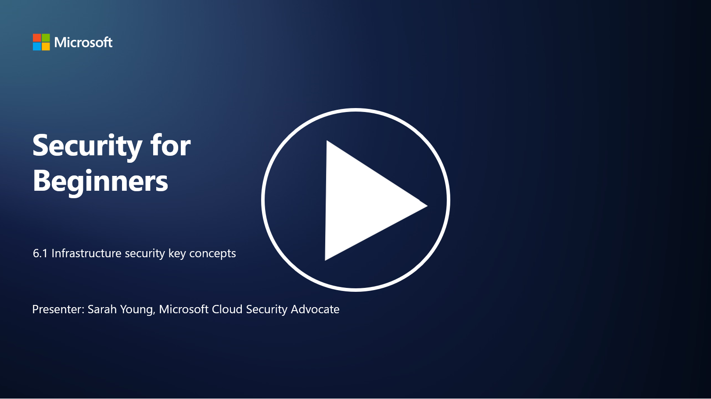

# Infrastructure security key concepts

“Infrastructure” refers to the building blocks of any IT environment which includes servers, cloud services and containers – a huge swathe of different technologies. The applications that were discussed in the prior section run on infrastructure, so it can also be targeted by attackers.

In this lesson, we’ll cover:

- What is security hygiene and why is it important?

- What is security posture management?

- What is patching and why is it important?

- What are containers and what is different about their security?

## What is security hygiene and why is it important?

**Security hygiene** refers to the set of practices and behaviors individuals and organizations follow to maintain good cybersecurity habits. It involves taking steps to protect systems, data, and networks from threats and vulnerabilities. Good security hygiene is important for several reasons:

- **Preventing Attacks**: Following best practices can prevent common cyberattacks, such as phishing, malware infections, and unauthorized access.

- **Protecting Data**: Proper security hygiene safeguards sensitive and confidential data from theft or exposure.

- **Maintaining Trust**: Organizations that demonstrate good security hygiene build trust with customers and partners.

- **Compliance**: Many regulations and standards require organizations to follow security hygiene practices.

- **Reducing Risk**: Consistent security hygiene reduces the overall risk of security incidents and breaches.

Security hygiene includes practices like keeping software up to date, using strong passwords and multi-factor authentication, regular backups, employee training, and monitoring for suspicious activities. It is the foundation of a strong cybersecurity posture.

## What is security posture management?

Security Posture Management refers to the practice of assessing, monitoring, and managing an organization's overall cybersecurity posture. A cybersecurity posture refers to an organization's overall approach and readiness to protect its information technology (IT) systems, networks, data, and assets from cyber threats and attacks. It encompasses the strategies, policies, practices, and technologies that an organization employs to safeguard its digital assets and maintain the confidentiality, integrity, and availability of its information.It involves evaluating and maintaining the security of systems, networks, applications, and data to ensure they align with security policies, best practices, and compliance requirements. SPM aims to provide a comprehensive view of an organization's security status, identify vulnerabilities and weaknesses, and prioritize remediation efforts.

## What is patching and why is it important?

**Patching** refers to the process of applying software updates, also known as patches or fixes, to software, operating systems, and applications. These updates typically address security vulnerabilities, bugs, and other issues that can be exploited by attackers. Hardware devices also require patching: it can be their firmware or built-in OS. Hardware patching can be much harder than software patching. 

Patching is important for several reasons:

- **Security**: Patches fix known vulnerabilities that attackers can exploit to compromise systems and steal data.

- **Stability**: Patches often include stability and performance improvements, reducing the risk of crashes or system failures.

- **Compliance**: Many regulations and compliance standards require organizations to apply security patches promptly.

- **Maintaining Trust**: Regular patching helps maintain the trust of customers and stakeholders by demonstrating a commitment to security.

- **Risk Reduction**: Patching reduces the attack surface and the likelihood of successful cyberattacks.

Failure to apply patches in a timely manner can leave systems vulnerable to known exploits, increasing the risk of security breaches and data loss.

## What are containers and what is different about their security?

Containers are a form of lightweight, standalone, and executable software packages that contain everything needed to run a piece of software, including the code, runtime, libraries, and system tools. Containers provide a consistent and isolated environment for applications, making it easier to develop, package, and deploy software across different environments and platforms. Popular containerization technologies include Docker and Kubernetes.

Container Security refers to the practices and technologies used to protect containers and the applications they host from various security threats and vulnerabilities. Container security is crucial because, while containers offer many benefits in terms of portability and scalability, they also introduce potential security challenges:

1.  **Image Security:** Container images can contain vulnerabilities, and if these images are not regularly updated and patched, they can be exploited by attackers. Container security involves scanning images for known vulnerabilities and ensuring that only trusted images are used.
    
2.  **Runtime Security:** Running containers must be isolated from each other and the host system to prevent unauthorized access and potential attacks. Runtime security mechanisms include container isolation technologies like namespaces and cgroups, as well as tools for monitoring and auditing container behavior.
    
3.  **Network Security:** Containers communicate with each other and external systems over networks. Proper network segmentation and firewall rules are essential to control traffic between containers and prevent unauthorized access.
    
4.  **Access Control:** Ensuring that only authorized users and processes can access and modify containers is critical. Role-based access control (RBAC) and identity management tools are often used for access control.
    
5.  **Logging and Monitoring:** Container security involves the collection and analysis of logs and monitoring data to detect and respond to security incidents and anomalies in real-time.
    
6.  **Orchestration Security:** When using container orchestration platforms like Kubernetes, securing the orchestration layer is equally important. This includes securing the Kubernetes API server, ensuring proper RBAC policies, and auditing cluster activity.
    
7.  **Secrets Management:** Handling sensitive information, such as API keys and passwords, in containers requires secure storage and management solutions to prevent exposure.
    

Container security solutions often involve a combination of security best practices, vulnerability scanning tools, runtime protection mechanisms, network security configurations, and container orchestration security features. Continuous monitoring and automation are essential components of container security to quickly detect and respond to threats as containerized applications evolve and scale.

## Further reading

- [The importance of security hygiene | Security Magazine](https://www.securitymagazine.com/articles/99510-the-importance-of-security-hygiene)
- [What is CSPM? | Microsoft Security](https://www.microsoft.com/security/business/security-101/what-is-cspm?WT.mc_id=academic-96948-sayoung)
- [What is Cloud Security Posture Management (CSPM)? | HackerOne](https://www.hackerone.com/knowledge-center/what-cloud-security-posture-management)
- [Function of cloud security posture management - Cloud Adoption Framework | Microsoft Learn](https://learn.microsoft.com/azure/cloud-adoption-framework/organize/cloud-security-posture-management?WT.mc_id=academic-96948-sayoung)
- [What Is a CNAPP? | Microsoft Security](https://www.microsoft.com/security/business/security-101/what-is-cnapp)
- [Why Everyone Is Talking About CNAPP (forbes.com)](https://www.forbes.com/sites/forbestechcouncil/2021/12/10/why-everyone-is-talking-about-cnapp/?sh=567275ca1549)
- [Why is patching important to cybersecurity? - CyberSmart](https://cybersmart.co.uk/blog/why-is-patching-important-to-cybersecurity/)
- [What Is Container Security? Complete Guide [2023] (aquasec.com)](https://www.aquasec.com/cloud-native-academy/container-security/container-security/)

