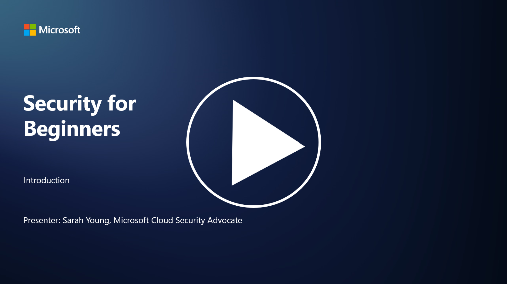

# 🚀 Cybersecurity for Beginners – a curriculum

This course is designed to teach you fundamental cyber security concepts to kick-start your security learning. It is vendor agnostic and is divided into small lessons that should take around 30-60 mins to complete. Each lesson has a small quiz and links to further reading if you want to dive into the topic a bit more.

What this course covers 📚

- 🔐 Basic cyber security concepts such as the CIA triad, the differences between risks, threats, etc,
- 🛡️ Understanding what a security control is and what forms they take.
- 🌐 Understanding what zero trust is and why this is important in modern cyber security.
- 🔑 Understanding key concepts and themes across identity, networking, security operations, infrastructure and data security.
- 🔧 Giving some examples of tools used to implement security controls.

What this course does not cover 🙅‍♂️

- 🚫 How to use specific security tools.
- 🚫 How to "hack" or do red teaming/offensive security.
- 🚫 Learning about specific compliance standards.

When you have finished this course, you can move onto some of our Microsoft Learn modules. We recommend you continue your learning with  [Microsoft Security, Compliance, and Identity Fundamentals.](https://learn.microsoft.com/training/paths/describe-concepts-of-security-compliance-identity/?WT.mc_id=academic-96948-sayoung) 

Ultimately, you could consider taking the [Exam SC-900: Microsoft Security, Compliance, and Identity Fundamentals exam.](https://learn.microsoft.com/credentials/certifications/exams/sc-900/?WT.mc_id=academic-96948-sayoung)

> 💁 If you have any feedback or suggestions on this course and any content we're missing, we'd love to hear from you!

## Modules Overview 📝 
| **Module number** | **Module name**                           | **Concepts taught**                  | **Learning objectives**                                                                                          |
|-------------------|-------------------------------------------|--------------------------------------|-----------------------------------------------------------------------------------------------------------------|
| **1.1**           | Basic security concepts                   | [The CIA triad](https://github.com/microsoft/Security-101/blob/main/1.1%20The%20CIA%20triad%20and%20other%20key%20concepts.md)                        | Learn about confidentiality, availability and integrity. Also authenticity and also nonrepudiation and privacy. |
| **1.2**           | Basic security concepts                   | [Common cyber security threats](https://github.com/microsoft/Security-101/blob/main/1.2%20Common%20cybersecurity%20threats.md)        | Learn about the common cyber security threats facing individuals and organizations.                             |
| **1.3**           | Basic security concepts                   | [Understanding risk management](https://github.com/microsoft/Security-101/blob/main/1.3%20Understanding%20risk%20management.md)       | Learn about assessing and understanding risk – impact/likelihood and implementing controls.                                                                                                               | |
| **1.4**           | Basic security concepts                   | [Security practices and documentation](https://github.com/microsoft/Security-101/blob/main/1.4%20Security%20practices%20and%20documentation.md) | Learn about the difference between policies, procedures, standards and regulations/laws.                         |
| **1.5**           | Basic security concepts                   | [The shared responsibility model](https://github.com/microsoft/Security-101/blob/main/1.6%20Shared%20responsibility%20model.md)                           | What is the shared responsibility model and how does it affect cyber security?                  |
| **1.6**           | Basic security concepts                   | [Zero trust](https://github.com/microsoft/Security-101/blob/main/1.5%20Zero%20trust.md)                           | Learn about what is zero trust and how does it affect architecture? What is defense in depth?                   |
| **1.7**           | [End of module quiz](https://github.com/microsoft/Security-101/blob/main/1.7%20End%20of%20module%20quiz.md)                        |                                      |                                                                                                                 |
| **2.1**           | Identity & access management fundamentals | [IAM key concepts](https://github.com/microsoft/Security-101/blob/main/2.1%20IAM%20key%20concepts.md)                     | Learn about the principle of least privilege, segregation of duties, how IAM supports zero trust.               |
| **2.1**           | Identity & access management fundamentals | [IAM zero trust architecture](https://github.com/microsoft/Security-101/blob/main/2.2%20IAM%20zero%20trust%20architecture.md)          | Learn about how identity is the new perimeter for modern IT environments and the threats it mitigates.          |
| **2.3**           | Identity & access management fundamentals | [IAM capabilities](https://github.com/microsoft/Security-101/blob/main/2.3%20IAM%20capabilities.md)                     | Learn about IAM capabilities and controls to secure identities                                                  |
| **2.4**           | [End of module quiz](https://github.com/microsoft/Security-101/blob/main/2.4%20End%20of%20module%20quiz.md)                        |                                      |                                                                                                                 |
| **3.1**           | Network security fundamentals             | [Networking key concepts](https://github.com/microsoft/Security-101/blob/main/3.1%20Networking%20key%20concepts.md)              | Learn about networking concepts (IP addressing, port numbers, encryption, etc.)                                 |
| **3.2**           | Network security fundamentals             | [Networking zero trust architecture](https://github.com/microsoft/Security-101/blob/main/3.2%20Networking%20zero%20trust%20architecture.md)   | Learn about how networking contributes to an E2E ZT architecture and the threats it mitigates.                  |
| **3.3**           | Network security fundamentals             | [Network security capabilities](https://github.com/microsoft/Security-101/blob/main/3.3%20Network%20security%20capabilities.md)        | Learn about network security tooling – firewalls, WAF, DDoS protection, etc.                                    |
| **3.4**           | [End of module quiz](https://github.com/microsoft/Security-101/blob/main/3.4%20End%20of%20module%20quiz.md)                        |                                      |                                                                                                                 |
| **4.1**           | Security operations fundamentals          | [SecOps key concepts](https://github.com/microsoft/Security-101/blob/main/4.1%20SecOps%20key%20concepts.md)                  | Learn about why security operations are important and how it differs from normal IT ops teams.                  |
| **4.2**           | Security operations fundamentals          | [SecOps zero trust architecture](https://github.com/microsoft/Security-101/blob/main/4.2%20SecOps%20zero%20trust%20architecture.md)       | Learn about how SecOps contributes to an E2E ZT architecture and the threats it mitigates.                      |
| **4.3**           | Security operations fundamentals          | [SecOps capabilities](https://github.com/microsoft/Security-101/blob/main/4.3%20SecOps%20capabilities.md)                  | Learn about SecOps tooling – SIEM, XDR, etc.                                                                    |
| **4.4**           | [End of module quiz](https://github.com/microsoft/Security-101/blob/main/4.4%20End%20of%20module%20quiz.md)                        |                                      |                                                                                                                 |
| **5.1**           | Application security fundamentals         | [AppSec key concepts](https://github.com/microsoft/Security-101/blob/main/5.1%20AppSec%20key%20concepts.md)                  | Learn about AppSec concepts such as secure by design, input validation, etc.                                    |
| **5.2**           | Application security fundamentals         | [AppSec capabilities](https://github.com/microsoft/Security-101/blob/main/5.2%20AppSec%20key%20capabilities.md)                  | Learn about AppSec tooling: pipeline security tools, code scanning, secret scanning, etc.                       |
| **5.3**           | [End of module quiz](https://github.com/microsoft/Security-101/blob/main/5.4%20End%20of%20module%20quiz.md)                        |                                      |                                                                                                                 |
| **6.1**           | Infrastructure security fundamentals      | [Infrastructure security key concepts](https://github.com/microsoft/Security-101/blob/main/6.1%20Infrastructure%20security%20key%20concepts.md) | Learn about hardening systems, patching, security hygiene, container security.                                  |
| **6.2**           | Infrastructure security fundamentals      | [Infrastructure security capabilities](https://github.com/microsoft/Security-101/blob/main/6.2%20Infrastructure%20security%20capabilities.md) | Learn about tooling that can assist with infrastructure security e.g. CSPM, container security, etc.            |
| **6.3**           | [End of module quiz](https://github.com/microsoft/Security-101/blob/main/6.3%20End%20of%20module%20quiz.md)                        |                                      |                                                                                                                 |
| **7.1**           | Data security fundamentals                | [Data security key concepts](https://github.com/microsoft/Security-101/blob/main/7.1%20Data%20security%20key%20concepts.md)           | Learn about data classification and retention and why this is important to an organization.                     |
| **7.2**           | Data security fundamentals                | [Data security capabilities](https://github.com/microsoft/Security-101/blob/main/7.2%20Data%20security%20capabilities.md)           | Learn about data security tooling – DLP, inside risk management, data governance, etc.                          |
| **7.3**           | [End of module quiz](https://github.com/microsoft/Security-101/blob/main/7.3%20End%20of%20module%20quiz.md)                        |

## 🎒  Other Courses 

Our team produces other courses! Check out:

- [ML for Beginners](https://aka.ms/ml-beginners?WT.mc_id=academic-96948-sayoung)
- [Data Science for Beginners](https://aka.ms/datascience-beginners?WT.mc_id=academic-96948-sayoung)
- [AI for Beginners](https://aka.ms/ai-beginners?WT.mc_id=academic-96948-sayoung)
- [Generative AI for Beginners](https://github.com/microsoft/generative-ai-for-beginners?WT.mc_id=academic-96948-sayoung)
- [Web Dev for Beginners](https://aka.ms/webdev-beginners?WT.mc_id=academic-96948-sayoung)
- [IoT for Beginners](https://aka.ms/iot-beginners?WT.mc_id=academic-96948-sayoung)
- [XR Development for Beginners](https://github.com/microsoft/xr-development-for-beginners?WT.mc_id=academic-96948-sayoung)
- [Mastering GitHub Copilot for AI Paired Programming](https://aka.ms/GitHubCopilotAI?WT.mc_id=academic-96948-sayoung)
