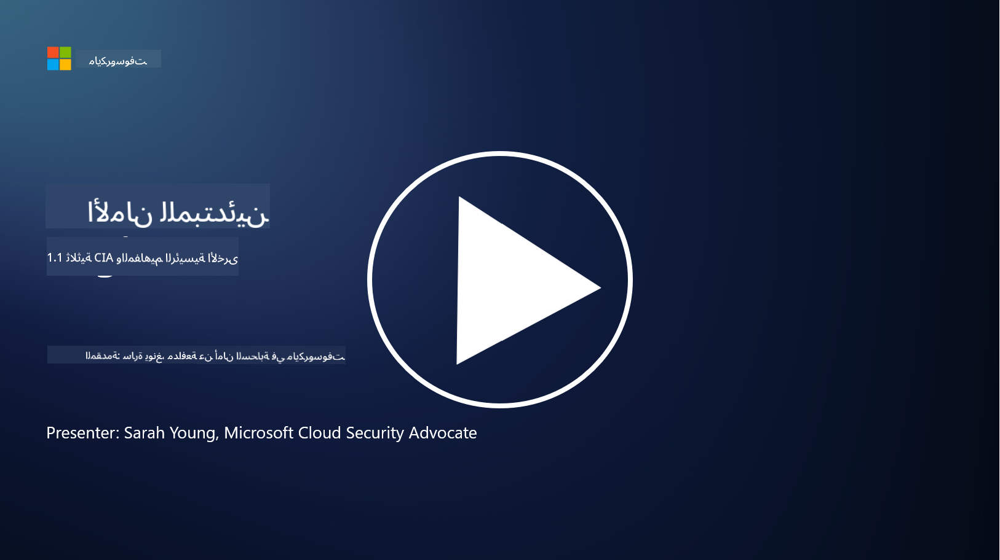
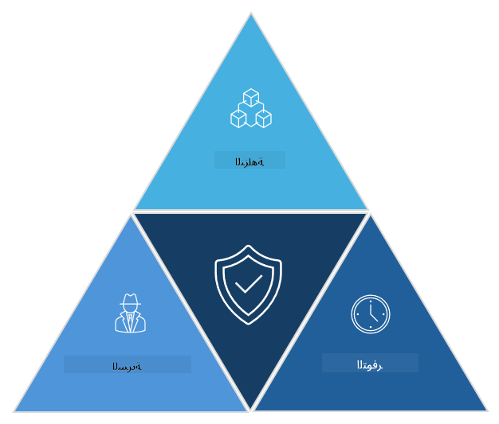

<!--
CO_OP_TRANSLATOR_METADATA:
{
  "original_hash": "16a76f9fa372fb63cffb6d76b855f023",
  "translation_date": "2025-09-03T21:38:21+00:00",
  "source_file": "1.1 The CIA triad and other key concepts.md",
  "language_code": "ar"
}
-->
# ثلاثية CIA والمفاهيم الرئيسية الأخرى

## المقدمة

في هذه الدرس، سنتناول:

 - ما هي الأمن السيبراني؟
   
 
 - ما هي ثلاثية الأمن السيبراني CIA؟

   

 - ما هي الأصالة، عدم الإنكار، والخصوصية في سياق الأمن السيبراني؟

## ما هو الأمن السيبراني؟

الأمن السيبراني، المعروف أيضًا بأمن المعلومات، هو ممارسة حماية أنظمة الكمبيوتر والشبكات والأجهزة والبيانات من الهجمات الرقمية، الوصول غير المصرح به، التلف، أو السرقة. الهدف الأساسي للأمن السيبراني هو ضمان سرية وسلامة وتوافر الأصول الرقمية والمعلومات. يقوم محترفو الأمن السيبراني بتصميم وتنفيذ ضوابط أمنية لحماية الأصول والبيانات والمعلومات. ومع تحول المزيد من جوانب حياتنا إلى الرقمية وعبر الإنترنت، أصبح الأمن السيبراني مصدر قلق رئيسي للأفراد والمنظمات على حد سواء.

## ما هي ثلاثية الأمن السيبراني CIA؟

تشير ثلاثية الأمن السيبراني إلى النموذج الذي يدمج الاعتبارات الثلاثة الرئيسية لأي عمل في مجال الأمن السيبراني أو تصميم نظام/بيئة:

### السرية

هذا هو الاعتبار الذي يكون مألوفًا لدى معظم الناس عندما يفكرون في "الأمن السيبراني": السرية هي عملية حماية البيانات والمعلومات من محاولات الوصول غير المصرح بها، أي أن الأشخاص الذين يحتاجون إلى رؤية المعلومات فقط هم من يمكنهم الوصول إليها. ومع ذلك، ليست كل البيانات متساوية، وعادةً ما يتم تصنيف البيانات وحمايتها بناءً على مدى الضرر الذي قد يحدث إذا تم الوصول إليها من قبل الأشخاص الخطأ.

### السلامة

تشير إلى حماية دقة وموثوقية البيانات الموجودة داخل البيئات وعدم السماح بتعديل أو تغيير البيانات من قبل أفراد غير مصرح لهم. على سبيل المثال، طالب يقوم بتعديل تاريخ ميلاده في سجلات إدارة المركبات (DMV) ليصبح أكبر سنًا حتى يتمكن من إعادة طباعة رخصة القيادة بتاريخ ميلاد أقدم لشراء الكحول.

### التوافر

هذا اعتبار عبر تكنولوجيا المعلومات التشغيلية، ولكن التوافر مهم أيضًا للأمن السيبراني. هناك أنواع محددة من الهجمات التي تستهدف التوافر والتي يجب على محترفي الأمن الحماية منها (مثل هجمات الحرمان من الخدمة الموزعة – DDoS).

**ثلاثية الأمن السيبراني CIA**

## ما هي الأصالة، عدم الإنكار، والخصوصية في سياق الأمن السيبراني؟

هذه مفاهيم إضافية مهمة تتعلق بضمان أمان وموثوقية الأنظمة والبيانات:

**الأصالة** - تشير إلى ضمان أن المعلومات أو الاتصال أو الكيان الذي تتفاعل معه أصلي ولم يتم العبث به أو تغييره من قبل أطراف غير مصرح لها.

**عدم الإنكار** - هو مفهوم ضمان أن الطرف لا يمكنه إنكار مشاركته أو أصالة معاملة أو اتصال. يمنع شخصًا من الادعاء بأنه لم يرسل رسالة أو لم يقم بإجراء معين عندما توجد أدلة تثبت العكس.

**الخصوصية** - تشير إلى حماية المعلومات الحساسة والمعلومات الشخصية من الوصول غير المصرح به أو الاستخدام أو الكشف أو التلاعب. تتضمن التحكم في من يمكنه الوصول إلى البيانات الشخصية وكيف يتم جمع هذه البيانات وتخزينها ومشاركتها.

## قراءة إضافية

[ما هو أمن المعلومات (InfoSec)؟ | أمن Microsoft](https://www.microsoft.com/security/business/security-101/what-is-information-security-infosec#:~:text=Three%20pillars%20of%20information%20security%3A%20the%20CIA%20triad,as%20guiding%20principles%20for%20implementing%20an%20InfoSec%20plan.)

---

**إخلاء المسؤولية**:  
تم ترجمة هذا المستند باستخدام خدمة الترجمة بالذكاء الاصطناعي [Co-op Translator](https://github.com/Azure/co-op-translator). بينما نسعى لتحقيق الدقة، يرجى العلم أن الترجمات الآلية قد تحتوي على أخطاء أو معلومات غير دقيقة. يجب اعتبار المستند الأصلي بلغته الأصلية المصدر الموثوق. للحصول على معلومات حاسمة، يُوصى بالاستعانة بترجمة بشرية احترافية. نحن غير مسؤولين عن أي سوء فهم أو تفسيرات خاطئة ناتجة عن استخدام هذه الترجمة.