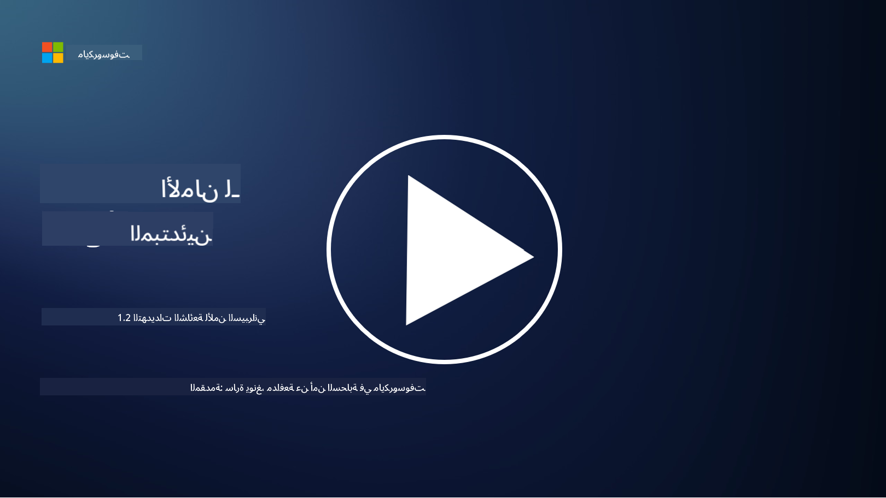

<!--
CO_OP_TRANSLATOR_METADATA:
{
  "original_hash": "6fc3030323139d7134a4ca9d03eccac9",
  "translation_date": "2025-09-03T20:08:47+00:00",
  "source_file": "1.2 Common cybersecurity threats.md",
  "language_code": "ar"
}
-->
# التهديدات الشائعة في الأمن السيبراني

## المقدمة

في هذه الدرس، سنتناول:

- ما هو التهديد السيبراني؟

- لماذا يسعى المهاجمون إلى اختراق البيانات وأنظمة تكنولوجيا المعلومات؟

- ما هي الأنواع الأكثر شيوعًا من التهديدات السيبرانية؟

- ما هو إطار عمل MITRE ATT&CK؟

- أين يمكنني متابعة مستجدات مشهد التهديدات السيبرانية؟

## ما هو التهديد السيبراني؟

يشير التهديد السيبراني إلى أي خطر أو تهديد محتمل يمكن أن يؤثر على سرية البيانات أو سلامتها أو توفرها في أنظمة تكنولوجيا المعلومات. هذه التهديدات تأتي من جهات خبيثة تسعى لاستغلال الثغرات للوصول غير المصرح به، أو سرقة المعلومات الحساسة، أو تعطيل العمليات، أو إلحاق الضرر بالأفراد أو المؤسسات أو حتى الدول بأكملها. يمكن أن تأخذ التهديدات السيبرانية أشكالًا متعددة وتستهدف جوانب مختلفة من الأنظمة الرقمية والبيانات.

## لماذا يسعى المهاجمون إلى اختراق البيانات وأنظمة تكنولوجيا المعلومات؟

يسعى المهاجمون إلى اختراق البيانات وأنظمة تكنولوجيا المعلومات لأسباب متعددة، غالبًا بدافع تحقيق مكاسب شخصية، أو دوافع أيديولوجية، أو الرغبة في التسبب في اضطراب. فهم هذه الدوافع يمكن أن يساعد المؤسسات والأفراد على الدفاع بشكل أفضل ضد التهديدات السيبرانية. بعض الأسباب الشائعة التي تدفع المهاجمين إلى شن الهجمات السيبرانية تشمل:

1. **المكاسب المالية**: العديد من الهجمات تكون مدفوعة بالرغبة في تحقيق أرباح مالية. قد يسرق المهاجمون معلومات حساسة مثل أرقام بطاقات الائتمان، تفاصيل الحسابات البنكية، أو معلومات الهوية الشخصية لارتكاب الاحتيال، أو سرقة الهوية، أو ابتزاز الأفراد أو المؤسسات، أو بيع البيانات المسروقة على الشبكة المظلمة.

2. **التجسس**: قد تنخرط الدول أو المنافسون أو جهات أخرى في التجسس السيبراني لسرقة بيانات حساسة حكومية أو تجارية أو بحثية لتحقيق مكاسب سياسية أو اقتصادية أو عسكرية.

3. **التعطيل والتخريب**: تهدف بعض الهجمات إلى تعطيل البنية التحتية الحيوية أو الخدمات أو العمليات لأسباب سياسية أو أيديولوجية. يمكن أن تسبب هذه الهجمات فوضى واسعة النطاق، وخسائر مالية، وضررًا للسمعة.

4. **الدوافع الأيديولوجية**: قد يقوم ناشطون أو مجموعات ذات دوافع أيديولوجية أو سياسية باختراق الأنظمة لزيادة الوعي حول قضايا معينة، أو الترويج لمعتقداتهم، أو الاحتجاج ضد إجراءات أو مؤسسات محددة.

5. **الأفعال غير المقصودة**: ليست كل الأفعال الخبيثة متعمدة؛ فقد يساهم بعض الأفراد دون قصد في التهديدات السيبرانية من خلال الوقوع ضحية للهندسة الاجتماعية أو كونهم جزءًا من شبكة مخترقة.

في النهاية، تتنوع دوافع اختراق البيانات وأنظمة تكنولوجيا المعلومات بشكل كبير، ويمكن أن تكون آثار هذه الهجمات خطيرة. من المهم أن يأخذ الأفراد والمؤسسات والحكومات الأمن السيبراني على محمل الجد وأن يطبقوا تدابير لحماية أنفسهم من هذه التهديدات.

## ما هي الأنواع الأكثر شيوعًا من التهديدات السيبرانية؟

هناك العديد من الأنواع الشائعة للهجمات السيبرانية التي يستخدمها المهاجمون لاختراق الأنظمة، وسرقة البيانات، والتسبب في اضطرابات. فيما يلي بعض الأنواع الأكثر انتشارًا في وقت كتابة هذا النص:

1. **التصيد الاحتيالي**:

يتضمن التصيد الاحتيالي إرسال رسائل بريد إلكتروني أو رسائل خادعة تبدو وكأنها من مصادر موثوقة لخداع المستلمين للكشف عن معلومات حساسة، مثل كلمات المرور أو أرقام بطاقات الائتمان أو التفاصيل الشخصية. يمكن أن يؤدي التصيد الاحتيالي أيضًا إلى توجيه الضحايا إلى مواقع ويب خبيثة أو تحميل برامج ضارة.

2. **البرمجيات الخبيثة**:

تشمل البرمجيات الخبيثة (Malware) مجموعة من البرامج الضارة المصممة لإصابة الأنظمة، وسرقة البيانات، أو التسبب في أضرار. أنواع البرمجيات الخبيثة تشمل:

- **برمجيات الفدية**: تقوم بتشفير الملفات وتطلب فدية لفك التشفير.

- **أحصنة طروادة**: تتنكر كبرامج شرعية وتمنح المهاجمين وصولًا غير مصرح به.

- **الفيروسات**: برامج ذاتية النسخ تلتصق بالملفات وتنتشر.

- **الدودة**: برامج ذاتية النسخ تنتشر عبر الشبكات.

3. **هجمات الحرمان من الخدمة (DoS) وهجمات الحرمان من الخدمة الموزعة (DDoS)**:

تقوم هجمات الحرمان من الخدمة بإغراق النظام المستهدف، مما يجعله غير متاح للمستخدمين. أما هجمات الحرمان من الخدمة الموزعة فتستخدم شبكة من الأجهزة المخترقة لإغراق الهدف بحركة مرور، مما يجعل من الصعب على النظام العمل بشكل صحيح أو قد يتوقف عن العمل تمامًا.

4. **حقن SQL**:

في هذا الهجوم، يقوم المهاجمون بالتلاعب بحقول الإدخال في تطبيقات الويب لحقن استعلامات SQL خبيثة، مما يمكنهم من الوصول غير المصرح به إلى قواعد البيانات والبيانات الحساسة.

5. **البرمجة عبر المواقع (XSS)**:

يقوم المهاجمون بحقن نصوص خبيثة في تطبيقات الويب، والتي يتم تنفيذها بواسطة متصفحات المستخدمين دون علمهم. يمكن أن يؤدي ذلك إلى سرقة بيانات المستخدم أو نشر البرمجيات الخبيثة.

6. **الهندسة الاجتماعية**:

تستغل الهندسة الاجتماعية علم النفس البشري للتلاعب بالأفراد للكشف عن معلومات سرية أو القيام بأفعال تضر بالأمن.

7. **الثغرات غير المكتشفة (Zero-Day)**:

تستهدف هذه الهجمات الثغرات في البرامج أو الأجهزة التي لم يتم اكتشافها بعد من قبل البائع أو الجمهور. يستغل المهاجمون هذه الثغرات قبل تطوير التصحيحات. على الرغم من أن العديد من المؤسسات تقلق بشأن الثغرات غير المكتشفة، إلا أنها ليست شائعة مثل الهجمات الأخرى في هذه القائمة. عندما يتم اكتشاف ثغرة غير مكتشفة، يعمل الباحثون الأمنيون بسرعة لتطوير تصحيح، وبالتالي تكون هذه الثغرات قصيرة الأمد عمومًا.

8. **هجمات الاعتماد**:

تشمل هذه الهجمات هجمات القوة الغاشمة، حيث يحاول المهاجمون تخمين كلمات المرور بشكل متكرر، وهجمات حشو الاعتماد، حيث يتم استخدام بيانات اعتماد مسروقة من موقع واحد لمحاولة الوصول إلى مواقع أخرى.

## ما هو إطار عمل MITRE ATT&CK؟

إطار عمل [MITRE ATT&CK](https://attack.mitre.org/) (التكتيكات، التقنيات، والمعرفة المشتركة للخصوم) هو إطار عمل يقوم بتصنيف وتوثيق التكتيكات، التقنيات، والإجراءات (TTPs) التي يستخدمها الخصوم أثناء الهجمات السيبرانية. تم إنشاء هذا الإطار بواسطة مؤسسة MITRE، وهي منظمة غير ربحية تدير مراكز البحث والتطوير للعديد من الوكالات الحكومية.

يوفر إطار عمل MITRE ATT&CK طريقة موحدة لوصف وتحليل التهديدات السيبرانية، مما يمكن المتخصصين في الأمن السيبراني من فهم والدفاع ضد تقنيات الهجوم المختلفة بشكل أفضل. يُستخدم هذا الإطار على نطاق واسع من قبل فرق الأمن، وصائدي التهديدات، ومستجيبي الحوادث لـ:

1. **فهم سلوك الخصوم**: يوثق الإطار سلوكيات الهجوم الواقعية، موضحًا الخطوات التي يتخذها المهاجمون من الدخول الأولي إلى تحقيق أهدافهم. يغطي مجموعة واسعة من تقنيات الهجوم التي تستخدمها مجموعات التهديد المختلفة.

2. **تخطيط وتنفيذ استراتيجيات الدفاع**: يمكن لفرق الأمن استخدام الإطار لتطوير استراتيجيات دفاعية استباقية تتماشى مع التكتيكات والتقنيات المحددة التي قد يستخدمها الخصوم.

3. **الاستجابة للحوادث وصيد التهديدات**: عند التحقيق في الحوادث أو إجراء صيد التهديدات، يمكن للمتخصصين في الأمن الرجوع إلى الإطار لتحديد وتخفيف التقنيات المحددة التي يستخدمها المهاجمون.

يتم تنظيم إطار عمل MITRE ATT&CK في مصفوفات تجمع تقنيات الهجوم بناءً على منصات وبيئات محددة، مثل Windows، macOS، Linux، والخدمات السحابية. يتم تقسيم كل مصفوفة إلى تكتيكات (أهداف عالية المستوى) وتقنيات (طرق محددة لتحقيق تلك الأهداف). لكل تقنية، يوفر الإطار معلومات حول كيفية عملها، التدابير الممكنة للتخفيف منها، والمراجع ذات الصلة لمجموعات التهديدات الواقعية التي استخدمت التقنية.

يتم تحديث الإطار وتوسيعه باستمرار مع جمع معلومات جديدة عن التهديدات ومع تطور مشهد الأمن السيبراني. إنه مورد قيم لتعزيز وضع الأمن السيبراني للمؤسسات من خلال تمكين فهم أعمق لكيفية عمل المهاجمين وكيفية الدفاع ضد تكتيكاتهم.

## أين يمكنني متابعة مستجدات مشهد التهديدات السيبرانية؟

هناك العديد من المصادر التي يمكن استخدامها لمتابعة مستجدات التهديدات السيبرانية، إليك مجموعة مختارة:

- [Open Web Application Security Project (OWASP) top 10 vulnerabilities](https://owasp.org/Top10/)
- [Common Vulnerabilities and Exposures (CVEs)](https://www.bing.com/ck/a?!&&p=53df6007f017bca2JmltdHM9MTY5MjU3NjAwMCZpZ3VpZD0zYmY4N2RiYS1jYWI1LTYwMDgtMWY1YS02ZmYyY2JjNjYxZWUmaW5zaWQ9NTc2OQ&ptn=3&hsh=3&fclid=3bf87dba-cab5-6008-1f5a-6ff2cbc661ee&psq=cve&u=a1aHR0cHM6Ly9iaW5nLmNvbS9hbGluay9saW5rP3VybD1odHRwcyUzYSUyZiUyZmN2ZS5taXRyZS5vcmclMmYmc291cmNlPXNlcnAtcnImaD1BZXN4S0VBWTNnbGhNZEFpd3daMlNSZkZQNTlrODhIUnYxRUtlSkY1RTk0JTNkJnA9a2NvZmZjaWFsd2Vic2l0ZQ&ntb=1 "Common Vulnerabilities and Exposures")
- [Microsoft Security Response Center blogs](https://msrc.microsoft.com/blog/)
- [National Institute of Standards and Technology (NIST)](https://www.dhs.gov/topics/cybersecurity): يوفر NIST موارد وتنبيهات وتحديثات حول التهديدات السيبرانية المحتملة.
- [Cybersecurity and Infrastructure Security Agency (CISA)](https://www.cisa.gov/resources-tools/resources/free-cybersecurity-services-and-tools): تقدم CISA موارد الأمن السيبراني وأفضل الممارسات للشركات والوكالات الحكومية والمنظمات الأخرى. تشارك CISA معلومات محدثة حول أنواع النشاط الأمني ذات التأثير العالي التي تؤثر على المجتمع بشكل عام وتحليلًا معمقًا حول التهديدات السيبرانية الجديدة والمتطورة.
- [National Cybersecurity Center of Excellence (NCCoE)](https://www.dhs.gov/topics/cybersecurity): NCCoE هو مركز يقدم حلول الأمن السيبراني العملية التي يمكن تطبيقها في المواقف الواقعية.
- [US-CERT](https://www.cisa.gov/resources-tools/resources/free-cybersecurity-services-and-tools): يقدم فريق الاستعداد للطوارئ الحاسوبية في الولايات المتحدة (US-CERT) مجموعة متنوعة من موارد الأمن السيبراني، بما في ذلك التنبيهات والنصائح والمزيد.
- فريق الاستجابة للطوارئ السيبرانية في بلدك (CERT).

---

**إخلاء المسؤولية**:  
تم ترجمة هذا المستند باستخدام خدمة الترجمة بالذكاء الاصطناعي [Co-op Translator](https://github.com/Azure/co-op-translator). بينما نسعى لتحقيق الدقة، يرجى العلم أن الترجمات الآلية قد تحتوي على أخطاء أو معلومات غير دقيقة. يجب اعتبار المستند الأصلي بلغته الأصلية المصدر الرسمي. للحصول على معلومات حاسمة، يُوصى بالترجمة البشرية الاحترافية. نحن غير مسؤولين عن أي سوء فهم أو تفسيرات خاطئة تنشأ عن استخدام هذه الترجمة.