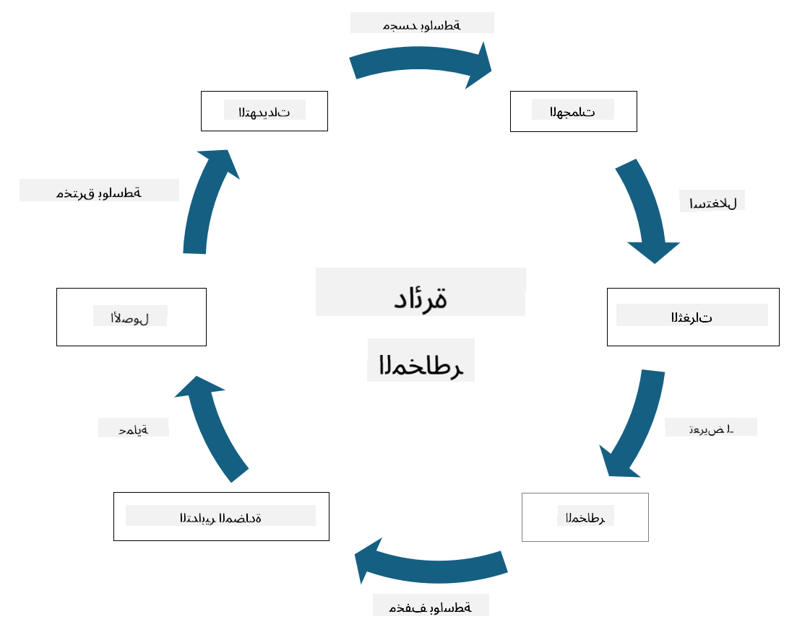

<!--
CO_OP_TRANSLATOR_METADATA:
{
  "original_hash": "fcca304f072cabf206388199e8e2e578",
  "translation_date": "2025-09-03T21:50:19+00:00",
  "source_file": "1.3 Understanding risk management.md",
  "language_code": "ar"
}
-->
# فهم إدارة المخاطر

## المقدمة

في هذه الدرس، سنتناول:

- تعريفات المصطلحات الأمنية الشائعة الاستخدام

- أنواع الضوابط الأمنية

- تقييم المخاطر الأمنية

## تعريفات المصطلحات الأمنية الشائعة الاستخدام

تُعد هذه المصطلحات مفاهيم أساسية في مجال الأمن السيبراني وإدارة المخاطر. دعونا نوضح كل مصطلح وكيفية ارتباطه بالآخر:

1. **وكيل التهديد**:

وكيل التهديد هو فرد أو مجموعة أو منظمة أو نظام آلي لديه القدرة على استغلال الثغرات في نظام أو شبكة لإحداث ضرر أو تلف. يمكن أن يكون وكلاء التهديد قراصنة، مؤلفي البرمجيات الضارة، موظفين ساخطين، أو أي كيان يشكل خطرًا على أنظمة المعلومات والتكنولوجيا.

2. **التهديد**:

التهديد هو حدث محتمل أو إجراء يمكن أن يستغل الثغرات في النظام ويتسبب في ضرر لأصل معين. تشمل التهديدات أفعالًا مثل الاختراق، وتسريب البيانات، وهجمات حجب الخدمة، وغيرها. التهديدات تمثل "ما يمكن أن يحدث" من أضرار محتملة على أصول المنظمة.

3. **الثغرة**:

الثغرة هي نقطة ضعف أو خلل في تصميم النظام أو تنفيذه أو تكوينه يمكن أن يستغله وكيل التهديد لاختراق أمان النظام. يمكن أن توجد الثغرات في البرمجيات أو الأجهزة أو العمليات أو السلوك البشري. تحديد ومعالجة الثغرات أمر ضروري لتقليل مخاطر الهجمات الناجحة.

4. **المخاطر**:

المخاطر هي الاحتمالية لفقدان أو ضرر أو تلف ناتج عن التفاعل بين التهديد والثغرة. هي احتمال أن يستغل وكيل التهديد ثغرة ما لإحداث تأثير سلبي. يتم تقييم المخاطر عادةً بناءً على تأثيرها المحتمل واحتمالية حدوثها.

5. **الأصل**:

الأصل هو أي شيء ذو قيمة تسعى المنظمة لحمايته. يمكن أن تشمل الأصول أشياء مادية (مثل الحواسيب والخوادم)، البيانات (معلومات العملاء، السجلات المالية)، الملكية الفكرية (الأسرار التجارية، براءات الاختراع)، وحتى الموارد البشرية (مهارات ومعرفة الموظفين). حماية الأصول هي هدف رئيسي للأمن السيبراني.

6. **التعرض**:

التعرض يشير إلى حالة الضعف أمام التهديدات المحتملة. يحدث عندما توجد ثغرة يمكن أن يستغلها وكيل التهديد. يبرز التعرض المخاطر المرتبطة بوجود ثغرات في النظام أو الشبكة.

7. **الضوابط**:

الضوابط هي تدابير يتم وضعها لتقليل المخاطر المرتبطة بالثغرات والتهديدات. يمكن أن تكون الضوابط تقنية أو إجرائية أو إدارية. تهدف إلى منع أو اكتشاف أو تخفيف التهديدات والثغرات المحتملة. تشمل الأمثلة الجدران النارية، ضوابط الوصول، التشفير، السياسات الأمنية، وتدريب الموظفين.

لتلخيص العلاقة بين هذه المصطلحات: وكلاء التهديد يستغلون الثغرات لتنفيذ التهديدات، مما يؤدي إلى مخاطر قد تسبب ضررًا للأصول القيمة. يحدث التعرض عندما تكون الثغرات موجودة، ويتم وضع الضوابط لتقليل المخاطر من خلال منع أو تخفيف تأثير التهديدات على الأصول. يشكل هذا الإطار أساس إدارة المخاطر السيبرانية، حيث يوجه المنظمات في تحديد وتقييم ومعالجة المخاطر المحتملة على أنظمة المعلومات والأصول.

## أنواع الضوابط الأمنية

الضوابط الأمنية هي تدابير أو وسائل حماية يتم تنفيذها لحماية أنظمة المعلومات والأصول من التهديدات والثغرات المختلفة. يمكن تصنيفها إلى عدة فئات بناءً على تركيزها والغرض منها. فيما يلي بعض الأنواع الشائعة للضوابط الأمنية:

1. **الضوابط الإدارية**:

هذه الضوابط تتعلق بالسياسات والإجراءات والإرشادات التي تحكم ممارسات الأمان وسلوك المستخدمين في المنظمة.

- السياسات والإجراءات الأمنية: إرشادات موثقة تحدد كيفية الحفاظ على الأمان داخل المنظمة.

- التوعية والتدريب الأمني: برامج لتثقيف الموظفين حول أفضل الممارسات الأمنية والتهديدات المحتملة.

- الاستجابة للحوادث وإدارتها: خطط للاستجابة للحوادث الأمنية والتخفيف من آثارها.

2. **الضوابط التقنية**:

تشمل الضوابط التقنية استخدام التكنولوجيا لفرض تدابير الأمان وحماية الأنظمة والبيانات. أمثلة على الضوابط التقنية:

- ضوابط الوصول: تدابير تقيد وصول المستخدمين إلى الموارد بناءً على أدوارهم وصلاحياتهم.

- التشفير: تحويل البيانات إلى صيغة آمنة لمنع الوصول غير المصرح به.

- الجدران النارية: أجهزة أمان الشبكة التي تصفي وتتحكم في حركة المرور الواردة والصادرة.

- أنظمة كشف ومنع التسلل (IDPS): أدوات تراقب حركة مرور الشبكة للنشاط المشبوه.

- برامج مكافحة الفيروسات والبرمجيات الضارة: برامج تكتشف وتزيل البرمجيات الضارة.

- آليات المصادقة: طرق للتحقق من هوية المستخدمين، مثل كلمات المرور، والقياسات الحيوية، والمصادقة متعددة العوامل.

- إدارة التحديثات: تحديث البرمجيات بانتظام لمعالجة الثغرات المعروفة.

3. **الضوابط الفيزيائية**:

الضوابط الفيزيائية هي تدابير لحماية الأصول والمرافق المادية.

- الحراس وضباط التحكم في الوصول: أفراد يراقبون ويسيطرون على الوصول إلى المواقع الفيزيائية.

- كاميرات المراقبة: أنظمة مراقبة بالفيديو لمراقبة وتسجيل الأنشطة.

- الأقفال والحواجز الفيزيائية: تدابير مادية لتقييد الوصول إلى المناطق الحساسة.

- الضوابط البيئية: تدابير لتنظيم درجة الحرارة والرطوبة والعوامل البيئية الأخرى التي تؤثر على المعدات ومراكز البيانات.

4. **الضوابط التشغيلية**:

هذه الضوابط تتعلق بالعمليات والأنشطة اليومية التي تضمن الأمان المستمر للأنظمة.

- إدارة التغيير: عمليات لتتبع واعتماد التغييرات في الأنظمة والتكوينات.

- النسخ الاحتياطي واستعادة البيانات: خطط لنسخ البيانات واستعادتها في حالة فشل الأنظمة أو الكوارث.

- التسجيل والتدقيق: مراقبة وتسجيل أنشطة النظام لأغراض الأمان والامتثال.

- ممارسات البرمجة الآمنة: إرشادات لكتابة البرمجيات لتقليل الثغرات.

5. **الضوابط القانونية والتنظيمية**:

تضمن هذه الضوابط الامتثال للقوانين واللوائح والمعايير الصناعية ذات الصلة. تعتمد المعايير التي يجب أن تلتزم بها المنظمة على الولاية القضائية والقطاع الصناعي وعوامل أخرى.

- لوائح حماية البيانات: الامتثال لقوانين مثل GDPR، HIPAA، وCCPA.

- المعايير الصناعية: الالتزام بمعايير مثل PCI DSS لأمان بيانات بطاقات الدفع.

تعمل هذه الفئات من الضوابط الأمنية معًا لإنشاء وضع أمني شامل للمنظمات، مما يساعد على حماية أنظمتها وبياناتها وأصولها من مجموعة واسعة من التهديدات.

## تقييم المخاطر الأمنية

يشعر بعض المتخصصين في الأمن بأن إدارة المخاطر تُترك للمختصين في هذا المجال، ولكن فهم عملية إدارة المخاطر الأمنية أمر مهم لأي متخصص أمني للتعبير عن المخاطر الأمنية بلغة يمكن لبقية المنظمة فهمها واتخاذ إجراءات بناءً عليها.

يجب على المنظمات تقييم المخاطر الأمنية باستمرار واتخاذ قرار بشأن الإجراءات (أو عدمها) التي يجب اتخاذها ضد المخاطر التي تواجه الأعمال. فيما يلي نظرة عامة على كيفية تنفيذ ذلك عادةً. لاحظ أن هذه العملية تُنفذ عادةً عبر عدة فرق مختلفة داخل المنظمة، ومن النادر أن يكون فريق واحد مسؤولًا عن إدارة المخاطر من البداية إلى النهاية.

1. **تحديد الأصول والتهديدات**:

تحدد المنظمة الأصول التي ترغب في حمايتها. يمكن أن تشمل هذه الأصول البيانات، الأنظمة، الأجهزة، البرمجيات، الملكية الفكرية، والمزيد. بعد ذلك، تحدد التهديدات المحتملة التي قد تستهدف هذه الأصول.

2. **تقييم الثغرات**:

تقوم المنظمات بتحديد الثغرات أو نقاط الضعف في الأنظمة أو العمليات التي يمكن أن يستغلها التهديدات. قد تنبع هذه الثغرات من عيوب البرمجيات، التكوينات الخاطئة، نقص الضوابط الأمنية، والأخطاء البشرية.

3. **تقييم الاحتمالية**:

تقوم المنظمة بتقييم احتمالية حدوث كل تهديد. يشمل ذلك النظر في البيانات التاريخية، معلومات التهديدات، اتجاهات الصناعة، والعوامل الداخلية. يمكن تصنيف الاحتمالية إلى منخفضة، متوسطة، أو عالية بناءً على احتمال تحقق التهديد.

4. **تقييم التأثير**:

بعد ذلك، تحدد المنظمة التأثير المحتمل لكل تهديد إذا استغل ثغرة ما. يمكن أن يشمل التأثير الخسائر المالية، الاضطرابات التشغيلية، الأضرار السمعة، العواقب القانونية، والمزيد. يمكن أيضًا تصنيف التأثير إلى منخفض، متوسط، أو عالي بناءً على العواقب المحتملة.

5. **حساب المخاطر**:

يتم دمج تقييمات الاحتمالية والتأثير لحساب مستوى المخاطر الإجمالي لكل تهديد محدد. يتم ذلك غالبًا باستخدام مصفوفة المخاطر التي تعين قيمًا رقمية أو أوصافًا نوعية لمستويات الاحتمالية والتأثير. يساعد مستوى المخاطر الناتج في تحديد أولويات المخاطر التي تحتاج إلى اهتمام فوري.

6. **تحديد الأولويات واتخاذ القرارات**:

تقوم المنظمة بعد ذلك بتحديد أولويات المخاطر من خلال التركيز على تلك التي لديها أعلى قيم مشتركة للاحتمالية والتأثير. يسمح ذلك بتخصيص الموارد وتنفيذ الضوابط بشكل أكثر فعالية. تتطلب التهديدات ذات المخاطر العالية اهتمامًا فوريًا، بينما يمكن معالجة التهديدات ذات المخاطر المنخفضة على مدى فترة زمنية أطول.

7. **معالجة المخاطر**:

بناءً على تقييم المخاطر، تحدد المنظمة كيفية التخفيف من كل خطر أو إدارته. قد يشمل ذلك تنفيذ الضوابط الأمنية، نقل المخاطر من خلال التأمين، أو حتى قبول مستويات معينة من المخاطر المتبقية إذا كانت تُعتبر قابلة للإدارة أو مكلفة جدًا للإصلاح.

8. **المراقبة والمراجعة المستمرة**:

تقييم المخاطر ليس عملية تُنفذ مرة واحدة. يجب إجراؤه بشكل دوري أو عند حدوث تغييرات كبيرة في بيئة المنظمة. تضمن المراقبة المستمرة أن يتم أخذ التهديدات الجديدة أو الثغرات أو التغييرات في مشهد الأعمال بعين الاعتبار.

من خلال تقييم المخاطر الأمنية بهذه الطريقة المنظمة، يمكن للمنظمات اتخاذ قرارات مستنيرة بشأن تخصيص الموارد، الضوابط الأمنية، واستراتيجيات إدارة المخاطر بشكل عام. الهدف هو تقليل تعرض المنظمة للمخاطر مع مواءمة الجهود الأمنية مع أهداف المنظمة وأهدافها التجارية.

---

**إخلاء المسؤولية**:  
تم ترجمة هذا المستند باستخدام خدمة الترجمة بالذكاء الاصطناعي [Co-op Translator](https://github.com/Azure/co-op-translator). بينما نسعى لتحقيق الدقة، يرجى العلم أن الترجمات الآلية قد تحتوي على أخطاء أو معلومات غير دقيقة. يجب اعتبار المستند الأصلي بلغته الأصلية المصدر الموثوق. للحصول على معلومات حاسمة، يُوصى بالاستعانة بترجمة بشرية احترافية. نحن غير مسؤولين عن أي سوء فهم أو تفسيرات خاطئة تنشأ عن استخدام هذه الترجمة.