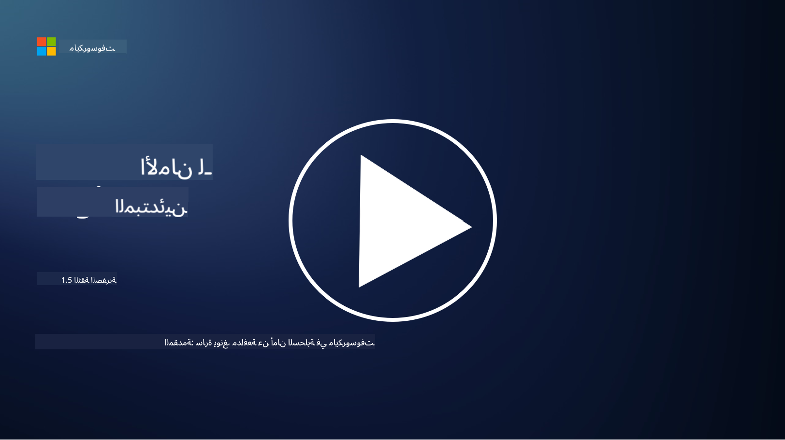
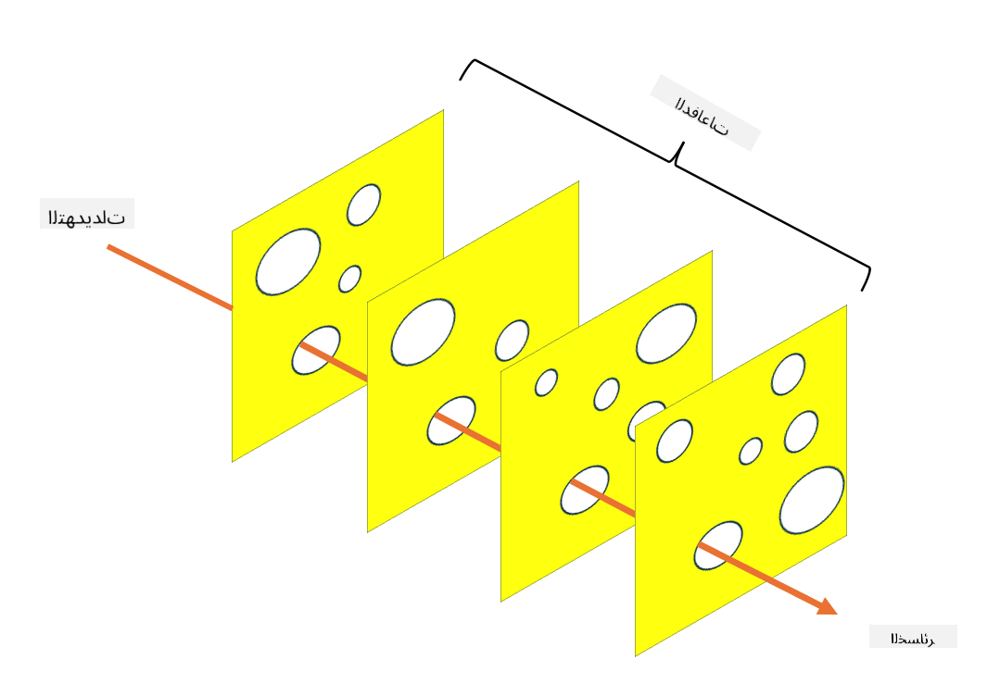

<!--
CO_OP_TRANSLATOR_METADATA:
{
  "original_hash": "75f77f972d2233c584f87c1eb96c983b",
  "translation_date": "2025-09-03T20:29:42+00:00",
  "source_file": "1.5 Zero trust.md",
  "language_code": "ar"
}
-->
# الثقة الصفرية

"الثقة الصفرية" هي عبارة تُستخدم كثيرًا في دوائر الأمن السيبراني هذه الأيام. ولكن ماذا تعني؟ هل هي مجرد كلمة رنانة؟ في هذه الدرس، سنتعمق في مفهوم الثقة الصفرية.

## المقدمة

 - في هذا الدرس، سنغطي:
   
   
 - ما هي الثقة الصفرية؟

   
  

 - كيف تختلف الثقة الصفرية عن نماذج الأمن التقليدية؟

   
   

 - ما هو الدفاع المتعمق؟

## الثقة الصفرية

الثقة الصفرية هي نهج في الأمن السيبراني يتحدى الفكرة التقليدية "الثقة مع التحقق" من خلال افتراض أن أي كيان، سواء كان داخل أو خارج شبكة المؤسسة، لا يجب أن يُوثق به بشكل تلقائي. بدلاً من ذلك، تدعو الثقة الصفرية إلى التحقق من كل مستخدم وجهاز وتطبيق يحاول الوصول إلى الموارد، بغض النظر عن موقعه. المبدأ الأساسي للثقة الصفرية هو تقليل "سطح الهجوم" والحد من تأثير الاختراقات الأمنية.

في نموذج الثقة الصفرية، يتم التركيز على المبادئ التالية:

1. **التحقق من الهوية**: يتم تطبيق المصادقة والتفويض بشكل صارم على جميع المستخدمين والأجهزة، بغض النظر عن موقعهم. تذكر أن الهوية ليست بالضرورة إنسانًا؛ يمكن أن تكون جهازًا أو تطبيقًا أو غير ذلك.

2. **أقل قدر من الامتيازات**: يتم منح المستخدمين والأجهزة الحد الأدنى من الوصول اللازم لأداء مهامهم، مما يقلل من الأضرار المحتملة في حال تعرضهم للاختراق.

3. **التقسيم الجزئي**: يتم تقسيم موارد الشبكة إلى أجزاء أصغر للحد من الحركة الجانبية داخل الشبكة في حالة حدوث اختراق.

4. **المراقبة المستمرة**: يتم إجراء مراقبة وتحليل مستمر لسلوك المستخدمين والأجهزة للكشف عن الشذوذ والتهديدات المحتملة. تستخدم تقنيات المراقبة الحديثة التعلم الآلي والذكاء الاصطناعي ومعلومات التهديد لتوفير تفاصيل وسياق إضافي للمراقبة.

5. **تشفير البيانات**: يتم تشفير البيانات أثناء النقل وفي حالة السكون لمنع الوصول غير المصرح به.

6. **التحكم الصارم في الوصول**: يتم فرض ضوابط الوصول بناءً على السياق، مثل أدوار المستخدم، صحة الجهاز، وموقع الشبكة.

تقوم مايكروسوفت بتقسيم الثقة الصفرية إلى خمسة أعمدة، والتي سنناقشها في درس لاحق.

## الاختلافات عن نماذج الأمن التقليدية

تختلف الثقة الصفرية عن نماذج الأمن التقليدية، مثل النماذج القائمة على المحيط، بعدة طرق:

1. **المحيط مقابل التركيز على الهوية**: تركز النماذج التقليدية على تأمين محيط الشبكة وافتراض أن المستخدمين والأجهزة الداخلية يمكن الوثوق بها بمجرد دخولهم. أما الثقة الصفرية، فتفترض أن التهديدات يمكن أن تنشأ من داخل وخارج الشبكة وتفرض ضوابط صارمة تعتمد على الهوية.

2. **الثقة الضمنية مقابل الثقة الصريحة**: النماذج التقليدية تثق ضمنيًا بالأجهزة والمستخدمين داخل الشبكة حتى يثبت العكس. أما الثقة الصفرية، فتتحقق صراحةً من الهويات وتراقب باستمرار للكشف عن الشذوذ.

3. **الشبكة المسطحة مقابل الشبكة المجزأة**: غالبًا ما تتضمن النماذج التقليدية شبكات مسطحة حيث يتمتع المستخدمون الداخليون بوصول واسع. تدعو الثقة الصفرية إلى تقسيم الشبكة إلى مناطق أصغر ومعزولة لاحتواء الاختراقات المحتملة.

4. **رد الفعل مقابل النهج الاستباقي**: تعتمد الأمن التقليدي غالبًا على إجراءات رد الفعل مثل جدران الحماية المحيطية وأنظمة الكشف عن التسلل. أما الثقة الصفرية، فتتخذ نهجًا استباقيًا من خلال افتراض أن الاختراقات محتملة وتقليل تأثيرها.

## الدفاع المتعمق

الدفاع المتعمق، المعروف أيضًا بالأمن الطبقي، هو استراتيجية في الأمن السيبراني تتضمن نشر طبقات متعددة من الضوابط والإجراءات الأمنية لحماية أصول المؤسسة. الهدف هو إنشاء طبقات متداخلة من الدفاع بحيث إذا تم اختراق طبقة واحدة، يمكن للطبقات الأخرى أن توفر الحماية. تركز كل طبقة على جانب مختلف من الأمن وتزيد من الوضع الأمني العام للمؤسسة.

يتضمن الدفاع المتعمق مزيجًا من الإجراءات التقنية والإجرائية والفيزيائية. يمكن أن تشمل هذه الإجراءات جدران الحماية، أنظمة الكشف عن التسلل، ضوابط الوصول، التشفير، تدريب المستخدمين، السياسات الأمنية، والمزيد. الفكرة هي إنشاء حواجز متعددة تجعل من الصعب على المهاجمين اختراق أنظمة وشبكات المؤسسة. يُعرف هذا أيضًا أحيانًا بنموذج "الجبن السويسري" الذي يُستخدم أيضًا في الوقاية من الحوادث في صناعات أخرى (مثل النقل).

## قراءة إضافية

[ما هي الثقة الصفرية؟](https://learn.microsoft.com/security/zero-trust/zero-trust-overview?WT.mc_id=academic-96948-sayoung)

[تطور الثقة الصفرية – ورقة موقف مايكروسوفت](https://query.prod.cms.rt.microsoft.com/cms/api/am/binary/RWJJdT?WT.mc_id=academic-96948-sayoung)

[الثقة الصفرية وBeyondCorp Google Cloud | مدونة Google Cloud](https://cloud.google.com/blog/topics/developers-practitioners/zero-trust-and-beyondcorp-google-cloud)

---

**إخلاء المسؤولية**:  
تم ترجمة هذا المستند باستخدام خدمة الترجمة بالذكاء الاصطناعي [Co-op Translator](https://github.com/Azure/co-op-translator). بينما نسعى لتحقيق الدقة، يرجى العلم أن الترجمات الآلية قد تحتوي على أخطاء أو معلومات غير دقيقة. يجب اعتبار المستند الأصلي بلغته الأصلية المصدر الرسمي. للحصول على معلومات حاسمة، يُوصى بالاستعانة بترجمة بشرية احترافية. نحن غير مسؤولين عن أي سوء فهم أو تفسيرات خاطئة ناتجة عن استخدام هذه الترجمة.