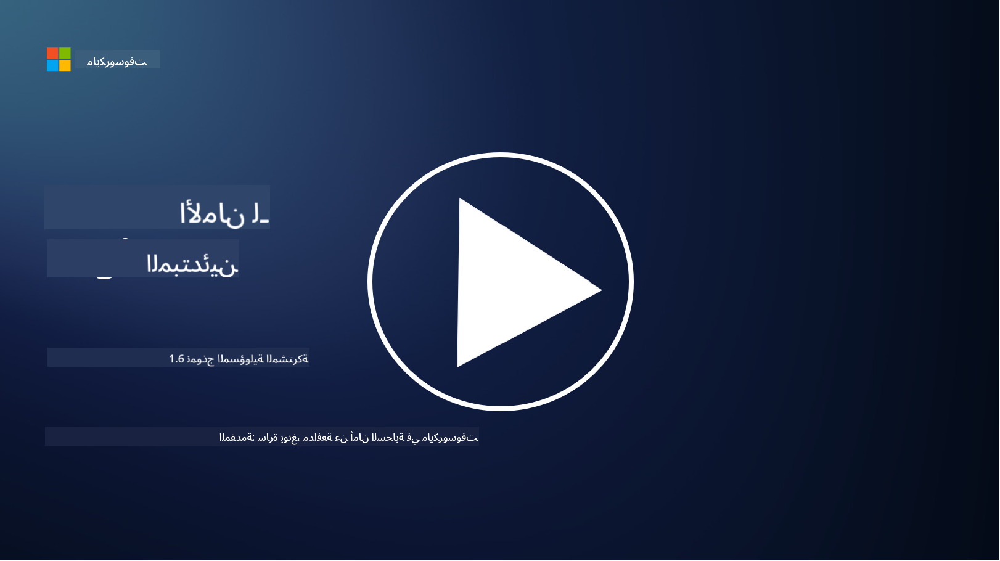

<!--
CO_OP_TRANSLATOR_METADATA:
{
  "original_hash": "a48db640d80c786b928ca178c414f084",
  "translation_date": "2025-09-03T21:02:28+00:00",
  "source_file": "1.6 Shared responsibility model.md",
  "language_code": "ar"
}
-->
# نموذج المسؤولية المشتركة

المسؤولية المشتركة هي مفهوم جديد في مجال تقنية المعلومات ظهر مع تطور الحوسبة السحابية. من منظور الأمن السيبراني، من الضروري فهم من يقدم أي ضوابط أمنية لضمان عدم وجود ثغرات في الدفاع.

## المقدمة

في هذه الدرس، سنتناول:

- ما هي المسؤولية المشتركة في سياق الأمن السيبراني؟

- ما هو الفرق في المسؤولية المشتركة لضوابط الأمن بين IaaS وPaaS وSaaS؟

- أين يمكنك العثور على الضوابط الأمنية التي يوفرها نظام الحوسبة السحابية الخاص بك؟

- ما معنى "الثقة ولكن التحقق"؟

## ما هي المسؤولية المشتركة في سياق الأمن السيبراني؟

تشير المسؤولية المشتركة في الأمن السيبراني إلى توزيع المسؤوليات الأمنية بين مزود الخدمة السحابية (CSP) وعملائه. في بيئات الحوسبة السحابية، مثل البنية التحتية كخدمة (IaaS)، المنصة كخدمة (PaaS)، والبرمجيات كخدمة (SaaS)، يلعب كل من مزود الخدمة والعميل دورًا في ضمان أمن البيانات والتطبيقات والأنظمة.

## ما هو الفرق في المسؤولية المشتركة لضوابط الأمن بين IaaS وPaaS وSaaS؟

تقسيم المسؤوليات يعتمد عادةً على نوع الخدمة السحابية المستخدمة:

- **IaaS (البنية التحتية كخدمة):** يقدم مزود الخدمة البنية التحتية الأساسية (الخوادم، الشبكات، التخزين)، بينما يكون العميل مسؤولًا عن إدارة أنظمة التشغيل والتطبيقات وتكوينات الأمان على تلك البنية التحتية.

- **PaaS (المنصة كخدمة):** يوفر مزود الخدمة منصة يمكن للعملاء استخدامها لبناء ونشر التطبيقات. يدير مزود الخدمة البنية التحتية الأساسية، بينما يركز العميل على تطوير التطبيقات وأمن البيانات.

- **SaaS (البرمجيات كخدمة):** يقدم مزود الخدمة تطبيقات جاهزة للاستخدام عبر الإنترنت. في هذه الحالة، يكون مزود الخدمة مسؤولًا عن أمان التطبيق والبنية التحتية، بينما يدير العميل الوصول إلى المستخدمين واستخدام البيانات.

فهم المسؤولية المشتركة أمر بالغ الأهمية لأنه يوضح الجوانب الأمنية التي يغطيها مزود الخدمة والجوانب التي يجب على العميل معالجتها. يساعد ذلك في منع سوء الفهم وضمان تنفيذ التدابير الأمنية بشكل شامل.

## أين يمكنك العثور على الضوابط الأمنية التي يوفرها نظام الحوسبة السحابية الخاص بك؟

للعثور على الضوابط الأمنية التي يوفرها نظام الحوسبة السحابية الخاص بك، يجب الرجوع إلى وثائق وموارد مزود الخدمة السحابية. تشمل هذه الموارد:

- **موقع مزود الخدمة ووثائقه:** يحتوي موقع مزود الخدمة على معلومات حول الميزات الأمنية والضوابط المقدمة كجزء من خدماته. عادةً ما يقدم مزودو الخدمة وثائق تفصيلية تشرح ممارساتهم الأمنية، الضوابط، والتوصيات. قد تشمل هذه الوثائق أوراق بيضاء، أدلة أمنية، ووثائق تقنية.

- **تقييمات ومراجعات الأمان:** يقوم معظم مزودي الخدمة السحابية بتقييم ضوابطهم الأمنية من قبل خبراء أمن مستقلين ومنظمات. توفر هذه المراجعات رؤى حول جودة التدابير الأمنية لمزود الخدمة. في بعض الأحيان يؤدي ذلك إلى حصول مزود الخدمة على شهادة امتثال أمني (انظر النقطة التالية).

- **شهادات الامتثال الأمني:** يحصل معظم مزودي الخدمة على شهادات مثل ISO:27001، SOC 2، وFedRAMP، وغيرها. تثبت هذه الشهادات أن المزود يلتزم بمعايير أمنية وامتثال محددة.

تذكر أن مستوى التفاصيل وتوفر المعلومات قد يختلف بين مزودي الخدمة السحابية. تأكد دائمًا من الرجوع إلى الموارد الرسمية والمحدثة التي يقدمها مزود الخدمة السحابية لاتخاذ قرارات مستنيرة بشأن أمان أصولك السحابية.

## ما معنى "الثقة ولكن التحقق"؟

في سياق استخدام مزود الخدمة السحابية، برامج الطرف الثالث أو خدمات الأمن السيبراني الأخرى، قد تثق المنظمة في البداية بادعاءات المزود بشأن التدابير الأمنية. ومع ذلك، لضمان سلامة بياناتها وأنظمتها، يجب عليها التحقق من هذه الادعاءات من خلال تقييمات الأمان، اختبارات الاختراق، ومراجعة ضوابط الأمان الخاصة بالطرف الخارجي قبل دمج البرنامج أو الخدمة بالكامل في عملياتها. يجب على جميع الأفراد والمنظمات السعي إلى الثقة ولكن التحقق من الضوابط الأمنية التي لا يتحملون مسؤوليتها.

## المسؤولية المشتركة داخل المنظمة

تذكر أن المسؤولية المشتركة للأمن داخل المنظمة بين الفرق المختلفة يجب أن تؤخذ أيضًا في الاعتبار. نادرًا ما تقوم فرق الأمن بتنفيذ جميع الضوابط بنفسها، وستحتاج إلى التعاون مع فرق العمليات، المطورين، وأجزاء أخرى من العمل لتنفيذ جميع الضوابط الأمنية اللازمة للحفاظ على أمان المنظمة.

## قراءة إضافية
- [المسؤولية المشتركة في السحابة - Microsoft Azure | Microsoft Learn](https://learn.microsoft.com/azure/security/fundamentals/shared-responsibility?WT.mc_id=academic-96948-sayoung)
- [ما هو نموذج المسؤولية المشتركة؟ – تعريف من TechTarget.com](https://www.techtarget.com/searchcloudcomputing/definition/shared-responsibility-model)
- [شرح نموذج المسؤولية المشتركة وما يعنيه لأمن السحابة | CSO Online](https://www.csoonline.com/article/570779/the-shared-responsibility-model-explained-and-what-it-means-for-cloud-security.html)
- [المسؤولية المشتركة لأمن السحابة: ما تحتاج إلى معرفته (cisecurity.org)](https://www.cisecurity.org/insights/blog/shared-responsibility-cloud-security-what-you-need-to-know)

---

**إخلاء المسؤولية**:  
تم ترجمة هذا المستند باستخدام خدمة الترجمة بالذكاء الاصطناعي [Co-op Translator](https://github.com/Azure/co-op-translator). بينما نسعى لتحقيق الدقة، يرجى العلم أن الترجمات الآلية قد تحتوي على أخطاء أو معلومات غير دقيقة. يجب اعتبار المستند الأصلي بلغته الأصلية المصدر الموثوق. للحصول على معلومات حاسمة، يُوصى بالاستعانة بترجمة بشرية احترافية. نحن غير مسؤولين عن أي سوء فهم أو تفسيرات خاطئة تنشأ عن استخدام هذه الترجمة.