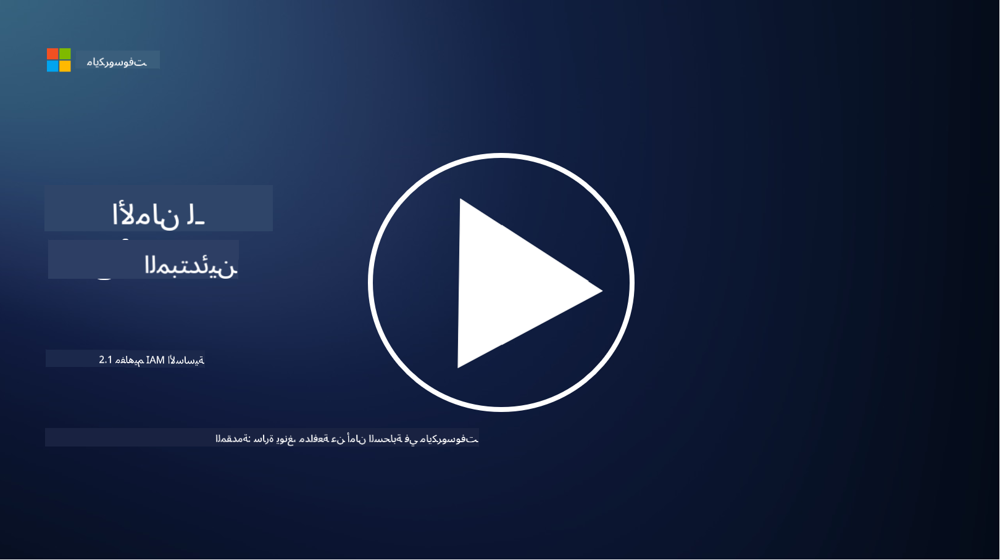

<!--
CO_OP_TRANSLATOR_METADATA:
{
  "original_hash": "2e3864e3d579f0dbb4ac2ec8c5f82acf",
  "translation_date": "2025-09-03T19:33:47+00:00",
  "source_file": "2.1 IAM key concepts.md",
  "language_code": "ar"
}
-->
# مفاهيم أساسية في إدارة الهوية والوصول (IAM)

هل سبق لك أن قمت بتسجيل الدخول إلى جهاز كمبيوتر أو موقع إلكتروني؟ بالطبع فعلت! هذا يعني أنك استخدمت بالفعل أدوات التحكم في الهوية في حياتك اليومية. إدارة الهوية والوصول (IAM) هي ركيزة أساسية للأمن، وسنتعلم المزيد عنها في الدروس القادمة.

**المقدمة**

في هذا الدرس، سنتناول:

- ماذا نعني بإدارة الهوية والوصول (IAM) في سياق الأمن السيبراني؟
- ما هو مبدأ أقل امتياز؟
- ما هو الفصل بين المهام؟
- ما هو التحقق من الهوية والتفويض؟

## ماذا نعني بإدارة الهوية والوصول (IAM) في سياق الأمن السيبراني؟

إدارة الهوية والوصول (IAM) تشير إلى مجموعة من العمليات والتقنيات والسياسات التي يتم تنفيذها لضمان أن الأفراد المناسبين لديهم الوصول المناسب إلى الموارد داخل البيئة الرقمية للمؤسسة. تتضمن IAM إدارة الهويات الرقمية (المستخدمين، الموظفين، الشركاء) والوصول إلى الأنظمة والتطبيقات والبيانات والشبكات. الهدف الأساسي من IAM هو تعزيز الأمن، تبسيط وصول المستخدم، وضمان الامتثال لسياسات ولوائح المؤسسة. عادةً ما تشمل حلول IAM التحقق من الهوية، التفويض، توفير الهوية، التحكم في الوصول، وإدارة دورة حياة المستخدم (التأكد من حذف الحسابات عندما لا يتم استخدامها).

## ما هو مبدأ أقل امتياز؟

مبدأ أقل امتياز هو مفهوم أساسي يدعو إلى منح المستخدمين والأنظمة الحد الأدنى من الامتيازات اللازمة لأداء مهامهم أو أدوارهم المقصودة فقط. يساعد هذا المبدأ في تقليل الأضرار المحتملة التي قد تحدث في حالة حدوث اختراق أمني أو تهديد داخلي. من خلال الالتزام بمبدأ أقل امتياز، تقلل المؤسسات من سطح الهجوم وتقلل من خطر الوصول غير المصرح به، وتسرب البيانات، وسوء استخدام الامتيازات عن طريق الخطأ. عمليًا، يعني ذلك أن المستخدمين يحصلون فقط على الوصول إلى الموارد والوظائف المحددة المطلوبة لأدوارهم الوظيفية، ولا أكثر. على سبيل المثال، إذا كنت تحتاج فقط إلى قراءة مستند، فسيكون من المبالغ فيه أن تحصل على امتيازات إدارية كاملة لهذا المستند.

## ما هو الفصل بين المهام؟

الفصل بين المهام هو مبدأ يهدف إلى منع تضارب المصالح وتقليل خطر الاحتيال والأخطاء من خلال توزيع المهام والمسؤوليات الحرجة بين أفراد مختلفين داخل المؤسسة. في سياق الأمن السيبراني، يتضمن الفصل بين المهام ضمان أن لا يكون لأي فرد واحد السيطرة على جميع جوانب عملية أو نظام حرج. الهدف هو إنشاء نظام من الضوابط والتوازنات التي تمنع أي شخص واحد من القدرة على تنفيذ كل من مراحل الإعداد والموافقة لعملية معينة. على سبيل المثال، في الأنظمة المالية، قد يتطلب ذلك أن الشخص الذي يدخل المعاملات في النظام لا يكون هو نفسه الشخص الذي يوافق على تلك المعاملات. هذا يقلل من خطر الإجراءات غير المصرح بها أو الاحتيالية التي تمر دون اكتشاف.

## ما هو التحقق من الهوية والتفويض؟

التحقق من الهوية والتفويض هما مفهومان أساسيان في الأمن السيبراني يلعبان دورًا حيويًا في ضمان أمن وسلامة أنظمة الكمبيوتر والبيانات. غالبًا ما يتم استخدامهما معًا للتحكم في الوصول إلى الموارد وحماية المعلومات الحساسة.

**1. التحقق من الهوية**: التحقق من الهوية هو عملية التحقق من هوية المستخدم أو النظام أو الكيان الذي يحاول الوصول إلى نظام كمبيوتر أو مورد معين. يضمن أن الهوية المزعومة حقيقية ودقيقة. عادةً ما تتضمن طرق التحقق من الهوية استخدام واحد أو أكثر من العوامل التالية:

   أ. شيء تعرفه: يشمل ذلك كلمات المرور، أرقام التعريف الشخصية (PINs)، أو أي معلومات سرية يجب أن يمتلكها المستخدم المصرح له فقط.
   
   ب. شيء تمتلكه: يتضمن ذلك الرموز أو الأجهزة المادية مثل البطاقات الذكية، الرموز الأمنية، أو الهواتف المحمولة المستخدمة لتأكيد هوية المستخدم.
   
   ج. شيء أنت عليه: يشير إلى العوامل البيومترية مثل بصمات الأصابع، التعرف على الوجه، أو مسح الشبكية التي تكون فريدة للفرد.

آليات التحقق من الهوية تُستخدم لتأكيد أن المستخدم هو من يدعي أنه قبل السماح له بالوصول إلى نظام أو مورد. يساعد ذلك في منع الوصول غير المصرح به ويضمن أن المستخدمين الشرعيين فقط يمكنهم تنفيذ الإجراءات داخل النظام.

**2. التفويض**: التفويض هو عملية منح أو رفض أذونات وامتيازات محددة للمستخدمين أو الكيانات التي تم التحقق من هويتها بعد التأكد من هويتهم. يحدد ما هي الإجراءات أو العمليات التي يُسمح للمستخدم بتنفيذها داخل النظام أو على موارد معينة. غالبًا ما يعتمد التفويض على سياسات محددة مسبقًا، قواعد التحكم في الوصول، والأدوار المخصصة للمستخدمين.

يمكن اعتبار التفويض كإجابة على السؤال: "ما الذي يمكن للمستخدم الذي تم التحقق من هويته القيام به؟" يتضمن ذلك تعريف وتنفيذ سياسات التحكم في الوصول لحماية البيانات والموارد الحساسة من الوصول أو التعديل غير المصرح به.

**باختصار:**

- التحقق من الهوية يثبت هوية المستخدمين أو الكيانات.
- التفويض يحدد ما هي الإجراءات والموارد التي يُسمح للمستخدمين الذين تم التحقق من هويتهم بالوصول إليها أو تعديلها.

## قراءة إضافية

- [Describe identity concepts - Training | Microsoft Learn](https://learn.microsoft.com/training/modules/describe-identity-principles-concepts/?WT.mc_id=academic-96948-sayoung)
- [Introduction to identity - Microsoft Entra | Microsoft Learn](https://learn.microsoft.com/azure/active-directory/fundamentals/identity-fundamental-concepts?WT.mc_id=academic-96948-sayoung)
- [What is Identity Access Management (IAM)? | Microsoft Security](https://www.microsoft.com/security/business/security-101/what-is-identity-access-management-iam?WT.mc_id=academic-96948-sayoung)
- [What is IAM? Identity and access management explained | CSO Online](https://www.csoonline.com/article/518296/what-is-iam-identity-and-access-management-explained.html)
- [What is IAM? (auth0.com)](https://auth0.com/blog/what-is-iam/)
- [Security+: implementing Identity and Access Management (IAM) controls [updated 2021] | Infosec (infosecinstitute.com)](https://resources.infosecinstitute.com/certifications/securityplus/security-implementing-identity-and-access-management-iam-controls/)
- [least privilege - Glossary | CSRC (nist.gov)](https://csrc.nist.gov/glossary/term/least_privilege)
- [Security: The Principle of Least Privilege (POLP) - Microsoft Community Hub](https://techcommunity.microsoft.com/t5/azure-sql-blog/security-the-principle-of-least-privilege-polp/ba-p/2067390?WT.mc_id=academic-96948-sayoung)
- [Principle of least privilege | CERT NZ](https://www.cert.govt.nz/it-specialists/critical-controls/principle-of-least-privilege/)
- [Why is separation of duties required by NIST 800-171 and CMMC? - (totem.tech)](https://www.totem.tech/cmmc-separation-of-duties/)

---

**إخلاء المسؤولية**:  
تم ترجمة هذا المستند باستخدام خدمة الترجمة بالذكاء الاصطناعي [Co-op Translator](https://github.com/Azure/co-op-translator). بينما نسعى لتحقيق الدقة، يرجى العلم أن الترجمات الآلية قد تحتوي على أخطاء أو معلومات غير دقيقة. يجب اعتبار المستند الأصلي بلغته الأصلية المصدر الموثوق. للحصول على معلومات حاسمة، يُوصى بالاستعانة بترجمة بشرية احترافية. نحن غير مسؤولين عن أي سوء فهم أو تفسيرات خاطئة تنشأ عن استخدام هذه الترجمة.