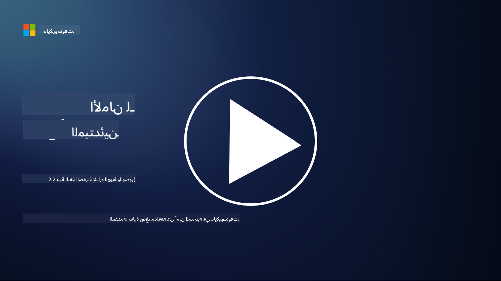

<!--
CO_OP_TRANSLATOR_METADATA:
{
  "original_hash": "4774a978af123f72ebb872199c4c4d4f",
  "translation_date": "2025-09-03T20:24:27+00:00",
  "source_file": "2.2 IAM zero trust architecture.md",
  "language_code": "ar"
}
-->
# بنية الثقة الصفرية لإدارة الهوية والوصول (IAM)

الهوية هي جزء أساسي من تنفيذ بنية الثقة الصفرية وبناء محيط لأي بيئة تقنية معلومات. في هذا القسم، سنستكشف لماذا من المهم استخدام ضوابط الهوية لتنفيذ الثقة الصفرية.

## المقدمة

في هذه الدرس، سنتناول:

- لماذا نحتاج إلى استخدام الهوية كمحيط في بيئات تقنية المعلومات الحديثة؟

- كيف يختلف هذا عن بنى تقنية المعلومات التقليدية؟

- كيف تُستخدم الهوية لتنفيذ بنية الثقة الصفرية؟

## لماذا نحتاج إلى استخدام الهوية كمحيط في بيئات تقنية المعلومات الحديثة؟

في بيئات تقنية المعلومات الحديثة، أصبح مفهوم المحيط الفيزيائي التقليدي (باستخدام أدوات مثل الجدران النارية وحدود الشبكة) كخط دفاع رئيسي ضد التهديدات السيبرانية أقل فعالية بسبب تعقيد التكنولوجيا المتزايد، انتشار العمل عن بُعد، واعتماد الخدمات السحابية. بدلاً من ذلك، تتجه المؤسسات نحو استخدام الهوية كمحيط جديد. هذا يعني أن الأمن يدور حول التحقق وإدارة هوية المستخدمين، الأجهزة، والتطبيقات التي تحاول الوصول إلى الموارد، بغض النظر عن موقعها الفيزيائي.

إليك لماذا يعتبر استخدام الهوية كمحيط أمرًا ضروريًا في بيئات تقنية المعلومات الحديثة:

**القوى العاملة عن بُعد**: مع انتشار العمل عن بُعد واستخدام الأجهزة المحمولة، يمكن للمستخدمين الوصول إلى الموارد من مواقع وأجهزة مختلفة. النهج التقليدي للمحيط لا يعمل عندما لا يكون المستخدمون محصورين في مكتب فيزيائي.

**البيئات السحابية والهجينة**: تتبنى المؤسسات بشكل متزايد الخدمات السحابية والبيئات الهجينة. لم تعد البيانات والتطبيقات موجودة فقط داخل مقر المؤسسة، مما يجعل الدفاعات التقليدية للمحيط أقل أهمية.

**أمن الثقة الصفرية**: مفهوم أمن الثقة الصفرية يفترض أن أي كيان، سواء داخل أو خارج الشبكة، لا يجب أن يُوثق به تلقائيًا. تصبح الهوية الأساس للتحقق من طلبات الوصول، بغض النظر عن مصدرها.

**مشهد التهديدات**: التهديدات السيبرانية تتطور، والمهاجمون يجدون طرقًا لتجاوز الدفاعات التقليدية للمحيط. التصيد الاحتيالي، الهندسة الاجتماعية، والتهديدات الداخلية غالبًا ما تستغل نقاط ضعف البشر بدلاً من محاولة اختراق محيط الشبكة.

**نهج يركز على البيانات**: حماية البيانات الحساسة أمر بالغ الأهمية. من خلال التركيز على الهوية، يمكن للمؤسسات التحكم في من يصل إلى أي بيانات، مما يقلل من خطر تسرب البيانات.

## كيف يختلف هذا عن بنى تقنية المعلومات التقليدية؟

كانت بنى تقنية المعلومات التقليدية تعتمد بشكل كبير على نماذج أمنية قائمة على المحيط، حيث لعبت الجدران النارية وحدود الشبكة دورًا كبيرًا في منع التهديدات. الفروقات الرئيسية بين النهج التقليدي ونهج الهوية هي:

|      الجانب                 |      بنى تقنية المعلومات التقليدية                                                              |      النهج القائم على الهوية                                                                             |
|-----------------------------|----------------------------------------------------------------------------------------------------|------------------------------------------------------------------------------------------------------------|
|     التركيز                 |     التركيز على المحيط: يعتمد على دفاعات المحيط مثل الجدران النارية   والتحكم في الوصول.             |     التركيز على التحقق من الهوية: الانتقال من حدود الشبكة إلى التحقق من   هوية المستخدم/الجهاز.             |
|     الموقع                  |     الاعتماد على الموقع: - الأمن مرتبط بمواقع المكاتب الفيزيائية وحدود   الشبكة.                  |     الاستقلالية عن الموقع: الأمن غير مرتبط بمواقع محددة؛ الوصول من أي مكان.                               |
|     افتراض الثقة            |     افتراض الثقة: الثقة مفترضة داخل محيط الشبكة للمستخدمين/الأجهزة.                              |     نهج الثقة الصفرية: الثقة لا تُفترض أبدًا؛ يتم التحقق من الوصول بناءً   على الهوية والسياق.             |
|     اعتبار الجهاز            |     تنوع الأجهزة: يُفترض أن الأجهزة داخل محيط الشبكة آمنة.                                        |     الوعي بالجهاز: يتم أخذ صحة الجهاز ووضعه الأمني في الاعتبار، بغض النظر   عن الموقع.                     |
|     حماية البيانات           |     حماية البيانات: التركيز على تأمين محيط الشبكة لحماية البيانات.                                |     حماية تركز على البيانات: التركيز على التحكم في الوصول إلى البيانات بناءً   على الهوية وحساسية البيانات. |

## كيف تُستخدم الهوية لتنفيذ بنية الثقة الصفرية؟

في بنية الثقة الصفرية، المبدأ الأساسي هو عدم الثقة تلقائيًا بأي كيان، سواء كان داخل أو خارج محيط الشبكة. تلعب الهوية دورًا مركزيًا في تنفيذ نهج الثقة الصفرية من خلال تمكين التحقق المستمر من الكيانات التي تحاول الوصول إلى الموارد. تتيح ضوابط أمن الهوية الحديثة لكل مستخدم، جهاز، تطبيق، وخدمة تسعى للوصول إلى الموارد أن يتم تحديدها ومصادقتها بدقة قبل منح الوصول. يتضمن ذلك التحقق من الهوية الرقمية باستخدام طرق مثل اسم المستخدم/كلمة المرور، المصادقة متعددة العوامل (MFA)، القياسات الحيوية، وآليات المصادقة القوية الأخرى.

## قراءة إضافية

- [Securing identity with Zero Trust | Microsoft Learn](https://learn.microsoft.com/security/zero-trust/deploy/identity?WT.mc_id=academic-96948-sayoung)
- [Zero Trust Principles and Guidance for Identity and Access | CSA (cloudsecurityalliance.org)](https://cloudsecurityalliance.org/artifacts/zero-trust-principles-and-guidance-for-iam/)
- [Zero Trust Identity Controls - Essentials Series - Episode 2 - YouTube](https://www.youtube.com/watch?v=fQZQznIKcGM&list=PLXtHYVsvn_b_gtX1-NB62wNervQx1Fhp4&index=13)

---

**إخلاء المسؤولية**:  
تم ترجمة هذا المستند باستخدام خدمة الترجمة بالذكاء الاصطناعي [Co-op Translator](https://github.com/Azure/co-op-translator). بينما نسعى لتحقيق الدقة، يرجى العلم أن الترجمات الآلية قد تحتوي على أخطاء أو معلومات غير دقيقة. يجب اعتبار المستند الأصلي بلغته الأصلية المصدر الرسمي. للحصول على معلومات حاسمة، يُوصى بالاستعانة بترجمة بشرية احترافية. نحن غير مسؤولين عن أي سوء فهم أو تفسيرات خاطئة تنشأ عن استخدام هذه الترجمة.