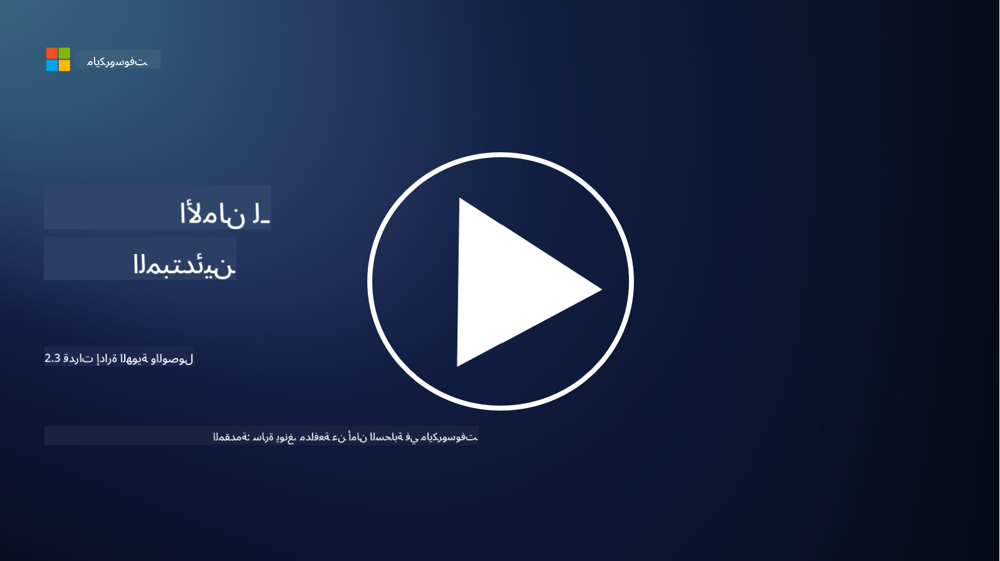

<!--
CO_OP_TRANSLATOR_METADATA:
{
  "original_hash": "bf0b8a54f2c69951744df5a94bc923f7",
  "translation_date": "2025-09-03T22:08:24+00:00",
  "source_file": "2.3 IAM capabilities.md",
  "language_code": "ar"
}
-->
# قدرات إدارة الهوية والوصول (IAM)

في هذا القسم، سنغطي المزيد من التفاصيل حول الأدوات والقدرات الأساسية المستخدمة في أمان الهوية.

## المقدمة

في هذه الدرس، سنغطي:

 - ما هو خدمة الدليل؟
      
     
    
 - ما هي القدرات التي يمكن استخدامها لتأمين الهويات؟
>
>        المصادقة متعددة العوامل (MFA)
> 
>        تسجيل الدخول الموحد (SSO)
> 
>        التحكم في الوصول بناءً على الأدوار (RBAC)
> 
>        المصادقة التكيفية
> 
>        المصادقة البيومترية
> 
>        إدارة الوصول المميز (PAM)
> 
>        إدارة الحوكمة والهوية (IGA)
> 
>        تحليلات السلوك

## ما هو خدمة الدليل؟

خدمة الدليل هي قاعدة بيانات متخصصة تخزن وتدير معلومات حول موارد الشبكة، بما في ذلك المستخدمين، المجموعات، الأجهزة، التطبيقات، وغيرها من الكائنات. تعمل كمرجع مركزي للبيانات المتعلقة بالهوية والوصول، مما يسمح للمؤسسات بإدارة ومراقبة مصادقة المستخدم، التفويض، وغيرها من المهام الأمنية بكفاءة.

تلعب خدمات الدليل دورًا حيويًا في بيئات تكنولوجيا المعلومات الحديثة من خلال توفير أساس لحلول إدارة الهوية والوصول (IAM). تسهل الوصول الآمن إلى الموارد، تفرض سياسات الوصول، وتبسط المهام الإدارية. واحدة من خدمات الدليل الأكثر شهرة هي Microsoft Active Directory، ولكن هناك حلول أخرى مثل أدلة LDAP (بروتوكول الوصول الخفيف إلى الدليل) التي تخدم أغراض مشابهة.

الوظائف والميزات الرئيسية لخدمة الدليل في سياق الأمن السيبراني تشمل:

 - **مصادقة المستخدم**: تتحقق خدمات الدليل من بيانات اعتماد المستخدم (مثل أسماء المستخدمين وكلمات المرور) لضمان أن المستخدمين المصرح لهم فقط يمكنهم الوصول إلى الشبكة ومواردها.
 - **تفويض المستخدم**: تحدد مستوى الوصول الذي يمتلكه كل مستخدم بناءً على دوره، عضويته في المجموعة، وسمات أخرى. يضمن ذلك أن المستخدمين يمكنهم الوصول فقط إلى الموارد التي يحق لهم الوصول إليها.
 - **إدارة المجموعات**: تسمح خدمات الدليل للمسؤولين بتنظيم المستخدمين في مجموعات منطقية، مما يبسط إدارة التحكم في الوصول. يمكن تعيين الأذونات للمجموعات بدلاً من المستخدمين الفرديين.
 - **سياسات كلمات المرور**: تفرض تعقيد كلمات المرور وقواعد انتهاء صلاحيتها، مما يعزز أمان حسابات المستخدمين.
 - **تسجيل الدخول الموحد (SSO)**: تدعم بعض خدمات الدليل تسجيل الدخول الموحد، مما يتيح للمستخدمين الوصول إلى تطبيقات وخدمات متعددة باستخدام مجموعة واحدة من بيانات الاعتماد.
 - **إدارة المستخدم المركزية**: تركز خدمات الدليل معلومات المستخدم، مما يجعل من السهل إدارة حسابات المستخدمين، الملفات الشخصية، والسمات من موقع واحد.
 - **التدقيق والتسجيل**: يمكنها تسجيل أنشطة مصادقة المستخدم والوصول، مما يساعد في عمليات التدقيق الأمني وجهود الامتثال.

## ما هي القدرات التي يمكن استخدامها لتأمين الهويات؟

**المصادقة متعددة العوامل (MFA)**

تتطلب المصادقة متعددة العوامل من المستخدمين تقديم أشكال متعددة من التحقق قبل منح الوصول. يشمل ذلك عادةً شيئًا يعرفه المستخدم (كلمة المرور)، شيئًا يمتلكه المستخدم (الهاتف الذكي أو رمز الأمان)، وشيئًا يكونه المستخدم (بيانات بيومترية مثل بصمة الإصبع أو التعرف على الوجه).

**تسجيل الدخول الموحد (SSO)**

يسمح تسجيل الدخول الموحد للمستخدمين بالوصول إلى تطبيقات وأنظمة متعددة باستخدام مجموعة واحدة من بيانات الاعتماد. يحسن ذلك تجربة المستخدم ويقلل من المخاطر المرتبطة بإدارة كلمات مرور متعددة.

**التحكم في الوصول بناءً على الأدوار (RBAC)**

يخصص التحكم في الوصول بناءً على الأدوار الأذونات بناءً على الأدوار المحددة مسبقًا. يتم منح المستخدمين الوصول بناءً على أدوارهم داخل المؤسسة.

**المصادقة التكيفية**

تقيم المصادقة التكيفية عوامل المخاطر مثل الموقع، الجهاز، وقت الوصول، وسلوك المستخدم لتعديل مستوى المصادقة المطلوب ديناميكيًا. إذا بدا الطلب مشبوهًا، قد يتم تفعيل خطوات مصادقة إضافية.

**المصادقة البيومترية**

تستخدم المصادقة البيومترية خصائص بيولوجية فريدة مثل بصمات الأصابع، ملامح الوجه، أنماط الصوت، وحتى السمات السلوكية مثل سرعة الكتابة للتحقق من الهوية.

**إدارة الوصول المميز (PAM)**

تركز إدارة الوصول المميز على تأمين الوصول إلى الأنظمة والبيانات الحرجة من خلال فرض ضوابط صارمة على الحسابات المميزة. تشمل الميزات مثل الوصول عند الحاجة ومراقبة الجلسات.

**إدارة الحوكمة والهوية (IGA)**

تدير حلول إدارة الحوكمة والهوية هويات المستخدمين ووصولهم إلى الموارد طوال دورة حياتهم. يشمل ذلك الإعداد، التوفير، التحكم في الوصول بناءً على الأدوار، وإلغاء التوفير.

**تحليلات السلوك**

تحليلات السلوك تراقب سلوك المستخدم وتضع أنماطًا أساسية. يمكن أن تؤدي الانحرافات عن النمط الطبيعي إلى إطلاق تنبيهات لمزيد من التحقيق.

# قراءة إضافية
- [وثائق أساسيات Azure Active Directory - Microsoft Entra | Microsoft Learn](https://learn.microsoft.com/azure/active-directory/fundamentals/?WT.mc_id=academic-96948-sayoung)
- [ما هو Azure Active Directory؟ - Microsoft Entra | Microsoft Learn](https://learn.microsoft.com/azure/active-directory/fundamentals/whatis?WT.mc_id=academic-96948-sayoung)
- [إدارة بنية الهوية متعددة السحابة باستخدام Microsoft Entra - YouTube](https://www.youtube.com/watch?v=9qQiq3wTS2Y&list=PLXtHYVsvn_b_gtX1-NB62wNervQx1Fhp4&index=18)

---

**إخلاء المسؤولية**:  
تمت ترجمة هذا المستند باستخدام خدمة الترجمة الآلية [Co-op Translator](https://github.com/Azure/co-op-translator). بينما نسعى لتحقيق الدقة، يرجى العلم أن الترجمات الآلية قد تحتوي على أخطاء أو معلومات غير دقيقة. يجب اعتبار المستند الأصلي بلغته الأصلية هو المصدر الموثوق. للحصول على معلومات حساسة أو هامة، يُوصى بالاستعانة بترجمة بشرية احترافية. نحن غير مسؤولين عن أي سوء فهم أو تفسيرات خاطئة تنشأ عن استخدام هذه الترجمة.