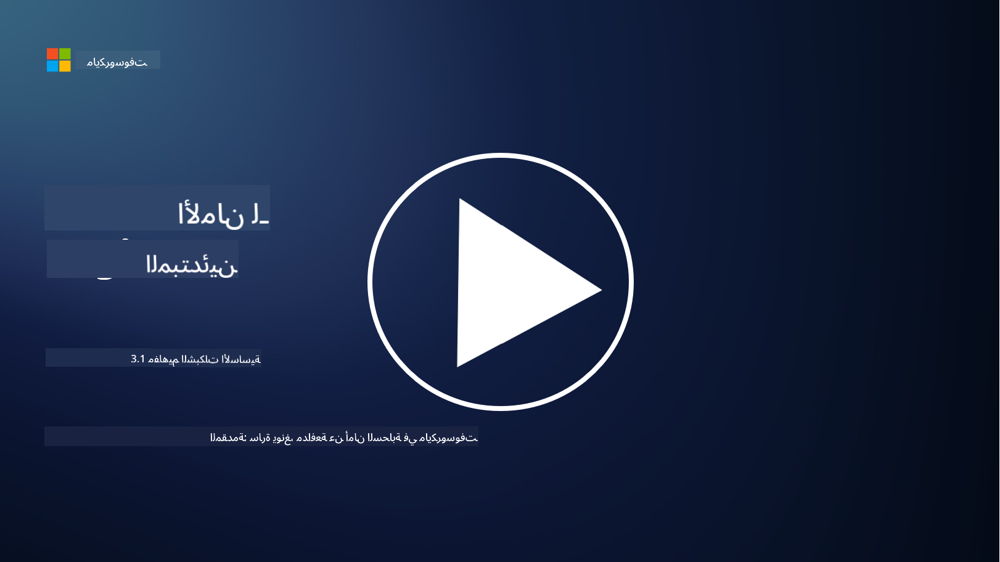
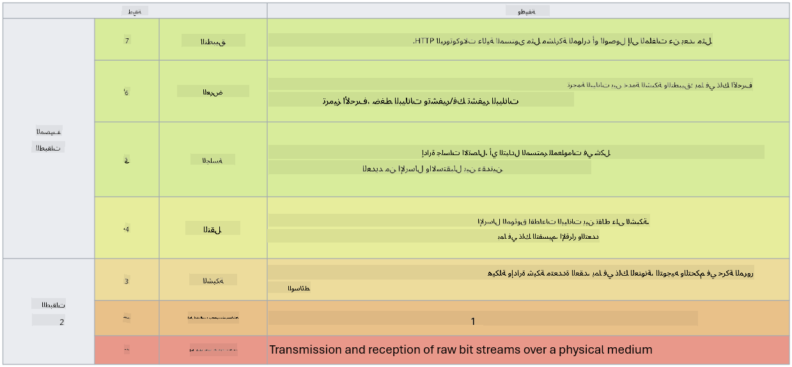

<!--
CO_OP_TRANSLATOR_METADATA:
{
  "original_hash": "252724eceeb183fb9018f88c5e1a3f0c",
  "translation_date": "2025-09-03T22:01:56+00:00",
  "source_file": "3.1 Networking key concepts.md",
  "language_code": "ar"
}
-->
# مفاهيم أساسية في الشبكات

إذا كنت قد عملت في مجال تقنية المعلومات، فمن المحتمل أنك تعرضت لمفاهيم الشبكات. على الرغم من أننا نستخدم الهوية كوسيلة رئيسية للتحكم في المحيط في البيئات الحديثة، إلا أن هذا لا يعني أن أدوات التحكم في الشبكة أصبحت غير ضرورية. على الرغم من أن هذا الموضوع واسع جدًا، إلا أننا سنغطي في هذه الدرس بعض المفاهيم الأساسية في الشبكات.

في هذا الدرس، سنتناول:

- ما هو عنوان IP؟

- ما هو نموذج OSI؟

- ما هو TCP/UDP؟

- ما هي أرقام المنافذ؟

- ما هو التشفير أثناء التخزين وأثناء النقل؟

## ما هو عنوان IP؟

عنوان IP، أو عنوان بروتوكول الإنترنت، هو تسمية رقمية تُخصص لكل جهاز متصل بشبكة حاسوبية تستخدم بروتوكول الإنترنت للتواصل. يعمل كمعرف فريد للأجهزة داخل الشبكة، مما يسمح لها بإرسال واستقبال البيانات عبر الإنترنت أو الشبكات المترابطة الأخرى. هناك نسختان رئيسيتان من عناوين IP: IPv4 (الإصدار الرابع من بروتوكول الإنترنت) وIPv6 (الإصدار السادس من بروتوكول الإنترنت). يتم تمثيل عنوان IP عادةً بتنسيق IPv4 (مثل 192.168.1.1) أو بتنسيق IPv6 (مثل 2001:0db8:85a3:0000:0000:8a2e:0370:7334).

## ما هو نموذج OSI؟

نموذج OSI (ترابط الأنظمة المفتوحة) هو إطار مفاهيمي يقيّم وظائف نظام الاتصال إلى سبع طبقات متميزة. كل طبقة تؤدي مهامًا محددة وتتواصل مع الطبقات المجاورة لضمان اتصال بيانات فعال وموثوق بين الأجهزة في الشبكة. الطبقات، من الأسفل إلى الأعلى، هي كالتالي:

1. الطبقة الفيزيائية

2. طبقة ربط البيانات

3. طبقة الشبكة

4. طبقة النقل

5. طبقة الجلسة

6. طبقة العرض

7. طبقة التطبيقات

يوفر نموذج OSI مرجعًا مشتركًا لفهم كيفية تفاعل بروتوكولات وتقنيات الشبكات، بغض النظر عن تنفيذ الأجهزة أو البرمجيات المحددة.

_ref: https://en.wikipedia.org/wiki/OSI_model_

## ما هو TCP/UDP؟

TCP (بروتوكول التحكم في الإرسال) وUDP (بروتوكول بيانات المستخدم) هما بروتوكولان أساسيان في طبقة النقل يُستخدمان في شبكات الحاسوب لتسهيل الاتصال بين الأجهزة عبر الإنترنت أو داخل الشبكة المحلية. هما مسؤولان عن تقسيم البيانات إلى حزم للإرسال ثم إعادة تجميع تلك الحزم إلى البيانات الأصلية في الطرف المستقبل. ومع ذلك، يختلفان في خصائصهما واستخداماتهما.

**TCP (بروتوكول التحكم في الإرسال)**:

TCP هو بروتوكول يعتمد على الاتصال ويوفر تسليمًا موثوقًا ومنظمًا للبيانات بين الأجهزة. يقوم بإنشاء اتصال بين المرسل والمستقبل قبل بدء تبادل البيانات. يضمن TCP وصول حزم البيانات بالترتيب الصحيح ويمكنه التعامل مع إعادة إرسال الحزم المفقودة لضمان سلامة البيانات واكتمالها. هذا يجعل TCP مناسبًا للتطبيقات التي تتطلب تسليم بيانات موثوقًا، مثل تصفح الويب، البريد الإلكتروني، نقل الملفات (FTP)، والتواصل مع قواعد البيانات.

**UDP (بروتوكول بيانات المستخدم)**:

UDP هو بروتوكول لا يعتمد على الاتصال ويوفر نقل بيانات أسرع ولكنه لا يوفر نفس مستوى الموثوقية مثل TCP. لا يقوم بإنشاء اتصال رسمي قبل إرسال البيانات ولا يتضمن آليات لتأكيد أو إعادة إرسال الحزم المفقودة. يناسب UDP التطبيقات التي تكون فيها السرعة والكفاءة أكثر أهمية من ضمان التسليم، مثل الاتصال في الوقت الحقيقي، بث الوسائط، الألعاب عبر الإنترنت، واستعلامات DNS.

باختصار، يركز TCP على الموثوقية وتسليم البيانات بالترتيب، مما يجعله مناسبًا للتطبيقات التي تتطلب دقة البيانات، بينما يركز UDP على السرعة والكفاءة، مما يجعله مناسبًا للتطبيقات التي يمكنها تحمل فقدان بيانات بسيط أو إعادة ترتيبها مقابل تقليل التأخير. يعتمد الاختيار بين TCP وUDP على المتطلبات المحددة للتطبيق أو الخدمة المستخدمة.

## ما هي أرقام المنافذ؟

في الشبكات، رقم المنفذ هو معرف رقمي يُستخدم لتمييز بين الخدمات أو التطبيقات المختلفة التي تعمل على جهاز واحد داخل الشبكة. تساعد المنافذ في توجيه البيانات الواردة إلى التطبيق المناسب. أرقام المنافذ هي أعداد صحيحة غير موقعة مكونة من 16 بت، مما يعني أنها تتراوح من 0 إلى 65535. يتم تقسيمها إلى ثلاث نطاقات:

- المنافذ المعروفة (0-1023): مخصصة للخدمات القياسية مثل HTTP (المنفذ 80) وFTP (المنفذ 21).

- المنافذ المسجلة (1024-49151): تُستخدم للتطبيقات والخدمات التي ليست جزءًا من النطاق المعروف ولكنها مسجلة رسميًا.

- المنافذ الديناميكية/الخاصة (49152-65535): متاحة للاستخدام المؤقت أو الخاص بواسطة التطبيقات.

## ما هو التشفير أثناء التخزين وأثناء النقل؟

التشفير هو عملية تحويل البيانات إلى صيغة آمنة لحمايتها من الوصول غير المصرح به أو العبث. يمكن تطبيق التشفير على البيانات "أثناء التخزين" (عند تخزينها على جهاز أو خادم) و"أثناء النقل" (عند نقلها بين الأجهزة أو عبر الشبكات).

التشفير أثناء التخزين: يتضمن تشفير البيانات المخزنة على الأجهزة أو الخوادم أو أنظمة التخزين. حتى إذا تمكن المهاجم من الوصول الفعلي إلى وسائط التخزين، فإنه لا يمكنه الوصول إلى البيانات دون مفاتيح التشفير. هذا أمر بالغ الأهمية لحماية البيانات الحساسة في حالة سرقة الأجهزة، اختراق البيانات، أو الوصول غير المصرح به.

التشفير أثناء النقل: يتضمن تشفير البيانات أثناء انتقالها بين الأجهزة أو عبر الشبكات. يمنع هذا التنصت واعتراض البيانات غير المصرح به أثناء النقل. تشمل البروتوكولات الشائعة للتشفير أثناء النقل HTTPS للتواصل عبر الويب وTLS/SSL لتأمين أنواع مختلفة من حركة مرور الشبكة.

## قراءة إضافية
- [كيف تعمل عناوين IP؟ (howtogeek.com)](https://www.howtogeek.com/341307/how-do-ip-addresses-work/)
- [فهم عنوان IP: دليل تمهيدي (geekflare.com)](https://geekflare.com/understanding-ip-address/)
- [ما هو نموذج OSI؟ شرح الطبقات السبع لنموذج OSI (techtarget.com)](https://www.techtarget.com/searchnetworking/definition/OSI)
- [نموذج OSI – شرح الطبقات السبع للشبكات بلغة بسيطة (freecodecamp.org)](https://www.freecodecamp.org/news/osi-model-networking-layers-explained-in-plain-english/)
- [بروتوكولات TCP/IP - وثائق IBM](https://www.ibm.com/docs/en/aix/7.3?topic=protocol-tcpip-protocols)
- [ورقة الغش لأرقام المنافذ: قائمة المنافذ والبروتوكولات النهائية (stationx.net)](https://www.stationx.net/common-ports-cheat-sheet/)
- [تشفير البيانات أثناء التخزين في Azure - أمان Azure | Microsoft Learn](https://learn.microsoft.com/azure/security/fundamentals/encryption-atrest?WT.mc_id=academic-96948-sayoung)

---

**إخلاء المسؤولية**:  
تم ترجمة هذا المستند باستخدام خدمة الترجمة بالذكاء الاصطناعي [Co-op Translator](https://github.com/Azure/co-op-translator). بينما نسعى لتحقيق الدقة، يرجى العلم أن الترجمات الآلية قد تحتوي على أخطاء أو معلومات غير دقيقة. يجب اعتبار المستند الأصلي بلغته الأصلية المصدر الرسمي. للحصول على معلومات حاسمة، يُوصى بالترجمة البشرية الاحترافية. نحن غير مسؤولين عن أي سوء فهم أو تفسيرات خاطئة تنشأ عن استخدام هذه الترجمة.