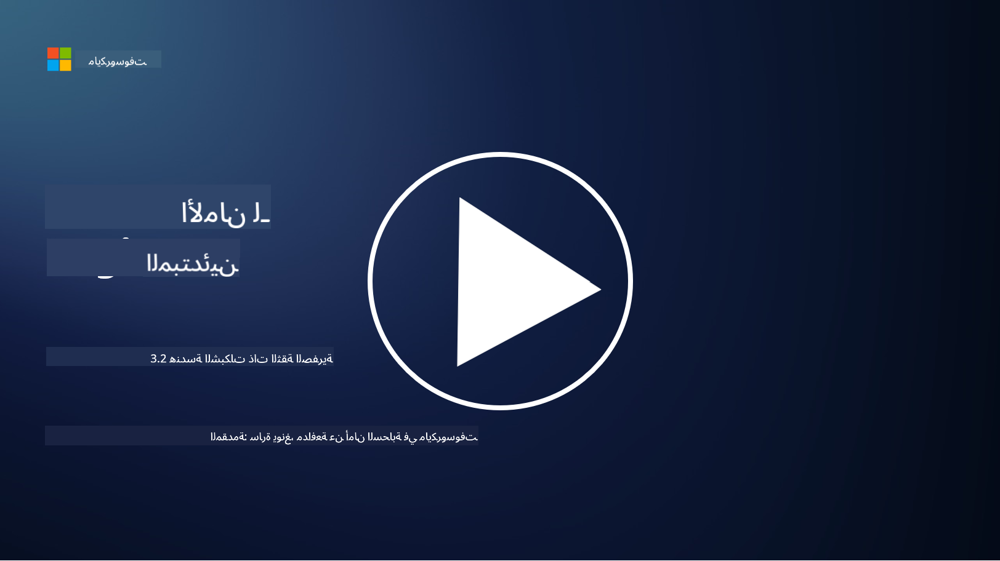

<!--
CO_OP_TRANSLATOR_METADATA:
{
  "original_hash": "680d6e14d9d33fc471c22f44679713f8",
  "translation_date": "2025-09-03T21:11:42+00:00",
  "source_file": "3.2 Networking zero trust architecture.md",
  "language_code": "ar"
}
-->
# بنية الشبكات في نموذج الثقة الصفرية

توفر الشبكة طبقة أساسية في ضوابط الثقة الصفرية، وفي هذا الدرس سنتعرف على المزيد حول هذا الموضوع:

- ما هو تقسيم الشبكة؟
- كيف يساعد تقسيم الشبكة في تطبيق نموذج الثقة الصفرية؟
- ما هو التشفير من الطرف إلى الطرف؟

## ما هو تقسيم الشبكة؟

تقسيم الشبكة هو ممارسة تقسيم الشبكة إلى أجزاء أصغر ومعزولة أو شبكات فرعية. يتم عزل كل جزء عن الآخر، ويتم التحكم في الوصول بين الأجزاء وتقييده بناءً على سياسات أمان محددة. يُستخدم تقسيم الشبكة لتحسين الأمان من خلال احتواء تأثير الاختراقات المحتملة وتقليل الحركة الجانبية للمهاجمين داخل الشبكة.

من خلال تطبيق تقسيم الشبكة، يمكن للمؤسسة إنشاء "مناطق" تفصل بين أنواع مختلفة من المستخدمين والتطبيقات والبيانات. هذا يقلل من سطح الهجوم ويحد من الضرر المحتمل الناتج عن حادث أمني. يمكن تحقيق تقسيم الشبكة باستخدام تقنيات مثل الشبكات المحلية الافتراضية (VLANs)، والجدران النارية، وضوابط الوصول.

## كيف يساعد تقسيم الشبكة في تطبيق نموذج الثقة الصفرية؟

يتماشى تقسيم الشبكة بشكل وثيق مع مبادئ نموذج الثقة الصفرية. في بنية الثقة الصفرية، يساعد تقسيم الشبكة في تطبيق مبدأ "الامتياز الأدنى" من خلال ضمان أن المستخدمين والأجهزة لديهم وصول فقط إلى الموارد والخدمات المحددة التي يحتاجونها لأداء مهامهم. من خلال تقسيم الشبكة إلى مناطق أصغر، يمكن للمؤسسات تطبيق ضوابط وصول صارمة، وعزل الأصول الحيوية، ومنع الحركة الجانبية للمهاجمين.

كما يساعد تقسيم الشبكة في تطبيق ضوابط الوصول القائمة على الهوية، حيث يتم التحقق من هوية المستخدمين والأجهزة وتفويضهم بشكل دقيق قبل الوصول إلى أجزاء معينة. هذا يمنع الوصول غير المصرح به إلى الموارد الحساسة ويقلل من تأثير بيانات الاعتماد المخترقة.

## ما هو التشفير من الطرف إلى الطرف؟

التشفير من الطرف إلى الطرف (E2E) هو إجراء أمني يضمن بقاء البيانات مشفرة طوال رحلتها من المرسل إلى المستقبل. في هذه العملية، يتم تشفير البيانات في طرف المرسل، ولا يمتلك مفتاح فك التشفير لفتح وقراءة البيانات سوى المستقبل. تحدث عمليات التشفير وفك التشفير في الأطراف، مما يجعل من الصعب للغاية على الأطراف غير المصرح لها، بما في ذلك مقدمي الخدمات والوسطاء، الوصول إلى البيانات النصية.

يوفر التشفير من الطرف إلى الطرف مستوى عالٍ من السرية والأمان لنقل البيانات، حتى إذا مرت البيانات عبر أنظمة أو شبكات وسيطة مختلفة. يُستخدم هذا النوع من التشفير بشكل شائع في تطبيقات الرسائل الآمنة، وخدمات البريد الإلكتروني، ومنصات الاتصال الأخرى لحماية المعلومات الحساسة من الاعتراض والوصول غير المصرح به.

يضمن هذا الأسلوب أنه حتى إذا تمكن المهاجمون من الوصول إلى البيانات أثناء انتقالها، فإنهم سيرون فقط محتوى مشفرًا لا معنى له بدون مفتاح فك التشفير. يلعب التشفير من الطرف إلى الطرف دورًا حيويًا في حماية خصوصية المستخدم وحماية المعلومات الحساسة من التعرض للأطراف غير المصرح لها.

## ما هو SASE؟

SASE هو اختصار لـ "حافة خدمة الوصول الآمن"، وهو إطار عمل وبنية للأمن السيبراني تجمع بين أمان الشبكة وقدرات الشبكات واسعة النطاق (WAN) في خدمة واحدة قائمة على السحابة. تم تصميم SASE لتوفير وصول آمن وقابل للتوسع إلى موارد الشبكة والتطبيقات والبيانات للمستخدمين عن بُعد والمتحركين، مع تبسيط إدارة الشبكة وتقليل تعقيد البنى التقليدية للشبكة والأمان.

الخصائص والمكونات الرئيسية لـ SASE تشمل:

1. **قائم على السحابة:** يتم تقديم SASE كخدمة سحابية، مما يعني أن وظائف الأمان والشبكات تُقدم من السحابة بدلاً من الاعتماد على الأجهزة التقليدية الموجودة في الموقع.
   
2. **دمج الأمان والشبكات:** يدمج SASE خدمات أمان مختلفة مثل بوابات الويب الآمنة (SWG)، الجدار الناري كخدمة (FWaaS)، منع فقدان البيانات (DLP)، الوصول إلى الشبكة بنموذج الثقة الصفرية (ZTNA)، وتحسين الشبكات واسعة النطاق مع قدرات الشبكات واسعة النطاق. هذا الدمج يساعد في تبسيط عمليات الأمان والشبكات.
   
3. **الثقة الصفرية:** يعمل SASE على مبدأ الثقة الصفرية، مما يعني أنه يفرض ضوابط وصول صارمة وسياسات امتياز أدنى. لا يتم الوثوق بالمستخدمين والأجهزة افتراضيًا، ويجب التحقق من هويتهم وتفويضهم قبل الوصول إلى الموارد.
   
4. **مركزية الهوية:** يركز SASE على هويات المستخدمين والأجهزة كأساس للتحكم في الوصول. تُستخدم السياسات القائمة على الهوية والسياق لتحديد أذونات الوصول، وتتكيف هذه السياسات ديناميكيًا بناءً على سلوك المستخدم والسياق.
   
5. **القابلية للتوسع والمرونة:** يمكن لـ SASE التوسع بسهولة لاستيعاب عدد كبير من المستخدمين والأجهزة، مما يجعله مناسبًا للمؤسسات ذات الاحتياجات المتنوعة والمتطورة للأمان والشبكات.

يعتبر SASE ذا أهمية خاصة في عصر العمل عن بُعد واعتماد السحابة، حيث يوفر نهجًا شاملاً ومرنًا لتأمين وإدارة الوصول إلى الشبكة. يساعد المؤسسات على التكيف مع متطلبات الأمان والشبكات المتغيرة مع الحفاظ على تركيز قوي على نماذج الأمان القائمة على المستخدم والثقة الصفرية.

## قراءة إضافية

- [ما هو تقسيم الشبكة؟ - Cisco](https://www.cisco.com/c/en/us/products/security/what-is-network-segmentation.html#~benefits)
- [ما هو التقسيم الدقيق؟ - Cisco](https://www.cisco.com/c/en/us/products/security/what-is-microsegmentation.html)
- [تطبيق تقسيم الشبكة والفصل | Cyber.gov.au](https://www.cyber.gov.au/resources-business-and-government/maintaining-devices-and-systems/system-hardening-and-administration/network-hardening/implementing-network-segmentation-and-segregation)
- [ما هو تقسيم الشبكة ولماذا هو مهم | CompTIA](https://www.comptia.org/blog/security-awareness-training-network-segmentation)
- [تقسيم الشبكة: المفاهيم والممارسات (cmu.edu)](https://insights.sei.cmu.edu/blog/network-segmentation-concepts-and-practices/)
- [تأمين الشبكات باستخدام نموذج الثقة الصفرية | Microsoft Learn](https://learn.microsoft.com/security/zero-trust/deploy/networks?WT.mc_id=academic-96948-sayoung)
- [ما هو التشفير من الطرف إلى الطرف؟ | IBM](https://www.ibm.com/topics/end-to-end-encryption)
- [ما هو التشفير من الطرف إلى الطرف ولماذا هو مهم؟ (howtogeek.com)](https://www.howtogeek.com/711656/what-is-end-to-end-encryption-and-why-does-it-matter/)
- [تعريف حافة خدمة الوصول الآمن (SASE) - قاموس تكنولوجيا المعلومات من Gartner](https://www.gartner.com/en/information-technology/glossary/secure-access-service-edge-sase)
- [ما هو حافة خدمة الوصول الآمن (SASE)؟ | Microsoft Security](https://www.microsoft.com/security/business/security-101/what-is-sase?WT.mc_id=academic-96948-sayoung)

---

**إخلاء المسؤولية**:  
تم ترجمة هذا المستند باستخدام خدمة الترجمة بالذكاء الاصطناعي [Co-op Translator](https://github.com/Azure/co-op-translator). بينما نسعى لتحقيق الدقة، يرجى العلم أن الترجمات الآلية قد تحتوي على أخطاء أو معلومات غير دقيقة. يجب اعتبار المستند الأصلي بلغته الأصلية المصدر الموثوق. للحصول على معلومات حاسمة، يُوصى بالاستعانة بترجمة بشرية احترافية. نحن غير مسؤولين عن أي سوء فهم أو تفسيرات خاطئة تنشأ عن استخدام هذه الترجمة.