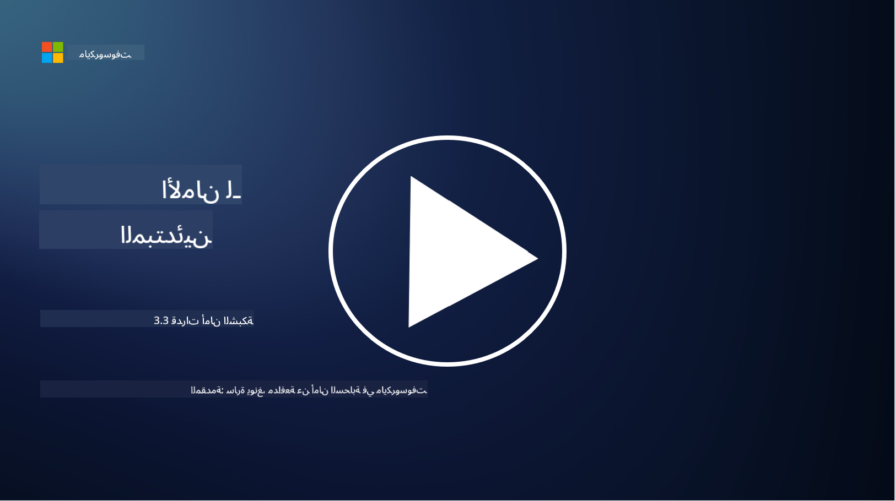

<!--
CO_OP_TRANSLATOR_METADATA:
{
  "original_hash": "c3aba077bb98eebc925dd58d870229ab",
  "translation_date": "2025-09-03T20:18:18+00:00",
  "source_file": "3.3 Network security capabilities.md",
  "language_code": "ar"
}
-->
# قدرات أمان الشبكة

في هذه الدرس سنتعلم عن القدرات التالية التي يمكن استخدامها لتأمين الشبكة:

- الجدران النارية التقليدية  
- جدران حماية تطبيقات الويب  
- مجموعات أمان السحابة  
- شبكات توزيع المحتوى (CDN)  
- موزعات الحمل  
- مضيفات الحصن  
- الشبكات الافتراضية الخاصة (VPNs)  
- أدوات حماية من هجمات DDoS  

## الجدران النارية التقليدية

الجدران النارية التقليدية هي أجهزة أمان تتحكم وتراقب حركة المرور الواردة والصادرة في الشبكة بناءً على قواعد أمان محددة مسبقًا. تعمل كحاجز بين الشبكة الداخلية الموثوقة والشبكات الخارجية غير الموثوقة، حيث تقوم بتصفية الحركة لمنع الوصول غير المصرح به والتهديدات المحتملة.

## جدران حماية تطبيقات الويب

جدران حماية تطبيقات الويب (WAFs) هي جدران نارية متخصصة مصممة لحماية تطبيقات الويب من الهجمات المختلفة، مثل حقن SQL، البرمجة عبر المواقع، وغيرها من الثغرات. تقوم بتحليل طلبات واستجابات HTTP لتحديد وحجب الحركة الضارة التي تستهدف تطبيقات الويب.

## مجموعات أمان السحابة

مجموعات الأمان هي ميزة أساسية لأمان الشبكة تقدمها مزودي الخدمات السحابية. تعمل كجدران نارية افتراضية تتحكم في حركة المرور الواردة والصادرة إلى ومن موارد السحابة، مثل الأجهزة الافتراضية (VMs) والحالات. تتيح مجموعات الأمان للمؤسسات تحديد قواعد تحدد أنواع الحركة المسموح بها والمرفوضة، مما يضيف طبقة إضافية من الدفاع إلى عمليات النشر السحابية.

## شبكات توزيع المحتوى (CDN)

شبكة توزيع المحتوى هي شبكة موزعة من الخوادم الموجودة في مواقع جغرافية مختلفة. تساعد شبكات CDN في تحسين أداء وتوافر المواقع الإلكترونية من خلال تخزين المحتوى مؤقتًا وتقديمه من خوادم أقرب إلى المستخدم. كما توفر مستوى معينًا من الحماية ضد هجمات DDoS من خلال توزيع الحركة عبر مواقع خوادم متعددة.

## موزعات الحمل

موزعات الحمل تقوم بتوزيع حركة المرور الواردة عبر عدة خوادم لتحسين استخدام الموارد، وضمان التوافر العالي، وتحسين أداء التطبيقات. تساعد في منع التحميل الزائد على الخوادم والحفاظ على أوقات استجابة فعالة، مما يعزز مرونة الشبكة.

## مضيفات الحصن

مضيفات الحصن هي خوادم آمنة ومعزولة للغاية توفر وصولًا محكمًا إلى الشبكة من شبكة خارجية غير موثوقة (مثل الإنترنت). تعمل كنقاط دخول للمسؤولين للوصول إلى الأنظمة الداخلية بشكل آمن. يتم تكوين مضيفات الحصن عادةً بإجراءات أمان قوية لتقليل سطح الهجوم.

## الشبكات الافتراضية الخاصة (VPNs)

الشبكات الافتراضية الخاصة (VPNs) تنشئ أنفاقًا مشفرة بين جهاز المستخدم والخادم البعيد، مما يضمن اتصالًا آمنًا وخاصًا عبر الشبكات غير الآمنة مثل الإنترنت. تُستخدم الشبكات الافتراضية الخاصة عادةً لتوفير الوصول عن بُعد إلى الشبكات الداخلية، مما يسمح للمستخدمين بالوصول إلى الموارد كما لو كانوا فعليًا على نفس الشبكة.

## أدوات حماية من هجمات DDoS

أدوات وخدمات حماية من هجمات DDoS (هجمات الحرمان من الخدمة الموزعة) مصممة لتخفيف تأثير هجمات DDoS، حيث تقوم أجهزة متعددة مخترقة بإغراق الشبكة أو الخدمة لإرباكها. تقوم حلول حماية DDoS بتحديد وتصفيه الحركة الضارة، مما يضمن أن الحركة الشرعية يمكنها الوصول إلى وجهتها المقصودة.

## قراءة إضافية

- [ما هو الجدار الناري؟ - Cisco](https://www.cisco.com/c/en/us/products/security/firewalls/what-is-a-firewall.html#~types-of-firewalls)  
- [ما الذي يفعله الجدار الناري فعليًا؟ (howtogeek.com)](https://www.howtogeek.com/144269/htg-explains-what-firewalls-actually-do/)  
- [ما هو الجدار الناري؟ كيف يعمل وأنواعه (kaspersky.com)](https://www.kaspersky.com/resource-center/definitions/firewall)  
- [مجموعة أمان الشبكة - كيف تعمل | Microsoft Learn](https://learn.microsoft.com/azure/virtual-network/network-security-group-how-it-works)  
- [مقدمة إلى شبكة توزيع المحتوى (CDN) - تدريب | Microsoft Learn](https://learn.microsoft.com/training/modules/intro-to-azure-content-delivery-network/?WT.mc_id=academic-96948-sayoung)  
- [ما هي شبكة توزيع المحتوى (CDN)؟ - Azure | Microsoft Learn](https://learn.microsoft.com/azure/cdn/cdn-overview?WT.mc_id=academic-96948-sayoung)  
- [ما هو توزيع الحمل؟ كيف تعمل موزعات الحمل (nginx.com)](https://www.nginx.com/resources/glossary/load-balancing/)  
- [مضيفات الحصن مقابل الشبكات الافتراضية الخاصة · Tailscale](https://tailscale.com/learn/bastion-hosts-vs-vpns/)  
- [ما هو VPN؟ كيف يعمل وأنواعه (kaspersky.com)](https://www.kaspersky.com/resource-center/definitions/what-is-a-vpn)  
- [مقدمة إلى حماية Azure DDoS - تدريب | Microsoft Learn](https://learn.microsoft.com/training/modules/introduction-azure-ddos-protection/?WT.mc_id=academic-96948-sayoung)  
- [ما هي هجمات DDoS؟ | أمان Microsoft](https://www.microsoft.com/security/business/security-101/what-is-a-ddos-attack?WT.mc_id=academic-96948-sayoung)  

---

**إخلاء المسؤولية**:  
تم ترجمة هذا المستند باستخدام خدمة الترجمة بالذكاء الاصطناعي [Co-op Translator](https://github.com/Azure/co-op-translator). بينما نسعى لتحقيق الدقة، يرجى العلم أن الترجمات الآلية قد تحتوي على أخطاء أو معلومات غير دقيقة. يجب اعتبار المستند الأصلي بلغته الأصلية المصدر الموثوق. للحصول على معلومات حاسمة، يُوصى بالاستعانة بترجمة بشرية احترافية. نحن غير مسؤولين عن أي سوء فهم أو تفسيرات خاطئة تنشأ عن استخدام هذه الترجمة.