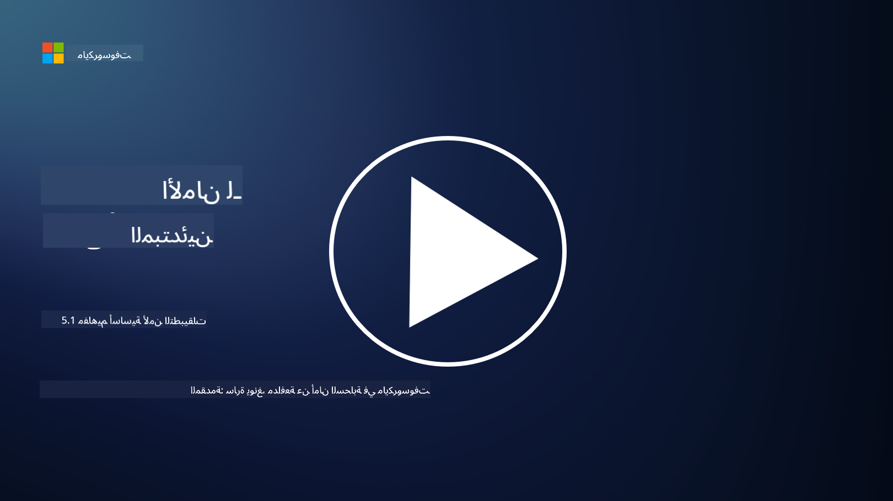

<!--
CO_OP_TRANSLATOR_METADATA:
{
  "original_hash": "e4b56bb23078d3ffb7ad407d280b0c36",
  "translation_date": "2025-09-03T21:07:47+00:00",
  "source_file": "5.1 AppSec key concepts.md",
  "language_code": "ar"
}
-->
# مفاهيم أساسية في أمن التطبيقات

يُعتبر أمن التطبيقات تخصصًا مستقلًا في مجال الأمن. في هذا الجزء من الدورة، سنستعرض المزيد حول أمن التطبيقات.

## المقدمة

في هذه الدرس، سنتناول:

- ما هو أمن التطبيقات؟

- ما هي المفاهيم/المبادئ الأساسية لأمن التطبيقات؟

## ما هو أمن التطبيقات؟

يشير أمن التطبيقات، الذي يُعرف غالبًا بـ "AppSec"، إلى ممارسة حماية التطبيقات البرمجية من التهديدات الأمنية والثغرات والهجمات. يشمل ذلك العمليات والتقنيات والأدوات المستخدمة لتحديد المخاطر الأمنية والتخفيف منها ومنعها خلال دورة حياة تطوير التطبيق ونشره وصيانته.

يُعتبر أمن التطبيقات أمرًا بالغ الأهمية لأن التطبيقات تُعد أهدافًا شائعة للهجمات السيبرانية. يستغل المهاجمون الثغرات والضعف في البرمجيات للوصول غير المصرح به، وسرقة البيانات، وتعطيل الخدمات، أو تنفيذ أنشطة خبيثة أخرى. يساهم أمن التطبيقات الفعّال في ضمان سرية التطبيق وسلامته وتوافره، بالإضافة إلى حماية البيانات المرتبطة به.

## ما هي المفاهيم/المبادئ الأساسية لأمن التطبيقات؟

تشمل المفاهيم والمبادئ الأساسية التي تدعم أمن التطبيقات ما يلي:

1. **الأمان من خلال التصميم**:

- يجب دمج الأمان في تصميم التطبيق وهندسته منذ البداية، بدلاً من إضافته لاحقًا.

2. **التحقق من المدخلات**:

- يجب التحقق من جميع مدخلات المستخدم لضمان توافقها مع التنسيقات المتوقعة وخلوها من الأكواد أو البيانات الضارة.

3. **ترميز المخرجات**:

- يجب ترميز البيانات المُرسلة إلى العميل بشكل صحيح لمنع الثغرات مثل البرمجة عبر المواقع (XSS).

4. **المصادقة والتفويض**:

- يجب التحقق من هوية المستخدمين وتفويض وصولهم إلى الموارد بناءً على أدوارهم وصلاحياتهم.

5. **حماية البيانات**:

- يجب تشفير البيانات الحساسة عند تخزينها ونقلها ومعالجتها لمنع الوصول غير المصرح به.

6. **إدارة الجلسات**:

- تضمن إدارة الجلسات الآمنة حماية جلسات المستخدمين من الاختراق والوصول غير المصرح به.

7. **التبعيات الآمنة**:

- يجب تحديث جميع التبعيات البرمجية بانتظام باستخدام تصحيحات الأمان لمنع الثغرات.

8. **معالجة الأخطاء وتسجيلها**:

- يجب تنفيذ معالجة آمنة للأخطاء لتجنب كشف معلومات حساسة وضمان ممارسات تسجيل آمنة.

9. **اختبار الأمان**:

- يجب اختبار التطبيقات بانتظام للكشف عن الثغرات باستخدام طرق مثل اختبار الاختراق، مراجعات الكود، وأدوات الفحص الآلي.

10. **دورة حياة تطوير البرمجيات الآمنة (SDLC)**:

- يجب دمج ممارسات الأمان في كل مرحلة من مراحل دورة حياة تطوير البرمجيات، بدءًا من المتطلبات وحتى النشر والصيانة.

## قراءة إضافية

- [SheHacksPurple: ما هو أمن التطبيقات؟ - YouTube](https://www.youtube.com/watch?v=eNmccQNzSSY)
- [ما هو أمن التطبيقات؟ - Cisco](https://www.cisco.com/c/en/us/solutions/security/application-first-security/what-is-application-security.html#~how-does-it-work)
- [ما هو أمن التطبيقات؟ عملية وأدوات لتأمين البرمجيات | CSO Online](https://www.csoonline.com/article/566471/what-is-application-security-a-process-and-tools-for-securing-software.html)
- [OWASP Cheat Sheet Series | OWASP Foundation](https://owasp.org/www-project-cheat-sheets/)

---

**إخلاء المسؤولية**:  
تم ترجمة هذا المستند باستخدام خدمة الترجمة بالذكاء الاصطناعي [Co-op Translator](https://github.com/Azure/co-op-translator). بينما نسعى لتحقيق الدقة، يرجى العلم أن الترجمات الآلية قد تحتوي على أخطاء أو معلومات غير دقيقة. يجب اعتبار المستند الأصلي بلغته الأصلية المصدر الرسمي. للحصول على معلومات حاسمة، يُوصى بالاستعانة بترجمة بشرية احترافية. نحن غير مسؤولين عن أي سوء فهم أو تفسيرات خاطئة تنشأ عن استخدام هذه الترجمة.