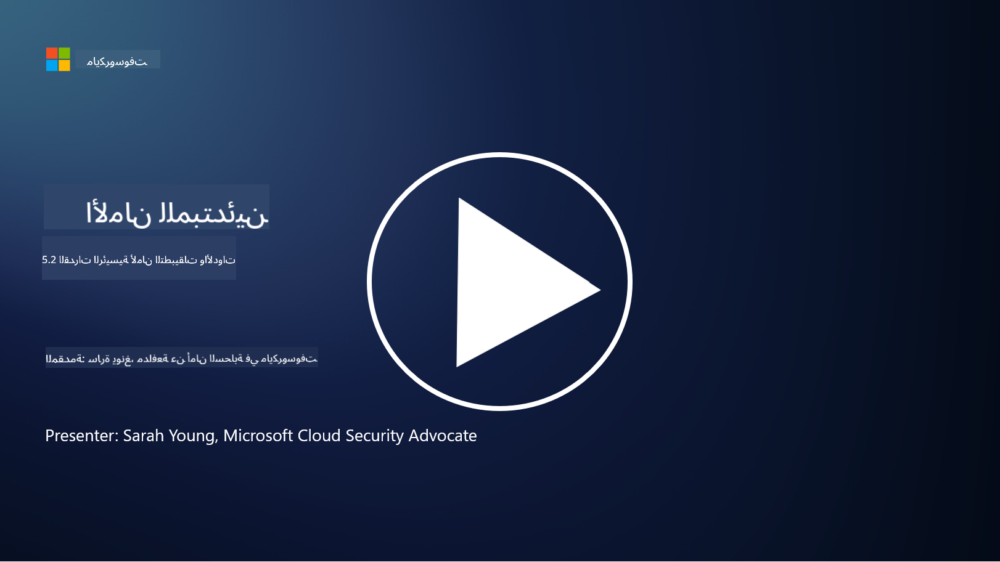

<!--
CO_OP_TRANSLATOR_METADATA:
{
  "original_hash": "790a3fa7e535ec60bb51bde13e759781",
  "translation_date": "2025-09-03T21:22:24+00:00",
  "source_file": "5.2 AppSec key capabilities.md",
  "language_code": "ar"
}
-->
## المقدمة

في هذا الدرس، سنغطي القدرات والأدوات الرئيسية المستخدمة في أمان التطبيقات.

## القدرات والأدوات الرئيسية في أمان التطبيقات

القدرات والأدوات الرئيسية المستخدمة في أمان التطبيقات ضرورية لتحديد الثغرات الأمنية والتهديدات، والتخفيف منها، ومنعها في تطبيقات البرمجيات. فيما يلي بعض من أهمها:

**1. اختبار أمان التطبيقات الثابت (SAST)**:

- **القدرات**: تحليل الكود المصدري أو الكود الثنائي أو الكود البايت لتحديد الثغرات الأمنية في قاعدة الكود الخاصة بالتطبيق.

- **الأدوات**: أمثلة تشمل Fortify، Checkmarx، و Veracode.

**2. اختبار أمان التطبيقات الديناميكي (DAST)**:

- **القدرات**: فحص التطبيق أثناء تشغيله لتحديد الثغرات من خلال إرسال طلبات إدخال وتحليل الردود.

- **الأدوات**: أمثلة تشمل ZAP، Burp Suite، و Qualys Web Application Scanning.

**3. اختبار أمان التطبيقات التفاعلي (IAST)**:

- **القدرات**: يجمع بين عناصر SAST و DAST لتحليل الكود أثناء وقت التشغيل، مما يوفر نتائج أكثر دقة ويقلل من الإيجابيات الكاذبة.

- **الأدوات**: أمثلة تشمل Contrast Security و HCL AppScan.

**4. الحماية الذاتية للتطبيق أثناء التشغيل (RASP)**:

- **القدرات**: مراقبة التطبيقات وحمايتها في الوقت الفعلي، واكتشاف التهديدات الأمنية والاستجابة لها أثناء حدوثها.

- **الأدوات**: أمثلة تشمل Veracode Runtime Protection و F5 Advanced WAF مع RASP.

**5. جدران الحماية لتطبيقات الويب (WAFs)**:

- **القدرات**: توفير طبقة حماية بين التطبيق والإنترنت، تصفية حركة المرور الواردة وحجب الطلبات الضارة.

- **الأدوات**: أمثلة تشمل ModSecurity، AWS WAF، و Akamai Kona Site Defender.

**6. فحص التبعيات**:

- **القدرات**: تحديد الثغرات الأمنية في المكتبات والمكونات الخارجية المستخدمة في التطبيق.

- **الأدوات**: أمثلة تشمل OWASP Dependency-Check و Snyk.

**7. اختبار الاختراق (Pen Testing)**:

- **القدرات**: محاكاة الهجمات الواقعية لاكتشاف الثغرات وتقييم أمان التطبيق.

- **الأدوات**: يتم تنفيذها بواسطة خبراء أمنيين معتمدين باستخدام أدوات مثل Metasploit و Nmap.

**8. الفحص والتحليل الأمني**:

- **القدرات**: فحص الثغرات المعروفة، أخطاء التكوين، وسوء التكوين الأمني.

- **الأدوات**: أمثلة تشمل Nessus، Qualys Vulnerability Management، و OpenVAS.

**9. أدوات أمان الحاويات**:

- **القدرات**: التركيز على تأمين التطبيقات المحاوية وبيئاتها.

- **الأدوات**: أمثلة تشمل Docker Security Scanning و Aqua Security.

**10. تدريب على التطوير الآمن**:

- **القدرات**: توفير برامج تدريبية وتوعوية لفرق التطوير لتعزيز ممارسات البرمجة الآمنة.

- **الأدوات**: برامج تدريبية مخصصة ومنصات.

**11. أطر اختبار الأمان**:

- **القدرات**: توفير أطر اختبار شاملة لاحتياجات اختبار أمان التطبيقات المختلفة.

- **الأدوات**: OWASP Amass، OWASP OWTF و FrAppSec.

**12. أدوات مراجعة الكود الآمن**:

- **القدرات**: مراجعة الكود المصدري للثغرات الأمنية وأفضل ممارسات البرمجة.

- **الأدوات**: أمثلة تشمل SonarQube و Checkmarx.

**13. أدوات تأمين واجهات برمجة التطبيقات والخدمات المصغرة**:

- **القدرات**: التركيز على تأمين واجهات برمجة التطبيقات والخدمات المصغرة، بما في ذلك المصادقة، التفويض، وحماية البيانات.

- **الأدوات**: أمثلة تشمل Apigee، AWS API Gateway، و Istio.

## قراءة إضافية

- [ما هو أمان التطبيقات؟ المفاهيم، الأدوات، وأفضل الممارسات | HackerOne](https://www.hackerone.com/knowledge-center/what-application-security-concepts-tools-best-practices)
- [ما هو IAST؟ (اختبار أمان التطبيقات التفاعلي) (comparitech.com)](https://www.comparitech.com/net-admin/what-is-iast/)
- [10 أنواع من أدوات اختبار أمان التطبيقات: متى وكيف تستخدمها (cmu.edu)](https://insights.sei.cmu.edu/blog/10-types-of-application-security-testing-tools-when-and-how-to-use-them/)
- [تحويل ميزان مخاطر الأمن السيبراني: المبادئ والمناهج للأمان حسب التصميم والإعداد الافتراضي | Cyber.gov.au](https://www.cyber.gov.au/about-us/view-all-content/publications/principles-and-approaches-for-security-by-design-and-default)

---

**إخلاء المسؤولية**:  
تم ترجمة هذا المستند باستخدام خدمة الترجمة بالذكاء الاصطناعي [Co-op Translator](https://github.com/Azure/co-op-translator). بينما نسعى لتحقيق الدقة، يرجى العلم أن الترجمات الآلية قد تحتوي على أخطاء أو معلومات غير دقيقة. يجب اعتبار المستند الأصلي بلغته الأصلية المصدر الرسمي. للحصول على معلومات حاسمة، يُوصى بالاستعانة بترجمة بشرية احترافية. نحن غير مسؤولين عن أي سوء فهم أو تفسيرات خاطئة ناتجة عن استخدام هذه الترجمة.