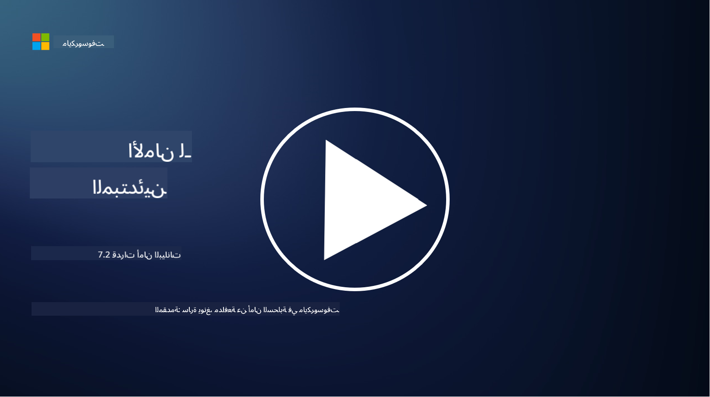

<!--
CO_OP_TRANSLATOR_METADATA:
{
  "original_hash": "50697add9758e54693442d502d2d5f8a",
  "translation_date": "2025-09-03T21:27:24+00:00",
  "source_file": "7.2 Data security capabilities.md",
  "language_code": "ar"
}
-->
# قدرات أمان البيانات

في هذا القسم، سنغطي المزيد من التفاصيل حول الأدوات والقدرات الأساسية المستخدمة في أمان البيانات:

**المقدمة**

في هذه الدرس، سنغطي:

- ما هي أدوات منع فقدان البيانات؟

- ما هي أدوات إدارة المخاطر الداخلية؟

- ما هي أدوات الاحتفاظ بالبيانات المتاحة؟

## ما هي أدوات منع فقدان البيانات؟

تشير أدوات منع فقدان البيانات (DLP) إلى مجموعة من الحلول البرمجية والتقنيات المصممة لمنع الوصول غير المصرح به أو مشاركة أو تسريب البيانات الحساسة أو السرية داخل المؤسسة. تستخدم هذه الأدوات فحص المحتوى، تطبيق السياسات، والمراقبة لتحديد وحماية البيانات الحساسة من التعرض أو سوء الاستخدام. تشمل أمثلة منتجات DLP: Symantec Data Loss Prevention، McAfee Total Protection for Data Loss Prevention، Microsoft 365 DLP**: يتكامل مع تطبيقات Microsoft 365 لمساعدة المؤسسات على تحديد وحماية البيانات الحساسة داخل رسائل البريد الإلكتروني، المستندات، والرسائل.

## ما هي أدوات إدارة المخاطر الداخلية؟

تساعد أدوات إدارة المخاطر الداخلية المؤسسات على تحديد وتخفيف المخاطر التي قد يسببها الموظفون، المتعاقدون، أو الشركاء الذين قد يهددون أمان البيانات عن قصد أو عن غير قصد. تقوم هذه الأدوات بمراقبة سلوك المستخدم، أنماط الوصول، واستخدام البيانات للكشف عن الأنشطة المشبوهة والتهديدات الداخلية المحتملة. تشمل أمثلة منتجات إدارة المخاطر الداخلية: Microsoft Insider Risk Management (جزء من Microsoft 365)، Forcepoint Insider Threat Data Protection، Varonis Insider Threat Detection.

## ما هي أدوات الاحتفاظ بالبيانات المتاحة؟

تشمل أدوات الاحتفاظ بالبيانات البرمجيات والحلول المصممة لإدارة الاحتفاظ وحذف البيانات وفقًا لسياسات الاحتفاظ بالبيانات الخاصة بالمؤسسة والمتطلبات القانونية. تساعد هذه الأدوات في أتمتة عملية الاحتفاظ بالبيانات لفترات محددة وحذفها بأمان عندما لا تكون هناك حاجة إليها. تشمل أمثلة منتجات الاحتفاظ بالبيانات: Veritas Enterprise Vault، Commvault Complete Data Protection، Microsoft data lifecycle management. تساعد هذه الحلول المؤسسات على الحفاظ على السيطرة على الاحتفاظ بالبيانات والتخلص منها، مما يضمن الامتثال للوائح حماية البيانات مع إدارة البيانات بكفاءة طوال دورة حياتها.

## قراءة إضافية

- [دليل إدارة وضع أمان البيانات (DSPM) | CSA (cloudsecurityalliance.org)](https://cloudsecurityalliance.org/blog/2023/03/31/the-big-guide-to-data-security-posture-management-dspm/)
- [منع فقدان البيانات عبر الأجهزة الطرفية، التطبيقات، والخدمات | Microsoft Purview](https://youtu.be/hvqq8L_0kgI)
- [أفضل 18 أداة برمجية لمنع فقدان البيانات 2023 (مجانية ومدفوعة) (comparitech.com)](https://www.comparitech.com/data-privacy-management/data-loss-prevention-tools-software/)
- [منع فقدان البيانات (nist.gov)](https://tsapps.nist.gov/publication/get_pdf.cfm?pub_id=904672)
- [تعرف على إدارة المخاطر الداخلية | Microsoft Learn](https://learn.microsoft.com/purview/insider-risk-management?WT.mc_id=academic-96948-sayoung)
- [إدارة دورة حياة البيانات | IBM](https://www.ibm.com/topics/data-lifecycle-management)
- [ما هي إدارة دورة حياة البيانات (DLM)؟ | أفضل الممارسات لعام 2023 (selecthub.com)](https://www.selecthub.com/big-data-analytics/data-lifecycle-management/)

---

**إخلاء المسؤولية**:  
تم ترجمة هذا المستند باستخدام خدمة الترجمة بالذكاء الاصطناعي [Co-op Translator](https://github.com/Azure/co-op-translator). بينما نسعى لتحقيق الدقة، يرجى العلم أن الترجمات الآلية قد تحتوي على أخطاء أو معلومات غير دقيقة. يجب اعتبار المستند الأصلي بلغته الأصلية المصدر الرسمي. للحصول على معلومات حاسمة، يُوصى بالاستعانة بترجمة بشرية احترافية. نحن غير مسؤولين عن أي سوء فهم أو تفسيرات خاطئة تنشأ عن استخدام هذه الترجمة.