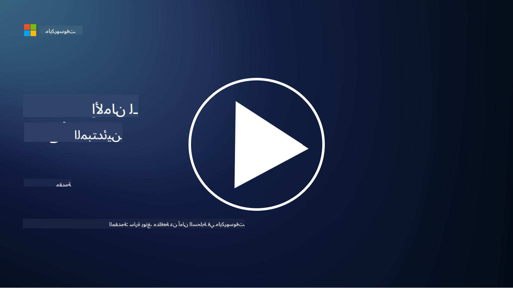

<!--
CO_OP_TRANSLATOR_METADATA:
{
  "original_hash": "33e83c2beb28a1b6e031416624dc23aa",
  "translation_date": "2025-10-11T10:42:38+00:00",
  "source_file": "README.md",
  "language_code": "ar"
}
-->
  
  
  
  
  
  

### 🌐 دعم متعدد اللغات  

#### مدعوم عبر GitHub Action (تلقائي ودائم التحديث)  

<!-- جدول لغات المترجم التعاوني يبدأ -->
[العربية](./README.md) | [البنغالية](../bn/README.md) | [البلغارية](../bg/README.md) | [البورمية (ميانمار)](../my/README.md) | [الصينية (المبسطة)](../zh/README.md) | [الصينية (التقليدية، هونغ كونغ)](../hk/README.md) | [الصينية (التقليدية، ماكاو)](../mo/README.md) | [الصينية (التقليدية، تايوان)](../tw/README.md) | [الكرواتية](../hr/README.md) | [التشيكية](../cs/README.md) | [الدانماركية](../da/README.md) | [الهولندية](../nl/README.md) | [الإستونية](../et/README.md) | [الفنلندية](../fi/README.md) | [الفرنسية](../fr/README.md) | [الألمانية](../de/README.md) | [اليونانية](../el/README.md) | [العبرية](../he/README.md) | [الهندية](../hi/README.md) | [الهنغارية](../hu/README.md) | [الإندونيسية](../id/README.md) | [الإيطالية](../it/README.md) | [اليابانية](../ja/README.md) | [الكورية](../ko/README.md) | [الليتوانية](../lt/README.md) | [الماليزية](../ms/README.md) | [الماراثية](../mr/README.md) | [النيبالية](../ne/README.md) | [النرويجية](../no/README.md) | [الفارسية (الإيرانية)](../fa/README.md) | [البولندية](../pl/README.md) | [البرتغالية (البرازيل)](../br/README.md) | [البرتغالية (البرتغال)](../pt/README.md) | [البنجابية (غورموخي)](../pa/README.md) | [الرومانية](../ro/README.md) | [الروسية](../ru/README.md) | [الصربية (السيريلية)](../sr/README.md) | [السلوفاكية](../sk/README.md) | [السلوفينية](../sl/README.md) | [الإسبانية](../es/README.md) | [السواحيلية](../sw/README.md) | [السويدية](../sv/README.md) | [التاغالوغية (الفلبينية)](../tl/README.md) | [التاميلية](../ta/README.md) | [التايلاندية](../th/README.md) | [التركية](../tr/README.md) | [الأوكرانية](../uk/README.md) | [الأردية](../ur/README.md) | [الفيتنامية](../vi/README.md)  
<!-- جدول لغات المترجم التعاوني ينتهي -->

**إذا كنت ترغب في دعم لغات إضافية، يمكنك الاطلاع على القائمة [هنا](https://github.com/Azure/co-op-translator/blob/main/getting_started/supported-languages.md)**  

#### انضم إلى مجتمعنا  
  

# 🚀 الأمن السيبراني للمبتدئين – منهج دراسي  

في هذا العصر المتغير بسرعة مع تبني تقنيات الذكاء الاصطناعي، يصبح من الضروري أكثر فهم كيفية تأمين أنظمة تكنولوجيا المعلومات. تم تصميم هذه الدورة لتعليمك مفاهيم الأمن السيبراني الأساسية لبدء تعلمك في مجال الأمن. الدورة محايدة من حيث البائعين ومقسمة إلى دروس صغيرة تستغرق حوالي 30-60 دقيقة لإكمالها. يحتوي كل درس على اختبار صغير وروابط لقراءة إضافية إذا كنت ترغب في التعمق في الموضوع.  

  

ما تغطيه هذه الدورة 📚  

- 🔐 مفاهيم الأمن السيبراني الأساسية مثل مثلث CIA، الفروقات بين المخاطر والتهديدات، إلخ.  
- 🛡️ فهم ما هو التحكم الأمني وما هي أشكاله.  
- 🌐 فهم ما هو الثقة الصفرية ولماذا هي مهمة في الأمن السيبراني الحديث.  
- 🔑 فهم المفاهيم والمواضيع الرئيسية عبر الهوية، الشبكات، عمليات الأمن، البنية التحتية وأمن البيانات.  
- 🔧 تقديم أمثلة على الأدوات المستخدمة لتنفيذ الضوابط الأمنية.  

ما لا تغطيه هذه الدورة 🙅‍♂️  

- 🚫 كيفية استخدام أدوات أمنية محددة.  
- 🚫 كيفية "الاختراق" أو القيام بالأمن الهجومي/اختبارات الاختراق.  
- 🚫 التعرف على معايير الامتثال المحددة.  

  

عندما تنتهي من هذه الدورة، يمكنك الانتقال إلى بعض وحدات Microsoft Learn الخاصة بنا. نوصي بمواصلة تعلمك مع [أساسيات الأمن والامتثال والهوية من Microsoft.](https://learn.microsoft.com/training/paths/describe-concepts-of-security-compliance-identity/?WT.mc_id=academic-96948-sayoung)  

في النهاية، يمكنك التفكير في اجتياز [امتحان SC-900: أساسيات الأمن والامتثال والهوية من Microsoft.](https://learn.microsoft.com/credentials/certifications/exams/sc-900/?WT.mc_id=academic-96948-sayoung)  

> 💁 إذا كان لديك أي ملاحظات أو اقتراحات حول هذه الدورة وأي محتوى نفتقده، يسعدنا سماع رأيك!  

## نظرة عامة على الوحدات 📝  
| **رقم الوحدة** | **اسم الوحدة**                           | **المفاهيم التي يتم تدريسها**                  | **أهداف التعلم**                                                                                          |  
|-------------------|-------------------------------------------|--------------------------------------|-----------------------------------------------------------------------------------------------------------------|  
| **1.1**           | مفاهيم الأمن الأساسية                   | [مثلث CIA](https://github.com/microsoft/Security-101/blob/main/1.1%20The%20CIA%20triad%20and%20other%20key%20concepts.md)                        | تعلم حول السرية، التوافر والنزاهة. أيضًا الأصالة وعدم الإنكار والخصوصية. |  
| **1.2**           | مفاهيم الأمن الأساسية                   | [التهديدات الشائعة للأمن السيبراني](https://github.com/microsoft/Security-101/blob/main/1.2%20Common%20cybersecurity%20threats.md)        | تعلم حول التهديدات الشائعة للأمن السيبراني التي تواجه الأفراد والمؤسسات.                             |  
| **1.3**           | مفاهيم الأمن الأساسية                   | [فهم إدارة المخاطر](https://github.com/microsoft/Security-101/blob/main/1.3%20Understanding%20risk%20management.md)       | تعلم حول تقييم وفهم المخاطر – التأثير/الاحتمالية وتنفيذ الضوابط.                                                                                                               | |  
| **1.4**           | مفاهيم الأمن الأساسية                   | [ممارسات الأمن والوثائق](https://github.com/microsoft/Security-101/blob/main/1.4%20Security%20practices%20and%20documentation.md) | تعلم حول الفرق بين السياسات، الإجراءات، المعايير واللوائح/القوانين.                         |  
| **1.5**           | مفاهيم الأمن الأساسية                   | [الثقة الصفرية](https://github.com/microsoft/Security-101/blob/main/1.5%20Zero%20trust.md)                           | تعلم حول ما هي الثقة الصفرية وكيف تؤثر على الهندسة؟ ما هو الدفاع في العمق؟                   |  
| **1.6**           | مفاهيم الأمن الأساسية                   | [نموذج المسؤولية المشتركة](https://github.com/microsoft/Security-101/blob/main/1.6%20Shared%20responsibility%20model.md)                           | ما هو نموذج المسؤولية المشتركة وكيف يؤثر على الأمن السيبراني؟                  |  
| **1.7**           | [اختبار نهاية الوحدة](https://github.com/microsoft/Security-101/blob/main/1.7%20End%20of%20module%20quiz.md)                        |                                      |                                                                                                                 |  
| **2.1**           | أساسيات إدارة الهوية والوصول | [مفاهيم IAM الرئيسية](https://github.com/microsoft/Security-101/blob/main/2.1%20IAM%20key%20concepts.md)                     | تعلم حول مبدأ أقل امتياز، فصل المهام، كيف يدعم IAM الثقة الصفرية.               |  
| **2.2**           | أساسيات إدارة الهوية والوصول | [هندسة الثقة الصفرية لـ IAM](https://github.com/microsoft/Security-101/blob/main/2.2%20IAM%20zero%20trust%20architecture.md)          | تعلم حول كيف أن الهوية هي المحيط الجديد لبيئات تكنولوجيا المعلومات الحديثة والتهديدات التي تخففها.          |  
| **2.3**           | أساسيات إدارة الهوية والوصول | [قدرات IAM](https://github.com/microsoft/Security-101/blob/main/2.3%20IAM%20capabilities.md)                     | تعلم حول قدرات IAM والضوابط لتأمين الهويات                                                  |  
| **2.4**           | [اختبار نهاية الوحدة](https://github.com/microsoft/Security-101/blob/main/2.4%20End%20of%20module%20quiz.md)                        |                                      |                                                                                                                 |  
| **3.1**           | أساسيات أمن الشبكات             | [مفاهيم الشبكات الرئيسية](https://github.com/microsoft/Security-101/blob/main/3.1%20Networking%20key%20concepts.md)              | تعلم حول مفاهيم الشبكات (عناوين IP، أرقام المنافذ، التشفير، إلخ.)                                 |  
| **3.2**           | أساسيات أمن الشبكات             | [هندسة الثقة الصفرية للشبكات](https://github.com/microsoft/Security-101/blob/main/3.2%20Networking%20zero%20trust%20architecture.md)   | تعلم حول كيف تساهم الشبكات في هندسة الثقة الصفرية الشاملة والتهديدات التي تخففها.                  |  
| **3.3**           | أساسيات أمن الشبكات             | [قدرات أمن الشبكات](https://github.com/microsoft/Security-101/blob/main/3.3%20Network%20security%20capabilities.md)        | تعلم حول أدوات أمن الشبكات – الجدران النارية، WAF، حماية DDoS، إلخ.                                    |  
| **3.4**           | [اختبار نهاية الوحدة](https://github.com/microsoft/Security-101/blob/main/3.4%20End%20of%20module%20quiz.md)                        |                                      |                                                                                                                 |  
| **4.1**           | أساسيات عمليات الأمن          | [مفاهيم SecOps الرئيسية](https://github.com/microsoft/Security-101/blob/main/4.1%20SecOps%20key%20concepts.md)                  | تعلم حول لماذا عمليات الأمن مهمة وكيف تختلف عن فرق عمليات تكنولوجيا المعلومات العادية.                  |  
| **4.2**           | أساسيات عمليات الأمن          | [هندسة الثقة الصفرية لـ SecOps](https://github.com/microsoft/Security-101/blob/main/4.2%20SecOps%20zero%20trust%20architecture.md)       | تعلم حول كيف تساهم عمليات الأمن في هندسة الثقة الصفرية الشاملة والتهديدات التي تخففها.                      |  
| **4.3**           | أساسيات عمليات الأمن          | [قدرات SecOps](https://github.com/microsoft/Security-101/blob/main/4.3%20SecOps%20capabilities.md)                  | تعلم حول أدوات SecOps – SIEM، XDR، إلخ.                                                                    |  
| **4.4**           | [اختبار نهاية الوحدة](https://github.com/microsoft/Security-101/blob/main/4.4%20End%20of%20module%20quiz.md)                        |                                      |                                                                                                                 |  
| **5.1**           | أساسيات أمن التطبيقات         | [مفاهيم AppSec الرئيسية](https://github.com/microsoft/Security-101/blob/main/5.1%20AppSec%20key%20concepts.md)                  | تعلم حول مفاهيم أمن التطبيقات مثل التصميم الآمن، التحقق من المدخلات، إلخ.                                    |  
| **5.2**           | أساسيات أمان التطبيقات                   | [قدرات أمان التطبيقات](https://github.com/microsoft/Security-101/blob/main/5.2%20AppSec%20key%20capabilities.md)                  | تعرف على أدوات أمان التطبيقات: أدوات أمان خطوط الأنابيب، فحص الأكواد، فحص الأسرار، وغيرها.                       |
| **5.3**           | [اختبار نهاية الوحدة](https://github.com/microsoft/Security-101/blob/main/5.3%20End%20of%20module%20quiz.md)                        |                                      |                                                                                                                 |
| **6.1**           | أساسيات أمان البنية التحتية              | [المفاهيم الأساسية لأمان البنية التحتية](https://github.com/microsoft/Security-101/blob/main/6.1%20Infrastructure%20security%20key%20concepts.md) | تعرف على تعزيز الأنظمة، التحديثات، النظافة الأمنية، وأمان الحاويات.                                              |
| **6.2**           | أساسيات أمان البنية التحتية              | [قدرات أمان البنية التحتية](https://github.com/microsoft/Security-101/blob/main/6.2%20Infrastructure%20security%20capabilities.md) | تعرف على الأدوات التي يمكن أن تساعد في أمان البنية التحتية مثل CSPM، أمان الحاويات، وغيرها.                      |
| **6.3**           | [اختبار نهاية الوحدة](https://github.com/microsoft/Security-101/blob/main/6.3%20End%20of%20module%20quiz.md)                        |                                      |                                                                                                                 |
| **7.1**           | أساسيات أمان البيانات                    | [المفاهيم الأساسية لأمان البيانات](https://github.com/microsoft/Security-101/blob/main/7.1%20Data%20security%20key%20concepts.md)           | تعرف على تصنيف البيانات والاحتفاظ بها ولماذا هذا مهم للمؤسسة.                                                     |
| **7.2**           | أساسيات أمان البيانات                    | [قدرات أمان البيانات](https://github.com/microsoft/Security-101/blob/main/7.2%20Data%20security%20capabilities.md)           | تعرف على أدوات أمان البيانات – DLP، إدارة المخاطر الداخلية، حوكمة البيانات، وغيرها.                              |
| **7.3**           | [اختبار نهاية الوحدة](https://github.com/microsoft/Security-101/blob/main/7.3%20End%20of%20module%20quiz.md)                        |
| **8.1**           | أساسيات أمان الذكاء الاصطناعي            | [المفاهيم الأساسية لأمان الذكاء الاصطناعي](https://github.com/microsoft/Security-101/blob/main/8.1%20AI%20security%20key%20concepts.md)          | تعرف على الفروقات والتشابهات بين الأمان التقليدي وأمان الذكاء الاصطناعي.                                         |
| **8.2**           | أساسيات أمان الذكاء الاصطناعي            | [قدرات أمان الذكاء الاصطناعي](https://github.com/microsoft/Security-101/blob/main/8.2%20AI%20security%20capabilities.md)           | تعرف على أدوات أمان الذكاء الاصطناعي والضوابط التي يمكن استخدامها لتأمين الذكاء الاصطناعي.                        |
| **8.3**           | أساسيات أمان الذكاء الاصطناعي            | [الذكاء الاصطناعي المسؤول](https://github.com/microsoft/Security-101/blob/main/8.3%20Responsible%20AI.md)          | تعرف على مفهوم الذكاء الاصطناعي المسؤول والأضرار الخاصة بالذكاء الاصطناعي التي يجب أن يكون المتخصصون في الأمان على دراية بها. |
| **8.4**           | [اختبار نهاية الوحدة](https://github.com/microsoft/Security-101/blob/main/8.4%20End%20of%20module%20quiz.md)     

## 🎒 دورات أخرى 

فريقنا يقدم دورات أخرى! تحقق من:

- [الذكاء الاصطناعي التوليدي للمبتدئين](https://aka.ms/genai-beginners)
- [الذكاء الاصطناعي التوليدي للمبتدئين .NET](https://github.com/microsoft/Generative-AI-for-beginners-dotnet)
- [الذكاء الاصطناعي التوليدي باستخدام JavaScript](https://github.com/microsoft/generative-ai-with-javascript)
- [الذكاء الاصطناعي التوليدي باستخدام Java](https://github.com/microsoft/Generative-AI-for-beginners-java)
- [الذكاء الاصطناعي للمبتدئين](https://aka.ms/ai-beginners)
- [علم البيانات للمبتدئين](https://aka.ms/datascience-beginners)
- [تعلم الآلة للمبتدئين](https://aka.ms/ml-beginners)
- [الأمن السيبراني للمبتدئين](https://github.com/microsoft/Security-101) 
- [تطوير الويب للمبتدئين](https://aka.ms/webdev-beginners)
- [إنترنت الأشياء للمبتدئين](https://aka.ms/iot-beginners)
- [تطوير الواقع الممتد للمبتدئين](https://github.com/microsoft/xr-development-for-beginners)
- [إتقان GitHub Copilot للبرمجة المشتركة](https://github.com/microsoft/Mastering-GitHub-Copilot-for-Paired-Programming)
- [إتقان GitHub Copilot لمطوري C#/.NET](https://github.com/microsoft/mastering-github-copilot-for-dotnet-csharp-developers)
- [اختر مغامرتك الخاصة مع Copilot](https://github.com/microsoft/CopilotAdventures)

---

**إخلاء المسؤولية**:  
تم ترجمة هذا المستند باستخدام خدمة الترجمة بالذكاء الاصطناعي [Co-op Translator](https://github.com/Azure/co-op-translator). بينما نسعى لتحقيق الدقة، يرجى العلم أن الترجمات الآلية قد تحتوي على أخطاء أو عدم دقة. يجب اعتبار المستند الأصلي بلغته الأصلية المصدر الرسمي. للحصول على معلومات حاسمة، يُوصى بالترجمة البشرية الاحترافية. نحن غير مسؤولين عن أي سوء فهم أو تفسيرات خاطئة ناتجة عن استخدام هذه الترجمة.