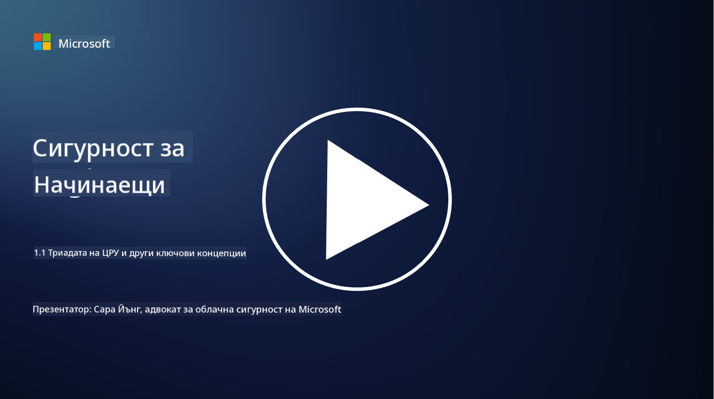
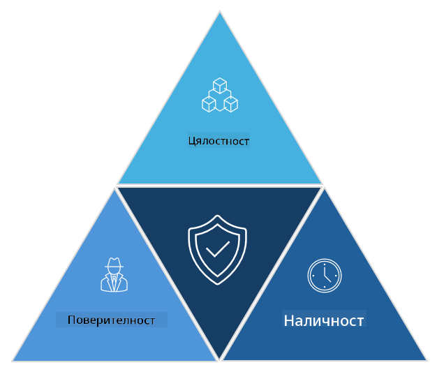

<!--
CO_OP_TRANSLATOR_METADATA:
{
  "original_hash": "16a76f9fa372fb63cffb6d76b855f023",
  "translation_date": "2025-09-03T21:38:47+00:00",
  "source_file": "1.1 The CIA triad and other key concepts.md",
  "language_code": "bg"
}
-->
# Триадата на ЦРУ и други ключови концепции

## Въведение

В този урок ще разгледаме:

 - Какво е киберсигурност?
   
 - Какво представлява триадата на ЦРУ в киберсигурността?

 - Какво са автентичност, неотказуемост и поверителност в контекста на киберсигурността?

## Какво е киберсигурност?

Киберсигурността, известна още като информационна сигурност, е практиката за защита на компютърни системи, мрежи, устройства и данни от цифрови атаки, неупълномощен достъп, повреда или кражба. Основната цел на киберсигурността е да се гарантира поверителността, целостта и наличността на цифровите активи и информация. Професионалистите в областта на киберсигурността проектират и прилагат мерки за защита на активи, данни и информация. С увеличаването на дигитализацията на нашия живот, киберсигурността се превърна в основен приоритет както за частни лица, така и за организации.

## Какво представлява триадата на ЦРУ в киберсигурността?

Триадата на ЦРУ в киберсигурността се отнася до модела, който включва трите основни аспекта, които трябва да се вземат предвид при всяка работа в областта на киберсигурността или при проектирането на система/среда:

### Поверителност

Това е аспектът, с който повечето хора са запознати, когато мислят за „киберсигурност“: поверителността е процесът на защита на данни и информация от опити за неупълномощен достъп, т.е. само хората, които трябва да виждат информацията, имат достъп до нея. Не всички данни са еднакви, и обикновено данните се категоризират и защитават въз основа на това колко щети биха настъпили, ако бъдат достъпени от неправилни хора.

### Целостност

Отнася се до защитата на точността и надеждността на данните в средите и предотвратяването на тяхното изменение или промяна от неупълномощени лица. Например, студент променя датата си на раждане в шофьорския си запис в DMV, за да изглежда по-възрастен и да може да получи нова шофьорска книжка с по-ранна дата на раждане, за да купува алкохол.

### Наличност

Това е аспект, който е важен за оперативната ИТ, но наличността също е от значение за киберсигурността. Съществуват специфични видове атаки, които целят наличността, срещу които специалистите по сигурност трябва да се защитават (например атаки за разпределено отказване на услуга – DDoS).

**Триадата на ЦРУ в киберсигурността**

## Какво са автентичност, неотказуемост и поверителност в контекста на киберсигурността?

Това са допълнителни важни концепции, които се отнасят до гарантирането на сигурността и надеждността на системите и данните:

**Автентичност** - отнася се до увереността, че информацията, комуникацията или субектът, с който взаимодействате, са истински и не са били манипулирани или променени от неупълномощени страни.

**Неотказуемост** - е концепцията за гарантиране, че дадена страна не може да отрече своето участие или автентичността на транзакция или комуникация. Тя предотвратява твърденията, че някой не е изпратил съобщение или не е извършил определено действие, когато има доказателства за обратното.

**Поверителност** - отнася се до защитата на чувствителна и лично идентифицируема информация от неупълномощен достъп, използване, разкриване или манипулация. Тя включва контролирането на това кой има достъп до лични данни и как тези данни се събират, съхраняват и споделят.

## Допълнително четене

[What Is Information Security (InfoSec)? | Microsoft Security](https://www.microsoft.com/security/business/security-101/what-is-information-security-infosec#:~:text=Three%20pillars%20of%20information%20security%3A%20the%20CIA%20triad,as%20guiding%20principles%20for%20implementing%20an%20InfoSec%20plan.)

---

**Отказ от отговорност**:  
Този документ е преведен с помощта на AI услуга за превод [Co-op Translator](https://github.com/Azure/co-op-translator). Въпреки че се стремим към точност, моля, имайте предвид, че автоматизираните преводи може да съдържат грешки или неточности. Оригиналният документ на неговия роден език трябва да се счита за авторитетен източник. За критична информация се препоръчва професионален човешки превод. Ние не носим отговорност за недоразумения или погрешни интерпретации, произтичащи от използването на този превод.