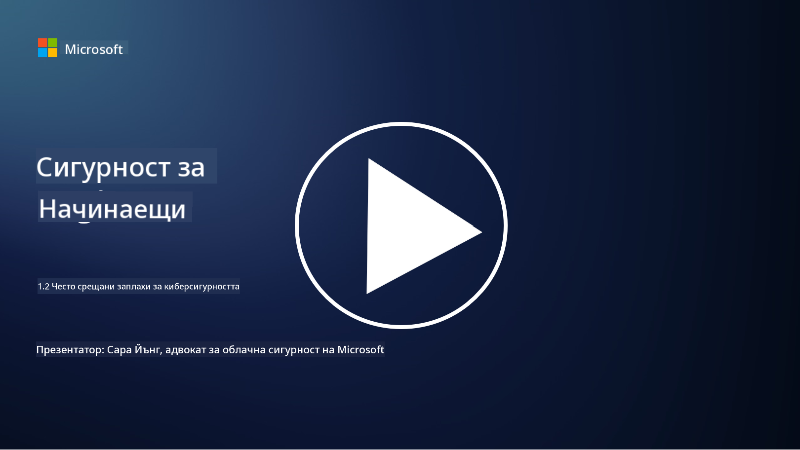

<!--
CO_OP_TRANSLATOR_METADATA:
{
  "original_hash": "6fc3030323139d7134a4ca9d03eccac9",
  "translation_date": "2025-09-03T20:09:51+00:00",
  "source_file": "1.2 Common cybersecurity threats.md",
  "language_code": "bg"
}
-->
# Често срещани заплахи за киберсигурността

## Въведение

В този урок ще разгледаме:

- Какво представлява заплахата за киберсигурността?

- Защо злонамерени лица искат да компрометират данни и IT системи?

- Какви са най-често срещаните видове заплахи за киберсигурността?

- Какво представлява рамката MITRE ATT&CK?

- Къде мога да се информирам за актуалния пейзаж на заплахите за киберсигурността?

## Какво представлява заплахата за киберсигурността?

Заплахата за киберсигурността се отнася до всяка потенциална опасност или риск, който може да компрометира конфиденциалността, целостта или наличността на данни или IT системи. Тези заплахи идват от злонамерени лица, които се опитват да използват уязвимости, за да получат неоторизиран достъп, да откраднат чувствителна информация, да нарушат операции или да причинят вреда на индивиди, организации или дори цели нации. Заплахите за киберсигурността могат да приемат различни форми и да се насочват към различни аспекти на дигиталните системи и данни.

## Защо злонамерени лица искат да компрометират данни и IT системи?

Злонамерените лица компрометират данни и IT системи по различни причини, често водени от лична изгода, идеологически мотиви или желание за създаване на хаос. Разбирането на тези мотивации може да помогне на организации и индивиди да се защитят по-добре срещу киберзаплахи. Някои от най-честите причини, поради които злонамерени лица извършват кибератаки, включват:

1. **Финансова изгода**: Много атаки са мотивирани от желание за финансова печалба. Злонамерените лица могат да откраднат чувствителна информация като номера на кредитни карти, банкови данни или лична идентификационна информация, за да извършат измами, кражба на самоличност, да изнудват индивиди или организации или да продадат откраднатите данни в тъмната мрежа.

2. **Шпионаж**: Държави, конкуренти или други субекти могат да извършват кибершпионаж, за да откраднат чувствителни правителствени, корпоративни или изследователски данни за политическо, икономическо или военно предимство.

3. **Смущения и саботаж**: Някои атаки целят да нарушат критична инфраструктура, услуги или операции по политически или идеологически причини. Тези атаки могат да причинят широко разпространен хаос, финансови загуби и увреждане на репутацията.

4. **Идеологически мотиви**: Хактивисти и групи с идеологически или политически мотиви могат да компрометират системи, за да привлекат внимание към определени въпроси, да популяризират своите убеждения или да протестират срещу конкретни действия или организации.

5. **Непреднамерени действия**: Не всички злонамерени действия са умишлени; някои индивиди могат несъзнателно да допринесат за киберзаплахи, като станат жертва на социално инженерство или част от компрометирана мрежа.

В крайна сметка мотивациите за компрометиране на данни и IT системи могат да бъдат много разнообразни, а въздействието на тези атаки може да бъде сериозно. Важно е индивидите, организациите и правителствата да приемат киберсигурността сериозно и да предприемат мерки за защита срещу тези заплахи.

## Какви са най-често срещаните видове заплахи за киберсигурността?

Съществуват няколко често срещани вида кибератаки, които злонамерени лица използват, за да компрометират системи, да откраднат данни и да причинят смущения. Ето някои от най-разпространените видове към момента на писане:

1. **Фишинг**:

Фишингът включва изпращане на подвеждащи имейли или съобщения, които изглеждат като от легитимни източници, за да подмамят получателите да разкрият чувствителна информация, като пароли, номера на кредитни карти или лични данни. Фишингът може също да насочи жертвите към злонамерени уебсайтове или да ги накара да изтеглят зловреден софтуер.

2. **Зловреден софтуер (Malware)**:

Зловредният софтуер обхваща редица злонамерени програми, предназначени да заразяват системи, да крадат данни или да причиняват щети. Видове зловреден софтуер включват:

- **Ransomware**: Криптира файлове и изисква откуп за тяхното декриптиране.

- **Троянски коне**: Маскирани като легитимен софтуер, те предоставят на нападателите неоторизиран достъп.

- **Вируси**: Самовъзпроизвеждащи се програми, които се прикрепят към файлове и се разпространяват.

- **Червеи**: Самовъзпроизвеждащи се програми, които се разпространяват през мрежи.

3. **Атаки за отказ на услуга (DoS) и разпределен отказ на услуга (DDoS)**:

DoS атаките претоварват целевата система, правейки я недостъпна за потребителите. DDoS атаките включват използване на мрежа от компрометирани устройства, за да се залее целта с трафик, което затруднява функционирането на системата или я спира напълно.

4. **SQL инжекция**:

При тази атака нападателите манипулират полетата за въвеждане на данни в уеб приложения, за да инжектират злонамерени SQL заявки, потенциално получавайки неоторизиран достъп до бази данни и чувствителни данни.

5. **Cross-Site Scripting (XSS)**:

Нападателите инжектират злонамерени скриптове в уеб приложения, които след това се изпълняват от браузърите на нищо неподозиращи потребители. Това може да доведе до кражба на потребителски данни и/или разпространение на зловреден софтуер.

6. **Социално инженерство**:

Социалното инженерство използва човешката психология, за да манипулира индивиди да разкриват конфиденциална информация или да извършват действия, които компрометират сигурността.

7. **Zero-Day (0day) уязвимости**:

Тези атаки се насочват към уязвимости в софтуер или хардуер, които все още не са известни на производителя или обществеността. Нападателите се възползват от тези уязвимости, преди да бъдат разработени корекции. Много организации се притесняват от zero-day уязвимости, тъй като няма налична корекция за тях, но те не са толкова често срещани, колкото другите атаки в този списък. Когато zero-day бъде открита, изследователите по сигурността работят бързо, за да създадат корекция, и затова zero-day уязвимостите обикновено са краткотрайни.

8. **Атаки срещу идентификационни данни**:

Тези атаки включват атаки с груба сила, при които нападателите многократно опитват да познаят пароли, и атаки с използване на откраднати идентификационни данни, при които откраднати данни от един сайт се използват за опит за достъп до други сайтове.

## Какво представлява рамката MITRE ATT&CK?

[Рамката MITRE ATT&CK](https://attack.mitre.org/) (Adversarial Tactics, Techniques, and Common Knowledge) е рамка, която каталогизира и категоризира тактиките, техниките и процедурите (TTPs), които противниците използват по време на кибератаки. Рамката е създадена от MITRE Corporation, неправителствена организация, която управлява изследователски и развойни центрове за различни правителствени агенции.

Рамката MITRE ATT&CK предоставя стандартизиран начин за описание и анализ на киберзаплахи, позволявайки на професионалистите по киберсигурност да разбират и защитават по-добре срещу различни техники за атака. Тя се използва широко от екипи по сигурност, ловци на заплахи и реагиращи на инциденти за:

1. **Разбиране на поведението на противниците**: Рамката документира реални атаки, описвайки стъпките, които нападателите предприемат от първоначалния достъп до постигането на целите си. Тя обхваща широк спектър от техники за атака, използвани от различни групи заплахи.

2. **Планиране и прилагане на стратегии за защита**: Екипите по сигурност могат да използват рамката, за да разработят проактивни стратегии за защита, които съответстват на конкретните тактики и техники, които противниците могат да използват.

3. **Реагиране на инциденти и лов на заплахи**: При разследване на инциденти или провеждане на лов на заплахи, професионалистите по сигурност могат да се позовават на рамката, за да идентифицират и смекчат конкретни техники, използвани от нападателите.

Рамката MITRE ATT&CK е организирана в матрици, които групират техники за атака въз основа на специфични платформи и среди, като Windows, macOS, Linux и облачни услуги. Всяка матрица е разделена на тактики (високопоставени цели) и техники (конкретни методи за постигане на тези цели). За всяка техника рамката предоставя информация за начина, по който работи, потенциални мерки за смекчаване и съответни препратки към реални заплахи, които са използвали техниката.

Рамката се актуализира и разширява непрекъснато, докато се събира нова информация за заплахи и докато пейзажът на киберсигурността се развива. Тя е ценен ресурс за подобряване на киберсигурността на организацията, като позволява по-дълбоко разбиране на начина, по който нападателите действат и как да се защитим срещу техните тактики.

## Къде мога да се информирам за актуалния пейзаж на заплахите за киберсигурността?

Съществуват много източници, които могат да се използват за информиране относно заплахите за киберсигурността. Ето някои от тях:

- [Open Web Application Security Project (OWASP) топ 10 уязвимости](https://owasp.org/Top10/)
- [Common Vulnerabilities and Exposures (CVEs)](https://www.bing.com/ck/a?!&&p=53df6007f017bca2JmltdHM9MTY5MjU3NjAwMCZpZ3VpZD0zYmY4N2RiYS1jYWI1LTYwMDgtMWY1YS02ZmYyY2JjNjYxZWUmaW5zaWQ9NTc2OQ&ptn=3&hsh=3&fclid=3bf87dba-cab5-6008-1f5a-6ff2cbc661ee&psq=cve&u=a1aHR0cHM6Ly9iaW5nLmNvbS9hbGluay9saW5rP3VybD1odHRwcyUzYSUyZiUyZmN2ZS5taXRyZS5vcmclMmYmc291cmNlPXNlcnAtcnImaD1BZXN4S0VBWTNnbGhNZEFpd3daMlNSZkZQNTlrODhIUnYxRUtlSkY1RTk0JTNkJnA9a2NvZmZjaWFsd2Vic2l0ZQ&ntb=1 "Common Vulnerabilities and Exposures")
- [Microsoft Security Response Center blogs](https://msrc.microsoft.com/blog/)
- [Национален институт за стандарти и технологии (NIST)](https://www.dhs.gov/topics/cybersecurity): NIST предоставя ресурси, предупреждения и последни актуализации за потенциални заплахи за киберсигурността.
- [Агенция за киберсигурност и инфраструктурна сигурност (CISA)](https://www.cisa.gov/resources-tools/resources/free-cybersecurity-services-and-tools): CISA предоставя ресурси за киберсигурност и най-добри практики за бизнеси, правителствени агенции и други организации. CISA споделя актуална информация за високовъздействени видове дейности по сигурност, които засягат общността като цяло, и задълбочен анализ на нови и развиващи се киберзаплахи.
- [Национален център за върхови постижения в киберсигурността (NCCoE)](https://www.dhs.gov/topics/cybersecurity): NCCoE е център, който предоставя практически решения за киберсигурност, които могат да бъдат приложени в реални ситуации.
- [US-CERT](https://www.cisa.gov/resources-tools/resources/free-cybersecurity-services-and-tools): Екипът за готовност при компютърни инциденти на САЩ (US-CERT) предоставя разнообразни ресурси за киберсигурност, включително предупреждения, съвети и други.
- Екипът за готовност при компютърни инциденти (CERT) на вашата страна.

---

**Отказ от отговорност**:  
Този документ е преведен с помощта на AI услуга за превод [Co-op Translator](https://github.com/Azure/co-op-translator). Въпреки че се стремим към точност, моля, имайте предвид, че автоматизираните преводи може да съдържат грешки или неточности. Оригиналният документ на неговия роден език трябва да се счита за авторитетен източник. За критична информация се препоръчва професионален човешки превод. Ние не носим отговорност за недоразумения или погрешни интерпретации, произтичащи от използването на този превод.