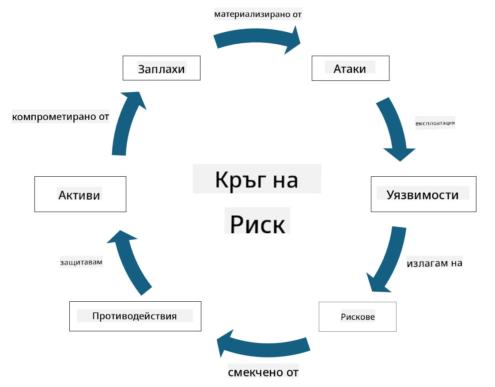

<!--
CO_OP_TRANSLATOR_METADATA:
{
  "original_hash": "fcca304f072cabf206388199e8e2e578",
  "translation_date": "2025-09-03T21:51:19+00:00",
  "source_file": "1.3 Understanding risk management.md",
  "language_code": "bg"
}
-->
# Разбиране на управлението на риска

## Въведение

В този урок ще разгледаме:

 - Дефиниции на често използвана терминология в областта на сигурността
   
 - Видове мерки за сигурност

 - Оценка на рисковете за сигурността

## Дефиниции на често използвана терминология в областта на сигурността

Тези термини са основни концепции в областта на киберсигурността и управлението на риска. Нека разгледаме всеки термин и как те се свързват помежду си:

1. **Агент на заплахата**:

Агент на заплахата е индивид, група, организация или автоматизирана система, която има потенциал да използва уязвимости в система или мрежа, за да причини вреда или щети. Агентите на заплахата могат да бъдат хакери, автори на зловреден софтуер, недоволни служители или всяка друга единица, която представлява риск за информационните и технологичните системи.

2. **Заплаха**:

Заплахата е потенциално събитие или действие, което може да използва уязвимости в система и да причини вреда на актив. Заплахите могат да включват действия като хакерски атаки, пробиви на данни, атаки за отказ на услуга и други. Заплахите са "какво" в контекста на потенциалната вреда, която може да бъде нанесена на активите на организацията.

3. **Уязвимост**:

Уязвимостта е слабост или недостатък в дизайна, изпълнението или конфигурацията на система, който може да бъде използван от агент на заплахата за компрометиране на сигурността на системата. Уязвимости могат да съществуват в софтуер, хардуер, процеси или човешко поведение. Идентифицирането и адресирането на уязвимости е от съществено значение за минимизиране на риска от успешни атаки.

4. **Риск**:

Рискът е потенциалът за загуба, вреда или щети, произтичащи от взаимодействието между заплаха и уязвимост. Това е вероятността агент на заплахата да използва уязвимост, за да причини негативно въздействие. Рисковете често се оценяват според техния потенциален ефект и вероятността за настъпване.

5. **Актив**:

Активът е всичко, което има стойност и организацията се стреми да защити. Активите могат да включват физически обекти (като компютри и сървъри), данни (информация за клиенти, финансови записи), интелектуална собственост (търговски тайни, патенти) и дори човешки ресурси (умения и знания на служителите). Защитата на активите е ключова цел на киберсигурността.

6. **Експозиция**:

Експозицията се отнася до състоянието на уязвимост към потенциални заплахи. Тя възниква, когато съществува уязвимост, която може да бъде използвана от агент на заплахата. Експозицията подчертава риска, свързан с наличието на уязвимости в система или мрежа.

7. **Контрол**:

Контролът е мярка, въведена за намаляване на риска, свързан с уязвимости и заплахи. Контролите могат да бъдат технически, процедурни или административни. Те са предназначени да предотвратяват, откриват или смекчават потенциални заплахи и уязвимости. Примери включват защитни стени, контрол на достъпа, криптиране, политики за сигурност и обучение на служителите.

За да обобщим връзката между тези термини: Агентите на заплахата използват уязвимости, за да реализират заплахи, които могат да доведат до рискове с потенциал да причинят вреда на ценни активи. Експозицията възниква, когато са налице уязвимости, а контролите се въвеждат, за да намалят риска чрез предотвратяване или смекчаване на въздействието на заплахите върху активите. Тази рамка формира основата на управлението на риска в киберсигурността, като насочва организациите в идентифицирането, оценката и адресирането на потенциални рискове за техните информационни системи и активи.

## Видове мерки за сигурност

Мерките за сигурност са действия или защити, въведени за защита на информационните системи и активи от различни заплахи и уязвимости. Те могат да бъдат класифицирани в няколко категории според техния фокус и цел. Ето някои често срещани видове мерки за сигурност:

1. **Административни мерки**:

Тези мерки са свързани с политики, процедури и насоки, които регулират практиките за сигурност и поведението на потребителите в организацията.

- Политики и процедури за сигурност: Документирани насоки, които определят как се поддържа сигурността в организацията.

- Осведоменост и обучение за сигурност: Програми за обучение на служителите относно най-добрите практики за сигурност и потенциални заплахи.

- Реакция и управление на инциденти: Планове за реагиране и смекчаване на инциденти, свързани със сигурността.

2. **Технически мерки**:

Техническите мерки включват използването на технологии за прилагане на мерки за сигурност и защита на системите и данните. Примери за технически мерки са:

- Контрол на достъпа: Мерки, които ограничават достъпа на потребителите до ресурси според техните роли и разрешения.

- Криптиране: Преобразуване на данни в защитен формат, за да се предотврати неоторизиран достъп.

- Защитни стени: Устройства за мрежова сигурност, които филтрират и контролират входящия и изходящия трафик.

- Системи за откриване и предотвратяване на прониквания (IDPS): Инструменти, които наблюдават мрежовия трафик за подозрителна активност.

- Антивирусен и анти-зловреден софтуер: Програми, които откриват и премахват зловреден софтуер.

- Механизми за удостоверяване: Методи за проверка на идентичността на потребителите, като пароли, биометрия и многофакторно удостоверяване.

- Управление на актуализации: Редовно обновяване на софтуера за адресиране на известни уязвимости.

3. **Физически мерки**:

Физическите мерки са действия за защита на физическите активи и съоръжения.

- Охранители и персонал за контрол на достъпа: Персонал, който наблюдава и контролира достъпа до физически помещения.

- Камери за наблюдение: Системи за видеонаблюдение за мониторинг и запис на дейности.

- Заключалки и физически бариери: Физически мерки за ограничаване на достъпа до чувствителни зони.

- Контроли на околната среда: Мерки за регулиране на температурата, влажността и други фактори, които влияят на оборудването и центровете за данни.

4. **Оперативни мерки**:

Тези мерки са свързани с ежедневните операции и дейности, които гарантират текущата сигурност на системите.

- Управление на промените: Процеси за проследяване и одобрение на промени в системите и конфигурациите.

- Архивиране и възстановяване след бедствия: Планове за архивиране и възстановяване на данни в случай на повреди или бедствия.

- Логване и одит: Наблюдение и записване на дейности в системата за целите на сигурността и съответствието.

- Практики за сигурно програмиране: Насоки за писане на софтуер с минимални уязвимости.

5. **Правни и регулаторни мерки**:

Тези мерки гарантират съответствие с приложимите закони, регулации и индустриални стандарти. Стандартите, които организацията трябва да спазва, зависят от юрисдикцията, индустриалния сектор и други фактори.

- Регулации за защита на данните: Съответствие с закони като GDPR, HIPAA и CCPA.

- Индустриални стандарти: Спазване на стандарти като PCI DSS за сигурност на данни за платежни карти.

Тези категории мерки за сигурност работят заедно, за да създадат цялостна сигурност за организациите, като помагат за защита на техните системи, данни и активи от широк спектър от заплахи.

## Оценка на рисковете за сигурността

Някои специалисти по сигурност смятат, че управлението на риска е задача на професионалистите по риск, но разбирането на процеса на управление на риска за сигурността е важно за всеки специалист по сигурност, за да може да изрази риска за сигурността на език, който останалата част от организацията може да разбере и да предприеме действия.

Организациите трябва постоянно да оценяват рисковете за сигурността и да решават какви действия (или липса на такива) да предприемат срещу рисковете за бизнеса. По-долу е представен преглед на това как обикновено се извършва този процес. Забележете, че този процес обикновено се извършва от няколко различни екипа в рамките на организацията; рядко един екип е отговорен за цялостното управление на риска.

1. **Идентифициране на активи и заплахи**:

Организацията идентифицира активите, които иска да защити. Те могат да включват данни, системи, хардуер, софтуер, интелектуална собственост и други. След това се идентифицират потенциалните заплахи, които могат да бъдат насочени към тези активи.

2. **Оценка на уязвимостите**:

Организациите идентифицират уязвимости или слабости в системите или процесите, които могат да бъдат използвани от заплахи. Тези уязвимости могат да произтичат от софтуерни недостатъци, грешни конфигурации, липса на мерки за сигурност и човешки грешки.

3. **Оценка на вероятността**:

Организацията оценява вероятността за настъпване на всяка заплаха. Това включва разглеждане на исторически данни, информация за заплахи, тенденции в индустрията и вътрешни фактори. Вероятността може да бъде категоризирана като ниска, средна или висока въз основа на вероятността за материализиране на заплахата.

4. **Оценка на въздействието**:

След това организацията определя потенциалното въздействие на всяка заплаха, ако тя използва уязвимост. Въздействието може да включва финансови загуби, оперативни прекъсвания, репутационни щети, правни последствия и други. Въздействието също може да бъде категоризирано като ниско, средно или високо въз основа на потенциалните последствия.

5. **Изчисляване на риска**:

Оценките за вероятност и въздействие се комбинират, за да се изчисли общото ниво на риск за всяка идентифицирана заплаха. Това често се прави с помощта на матрица за риск, която присвоява числови стойности или качествени описания на нивата на вероятност и въздействие. Полученото ниво на риск помага да се приоритизират рисковете, които изискват незабавно внимание.

6. **Приоритизация и вземане на решения**:

Организацията приоритизира рисковете, като се фокусира върху тези с най-високи комбинирани стойности за вероятност и въздействие. Това позволява по-ефективно разпределение на ресурсите и внедряване на мерки за сигурност. Заплахите с висок риск изискват незабавно внимание, докато заплахите с по-нисък риск могат да бъдат адресирани в по-дългосрочен план.

7. **Обработка на риска**:

Въз основа на оценката на риска организацията определя как да смекчи или управлява всеки риск. Това може да включва внедряване на мерки за сигурност, прехвърляне на риска чрез застраховка или дори приемане на определени нива на остатъчен риск, ако те се считат за управляеми/твърде скъпи за отстраняване/и т.н.

8. **Непрекъснато наблюдение и преглед**:

Оценката на риска не е еднократен процес. Тя трябва да се извършва периодично или когато има значителни промени в средата на организацията. Непрекъснатото наблюдение гарантира, че новите заплахи, уязвимости или промени в бизнес средата са взети предвид.

Чрез оценка на рисковете за сигурността по този структуриран начин организациите могат да вземат информирани решения относно разпределението на ресурсите, мерките за сигурност и цялостните стратегии за управление на риска. Целта е да се намали общата експозиция на риска на организацията, като същевременно се съгласуват усилията за сигурност с бизнес целите и приоритетите на организацията.

---

**Отказ от отговорност**:  
Този документ е преведен с помощта на AI услуга за превод [Co-op Translator](https://github.com/Azure/co-op-translator). Въпреки че се стремим към точност, моля, имайте предвид, че автоматизираните преводи може да съдържат грешки или неточности. Оригиналният документ на неговия роден език трябва да се счита за авторитетен източник. За критична информация се препоръчва професионален човешки превод. Ние не носим отговорност за недоразумения или погрешни интерпретации, произтичащи от използването на този превод.