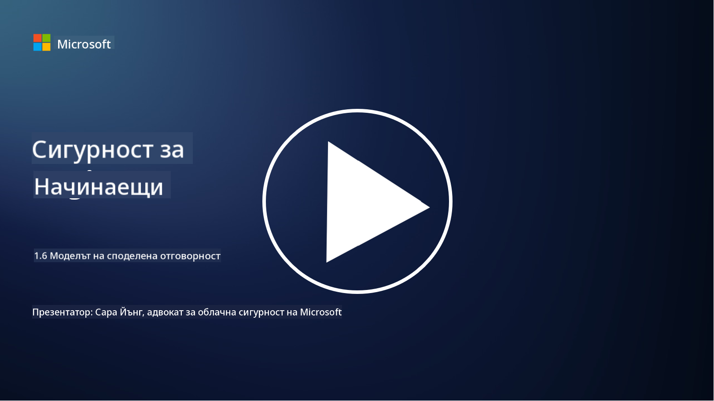

<!--
CO_OP_TRANSLATOR_METADATA:
{
  "original_hash": "a48db640d80c786b928ca178c414f084",
  "translation_date": "2025-09-03T21:03:14+00:00",
  "source_file": "1.6 Shared responsibility model.md",
  "language_code": "bg"
}
-->
# Моделът на споделена отговорност

Споделената отговорност е сравнително нова концепция в ИТ, която възникна с появата на облачните технологии. От гледна точка на киберсигурността е критично важно да се разбере кой предоставя кои мерки за сигурност, за да се избегнат пропуски в защитата.

## Въведение

В този урок ще разгледаме:

 - Какво представлява споделената отговорност в контекста на киберсигурността?
   
 - Каква е разликата в споделената отговорност за мерките за сигурност
   между IaaS, PaaS и SaaS?

   

 - Къде можете да намерите информация за мерките за сигурност, които вашата облачна платформа предоставя?

   
 

 - Какво означава „доверявай се, но проверявай“?

## Какво представлява споделената отговорност в контекста на киберсигурността?

Споделената отговорност в киберсигурността се отнася до разпределението на отговорностите за сигурност между доставчика на облачни услуги (CSP) и неговите клиенти. В облачните среди, като Infrastructure as a Service (IaaS), Platform as a Service (PaaS) и Software as a Service (SaaS), както CSP, така и клиентът имат роли в осигуряването на сигурността на данните, приложенията и системите.

## Каква е разликата в споделената отговорност за мерките за сигурност между IaaS, PaaS и SaaS?

Разпределението на отговорностите обикновено зависи от типа облачна услуга, която се използва:

 - **IaaS (Infrastructure as a Service)**: CSP предоставя основната инфраструктура (сървъри, мрежи, съхранение), докато клиентът е отговорен за управлението на операционните системи, приложенията и конфигурациите за сигурност върху тази инфраструктура.
   
   
 - **PaaS (Platform as a Service):** CSP предлага платформа, върху която клиентите могат да изграждат и внедряват приложения. CSP управлява основната инфраструктура, а клиентът се фокусира върху разработката на приложения и сигурността на данните.

   

 - **SaaS (Software as a Service)**: CSP предоставя напълно функционални приложения, достъпни през интернет. В този случай CSP е отговорен за сигурността на приложението и инфраструктурата, докато клиентът управлява достъпа на потребителите и използването на данните.

Разбирането на споделената отговорност е важно, защото изяснява кои аспекти на сигурността са покрити от CSP и кои трябва да бъдат адресирани от клиента. Това помага да се избегнат недоразумения и гарантира, че мерките за сигурност са приложени цялостно.

## Къде можете да намерите информация за мерките за сигурност, които вашата облачна платформа предоставя?

За да разберете какви мерки за сигурност предоставя вашата облачна платформа, трябва да се обърнете към документацията и ресурсите на доставчика на облачни услуги. Те включват:

 - **Уебсайт и документация на CSP**: Уебсайтът на CSP ще съдържа информация за функциите и мерките за сигурност, предлагани като част от техните услуги. CSP обикновено предоставят подробна документация, която обяснява техните практики за сигурност, мерки и препоръки. Това може да включва бели книги, ръководства за сигурност и техническа документация.
   
 - **Оценки и одити на сигурността**: Повечето CSP подлагат своите мерки за сигурност на оценка от независими експерти и организации. Тези прегледи могат да предоставят информация за качеството на мерките за сигурност на CSP. Понякога това води до получаване на сертификат за съответствие със сигурността (вижте следващата точка).
 - **Сертификати за съответствие със сигурността**: Повечето CSP получават сертификати като ISO:27001, SOC 2 и FedRAMP и др. Тези сертификати демонстрират, че доставчикът отговаря на определени стандарти за сигурност и съответствие.

Запомнете, че нивото на детайлност и наличността на информацията може да варира между различните доставчици на облачни услуги. Винаги се уверявайте, че консултирате официални и актуални ресурси, предоставени от доставчика, за да вземете информирани решения относно сигурността на вашите активи в облака.

## Какво означава „доверявай се, но проверявай“?

В контекста на използването на CSP, софтуер от трети страни или друга ИТ услуга за сигурност, организацията може първоначално да се довери на твърденията на доставчика относно мерките за сигурност. Въпреки това, за да гарантира наистина безопасността на своите данни и системи, тя трябва да провери тези твърдения чрез оценки на сигурността, тестове за проникване и преглед на мерките за сигурност на външната страна, преди напълно да интегрира софтуера или услугата в своите операции. Всички лица и организации трябва да се стремят да се доверяват, но да проверяват мерките за сигурност, за които не носят отговорност.

## Споделена отговорност в рамките на организацията

Не забравяйте, че споделената отговорност за сигурността в рамките на организацията между различни екипи също трябва да се вземе предвид. Екипът по сигурността рядко ще приложи всички мерки самостоятелно и ще трябва да си сътрудничи с екипите по операции, разработчици и други части на бизнеса, за да приложи всички необходими мерки за сигурност, които да гарантират безопасността на организацията.

## Допълнителна литература
- [Shared responsibility in the cloud - Microsoft Azure | Microsoft Learn](https://learn.microsoft.com/azure/security/fundamentals/shared-responsibility?WT.mc_id=academic-96948-sayoung)
- [What is shared responsibility model? – Definition from TechTarget.com](https://www.techtarget.com/searchcloudcomputing/definition/shared-responsibility-model)
- [The shared responsibility model explained and what it means for cloud security | CSO Online](https://www.csoonline.com/article/570779/the-shared-responsibility-model-explained-and-what-it-means-for-cloud-security.html)
- [Shared Responsibility for Cloud Security: What You Need to Know (cisecurity.org)](https://www.cisecurity.org/insights/blog/shared-responsibility-cloud-security-what-you-need-to-know)

---

**Отказ от отговорност**:  
Този документ е преведен с помощта на AI услуга за превод [Co-op Translator](https://github.com/Azure/co-op-translator). Въпреки че се стремим към точност, моля, имайте предвид, че автоматизираните преводи може да съдържат грешки или неточности. Оригиналният документ на неговия роден език трябва да се счита за авторитетен източник. За критична информация се препоръчва професионален човешки превод. Ние не носим отговорност за недоразумения или погрешни интерпретации, произтичащи от използването на този превод.