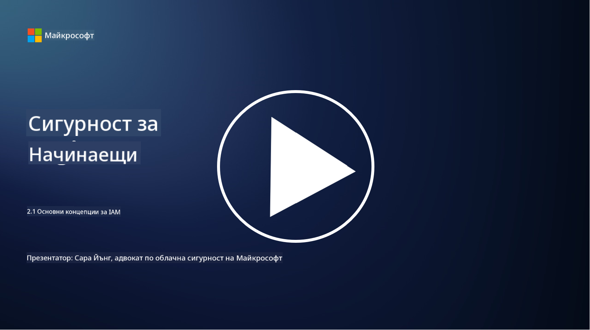

<!--
CO_OP_TRANSLATOR_METADATA:
{
  "original_hash": "2e3864e3d579f0dbb4ac2ec8c5f82acf",
  "translation_date": "2025-09-03T19:34:37+00:00",
  "source_file": "2.1 IAM key concepts.md",
  "language_code": "bg"
}
-->
# Основни концепции за IAM

Влизали ли сте някога в компютър или уебсайт? Разбира се, че сте! Това означава, че вече сте използвали контроли за идентичност в ежедневието си. Управлението на идентичност и достъп (IAM) е ключов стълб на сигурността, за който ще научим повече в следващите уроци.

**Въведение**

В този урок ще разгледаме:

- Какво означава управление на идентичност и достъп (IAM) в контекста на киберсигурността?

- Какво представлява принципът на минималните привилегии?

- Какво е разделение на задълженията?

- Какво са автентикация и авторизация?

## Какво означава управление на идентичност и достъп (IAM) в контекста на киберсигурността?

Управлението на идентичност и достъп (IAM) се отнася до набор от процеси, технологии и политики, които се прилагат, за да се гарантира, че правилните лица имат подходящ достъп до ресурси в дигиталната среда на организацията. IAM включва управление на дигитални идентичности (потребители, служители, партньори) и техния достъп до системи, приложения, данни и мрежи. Основната цел на IAM е да подобри сигурността, да улесни достъпа на потребителите и да осигури съответствие с организационните политики и регулации. Решенията за IAM обикновено включват автентикация на потребители, авторизация, предоставяне на идентичности, контрол на достъпа и управление на жизнения цикъл на потребителите (осигуряване, че акаунтите се изтриват, когато вече не се използват).

## Какво представлява принципът на минималните привилегии?

Принципът на минималните привилегии е основна концепция, която препоръчва предоставянето на потребители и системи само на минималните привилегии, необходими за изпълнение на техните задачи или роли. Този принцип помага да се ограничи потенциалната вреда, която може да възникне при пробив в сигурността или вътрешна заплаха. Спазването на принципа на минималните привилегии намалява повърхността на атака и минимизира риска от неупълномощен достъп, пробиви на данни и случайно неправилно използване на привилегии. На практика това означава, че на потребителите се предоставя достъп само до конкретните ресурси и функционалности, необходими за техните работни роли, и нищо повече. Например, ако просто трябва да прочетете документ, би било прекомерно да ви се предоставят пълни администраторски привилегии за този документ.

## Какво е разделение на задълженията?

Разделението на задълженията е принцип, насочен към предотвратяване на конфликти на интереси и намаляване на риска от измами и грешки чрез разпределяне на критични задачи и отговорности между различни лица в организацията. В контекста на киберсигурността, разделението на задълженията включва осигуряване, че нито едно лице няма контрол върху всички аспекти на критичен процес или система. Целта е да се създаде система от проверки и баланси, която предотвратява възможността едно лице да изпълнява както етапа на настройка, така и етапа на одобрение на даден процес. Например, във финансовите системи това може да означава, че лицето, което въвежда транзакции в системата, не трябва да бъде същото лице, което одобрява тези транзакции. Това намалява риска от неупълномощени или измамни действия, които остават незабелязани.

## Какво са автентикация и авторизация?

Автентикацията и авторизацията са две основни концепции в киберсигурността, които играят ключова роля за осигуряване на сигурността и целостта на компютърните системи и данни. Те често се използват заедно, за да контролират достъпа до ресурси и да защитават чувствителна информация.

**1. Автентикация**: Автентикацията е процесът на проверка на идентичността на потребител, система или субект, който се опитва да получи достъп до компютърна система или конкретен ресурс. Тя гарантира, че заявената идентичност е истинска и точна. Методите за автентикация обикновено включват използването на един или повече от следните фактори:

   a. Нещо, което знаете: Това включва пароли, ПИН кодове или друга тайна информация, която само упълномощеният потребител трябва да притежава.

   b. Нещо, което имате: Това включва физически токени или устройства като смарт карти, защитни токени или мобилни телефони, използвани за потвърждаване на идентичността на потребителя.

   c. Нещо, което сте: Това се отнася до биометрични фактори като пръстови отпечатъци, лицево разпознаване или сканиране на ретината, които са уникални за дадено лице.

Механизмите за автентикация се използват, за да се потвърди, че потребителят е този, за когото се представя, преди да му бъде позволен достъп до система или ресурс. Те помагат за предотвратяване на неупълномощен достъп и гарантират, че само легитимни потребители могат да извършват действия в системата.

**2. Авторизация**: Авторизацията е процесът на предоставяне или отказване на конкретни разрешения и привилегии на автентифицирани потребители или субекти, след като тяхната идентичност е била проверена. Тя определя какви действия или операции потребителят може да извършва в системата или върху конкретни ресурси. Авторизацията често се основава на предварително дефинирани политики, правила за контрол на достъпа и роли, присвоени на потребителите.

Авторизацията може да се разглежда като отговор на въпроса „Какво може да прави автентифицираният потребител?“ Тя включва дефиниране и прилагане на политики за контрол на достъпа, за да се защитят чувствителни данни и ресурси от неупълномощен достъп или модификация.

**Обобщение:**

- Автентикацията установява идентичността на потребителите или субектите.
- Авторизацията определя какви действия и ресурси автентифицираните потребители могат да достъпват или манипулират.

## Допълнителна литература

- [Describe identity concepts - Training | Microsoft Learn](https://learn.microsoft.com/training/modules/describe-identity-principles-concepts/?WT.mc_id=academic-96948-sayoung)
- [Introduction to identity - Microsoft Entra | Microsoft Learn](https://learn.microsoft.com/azure/active-directory/fundamentals/identity-fundamental-concepts?WT.mc_id=academic-96948-sayoung)
- [What is Identity Access Management (IAM)? | Microsoft Security](https://www.microsoft.com/security/business/security-101/what-is-identity-access-management-iam?WT.mc_id=academic-96948-sayoung)
- [What is IAM? Identity and access management explained | CSO Online](https://www.csoonline.com/article/518296/what-is-iam-identity-and-access-management-explained.html)
- [What is IAM? (auth0.com)](https://auth0.com/blog/what-is-iam/)
- [Security+: implementing Identity and Access Management (IAM) controls [updated 2021] | Infosec (infosecinstitute.com)](https://resources.infosecinstitute.com/certifications/securityplus/security-implementing-identity-and-access-management-iam-controls/)
- [least privilege - Glossary | CSRC (nist.gov)](https://csrc.nist.gov/glossary/term/least_privilege)
- [Security: The Principle of Least Privilege (POLP) - Microsoft Community Hub](https://techcommunity.microsoft.com/t5/azure-sql-blog/security-the-principle-of-least-privilege-polp/ba-p/2067390?WT.mc_id=academic-96948-sayoung)
- [Principle of least privilege | CERT NZ](https://www.cert.govt.nz/it-specialists/critical-controls/principle-of-least-privilege/)
- [Why is separation of duties required by NIST 800-171 and CMMC? - (totem.tech)](https://www.totem.tech/cmmc-separation-of-duties/)

---

**Отказ от отговорност**:  
Този документ е преведен с помощта на AI услуга за превод [Co-op Translator](https://github.com/Azure/co-op-translator). Въпреки че се стремим към точност, моля, имайте предвид, че автоматизираните преводи може да съдържат грешки или неточности. Оригиналният документ на неговия роден език трябва да се счита за авторитетен източник. За критична информация се препоръчва професионален човешки превод. Ние не носим отговорност за недоразумения или погрешни интерпретации, произтичащи от използването на този превод.