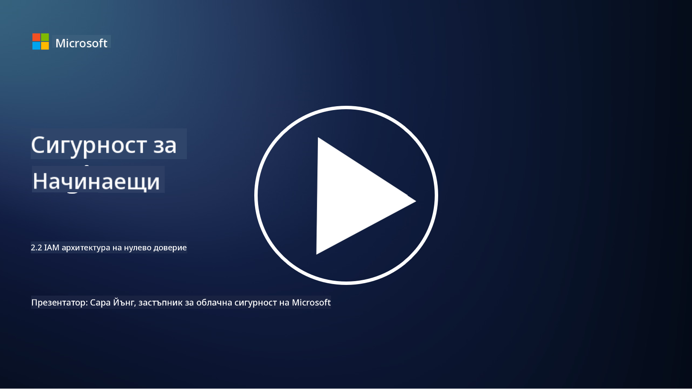

<!--
CO_OP_TRANSLATOR_METADATA:
{
  "original_hash": "4774a978af123f72ebb872199c4c4d4f",
  "translation_date": "2025-09-03T20:25:04+00:00",
  "source_file": "2.2 IAM zero trust architecture.md",
  "language_code": "bg"
}
-->
# IAM архитектура на нулево доверие

Идентичността е ключова част от прилагането на архитектура на нулево доверие и изграждането на периметър за всяка ИТ среда. В тази секция ще разгледаме защо е важно да използваме контроли за идентичност, за да внедрим нулево доверие.

## Въведение

В този урок ще разгледаме:

 - Защо трябва да използваме идентичността като наш периметър в съвременните ИТ среди?
   
 - Как това се различава от традиционните ИТ архитектури?
   
 - Как се използва идентичността за прилагане на архитектура на нулево доверие?

## Защо трябва да използваме идентичността като наш периметър в съвременните ИТ среди?

В съвременните ИТ среди традиционната концепция за физически периметър (с използване на инструменти като защитни стени и мрежови граници) като основна линия на защита срещу киберзаплахи става все по-неефективна поради нарастващата сложност на технологиите, увеличаването на дистанционната работа и приемането на облачни услуги. Вместо това организациите преминават към използване на идентичността като новия периметър. Това означава, че сигурността се върти около проверката и управлението на идентичността на потребители, устройства и приложения, които се опитват да получат достъп до ресурси, независимо от тяхното физическо местоположение.

Ето защо използването на идентичността като периметър е от съществено значение в съвременните ИТ среди:

**Дистанционна работна сила**: С дистанционната работа и мобилните устройства, които стават норма, потребителите могат да получават достъп до ресурси от различни местоположения и устройства. Традиционният подход с периметър не работи, когато потребителите вече не са ограничени до физически офис.

**Облачни и хибридни среди**: Организациите все повече приемат облачни услуги и хибридни среди. Данните и приложенията вече не се намират само в рамките на помещенията на организацията, което прави традиционните периметрови защити по-малко релевантни.

**Сигурност на нулево доверие**: Концепцията за сигурност на нулево доверие предполага, че нито един субект, независимо дали е вътре или извън мрежата, не трябва да бъде автоматично доверен. Идентичността става основа за проверка на заявките за достъп, независимо откъде произхождат.

**Заплахи в киберпространството**: Киберзаплахите се развиват, а нападателите намират начини да заобикалят традиционните периметрови защити. Фишингът, социалното инженерство и вътрешните заплахи често експлоатират човешки уязвимости, вместо да се опитват да пробият мрежовите периметри.

**Подход, фокусиран върху данните**: Защитата на чувствителни данни е от първостепенно значение. Чрез фокусиране върху идентичността организациите могат да контролират кой има достъп до какви данни, намалявайки риска от пробиви.

## Как това се различава от традиционните ИТ архитектури?

Традиционните ИТ архитектури разчитаха силно на модели за сигурност, базирани на периметър, където защитните стени и мрежовите граници играеха значителна роля за предпазване от заплахи. Основните разлики между традиционния и подхода, базиран на идентичност, са:

|      Аспект                |      Традиционни ИТ архитектури                                                                  |      Подход, базиран на идентичност                                                                      |
|----------------------------|--------------------------------------------------------------------------------------------------|----------------------------------------------------------------------------------------------------------|
|     Фокус                  |     Фокус върху периметъра: Разчитане на периметрови защити като защитни стени и контрол на достъпа. |     Фокус върху проверка на идентичността: Преход от мрежови граници към проверка на идентичността на потребители/устройства. |
|     Местоположение          |     Зависимост от местоположението: Сигурността е свързана с физически офис и мрежови граници.   |     Независимост от местоположението: Сигурността не е обвързана с конкретни местоположения; достъпът е възможен отвсякъде. |
|     Предположение за доверие |     Предполагаемо доверие: Доверие към потребители/устройства в рамките на мрежовия периметър.   |     Подход на нулево доверие: Доверието никога не се предполага; достъпът се проверява въз основа на идентичност и контекст. |
|     Устройства              |     Разнообразие на устройства: Предполага се, че устройствата в мрежовия периметър са сигурни. |     Осведоменост за устройства: Взема се предвид здравето и сигурността на устройствата, независимо от местоположението. |
|     Защита на данните        |     Защита на данните: Фокус върху защита на мрежовите периметри за защита на данните.          |     Защита, фокусирана върху данните: Контрол на достъпа до данни въз основа на идентичност и чувствителност на данните. |

## Как се използва идентичността за прилагане на архитектура на нулево доверие?

В архитектурата на нулево доверие основният принцип е никога да не се доверяваме автоматично на никой субект, независимо дали е вътре или извън мрежовия периметър. Идентичността играе централна роля в прилагането на подхода на нулево доверие, като позволява непрекъсната проверка на субектите, които се опитват да получат достъп до ресурси. Съвременните контроли за сигурност на идентичността изискват всеки потребител, устройство, приложение и услуга, които търсят достъп до ресурси, да бъдат напълно идентифицирани и удостоверени преди предоставяне на достъп. Това включва проверка на тяхната цифрова идентичност чрез методи като комбинации от потребителско име/парола, многофакторна автентикация (MFA), биометрия и други силни механизми за удостоверяване.

## Допълнителна литература

- [Securing identity with Zero Trust | Microsoft Learn](https://learn.microsoft.com/security/zero-trust/deploy/identity?WT.mc_id=academic-96948-sayoung)
- [Zero Trust Principles and Guidance for Identity and Access | CSA (cloudsecurityalliance.org)](https://cloudsecurityalliance.org/artifacts/zero-trust-principles-and-guidance-for-iam/)
- [Zero Trust Identity Controls - Essentials Series - Episode 2 - YouTube](https://www.youtube.com/watch?v=fQZQznIKcGM&list=PLXtHYVsvn_b_gtX1-NB62wNervQx1Fhp4&index=13)

---

**Отказ от отговорност**:  
Този документ е преведен с помощта на AI услуга за превод [Co-op Translator](https://github.com/Azure/co-op-translator). Въпреки че се стремим към точност, моля, имайте предвид, че автоматизираните преводи може да съдържат грешки или неточности. Оригиналният документ на неговия роден език трябва да се счита за авторитетен източник. За критична информация се препоръчва професионален човешки превод. Ние не носим отговорност за недоразумения или погрешни интерпретации, произтичащи от използването на този превод.