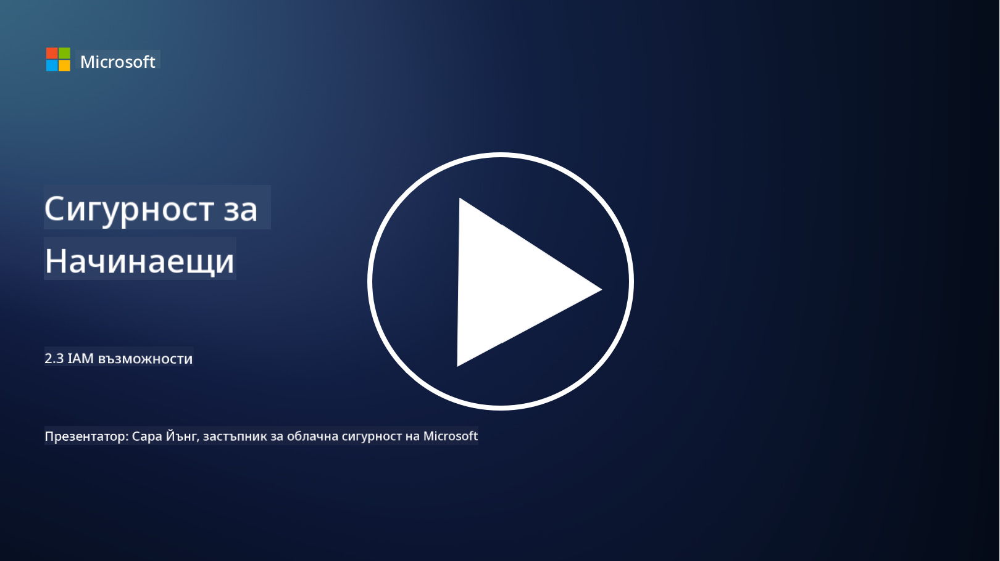

<!--
CO_OP_TRANSLATOR_METADATA:
{
  "original_hash": "bf0b8a54f2c69951744df5a94bc923f7",
  "translation_date": "2025-09-03T22:09:03+00:00",
  "source_file": "2.3 IAM capabilities.md",
  "language_code": "bg"
}
-->
# IAM Възможности

В този раздел ще разгледаме по-подробно основните инструменти и възможности, които се използват за защита на идентичността.

## Въведение

В този урок ще разгледаме:

 - Какво представлява услугата за директории?
      
     
    
 - Какви възможности могат да се използват за защита на идентичности?
>
>        Многофакторна автентикация (MFA)
> 
>        Еднократно влизане (SSO)
> 
>        Контрол на достъпа, базиран на роли (RBAC)
> 
>        Адаптивна автентикация
> 
>        Биометрична автентикация
> 
>        Управление на привилегирован достъп (PAM)
> 
>        Управление и администрация на идентичности (IGA)
> 
>        Поведенческа аналитика

## Какво представлява услугата за директории?

Услугата за директории е специализирана база данни, която съхранява и управлява информация за мрежови ресурси, включително потребители, групи, устройства, приложения и други обекти. Тя служи като централизирано хранилище за данни, свързани с идентичност и достъп, позволявайки на организациите ефективно да управляват и контролират автентикацията, авторизацията и други задачи, свързани със сигурността.

Услугите за директории играят ключова роля в съвременните IT среди, като предоставят основа за решения за управление на идентичности и достъп (IAM). Те улесняват сигурния достъп до ресурси, прилагат политики за достъп и опростяват административните задачи. Една от най-известните услуги за директории е Microsoft Active Directory, но съществуват и други решения като LDAP (Lightweight Directory Access Protocol) директории, които изпълняват подобни функции.

Основни функции и характеристики на услугата за директории в контекста на киберсигурността включват:

 - **Автентикация на потребители**: Услугите за директории валидират потребителските идентификационни данни (като потребителски имена и пароли), за да гарантират, че само упълномощени потребители могат да получат достъп до мрежата и нейните ресурси.
 - **Авторизация на потребители**: Те определят нивото на достъп на всеки потребител въз основа на неговата роля, членство в групи и други атрибути. Това гарантира, че потребителите имат достъп само до ресурсите, за които са упълномощени.
 - **Управление на групи**: Услугите за директории позволяват на администраторите да организират потребителите в логически групи, което опростява управлението на контрола на достъпа. Разрешенията могат да се задават на групи, вместо на отделни потребители.
 - **Политики за пароли**: Те прилагат правила за сложност и изтичане на паролите, подобрявайки сигурността на потребителските акаунти.
 - **Еднократно влизане (SSO)**: Някои услуги за директории поддържат SSO, което позволява на потребителите да получат достъп до множество приложения и услуги с един набор от идентификационни данни.
 - **Централизирано управление на потребители**: Услугите за директории централизирано съхраняват информация за потребителите, което улеснява управлението на акаунти, профили и атрибути от едно място.
 - **Одит и логване**: Те могат да записват дейности, свързани с автентикация и достъп на потребителите, подпомагайки одитите за сигурност и усилията за съответствие.

## Какви възможности могат да се използват за защита на идентичности?

**Многофакторна автентикация (MFA)**

MFA изисква от потребителите да предоставят няколко форми на верификация преди да получат достъп. Това обикновено включва нещо, което потребителят знае (парола), нещо, което потребителят притежава (смартфон или токен за сигурност), и нещо, което потребителят е (биометрични данни като пръстов отпечатък или лицево разпознаване).

**Еднократно влизане (SSO)**

SSO позволява на потребителите да получат достъп до множество приложения и системи с един набор от идентификационни данни. Това подобрява потребителското изживяване и намалява риска, свързан с управлението на множество пароли.

**Контрол на достъпа, базиран на роли (RBAC)**

RBAC задава разрешения въз основа на предварително дефинирани роли. Потребителите получават достъп въз основа на техните роли в организацията.

**Адаптивна автентикация**

Адаптивната автентикация оценява рискови фактори като местоположение, устройство, време на достъп и поведение на потребителя, за да динамично регулира нивото на необходимата автентикация. Ако заявката изглежда подозрителна, могат да се задействат допълнителни стъпки за автентикация.

**Биометрична автентикация**

Биометричната автентикация използва уникални биологични характеристики като пръстови отпечатъци, лицеви черти, гласови модели и дори поведенчески черти като скорост на писане за верификация на идентичността.

**Управление на привилегирован достъп (PAM)**

PAM се фокусира върху защитата на достъпа до критични системи и данни чрез прилагане на строги контроли върху привилегированите акаунти. Това включва функции като достъп "точно навреме" и мониторинг на сесиите.

**Управление и администрация на идентичности (IGA)**

IGA решенията управляват идентичностите на потребителите и техния достъп до ресурси през целия им жизнен цикъл. Това включва въвеждане, предоставяне, контрол на достъпа, базиран на роли, и премахване на достъпа.

**Поведенческа аналитика**

Поведенческата аналитика наблюдава поведението на потребителите и установява базови модели. Отклоненията от нормата могат да задействат сигнали за допълнително разследване.

# Допълнителна литература
- [Основна документация за Azure Active Directory - Microsoft Entra | Microsoft Learn](https://learn.microsoft.com/azure/active-directory/fundamentals/?WT.mc_id=academic-96948-sayoung)
- [Какво е Azure Active Directory? - Microsoft Entra | Microsoft Learn](https://learn.microsoft.com/azure/active-directory/fundamentals/whatis?WT.mc_id=academic-96948-sayoung)
- [Управление на вашата мултиоблачна инфраструктура за идентичности с Microsoft Entra - YouTube](https://www.youtube.com/watch?v=9qQiq3wTS2Y&list=PLXtHYVsvn_b_gtX1-NB62wNervQx1Fhp4&index=18)

---

**Отказ от отговорност**:  
Този документ е преведен с помощта на AI услуга за превод [Co-op Translator](https://github.com/Azure/co-op-translator). Въпреки че се стремим към точност, моля, имайте предвид, че автоматизираните преводи може да съдържат грешки или неточности. Оригиналният документ на неговия роден език трябва да се счита за авторитетен източник. За критична информация се препоръчва професионален човешки превод. Ние не носим отговорност за недоразумения или погрешни интерпретации, произтичащи от използването на този превод.