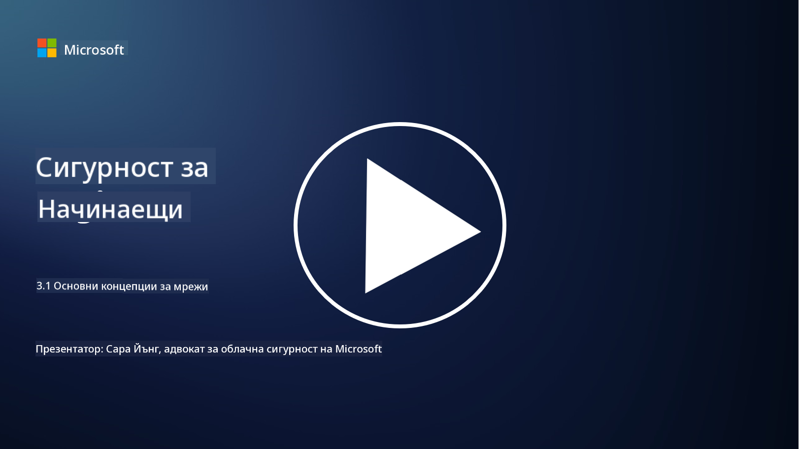
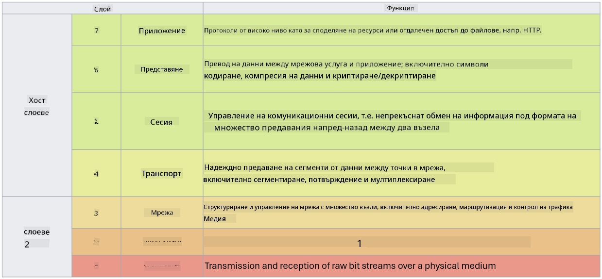

<!--
CO_OP_TRANSLATOR_METADATA:
{
  "original_hash": "252724eceeb183fb9018f88c5e1a3f0c",
  "translation_date": "2025-09-03T22:03:08+00:00",
  "source_file": "3.1 Networking key concepts.md",
  "language_code": "bg"
}
-->
# Основни концепции за мрежи

Ако сте работили в сферата на IT, вероятно сте се сблъсквали с концепции, свързани с мрежите. Въпреки че използваме идентичността като основен метод за контрол на достъпа в съвременните среди, това не означава, че мрежовите контроли са излишни. Макар темата да е обширна, в този урок ще разгледаме някои ключови концепции за мрежите.

В този урок ще разгледаме:

 - Какво е IP адресиране?
   
 - Какво представлява моделът OSI?

 

 - Какво са TCP/UDP?

   
 

 - Какво са портовите номера?

   
  

 - Какво е криптиране при съхранение и при пренос?

## Какво е IP адресиране?

IP адресирането, или адресиране чрез Интернет протокол, представлява числов етикет, който се присвоява на всяко устройство, свързано към компютърна мрежа, използваща Интернет протокол за комуникация. То служи като уникален идентификатор за устройствата в мрежата, позволявайки им да изпращат и получават данни през интернет или други свързани мрежи. Съществуват две основни версии на IP адресиране: IPv4 (версия 4 на Интернет протокола) и IPv6 (версия 6 на Интернет протокола). IP адресът обикновено се представя във формат IPv4 (например 192.168.1.1) или във формат IPv6 (например 2001:0db8:85a3:0000:0000:8a2e:0370:7334).

## Какво представлява моделът OSI?

Моделът OSI (Open Systems Interconnection) е концептуална рамка, която стандартизира функциите на комуникационна система в седем отделни слоя. Всеки слой изпълнява специфични задачи и комуникира със съседните слоеве, за да осигури ефективна и надеждна комуникация на данни между устройствата в мрежата. Слоевете, отдолу нагоре, са следните:

 1. Физически слой
    
 
 2. Слой за връзка на данни

    
    

 1. Мрежов слой

    
   

 1. Транспортен слой

    

 1. Слой за сесии

    
   

 1. Слой за представяне

    
    

 1. Приложен слой

Моделът OSI предоставя обща референция за разбиране на взаимодействието между мрежовите протоколи и технологии, независимо от конкретните хардуерни или софтуерни реализации.

_ref: https://en.wikipedia.org/wiki/OSI_model_

## Какво са TCP/UDP?

TCP (Transmission Control Protocol) и UDP (User Datagram Protocol) са два основни протокола на транспортния слой, използвани в компютърните мрежи за улесняване на комуникацията между устройствата през интернет или в локална мрежа. Те са отговорни за разбиването на данните на пакети за предаване и след това за сглобяването на тези пакети обратно в оригиналните данни на приемащия край. Въпреки това, те се различават по своите характеристики и приложения.

**TCP (Transmission Control Protocol)**:

TCP е протокол, ориентиран към връзка, който осигурява надеждно и подредено предаване на данни между устройствата. Той установява връзка между изпращача и получателя преди започването на обмена на данни. TCP гарантира, че пакетите данни пристигат в правилния ред и може да се справи с повторно предаване на изгубени пакети, за да осигури цялостност и точност на данните. Това прави TCP подходящ за приложения, които изискват надеждно предаване на данни, като уеб браузване, електронна поща, прехвърляне на файлове (FTP) и комуникация с бази данни.

**UDP (User Datagram Protocol)**:

UDP е протокол без връзка, който предлага по-бързо предаване на данни, но не осигурява същото ниво на надеждност като TCP. Той не установява формална връзка преди изпращането на данни и не включва механизми за потвърждение или повторно предаване на изгубени пакети. UDP е подходящ за приложения, при които скоростта и ефективността са по-важни от гарантираното предаване, като комуникация в реално време, стрийминг на медия, онлайн игри и DNS заявки.

В обобщение, TCP приоритизира надеждността и подреденото предаване, което го прави подходящ за приложения, които изискват точност на данните, докато UDP акцентира върху скоростта и ефективността, което го прави подходящ за приложения, при които малка загуба на данни или пренареждане на реда е приемливо в замяна на намалена латентност. Изборът между TCP и UDP зависи от специфичните изисквания на приложението или услугата.

## Какво са портовите номера?

В мрежите портовият номер е числов идентификатор, използван за разграничаване между различни услуги или приложения, които работят на едно устройство в мрежата. Портовете помагат за насочване на входящите данни към съответното приложение. Портовите номера са 16-битови беззнакови цели числа, което означава, че те варират от 0 до 65535. Те са разделени на три диапазона:

- Добре известни портове (0-1023): Резервирани за стандартни услуги като HTTP (порт 80) и FTP (порт 21).

- Регистрирани портове (1024-49151): Използвани за приложения и услуги, които не са част от добре известния диапазон, но са официално регистрирани.

- Динамични/частни портове (49152-65535): Налични за временна или частна употреба от приложения.

## Какво е криптиране при съхранение и при пренос?

Криптирането е процесът на преобразуване на данни в защитен формат, за да се предпазят от неоторизиран достъп или манипулация. Криптирането може да се приложи както към данни "при съхранение" (когато са съхранени на устройство или сървър), така и "при пренос" (когато се предават между устройства или през мрежи).

Криптиране при съхранение: Това включва криптиране на данни, които са съхранени на устройства, сървъри или системи за съхранение. Дори ако нападателят получи физически достъп до носителя за съхранение, той не може да получи достъп до данните без ключовете за криптиране. Това е от съществено значение за защита на чувствителни данни в случай на кражба на устройства, пробиви в сигурността или неоторизиран достъп.

Криптиране при пренос: Това включва криптиране на данни, докато те се предават между устройства или през мрежи. Това предотвратява подслушване и неоторизирано прихващане на данни по време на предаване. Често използвани протоколи за криптиране при пренос включват HTTPS за уеб комуникация и TLS/SSL за защита на различни видове мрежов трафик.

## Допълнителна литература
- [Как работят IP адресите? (howtogeek.com)](https://www.howtogeek.com/341307/how-do-ip-addresses-work/)
- [Разбиране на IP адресите: Въведение (geekflare.com)](https://geekflare.com/understanding-ip-address/)
- [Какво представлява моделът OSI? Обяснение на 7-те слоя на OSI (techtarget.com)](https://www.techtarget.com/searchnetworking/definition/OSI)
- [Моделът OSI – 7 слоя на мрежите, обяснени на ясен език (freecodecamp.org)](https://www.freecodecamp.org/news/osi-model-networking-layers-explained-in-plain-english/)
- [Протоколи TCP/IP - IBM документация](https://www.ibm.com/docs/en/aix/7.3?topic=protocol-tcpip-protocols)
- [Списък с често използвани портове: Пълно ръководство за портове и протоколи (stationx.net)](https://www.stationx.net/common-ports-cheat-sheet/)
- [Криптиране на данни при съхранение в Azure - Azure Security | Microsoft Learn](https://learn.microsoft.com/azure/security/fundamentals/encryption-atrest?WT.mc_id=academic-96948-sayoung)

---

**Отказ от отговорност**:  
Този документ е преведен с помощта на AI услуга за превод [Co-op Translator](https://github.com/Azure/co-op-translator). Въпреки че се стремим към точност, моля, имайте предвид, че автоматизираните преводи може да съдържат грешки или неточности. Оригиналният документ на неговия роден език трябва да се счита за авторитетен източник. За критична информация се препоръчва професионален човешки превод. Не носим отговорност за недоразумения или погрешни интерпретации, произтичащи от използването на този превод.