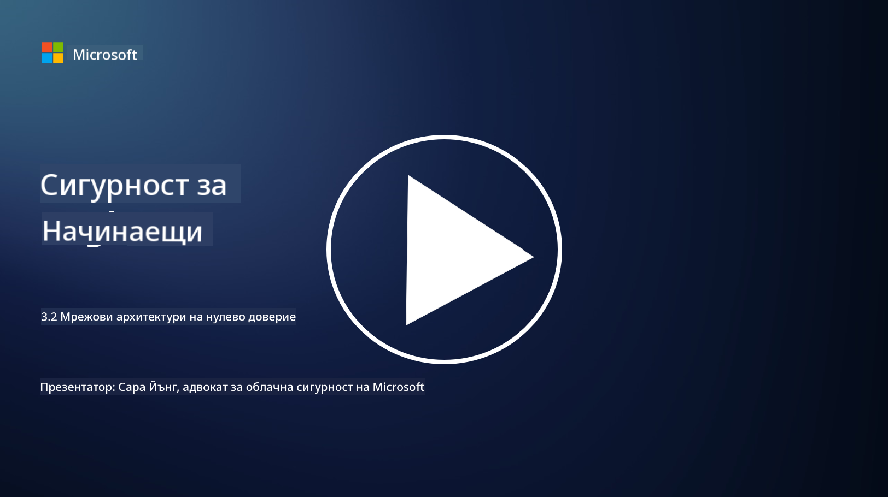

<!--
CO_OP_TRANSLATOR_METADATA:
{
  "original_hash": "680d6e14d9d33fc471c22f44679713f8",
  "translation_date": "2025-09-03T21:12:31+00:00",
  "source_file": "3.2 Networking zero trust architecture.md",
  "language_code": "bg"
}
-->
# Мрежови архитектури с нулево доверие

Мрежата предоставя ключов слой в контрола на нулевото доверие. В този урок ще научим повече за:

- Какво представлява мрежовата сегментация?  
- Как мрежовата сегментация помага за внедряването на нулево доверие?  
- Какво е криптиране от край до край?

## Какво представлява мрежовата сегментация?

Мрежовата сегментация е практика за разделяне на мрежата на по-малки, изолирани сегменти или подмрежи. Всеки сегмент е изолиран от останалите, а достъпът между сегментите се контролира и ограничава въз основа на специфични политики за сигурност. Мрежовата сегментация се използва за подобряване на сигурността чрез ограничаване на въздействието на потенциални пробиви и намаляване на страничното движение на атакуващите в мрежата.

Чрез внедряване на мрежова сегментация организацията може да създаде "зони", които разделят различни типове потребители, приложения и данни. Това намалява повърхността за атака и минимизира потенциалните щети, причинени от инцидент със сигурността. Мрежовата сегментация може да бъде постигната чрез технологии като виртуални локални мрежи (VLANs), защитни стени и контроли за достъп.

## Как мрежовата сегментация помага за внедряването на нулево доверие?

Мрежовата сегментация е тясно свързана с принципите на модела за нулево доверие. В архитектурата на нулево доверие мрежовата сегментация помага за прилагането на принципа "най-малко привилегии", като гарантира, че потребителите и устройствата имат достъп само до конкретните ресурси и услуги, които са им необходими за изпълнение на задачите. Чрез разделяне на мрежата на по-малки зони организациите могат да внедрят строги контроли за достъп, да изолират критични активи и да предотвратят страничното движение на атакуващите.

Мрежовата сегментация също така подпомага прилагането на контроли за достъп, базирани на идентичност, при които потребителите и устройствата се удостоверяват и упълномощават преди достъп до конкретни сегменти. Това предотвратява неупълномощен достъп до чувствителни ресурси и намалява потенциалното въздействие на компрометирани идентификационни данни.

## Какво е криптиране от край до край?

Криптирането от край до край (E2E) е мярка за сигурност, която гарантира, че данните остават криптирани през целия си път от подателя до получателя. В този процес данните се криптират от страната на подателя, а само получателят притежава ключа за декриптиране, за да отключи и прочете данните. Процесите на криптиране и декриптиране се извършват на крайните точки, което прави изключително трудно за неупълномощени страни, включително доставчици на услуги и посредници, да получат достъп до некриптираните данни.

Криптирането от край до край осигурява високо ниво на конфиденциалност и сигурност при предаване на данни, дори ако данните преминават през различни посреднически системи или мрежи. То често се използва в приложения за сигурно съобщаване, имейл услуги и други платформи за комуникация, за да защити чувствителна информация от прихващане и неупълномощен достъп.

Този метод на криптиране гарантира, че дори ако атакуващите успеят да получат достъп до данните по време на предаване, те ще видят само криптирано съдържание, което е безсмислено без ключа за декриптиране. Криптирането от край до край играе ключова роля в защитата на поверителността на потребителите и защитата на чувствителна информация от излагане на неупълномощени страни.

## Какво е SASE?

SASE означава "Secure Access Service Edge" (Сигурен достъп до периферията на услугите) и представлява рамка и архитектура за киберсигурност, която комбинира функции за мрежова сигурност и широколентови мрежи (WAN) в една облачна услуга. SASE е създаден, за да осигури сигурен и мащабируем достъп до мрежови ресурси, приложения и данни за отдалечени и мобилни потребители, като същевременно опростява управлението на мрежата и намалява сложността на традиционните мрежови и защитни архитектури.

Основни характеристики и компоненти на SASE включват:

1. **Облачна услуга:** SASE се предоставя като облачна услуга, което означава, че функциите за сигурност и мрежа се осигуряват от облака, вместо да се разчита на традиционен хардуер и устройства на място.

2. **Интеграция на сигурност и мрежа:** SASE интегрира различни услуги за сигурност като защитени уеб шлюзове (SWG), защитна стена като услуга (FWaaS), предотвратяване на загуба на данни (DLP), достъп до мрежа с нулево доверие (ZTNA) и оптимизация на WAN с функции за широколентови мрежи. Тази интеграция помага за опростяване на операциите по сигурност и мрежа.

3. **Нулево доверие:** SASE работи на принципа на нулево доверие, което означава, че прилага строги контроли за достъп и политики за най-малко привилегии. Потребителите и устройствата не се считат за надеждни по подразбиране и трябва да бъдат удостоверени и упълномощени преди достъп до ресурси.

4. **Фокус върху идентичността:** SASE се фокусира върху идентичността на потребителите и устройствата като основа за контрол на достъпа. Политики, базирани на идентичност и контекст, се използват за определяне на разрешения за достъп, като тези политики се адаптират динамично въз основа на поведението и контекста на потребителя.

5. **Мащабируемост и гъвкавост:** SASE може лесно да се мащабира, за да обслужва голям брой потребители и устройства, което го прави подходящ за организации с разнообразни и променящи се нужди от мрежа и сигурност.

SASE е особено актуален в съвременната ера на дистанционна работа и облачни технологии, тъй като предоставя цялостен и гъвкав подход за осигуряване и управление на мрежовия достъп. Той помага на организациите да се адаптират към променящите се изисквания за сигурност и мрежа, като същевременно запазват силен фокус върху модели за сигурност, базирани на потребителите и нулево доверие.

## Допълнителна литература

- [Какво е мрежова сегментация? - Cisco](https://www.cisco.com/c/en/us/products/security/what-is-network-segmentation.html#~benefits)  
- [Какво е микро-сегментация? - Cisco](https://www.cisco.com/c/en/us/products/security/what-is-microsegmentation.html)  
- [Внедряване на мрежова сегментация и разделяне | Cyber.gov.au](https://www.cyber.gov.au/resources-business-and-government/maintaining-devices-and-systems/system-hardening-and-administration/network-hardening/implementing-network-segmentation-and-segregation)  
- [Какво е мрежова сегментация и защо е важна | CompTIA](https://www.comptia.org/blog/security-awareness-training-network-segmentation)  
- [Мрежова сегментация: концепции и практики (cmu.edu)](https://insights.sei.cmu.edu/blog/network-segmentation-concepts-and-practices/)  
- [Сигурни мрежи с нулево доверие | Microsoft Learn](https://learn.microsoft.com/security/zero-trust/deploy/networks?WT.mc_id=academic-96948-sayoung)  
- [Какво е криптиране от край до край? | IBM](https://www.ibm.com/topics/end-to-end-encryption)  
- [Какво е криптиране от край до край и защо е важно? (howtogeek.com)](https://www.howtogeek.com/711656/what-is-end-to-end-encryption-and-why-does-it-matter/)  
- [Определение на Secure Access Service Edge (SASE) - Gartner Information Technology Glossary](https://www.gartner.com/en/information-technology/glossary/secure-access-service-edge-sase)  
- [Какво е Secure Access Service Edge (SASE)? | Microsoft Security](https://www.microsoft.com/security/business/security-101/what-is-sase?WT.mc_id=academic-96948-sayoung)  

---

**Отказ от отговорност**:  
Този документ е преведен с помощта на AI услуга за превод [Co-op Translator](https://github.com/Azure/co-op-translator). Въпреки че се стремим към точност, моля, имайте предвид, че автоматизираните преводи може да съдържат грешки или неточности. Оригиналният документ на неговия роден език трябва да се счита за авторитетен източник. За критична информация се препоръчва професионален човешки превод. Ние не носим отговорност за недоразумения или погрешни интерпретации, произтичащи от използването на този превод.