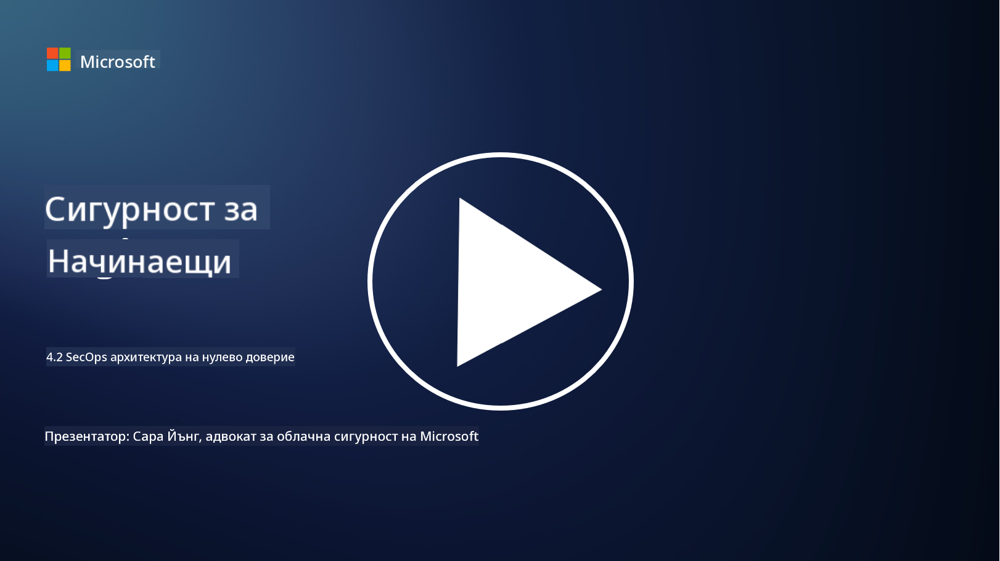

<!--
CO_OP_TRANSLATOR_METADATA:
{
  "original_hash": "45bbdc114e70936816b0b3e7c40189cf",
  "translation_date": "2025-09-03T21:18:38+00:00",
  "source_file": "4.2 SecOps zero trust architecture.md",
  "language_code": "bg"
}
-->
# Архитектура на нулево доверие в SecOps

Операциите по сигурност са две основни части от архитектурата на нулево доверие и в този урок ще разгледаме и двете:

- Как трябва да бъдат изградени IT архитектурите, за да позволят централизирано събиране на логове?

- Какви са най-добрите практики за операции по сигурност в съвременни IT среди?

## Как трябва да бъдат изградени IT архитектурите, за да позволят централизирано събиране на логове?

Централизираното събиране на логове е критичен компонент на съвременните операции по сигурност. То позволява на организациите да събират логове и данни от различни източници, като сървъри, приложения, мрежови устройства и инструменти за сигурност, в централен хранилище за анализ, мониторинг и реакция при инциденти. Ето някои най-добри практики за изграждане на IT архитектури, които поддържат централизирано събиране на логове:

1. **Интеграция на източниците на логове**:

- Уверете се, че всички релевантни устройства и системи са конфигурирани да генерират логове. Това включва сървъри, защитни стени, рутери, суичове, приложения и устройства за сигурност.

- Конфигурирайте източниците на логове да препращат логовете към централизирана система за събиране или управление.

2. **Избор на подходящ инструмент за SIEM (Security Information and Event Management)**:

- Изберете SIEM решение, което отговаря на нуждите и мащаба на вашата организация.

- Уверете се, че избраното решение поддържа събиране, агрегиране, анализ и отчитане на логове.

3. **Скалируемост и резервираност**:

- Проектирайте архитектурата така, че да бъде скалируема, за да се справя с увеличаващия се брой източници на логове и обем на данни.

- Внедрете резервираност за висока наличност, за да предотвратите прекъсвания поради хардуерни или мрежови проблеми.

4. **Сигурно транспортиране на логове**:

- Използвайте сигурни протоколи като TLS/SSL или IPsec за транспортиране на логове от източниците до централното хранилище.

- Внедрете автентикация и контрол на достъпа, за да гарантирате, че само упълномощени устройства могат да изпращат логове.

5. **Нормализация**:

- Стандартизирайте формата на логовете и нормализирайте данните, за да осигурите последователност и улеснен анализ.

6. **Съхранение и задържане**:

- Определете подходящ период за задържане на логовете въз основа на изискванията за съответствие и сигурност.

- Съхранявайте логовете сигурно, защитавайки ги от неупълномощен достъп и манипулация.

## Какви са най-добрите практики за операции по сигурност в съвременни IT среди?

Освен централизираното събиране на логове, ето някои най-добри практики за операции по сигурност в съвременни IT среди:

1. **Непрекъснат мониторинг**: Внедрете непрекъснат мониторинг на мрежовите и системните активности, за да откривате и реагирате на заплахи в реално време.

2. **Информация за заплахи**: Бъдете информирани за нововъзникващи заплахи и уязвимости, като използвате източници на информация за заплахи.

3. **Обучение на потребителите**: Провеждайте редовно обучение за осведоменост по сигурността за служителите, за да намалите рисковете, свързани със социално инженерство и фишинг атаки.

4. **План за реакция при инциденти**: Разработете и тествайте план за реакция при инциденти, за да осигурите бърза и ефективна реакция на инциденти със сигурността.

5. **Автоматизация на сигурността**: Използвайте инструменти за автоматизация и оркестрация на сигурността, за да оптимизирате реакцията при инциденти и повтарящи се задачи.

6. **Резервно копиране и възстановяване**: Внедрете надеждни решения за резервно копиране и възстановяване, за да осигурите наличност на данните в случай на загуба на данни или атаки с рансъмуер.

## Допълнителна литература

- [Microsoft Security Best Practices module: Security operations | Microsoft Learn](https://learn.microsoft.com/security/operations/security-operations-videos-and-decks?WT.mc_id=academic-96948-sayoung)
- [Security operations - Cloud Adoption Framework | Microsoft Learn](https://learn.microsoft.com/azure/cloud-adoption-framework/secure/security-operations?WT.mc_id=academic-96948-sayoung)
- [What is Security Operations and Analytics Platform Architecture? A Definition of SOAPA, How It Works, Benefits, and More (digitalguardian.com)](https://www.digitalguardian.com/blog/what-security-operations-and-analytics-platform-architecture-definition-soapa-how-it-works#:~:text=All%20in%20all%2C%20security%20operations%20and%20analytics%20platform,become%20more%20efficient%20and%20operative%20with%20your%20security.)

---

**Отказ от отговорност**:  
Този документ е преведен с помощта на AI услуга за превод [Co-op Translator](https://github.com/Azure/co-op-translator). Въпреки че се стремим към точност, моля, имайте предвид, че автоматизираните преводи може да съдържат грешки или неточности. Оригиналният документ на неговия роден език трябва да се счита за авторитетен източник. За критична информация се препоръчва професионален човешки превод. Ние не носим отговорност за недоразумения или погрешни интерпретации, произтичащи от използването на този превод.