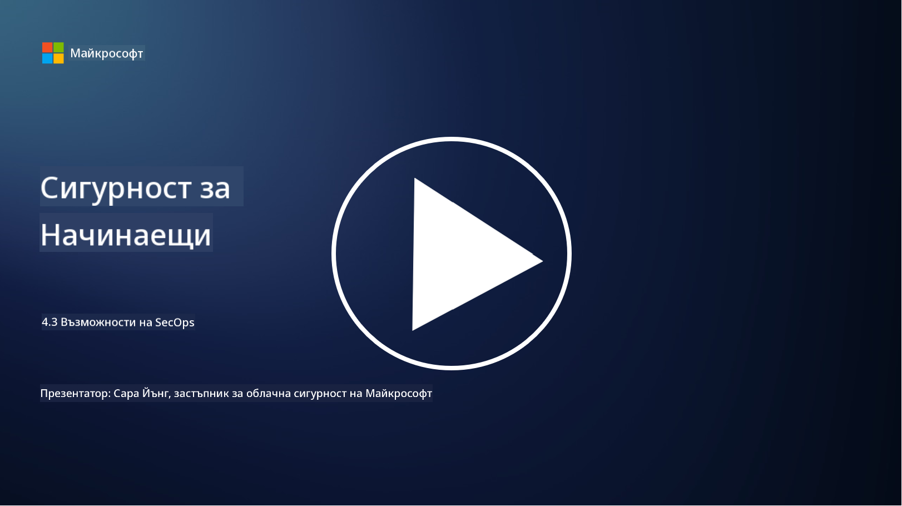

<!--
CO_OP_TRANSLATOR_METADATA:
{
  "original_hash": "553eb694c89f1caca0694e8d8ab89e0e",
  "translation_date": "2025-09-03T21:43:58+00:00",
  "source_file": "4.3 SecOps capabilities.md",
  "language_code": "bg"
}
-->
# Възможности на SecOps

В този раздел ще разгледаме по-подробно основните инструменти и възможности, които могат да се използват в операциите по сигурност.

В този урок ще разгледаме:

- Какво представлява инструментът за управление на информацията и събитията в сигурността (SIEM)?

- Какво е XDR?

- Какви възможности могат да се използват за подобряване на операциите по сигурност?

## Какво представлява инструментът за управление на информацията и събитията в сигурността (SIEM)?

Инструментът за управление на информацията и събитията в сигурността (SIEM) предоставя анализ на сигнали за сигурност, генерирани в ИТ средата на организацията. Той събира, агрегира, корелира и анализира данни от дневници и събития за сигурност от различни източници, като мрежови устройства, сървъри, приложения и системи за сигурност.

Основни функции и възможности на SIEM инструментите включват:

1. **Събиране на дневници**: SIEM инструментите събират данни от дневници и събития за сигурност от широк спектър устройства, системи и приложения, включително защитни стени, системи за откриване на прониквания, антивирусен софтуер и други.

2. **Нормализиране на данни**: Те нормализират данните от дневниците в общ формат, за да улеснят анализа и корелацията.

3. **Корелация на събития**: SIEM инструментите корелират събития, за да идентифицират модели и аномалии, които могат да показват инциденти или заплахи за сигурността.

4. **Сигнализация и уведомяване**: SIEM инструментите генерират сигнали и уведомления в реално време при откриване на подозрителни дейности или нарушения на сигурността, което позволява незабавна реакция.

5. **Откриване на инциденти**: Те улесняват откриването на инциденти, включително неоторизиран достъп, пробиви на данни, инфекции с зловреден софтуер и вътрешни заплахи.

6. **Анализ на поведението на потребители и обекти (UEBA)**: Някои SIEM инструменти включват UEBA възможности за идентифициране на необичайно поведение на потребители и обекти, което може да показва компрометирани акаунти или вътрешни заплахи.

7. **Интеграция с разузнаване за заплахи**: SIEM инструментите могат да се интегрират с потоци за разузнаване за заплахи, за да подобрят откриването на заплахи чрез сравнение на известни индикатори за компрометиране (IOCs) с мрежовата активност.

8. **Автоматизация и оркестрация**: Функциите за автоматизация позволяват на SIEM инструментите да автоматизират реакциите на често срещани инциденти, намалявайки времето за реакция и ръчните усилия.

9. **Табло и визуализация**: Те предлагат табла и инструменти за визуализация за наблюдение на данни за сигурност и създаване на персонализирани отчети.

10. **Интеграция с други инструменти за сигурност**: SIEM инструментите често се интегрират с други инструменти и технологии за сигурност, като решения за откриване и реакция на крайни точки (EDR), за да предоставят цялостен поглед върху състоянието на сигурността на организацията.

## Какво е XDR?

XDR (Extended Detection and Response) е технология, която разширява възможностите на традиционните решения за откриване и реакция на крайни точки (EDR) и ги комбинира с по-широка телеметрия за сигурност от различни източници, за да предостави по-цялостен поглед върху състоянието на сигурността на организацията. XDR има за цел да подобри откриването на заплахи, реакцията на инциденти и цялостната сигурност, като адресира ограниченията на разчитането само на EDR, SIEM или други индивидуални инструменти за сигурност.

Основни характеристики и компоненти на XDR включват:

1. **Интеграция на данни**: XDR интегрира данни от множество източници, включително крайни точки, мрежов трафик, облачни услуги, имейли и други. Тази цялостна агрегация на данни предоставя по-широк контекст за откриване и анализ на заплахи.

2. **Разширена аналитика**: XDR използва разширена аналитика, машинно обучение и анализ на поведението, за да идентифицира и приоритизира заплахите за сигурността. Той търси модели и аномалии в интегрираните данни, за да открие както известни, така и неизвестни заплахи.

3. **Автоматизирано откриване на заплахи**: XDR автоматизира откриването на заплахи и аномалии чрез корелация на информация от различни източници. Той може да идентифицира сложни вериги на атаки, които могат да обхващат множество вектори.

4. **Разследване и реакция на инциденти**: XDR предоставя инструменти за разследване и реакция на инциденти, помагайки на екипите за сигурност бързо да оценят обхвата и въздействието на инцидентите и да предприемат подходящи действия.

5. **Интеграция с разузнаване за заплахи**: Той интегрира потоци и данни за разузнаване за заплахи, за да подобри откриването на заплахи чрез сравнение на известни индикатори за компрометиране (IOCs) с активността в мрежата и крайните точки на организацията.

6. **Унифицирана конзола**: XDR обикновено предлага унифицирана конзола или табло, където екипите за сигурност могат да преглеждат и управляват сигнали и инциденти от различни източници на централизирано място.

7. **Покритие на различни платформи**: XDR решенията обхващат широк спектър от платформи, включително крайни точки, сървъри, облачни среди и мобилни устройства, което ги прави подходящи за съвременни, многоплатформени ИТ среди.

## Какви възможности могат да се използват за подобряване на операциите по сигурност?

За да подобрят операциите по сигурност, организациите могат да използват няколко възможности в допълнение към SIEM инструментите:

1. **Машинно обучение и изкуствен интелект**: Внедряване на разширена аналитика, машинно обучение и AI за откриване на развиващи се заплахи и автоматизиране на лов на заплахи.

2. **Анализ на поведението на потребители и обекти (UEBA)**: Анализиране на поведението на потребители и обекти за откриване на аномалии и вътрешни заплахи.

3. **Потоци за разузнаване за заплахи**: Интегриране на потоци за разузнаване за заплахи, за да се поддържа актуалност относно най-новите заплахи и индикатори за компрометиране.

4. **Оркестрация, автоматизация и реакция на сигурността (SOAR)**: Внедряване на SOAR платформи за автоматизиране на реакцията на инциденти и оптимизиране на работните процеси в операциите по сигурност.

5. **Технологии за заблуда**: Използване на технологии за заблуда, за да се подвеждат и откриват нападатели в мрежата.

## Допълнителна литература

- [What is SIEM? | Microsoft Security](https://www.microsoft.com/security/business/security-101/what-is-siem?WT.mc_id=academic-96948-sayoung)
- [What Is SIEM? - Security Information and Event Management - Cisco](https://www.cisco.com/c/en/us/products/security/what-is-siem.html)
- [Security information and event management - Wikipedia](https://en.wikipedia.org/wiki/Security_information_and_event_management)
- [What Is XDR? | Microsoft Security](https://www.microsoft.com/security/business/security-101/what-is-xdr?WT.mc_id=academic-96948-sayoung)
- [XDR & XDR Security (kaspersky.com.au)](https://www.kaspersky.com.au/resource-center/definitions/what-is-xdr)
- [The Power of SecOps: Redefining Core Security Capabilities - The New Stack](https://thenewstack.io/the-power-of-secops-redefining-core-security-capabilities/)
- [Seven Steps to Improve Your Security Operations and Response (securityintelligence.com)](https://securityintelligence.com/seven-steps-to-improve-your-security-operations-and-response/)

---

**Отказ от отговорност**:  
Този документ е преведен с помощта на AI услуга за превод [Co-op Translator](https://github.com/Azure/co-op-translator). Въпреки че се стремим към точност, моля, имайте предвид, че автоматизираните преводи може да съдържат грешки или неточности. Оригиналният документ на неговия роден език трябва да се счита за авторитетен източник. За критична информация се препоръчва професионален човешки превод. Ние не носим отговорност за недоразумения или погрешни интерпретации, произтичащи от използването на този превод.