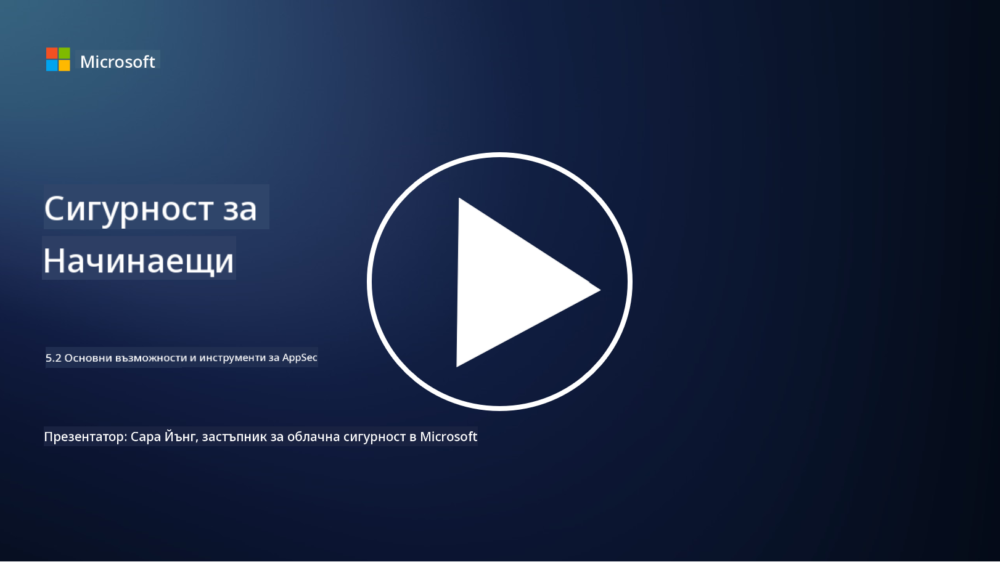

<!--
CO_OP_TRANSLATOR_METADATA:
{
  "original_hash": "790a3fa7e535ec60bb51bde13e759781",
  "translation_date": "2025-09-03T21:22:56+00:00",
  "source_file": "5.2 AppSec key capabilities.md",
  "language_code": "bg"
}
-->
## Въведение

В този урок ще разгледаме основните възможности и инструменти, които се използват за сигурността на приложенията.

## Основни възможности и инструменти за AppSec

Основните възможности и инструменти, използвани за сигурността на приложенията, са от съществено значение за идентифициране, смекчаване и предотвратяване на уязвимости и заплахи в софтуерните приложения. Ето някои от най-важните:

**1. Статично тестване на сигурността на приложенията (SAST)**:

- **Възможности**: Анализира изходния код, байткода или бинарния код, за да идентифицира уязвимости в кодовата база на приложението.

- **Инструменти**: Примери включват Fortify, Checkmarx и Veracode.

**2. Динамично тестване на сигурността на приложенията (DAST)**:

- **Възможности**: Сканира работещо приложение, за да идентифицира уязвимости чрез изпращане на входни заявки и анализиране на отговорите.

- **Инструменти**: Примери включват ZAP, Burp Suite и Qualys Web Application Scanning.

**3. Интерактивно тестване на сигурността на приложенията (IAST)**:

- **Възможности**: Комбинира елементи от SAST и DAST, за да анализира кода по време на изпълнение, предоставяйки по-точни резултати и намалявайки фалшивите положителни резултати.

- **Инструменти**: Примери включват Contrast Security и HCL AppScan.

**4. Самозащита на приложенията по време на изпълнение (RASP)**:

- **Възможности**: Наблюдава и защитава приложенията в реално време, като открива и реагира на заплахи за сигурността, докато те се случват.

- **Инструменти**: Примери включват Veracode Runtime Protection и F5 Advanced WAF с RASP.

**5. Уеб защитни стени (WAFs)**:

- **Възможности**: Осигурява защитен слой между приложението и интернет, като филтрира входящия трафик и блокира злонамерени заявки.

- **Инструменти**: Примери включват ModSecurity, AWS WAF и Akamai Kona Site Defender.

**6. Сканиране на зависимости**:

- **Възможности**: Идентифицира уязвимости в използваните от приложението библиотеки и компоненти от трети страни.

- **Инструменти**: Примери включват OWASP Dependency-Check и Snyk.

**7. Тестове за проникване (Pen Testing)**:

- **Възможности**: Симулира реални атаки, за да открие уязвимости и оцени сигурността на приложението.

- **Инструменти**: Извършва се от сертифицирани етични хакери и специалисти по сигурност, използващи различни инструменти като Metasploit и Nmap.

**8. Сканиране и анализ на сигурността**:

- **Възможности**: Сканира за известни уязвимости, грешки в конфигурацията и неправилни настройки за сигурност.

- **Инструменти**: Примери включват Nessus, Qualys Vulnerability Management и OpenVAS.

**9. Инструменти за сигурност на контейнери**:

- **Възможности**: Фокусирани върху защитата на контейнеризирани приложения и техните среди.

- **Инструменти**: Примери включват Docker Security Scanning и Aqua Security.

**10. Обучение за сигурна разработка**:

- **Възможности**: Осигурява програми за обучение и повишаване на осведомеността за екипите по разработка, за да насърчи практиките за сигурно кодиране.

- **Инструменти**: Персонализирани програми за обучение и платформи.

**11. Рамки за тестване на сигурността**:

- **Възможности**: Осигурява цялостни рамки за тестване за различни нужди на сигурността на приложенията.

- **Инструменти**: OWASP Amass, OWASP OWTF и FrAppSec.

**12. Инструменти за преглед на сигурността на кода**:

- **Възможности**: Преглежда изходния код за уязвимости и най-добри практики за кодиране.

- **Инструменти**: Примери включват SonarQube и Checkmarx.

**13. Инструменти за сигурност на API и микросервиси**:

- **Възможности**: Фокусирани върху защитата на API и микросервиси, включително автентикация, авторизация и защита на данни.

- **Инструменти**: Примери включват Apigee, AWS API Gateway и Istio.

## Допълнителна литература

- [Какво е сигурност на приложенията? Концепции, инструменти и най-добри практики | HackerOne](https://www.hackerone.com/knowledge-center/what-application-security-concepts-tools-best-practices)
- [Какво е IAST? (Интерактивно тестване на сигурността на приложенията) (comparitech.com)](https://www.comparitech.com/net-admin/what-is-iast/)
- [10 типа инструменти за тестване на сигурността на приложенията: кога и как да ги използваме (cmu.edu)](https://insights.sei.cmu.edu/blog/10-types-of-application-security-testing-tools-when-and-how-to-use-them/)
- [Промяна на баланса на риска в киберсигурността: принципи и подходи за сигурност по дизайн и по подразбиране | Cyber.gov.au](https://www.cyber.gov.au/about-us/view-all-content/publications/principles-and-approaches-for-security-by-design-and-default)

---

**Отказ от отговорност**:  
Този документ е преведен с помощта на AI услуга за превод [Co-op Translator](https://github.com/Azure/co-op-translator). Въпреки че се стремим към точност, моля, имайте предвид, че автоматизираните преводи може да съдържат грешки или неточности. Оригиналният документ на неговия роден език трябва да се счита за авторитетен източник. За критична информация се препоръчва професионален човешки превод. Не носим отговорност за недоразумения или погрешни интерпретации, произтичащи от използването на този превод.