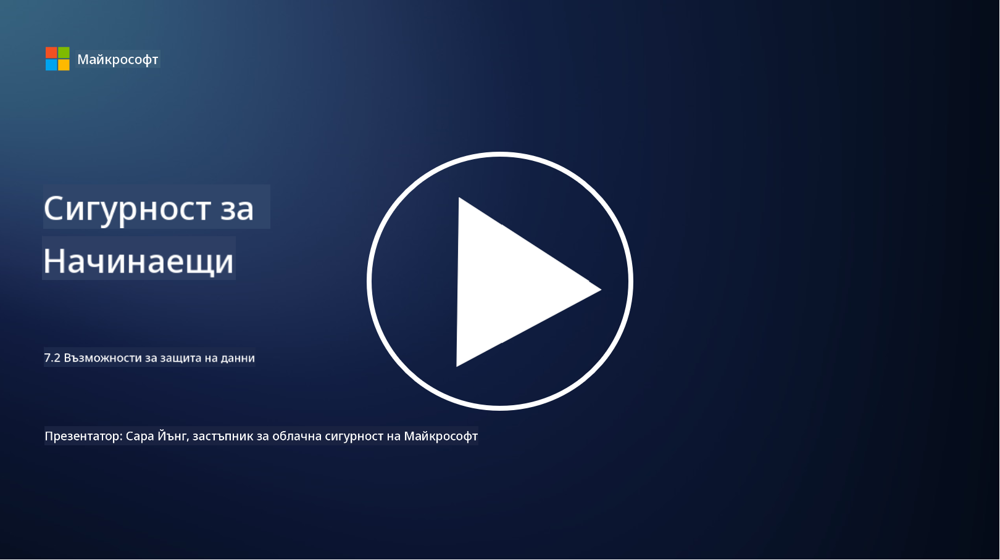

<!--
CO_OP_TRANSLATOR_METADATA:
{
  "original_hash": "50697add9758e54693442d502d2d5f8a",
  "translation_date": "2025-09-03T21:27:50+00:00",
  "source_file": "7.2 Data security capabilities.md",
  "language_code": "bg"
}
-->
# Възможности за защита на данните

В тази секция ще разгледаме повече подробности за основните инструменти и възможности, използвани за защита на данните:

**Въведение**

В този урок ще разгледаме:

- Какво представляват инструментите за предотвратяване на загуба на данни?

- Какво представляват инструментите за управление на вътрешни рискове?

- Какви инструменти за съхранение на данни са налични?

## Какво представляват инструментите за предотвратяване на загуба на данни?

Инструментите за предотвратяване на загуба на данни (Data Loss Prevention, DLP) представляват набор от софтуерни решения и технологии, предназначени да предотвратят неоторизиран достъп, споделяне или изтичане на чувствителни или конфиденциални данни в рамките на организацията. Тези инструменти използват инспекция на съдържанието, прилагане на политики и мониторинг, за да идентифицират и защитят чувствителни данни от излагане или неправомерна употреба. Примери за DLP продукти включват: Symantec Data Loss Prevention, McAfee Total Protection for Data Loss Prevention, Microsoft 365 DLP**: Интегрира се с приложенията на Microsoft 365, за да помогне на организациите да идентифицират и защитят чувствителни данни в имейли, документи и съобщения.

## Какво представляват инструментите за управление на вътрешни рискове?

Инструментите за управление на вътрешни рискове помагат на организациите да идентифицират и смекчат рисковете, породени от служители, изпълнители или партньори, които могат умишлено или неволно да компрометират сигурността на данните. Тези инструменти наблюдават поведението на потребителите, моделите на достъп и използването на данни, за да откриват подозрителни дейности и потенциални вътрешни заплахи. Примери за продукти за управление на вътрешни рискове включват: Microsoft Insider Risk Management (част от Microsoft 365), Forcepoint Insider Threat Data Protection, Varonis Insider Threat Detection.

## Какви инструменти за съхранение на данни са налични?

Инструментите за съхранение на данни включват софтуер и решения, предназначени за управление на съхранението и изтриването на данни в съответствие с политиките за съхранение на данни и законовите изисквания на организацията. Тези инструменти автоматизират процеса на съхранение на данни за определени периоди и сигурното им изтриване, когато вече не са необходими. Примери за продукти за съхранение на данни включват: Veritas Enterprise Vault, Commvault Complete Data Protection, Microsoft data lifecycle management. Тези решения помагат на организациите да поддържат контрол върху съхранението и унищожаването на данни, като осигуряват съответствие с регулациите за защита на данните и ефективно управление на данните през целия им жизнен цикъл.

## Допълнителна литература

- [Ръководство за управление на сигурността на данните (DSPM) | CSA (cloudsecurityalliance.org)](https://cloudsecurityalliance.org/blog/2023/03/31/the-big-guide-to-data-security-posture-management-dspm/)
- [Предотвратяване на загуба на данни на устройства, приложения и услуги | Microsoft Purview](https://youtu.be/hvqq8L_0kgI)
- [18 най-добри софтуерни инструменти за предотвратяване на загуба на данни за 2023 (безплатни и платени) (comparitech.com)](https://www.comparitech.com/data-privacy-management/data-loss-prevention-tools-software/)
- [Предотвратяване на загуба на данни (nist.gov)](https://tsapps.nist.gov/publication/get_pdf.cfm?pub_id=904672)
- [Научете повече за управлението на вътрешни рискове | Microsoft Learn](https://learn.microsoft.com/purview/insider-risk-management?WT.mc_id=academic-96948-sayoung)
- [Управление на жизнения цикъл на данните | IBM](https://www.ibm.com/topics/data-lifecycle-management)
- [Какво е управление на жизнения цикъл на данните (DLM)? | Най-добри практики за 2023 (selecthub.com)](https://www.selecthub.com/big-data-analytics/data-lifecycle-management/)

---

**Отказ от отговорност**:  
Този документ е преведен с помощта на AI услуга за превод [Co-op Translator](https://github.com/Azure/co-op-translator). Въпреки че се стремим към точност, моля, имайте предвид, че автоматизираните преводи може да съдържат грешки или неточности. Оригиналният документ на неговия роден език трябва да се счита за авторитетен източник. За критична информация се препоръчва професионален човешки превод. Ние не носим отговорност за недоразумения или погрешни интерпретации, произтичащи от използването на този превод.