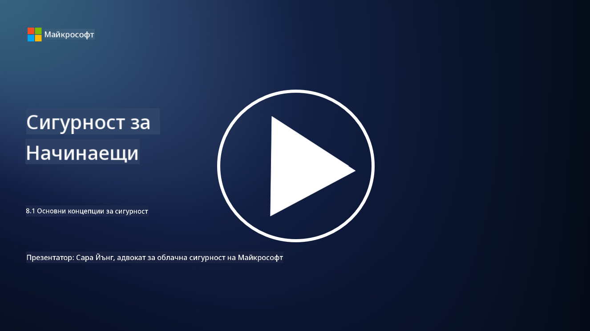

<!--
CO_OP_TRANSLATOR_METADATA:
{
  "original_hash": "66b61d96936cf25d20fcb411d4ce5227",
  "translation_date": "2025-09-03T19:40:36+00:00",
  "source_file": "8.1 AI security key concepts.md",
  "language_code": "bg"
}
-->
# Основни концепции за сигурност на AI

## Как се различава сигурността на AI от традиционната киберсигурност?

Осигуряването на сигурност за AI системи представлява уникални предизвикателства в сравнение с традиционната киберсигурност, главно заради способностите на AI за учене и вземане на решения. Ето някои ключови разлики:

-   **Цялост на данните**: AI системите силно зависят от данните за обучение. [Осигуряването на цялостта на тези данни е от решаващо значение, тъй като нападателите могат да манипулират данните, за да повлияят на поведението на AI, тактика, известна като "отравяне на данни".
-   **Сигурност на модела**: Самият модел за вземане на решения на AI може да бъде цел. [Нападателите могат да се опитат да обърнат инженерния процес на модела или да използват неговите слабости, за да предизвикат неправилни или вредни решения.
-   **Атаки с противодействие**: AI системите могат да бъдат уязвими към атаки с противодействие, при които малки, често незабележими промени в входните данни могат да доведат до грешки или неправилни прогнози.
-   **Сигурност на инфраструктурата**: Докато традиционната киберсигурност също се фокусира върху защитата на инфраструктурата, AI системите могат да имат допълнителни слоеве сложност, като облачни услуги или специализиран хардуер, които изискват специфични мерки за сигурност.
-   **Етични съображения**: Използването на AI в сигурността носи етични въпроси, като загриженост за поверителността и потенциал за пристрастия при вземане на решения, които трябва да бъдат адресирани в стратегията за сигурност.

Като цяло, осигуряването на сигурност за AI системи изисква различен подход, който отчита уникалните аспекти на AI технологията, включително защитата на данни, модели и процеса на учене на AI, като същевременно се разглеждат етичните последици от внедряването на AI.

AI сигурността и традиционната киберсигурност споделят много сходства, но също така имат някои отличителни разлики поради уникалните характеристики и способности на системите с изкуствен интелект. Ето как се различават:

- **Сложност на заплахите**: AI системите въвеждат нови слоеве сложност в киберсигурността. Традиционната киберсигурност основно се занимава със заплахи като зловреден софтуер, фишинг атаки и прониквания в мрежата. Въпреки това, AI системите могат да бъдат уязвими към атаки като атаки с противодействие, отравяне на данни и избягване на модела, които конкретно целят алгоритмите за машинно обучение.

- **Повърхност на атака**: AI системите често имат по-голяма повърхност на атака в сравнение с традиционните системи. Това е така, защото те не само разчитат на софтуер, но и на данни и модели. Нападателите могат да целят тренировъчните данни, да манипулират модели или да използват уязвимости в самите алгоритми.

- **Адаптивност на заплахите**: AI системите могат да се адаптират и учат от средата си, което може да ги направи по-уязвими към адаптивни и еволюиращи заплахи. Традиционните мерки за киберсигурност може да не са достатъчни за защита срещу атаки, които постоянно се развиват въз основа на поведението на AI системата.

- **Интерпретируемост и обяснимост**: Разбирането защо AI система е взела определено решение често е по-трудно в сравнение с традиционните софтуерни системи. Тази липса на интерпретируемост и обяснимост може да затрудни ефективното откриване и смекчаване на атаки върху AI системи.

- **Загриженост за поверителността на данните**: AI системите често разчитат на големи количества данни, което може да въведе рискове за поверителността, ако не се обработват правилно. Традиционните мерки за киберсигурност може да не адресират адекватно тези специфични за AI системите загрижености за поверителността на данните.

- **Съответствие с регулациите**: Регулаторната среда за AI сигурност все още се развива, като се появяват специфични регулации и стандарти за справяне с уникалните предизвикателства, които поставят AI системите. Традиционните рамки за киберсигурност може да се наложи да бъдат разширени или адаптирани, за да се осигури съответствие с тези нови регулации.

- **Етични съображения**: AI сигурността включва не само защита на системите от злонамерени атаки, но и осигуряване, че AI системите се използват по етичен и отговорен начин. Това включва съображения като справедливост, прозрачност и отчетност, които може да не са толкова изявени в традиционната киберсигурност.

## Как AI е подобен на осигуряването на традиционни IT системи?

Осигуряването на сигурност за AI системи споделя няколко основни принципа с традиционната киберсигурност:

-   **Защита от заплахи**: Както AI, така и традиционните системи трябва да бъдат защитени от неоторизиран достъп, модификация на данни и унищожение, както и от други общи заплахи.
-   **Управление на уязвимости**: Много уязвимости, които засягат традиционните системи, като софтуерни грешки или неправилни конфигурации, могат също да повлияят на AI системите.
-   **Сигурност на данните**: Защитата на обработваните данни е от решаващо значение и в двата случая, за да се предотвратят пробиви на данни и да се осигури конфиденциалност.
-   **Сигурност на веригата за доставки**: И двата типа системи са уязвими към атаки във веригата за доставки, при които компрометиран компонент може да подкопае сигурността на цялата система.

Тези сходства подчертават, че докато AI системите въвеждат нови предизвикателства за сигурността, те също изискват прилагането на утвърдени практики за киберсигурност, за да се осигури надеждна защита. Това е комбинация от използване на традиционната мъдрост за сигурност и адаптиране към уникалните аспекти на AI технологията.

## Допълнителна литература

 - [Not with a Bug, But with a Sticker [Book] (oreilly.com)](https://www.oreilly.com/library/view/not-with-a/9781119883982/)
   
  -  [Intro to AI Security Part 1: AI Security 101 | by HarrietHacks | Medium](https://medium.com/@harrietfarlow/intro-to-ai-security-part-1-ai-security-101-b8662a9efe5)
   
-    [Best practices for AI security risk management | Microsoft Security Blog](https://www.microsoft.com/en-us/security/blog/2021/12/09/best-practices-for-ai-security-risk-management/?WT.mc_id=academic-96948-sayoung)
   
-    [OWASP AI Security and Privacy Guide | OWASP Foundation](https://owasp.org/www-project-ai-security-and-privacy-guide/)

---

**Отказ от отговорност**:  
Този документ е преведен с помощта на AI услуга за превод [Co-op Translator](https://github.com/Azure/co-op-translator). Въпреки че се стремим към точност, моля, имайте предвид, че автоматизираните преводи може да съдържат грешки или неточности. Оригиналният документ на неговия роден език трябва да се счита за авторитетен източник. За критична информация се препоръчва професионален човешки превод. Ние не носим отговорност за недоразумения или погрешни интерпретации, произтичащи от използването на този превод.