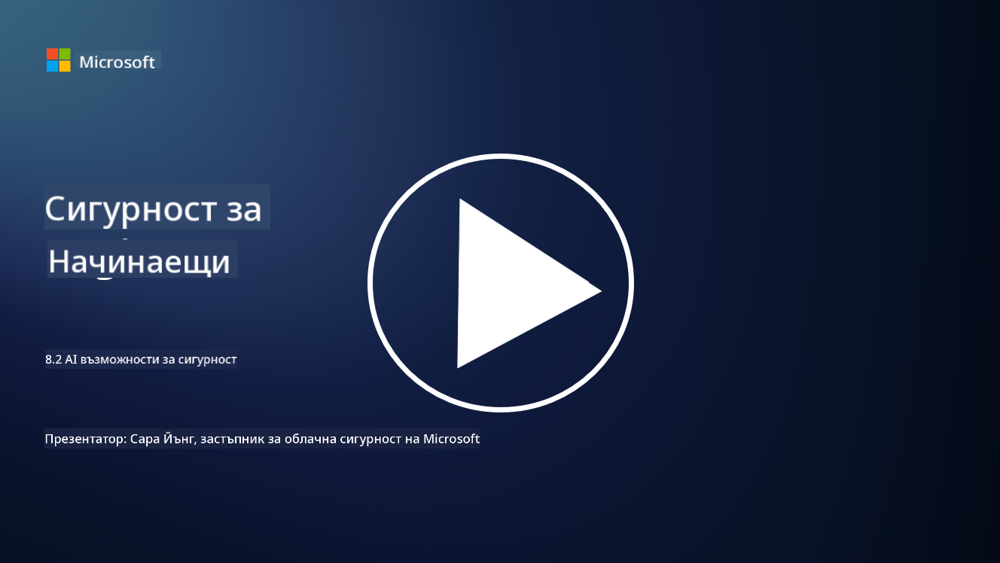

<!--
CO_OP_TRANSLATOR_METADATA:
{
  "original_hash": "b6bb7175672298d1e2f73ba7e0006f95",
  "translation_date": "2025-09-03T21:34:57+00:00",
  "source_file": "8.2 AI security capabilities.md",
  "language_code": "bg"
}
-->
# AI възможности за сигурност

## Какви инструменти и възможности имаме в момента за защита на AI системи?

В момента съществуват няколко инструмента и възможности за защита на AI системи:

-   **Counterfit**: Инструмент с отворен код за автоматизирано тестване на сигурността на AI системи, създаден да помага на организациите да провеждат оценки на рисковете за сигурността на AI и да гарантират устойчивостта на техните алгоритми.
-   **Инструменти за атакуване на машинно обучение**: Тези инструменти оценяват устойчивостта на моделите за машинно обучение срещу злонамерени атаки, като помагат за идентифициране и смекчаване на уязвимости.
-   **AI комплекти за сигурност**: Съществуват комплекти с отворен код, които предоставят ресурси за защита на AI системи, включително библиотеки и рамки за прилагане на мерки за сигурност.
-   **Платформи за сътрудничество**: Партньорства между компании и AI общности за разработване на специфични за AI скенери за сигурност и други инструменти за защита на веригата за доставки на AI.

Тези инструменти и възможности са част от нарастващото поле, посветено на подобряване на сигурността на AI системите срещу различни заплахи. Те представляват комбинация от изследвания, практически инструменти и индустриално сътрудничество, насочени към справяне с уникалните предизвикателства, които поставят AI технологиите.

## Какво представлява AI red teaming? Как се различава от традиционното red teaming за сигурност?

AI red teaming се различава от традиционното red teaming за сигурност в няколко ключови аспекта:

-   **Фокус върху AI системи**: AI red teaming се насочва към уникалните уязвимости на AI системите, като модели за машинно обучение и потоци от данни, вместо към традиционната IT инфраструктура.
-   **Тестване на поведението на AI**: Включва тестване как AI системите реагират на необичайни или неочаквани входни данни, което може да разкрие уязвимости, които биха могли да бъдат използвани от нападатели.
-   **Изследване на провалите на AI**: AI red teaming разглежда както злонамерени, така и доброкачествени провали, като взема предвид по-широк набор от сценарии и потенциални системни провали, отвъд само пробивите в сигурността.
-   **Инжектиране на команди и генериране на съдържание**: Включва тестване за провали като инжектиране на команди, при което нападателите манипулират AI системите да създават вредно или неподходящо съдържание.
-   **Етика и отговорен AI**: Част е от осигуряването на отговорен AI чрез дизайн, като гарантира, че AI системите са устойчиви срещу опити да бъдат накарани да се държат по нежелан начин.

Като цяло, AI red teaming е разширена практика, която не само обхваща тестване за уязвимости в сигурността, но също така включва тестване за други видове системни провали, специфични за AI технологиите. Това е ключова част от разработването на по-безопасни AI системи чрез разбиране и смекчаване на новите рискове, свързани с внедряването на AI.

## Допълнителна литература

 - [Microsoft AI Red Team building future of safer AI | Microsoft Security Blog](https://www.microsoft.com/en-us/security/blog/2023/08/07/microsoft-ai-red-team-building-future-of-safer-ai/?WT.mc_id=academic-96948-sayoung)
 - [Announcing Microsoft’s open automation framework to red team generative AI Systems | Microsoft Security Blog](https://www.microsoft.com/en-us/security/blog/2024/02/22/announcing-microsofts-open-automation-framework-to-red-team-generative-ai-systems/?WT.mc_id=academic-96948-sayoung)
 - [AI Security Tools: The Open-Source Toolkit | Wiz](https://www.wiz.io/academy/ai-security-tools)

---

**Отказ от отговорност**:  
Този документ е преведен с помощта на AI услуга за превод [Co-op Translator](https://github.com/Azure/co-op-translator). Въпреки че се стремим към точност, моля, имайте предвид, че автоматизираните преводи може да съдържат грешки или неточности. Оригиналният документ на неговия роден език трябва да се счита за авторитетен източник. За критична информация се препоръчва професионален човешки превод. Ние не носим отговорност за каквито и да е недоразумения или погрешни интерпретации, произтичащи от използването на този превод.