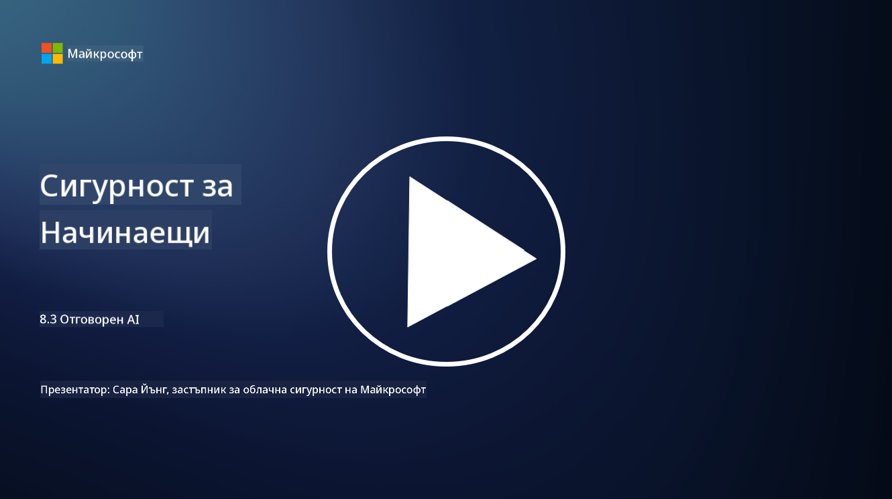

<!--
CO_OP_TRANSLATOR_METADATA:
{
  "original_hash": "5e9775ee91bde7d44577891d5f11c4c5",
  "translation_date": "2025-09-03T20:44:47+00:00",
  "source_file": "8.3 Responsible AI.md",
  "language_code": "bg"
}
-->
# Отговорен AI

## Какво е отговорен AI и как се свързва със сигурността на AI?

Отговорният AI се отнася до разработването и използването на изкуствен интелект по начин, който е етичен, прозрачен и съответства на обществените ценности. Той включва принципи като справедливост, отчетност и устойчивост, като гарантира, че AI системите са проектирани и управлявани така, че да носят ползи за индивидите, общностите и обществото като цяло.

Връзката между отговорния AI и сигурността на AI е значителна, защото:

-   **Етични съображения**: Отговорният AI включва етични съображения, които пряко влияят на сигурността, като защита на личните данни и поверителност. Гарантирането, че AI системите уважават личната информация и защитават данните, е ключов аспект на отговорния AI.
-   **Устойчивост и надеждност**: AI системите трябва да бъдат устойчиви срещу манипулации и атаки, което е основен принцип както на отговорния AI, така и на сигурността на AI. Това включва защита срещу злонамерени атаки и осигуряване на интегритета на процесите за вземане на решения от AI.
-   **Прозрачност и обяснимост**: Част от отговорния AI е гарантирането, че AI системите са прозрачни и техните решения могат да бъдат обяснени. Това е от решаващо значение за сигурността, тъй като заинтересованите страни трябва да разбират как работят AI системите, за да им се доверят.
-   **Отчетност**: AI системите трябва да бъдат отговорни за своите действия, което означава, че трябва да има механизми за проследяване на решенията и коригиране на проблеми. Това съответства на практиките за сигурност, които наблюдават и одитират дейностите на системата, за да предотвратят и реагират на нарушения.

В същността си, отговорният AI и сигурността на AI са взаимосвързани, като практиките на отговорния AI подобряват сигурността на AI системите и обратното. Прилагането на принципите на отговорния AI помага за създаването на AI системи, които са не само етично издържани, но и по-сигурни срещу потенциални заплахи.

## Как мога да гарантирам, че моята AI система е едновременно сигурна и етична?

Гарантирането, че вашата AI система е едновременно сигурна и етична, изисква многостранен подход, който включва следните стъпки:

- **Придържайте се към етични принципи**: Следвайте установени етични насоки, които акцентират върху благосъстоянието на хората, обществото и околната среда; справедливост; защита на личните данни; надеждност; прозрачност; възможност за оспорване; и отчетност.

- **Прилагайте устойчиви мерки за сигурност**: Използвайте проактивно тестване на сигурността и програми за управление на доверие, рискове и сигурност на AI, за да се защитите от заплахи и уязвимости.

- **Ангажирайте разнообразни заинтересовани страни**: Включете широк кръг участници в процеса на разработване на AI, включително етици, социални учени и представители на засегнатите общности, за да гарантирате, че се вземат предвид различни перспективи и ценности.

- **Осигурете прозрачност и обяснимост**: Уверете се, че процесите за вземане на решения на AI са прозрачни и могат да бъдат обяснени, което позволява по-голямо доверие и по-лесно идентифициране на потенциални пристрастия или грешки.

- **Поддържайте поверителност на данните**: Защитете поверителността и автентичността на данните чрез криптиране и други мерки за защита на данните, за да уважите правата на потребителите.

- **Позволете човешки надзор**: Внедрете механизми за човешки надзор, които да позволяват оспорване на решенията, взети от AI системите, и да гарантират отчетност.

- **Бъдете информирани за безопасността на AI**: Следете последните изследвания и дискусии относно безопасността на AI, за да разберете променящия се пейзаж на сигурността и етиката на AI.

- **Спазвайте регулациите**: Уверете се, че вашата AI система спазва всички приложими закони и регулации, които могат да включват закони за защита на данните, закони против дискриминация и специфични за индустрията насоки.

## Можете ли да дадете примери за проблеми със сигурността, причинени от неетично използване на AI?

Ето някои примери за проблеми със сигурността, които могат да възникнат от неетично използване на AI:

- **Пристрастно вземане на решения**: AI системите могат да възпроизвеждат и усилват съществуващи пристрастия, ако са обучени върху пристрастни набори от данни. Например, ако търсачка е обучена върху данни, които отразяват обществени стереотипи, тя може да показва пристрастни резултати от търсенето, което води до несправедливо отношение или дискриминация.

- **AI в съдебните системи**: Използването на AI в правни решения може да повдигне етични въпроси, особено ако процесът на вземане на решения от AI липсва прозрачност или е повлиян от пристрастни данни. Това може да доведе до несправедливи правни резултати и нарушаване на правата на индивидите.

- **Манипулация на AI системи**: AI системите могат да бъдат уязвими към злонамерени атаки, при които малки промени в входните данни могат да доведат до неправилни резултати. Например, автономни превозни средства могат да бъдат подведени да интерпретират неправилно пътни знаци, което води до рискове за безопасността.

- **AI-задвижвано наблюдение**: Използването на AI за наблюдение може да доведе до нарушения на поверителността, особено ако се използва без подходящо съгласие или по начини, които нарушават индивидуалните свободи. Това може да бъде особено проблематично в авторитарни режими, които могат да използват AI за наблюдение и потискане на несъгласие.

Тези примери подчертават важността на етичните съображения при разработването и внедряването на AI системи, за да се предотвратят проблеми със сигурността и да се защитят правата и поверителността на индивидите.

## Допълнителна литература

 - [Microsoft Responsible AI Standard v2 General Requirements](https://query.prod.cms.rt.microsoft.com/cms/api/am/binary/RE5cmFl?culture=en-us&country=us&WT.mc_id=academic-96948-sayoung)
 - [Responsible AI (mit.edu)](https://sloanreview.mit.edu/big-ideas/responsible-ai/)
 - [13 Principles for Using AI Responsibly (hbr.org)](https://hbr.org/2023/06/13-principles-for-using-ai-responsibly)

---

**Отказ от отговорност**:  
Този документ е преведен с помощта на AI услуга за превод [Co-op Translator](https://github.com/Azure/co-op-translator). Въпреки че се стремим към точност, моля, имайте предвид, че автоматизираните преводи може да съдържат грешки или неточности. Оригиналният документ на неговия роден език трябва да се счита за авторитетен източник. За критична информация се препоръчва професионален човешки превод. Ние не носим отговорност за каквито и да е недоразумения или погрешни интерпретации, произтичащи от използването на този превод.