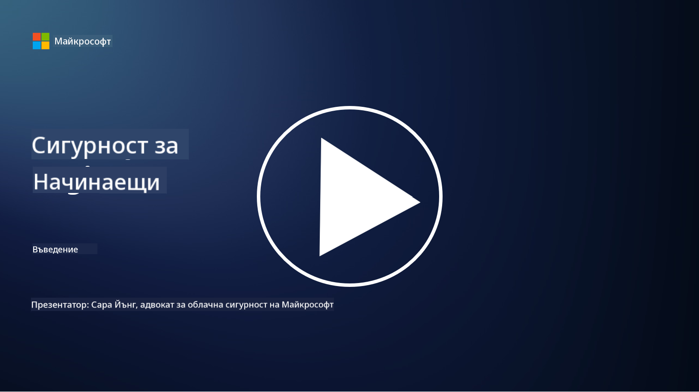

<!--
CO_OP_TRANSLATOR_METADATA:
{
  "original_hash": "0f9381fb23638f9341416474ce3c1563",
  "translation_date": "2025-09-03T19:47:12+00:00",
  "source_file": "README.md",
  "language_code": "bg"
}
-->
  
  
  
  
  
  

# 🚀 Киберсигурност за начинаещи – учебна програма  

В тази бързо променяща се епоха на внедряване на AI технологии е още по-важно да разберем как да защитим IT системите. Този курс е създаден, за да ви научи на основни концепции за киберсигурност и да ви помогне да започнете своето обучение в тази област. Курсът е независим от конкретни доставчици и е разделен на кратки уроци, които отнемат около 30-60 минути за завършване. Всеки урок включва кратък тест и връзки към допълнителни материали, ако искате да задълбочите знанията си по темата.  

  

Какво обхваща този курс 📚  

- 🔐 Основни концепции за киберсигурност като триадата CIA, разликите между рискове, заплахи и други.  
- 🛡️ Разбиране на това какво представлява контролът за сигурност и какви форми може да приеме.  
- 🌐 Разбиране на концепцията за "нулево доверие" и защо тя е важна в съвременната киберсигурност.  
- 🔑 Разбиране на ключови концепции и теми, свързани с идентичност, мрежи, операции по сигурност, инфраструктура и защита на данни.  
- 🔧 Примери за инструменти, използвани за внедряване на контроли за сигурност.  

Какво този курс не обхваща 🙅‍♂️  

- 🚫 Как да използвате конкретни инструменти за сигурност.  
- 🚫 Как да "хаквате" или да извършвате тестове за проникване/офанзивна сигурност.  
- 🚫 Обучение за конкретни стандарти за съответствие.  

  

След като завършите този курс, можете да преминете към някои от модулите на Microsoft Learn. Препоръчваме да продължите обучението си с [Microsoft Security, Compliance, and Identity Fundamentals.](https://learn.microsoft.com/training/paths/describe-concepts-of-security-compliance-identity/?WT.mc_id=academic-96948-sayoung)  

В крайна сметка можете да обмислите явяване на [Exam SC-900: Microsoft Security, Compliance, and Identity Fundamentals exam.](https://learn.microsoft.com/credentials/certifications/exams/sc-900/?WT.mc_id=academic-96948-sayoung)  

> 💁 Ако имате обратна връзка или предложения за този курс и съдържание, което според вас липсва, ще се радваме да чуем вашето мнение!  

## Преглед на модулите 📝  
| **Номер на модула** | **Име на модула**                        | **Преподавани концепции**            | **Цели на обучението**                                                                                          |  
|---------------------|------------------------------------------|--------------------------------------|-----------------------------------------------------------------------------------------------------------------|  
| **1.1**             | Основни концепции за сигурност           | [Триадата CIA](https://github.com/microsoft/Security-101/blob/main/1.1%20The%20CIA%20triad%20and%20other%20key%20concepts.md)                        | Научете за конфиденциалност, наличност и интегритет. Също така автентичност, непреодолимост и поверителност.     |  
| **1.2**             | Основни концепции за сигурност           | [Често срещани заплахи за киберсигурността](https://github.com/microsoft/Security-101/blob/main/1.2%20Common%20cybersecurity%20threats.md)        | Научете за често срещаните заплахи за киберсигурността, пред които са изправени хора и организации.              |  
| **1.3**             | Основни концепции за сигурност           | [Разбиране на управлението на риска](https://github.com/microsoft/Security-101/blob/main/1.3%20Understanding%20risk%20management.md)       | Научете за оценка и разбиране на риска – въздействие/вероятност и внедряване на контроли.                                                                                                               | |  
| **1.4**             | Основни концепции за сигурност           | [Практики за сигурност и документация](https://github.com/microsoft/Security-101/blob/main/1.4%20Security%20practices%20and%20documentation.md) | Научете за разликата между политики, процедури, стандарти и регулации/закони.                                   |  
| **1.5**             | Основни концепции за сигурност           | [Нулево доверие](https://github.com/microsoft/Security-101/blob/main/1.5%20Zero%20trust.md)                           | Научете какво е "нулево доверие" и как влияе на архитектурата. Какво е защита в дълбочина?                      |  
| **1.6**             | Основни концепции за сигурност           | [Модел на споделена отговорност](https://github.com/microsoft/Security-101/blob/main/1.6%20Shared%20responsibility%20model.md)                           | Какво представлява моделът на споделена отговорност и как влияе на киберсигурността?                            |  
| **1.7**             | [Край на теста за модула](https://github.com/microsoft/Security-101/blob/main/1.7%20End%20of%20module%20quiz.md)                        |                                      |                                                                                                                 |  
| **2.1**             | Основи на управление на идентичност и достъп | [Ключови концепции на IAM](https://github.com/microsoft/Security-101/blob/main/2.1%20IAM%20key%20concepts.md)                     | Научете за принципа на минимални привилегии, разделение на задълженията, как IAM поддържа "нулево доверие".     |  
| **2.2**             | Основи на управление на идентичност и достъп | [Архитектура на IAM с нулево доверие](https://github.com/microsoft/Security-101/blob/main/2.2%20IAM%20zero%20trust%20architecture.md)          | Научете как идентичността е новата периферия за съвременните IT среди и заплахите, които тя смекчава.            |  
| **2.3**             | Основи на управление на идентичност и достъп | [Възможности на IAM](https://github.com/microsoft/Security-101/blob/main/2.3%20IAM%20capabilities.md)                     | Научете за възможностите и контролите на IAM за защита на идентичности.                                         |  
| **2.4**             | [Край на теста за модула](https://github.com/microsoft/Security-101/blob/main/2.4%20End%20of%20module%20quiz.md)                        |                                      |                                                                                                                 |  
| **3.1**             | Основи на мрежова сигурност              | [Ключови концепции за мрежи](https://github.com/microsoft/Security-101/blob/main/3.1%20Networking%20key%20concepts.md)              | Научете за концепции за мрежи (IP адресиране, портове, криптиране и др.).                                       |  
| **3.2**             | Основи на мрежова сигурност              | [Архитектура на мрежи с нулево доверие](https://github.com/microsoft/Security-101/blob/main/3.2%20Networking%20zero%20trust%20architecture.md)   | Научете как мрежите допринасят за цялостна архитектура с нулево доверие и заплахите, които тя смекчава.         |  
| **3.3**             | Основи на мрежова сигурност              | [Възможности за мрежова сигурност](https://github.com/microsoft/Security-101/blob/main/3.3%20Network%20security%20capabilities.md)        | Научете за инструменти за мрежова сигурност – защитни стени, WAF, защита от DDoS и др.                          |  
| **3.4**             | [Край на теста за модула](https://github.com/microsoft/Security-101/blob/main/3.4%20End%20of%20module%20quiz.md)                        |                                      |                                                                                                                 |  
| **4.1**             | Основи на операции по сигурност          | [Ключови концепции за SecOps](https://github.com/microsoft/Security-101/blob/main/4.1%20SecOps%20key%20concepts.md)                  | Научете защо операциите по сигурност са важни и как се различават от нормалните IT операции.                    |  
| **4.2**             | Основи на операции по сигурност          | [Архитектура на SecOps с нулево доверие](https://github.com/microsoft/Security-101/blob/main/4.2%20SecOps%20zero%20trust%20architecture.md)       | Научете как SecOps допринася за цялостна архитектура с нулево доверие и заплахите, които тя смекчава.           |  
| **4.3**             | Основи на операции по сигурност          | [Възможности на SecOps](https://github.com/microsoft/Security-101/blob/main/4.3%20SecOps%20capabilities.md)                  | Научете за инструменти за SecOps – SIEM, XDR и др.                                                              |  
| **4.4**             | [Край на теста за модула](https://github.com/microsoft/Security-101/blob/main/4.4%20End%20of%20module%20quiz.md)                        |                                      |                                                                                                                 |  
| **5.1**             | Основи на сигурност на приложения        | [Ключови концепции за AppSec](https://github.com/microsoft/Security-101/blob/main/5.1%20AppSec%20key%20concepts.md)                  | Научете за концепции за AppSec като сигурност по дизайн, валидиране на входни данни и др.                       |  
| **5.2**             | Основи на сигурност на приложения        | [Възможности на AppSec](https://github.com/microsoft/Security-101/blob/main/5.2%20AppSec%20key%20capabilities.md)                  | Научете за инструменти за AppSec: инструменти за сигурност на тръбопроводи, сканиране на код, сканиране на тайни и др. |  
| **5.3**             | [Край на теста за модула](https://github.com/microsoft/Security-101/blob/main/5.3%20End%20of%20module%20quiz.md)                        |                                      |                                                                                                                 |  
| **6.1**             | Основи на сигурност на инфраструктурата  | [Ключови концепции за сигурност на инфраструктурата](https://github.com/microsoft/Security-101/blob/main/6.1%20Infrastructure%20security%20key%20concepts.md) | Научете за укрепване на системи, обновяване, хигиена на сигурността, сигурност на контейнери.                   |  
| **6.2**             | Основи на сигурност на инфраструктурата  | [Възможности за сигурност на инфраструктурата](https://github.com/microsoft/Security-101/blob/main/6.2%20Infrastructure%20security%20capabilities.md) | Научете за инструменти, които могат да помогнат за сигурността на инфраструктурата, напр. CSPM, сигурност на контейнери и др. |  
| **6.3**             | [Край на теста за модула](https://github.com/microsoft/Security-101/blob/main/6.3%20End%20of%20module%20quiz.md)                        |                                      |                                                                                                                 |  
| **7.1**             | Основи на сигурност на данни             | [Ключови концепции за сигурност на данни](https://github.com/microsoft/Security-101/blob/main/7.1%20Data%20security%20key%20concepts.md)           | Научете за класификация и съхранение на данни и защо това е важно за организацията.                              |  
| **7.2**             | Основи на сигурност на данни             | [Възможности за сигурност на данни](https://github.com/microsoft/Security-101/blob/main/7.2%20Data%20security%20capabilities.md)           | Научете за инструменти за сигурност на данни – DLP, управление на вътрешни рискове, управление на данни и др.   |  
| **7.3**             | [Край на теста за модула](https://github.com/microsoft/Security-101/blob/main/7.3%20End%20of%20module%20quiz.md)                        |                                      |                                                                                                                 |  
| **8.1**             | Основи на сигурност на AI                | [Ключови концепции за сигурност на AI](https://github.com/microsoft/Security-101/blob/main/8.1%20AI%20security%20key%20concepts.md)          | Научете за разликите и приликите между традиционната сигурност и сигурността на AI.                              |  
| **8.2**             | Основи на сигурност на AI                | [Възможности за сигурност на AI](https://github.com/microsoft/Security-101/blob/main/8.2%20AI%20security%20capabilities.md)           | Научете за инструменти за сигурност на AI и контролите, които могат да се използват за защита на AI.             |  
| **8.3**             | Основи на сигурност на AI                | [Отговорен AI](https://github.com/microsoft/Security-101/blob/main/8.3%20Responsible%20AI.md)          | Научете какво представлява отговорният AI и специфичните вреди, които специалистите по сигурност трябва да имат предвид. |  
| **8.4**             | [Край на теста за модула](https://github.com/microsoft/Security-101/blob/main/8.4%20End%20of%20module%20quiz.md)                        |                                      |                                                                                                                 |  

## 🎒 Други курсове  

Нашият екип създава и други курсове! Вижте:  

- [Генеративен AI за начинаещи](https://aka.ms/genai-beginners)  
- [Генеративен AI за начинаещи .NET](https://github.com/microsoft/Generative-AI-for-beginners-dotnet)  
- [Генеративен AI с JavaScript](https://github.com/microsoft/generative-ai-with-javascript)  
- [Генеративен AI с Java](https://github.com/microsoft/Generative-AI-for-beginners-java)  
- [AI за начинаещи](https://aka.ms/ai-beginners)  
- [Наука за данни за начинаещи](https://aka.ms/datascience-beginners)  
- [Машинно обучение за начинаещи](https://aka.ms/ml-beginners)  
- [Киберсигурност за начинаещи](https://github.com/microsoft/Security-101)  
- [Уеб разработка за начинаещи](https://aka.ms/webdev-beginners)  
- [IoT за начинаещи](https://aka.ms/iot-beginners)  
- [XR разработка за начинаещи](https://github.com/microsoft/xr-development-for-beginners)  
- [Овладяване на GitHub Copilot за съвместно програмиране](https://github.com/microsoft/Mastering-GitHub-Copilot-for-Paired-Programming)  
- [Овладяване на GitHub Copilot за разработчици на C#/.NET](https://github.com/microsoft/mastering-github-copilot-for-dotnet-csharp-developers)  
- [Избери своето приключение с Copilot](https://github.com/microsoft/CopilotAdventures)  

---

**Отказ от отговорност**:  
Този документ е преведен с помощта на AI услуга за превод [Co-op Translator](https://github.com/Azure/co-op-translator). Въпреки че се стремим към точност, моля, имайте предвид, че автоматизираните преводи може да съдържат грешки или неточности. Оригиналният документ на неговия роден език трябва да се счита за авторитетен източник. За критична информация се препоръчва професионален човешки превод. Ние не носим отговорност за недоразумения или погрешни интерпретации, произтичащи от използването на този превод.