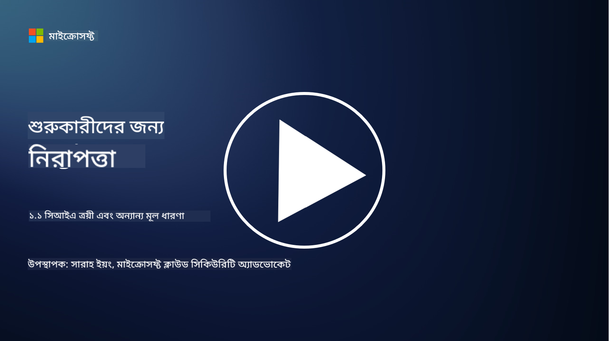
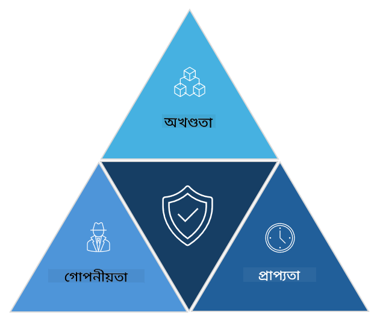

<!--
CO_OP_TRANSLATOR_METADATA:
{
  "original_hash": "16a76f9fa372fb63cffb6d76b855f023",
  "translation_date": "2025-09-03T21:38:33+00:00",
  "source_file": "1.1 The CIA triad and other key concepts.md",
  "language_code": "bn"
}
-->
# সিআইএ ট্রায়াড এবং অন্যান্য গুরুত্বপূর্ণ ধারণা

## পরিচিতি

এই পাঠে আমরা আলোচনা করব:

 - সাইবার নিরাপত্তা কী?

 - সাইবার নিরাপত্তার সিআইএ ট্রায়াড কী?

 - সাইবার নিরাপত্তার প্রেক্ষাপটে প্রামাণিকতা, অস্বীকৃতি এবং গোপনীয়তা কী?

## সাইবার নিরাপত্তা কী?

সাইবার নিরাপত্তা, যা তথ্য নিরাপত্তা নামেও পরিচিত, হল কম্পিউটার সিস্টেম, নেটওয়ার্ক, ডিভাইস এবং ডেটাকে ডিজিটাল আক্রমণ, অননুমোদিত প্রবেশ, ক্ষতি বা চুরির হাত থেকে রক্ষা করার প্রক্রিয়া। সাইবার নিরাপত্তার প্রধান লক্ষ্য হল ডিজিটাল সম্পদ এবং তথ্যের গোপনীয়তা, অখণ্ডতা এবং প্রাপ্যতা নিশ্চিত করা। সাইবার নিরাপত্তা বিশেষজ্ঞরা সম্পদ, ডেটা এবং তথ্য রক্ষার জন্য সুরক্ষা নিয়ন্ত্রণ ডিজাইন এবং বাস্তবায়ন করেন। আমাদের জীবনের আরও বেশি অংশ ডিজিটাল এবং অনলাইনে পরিণত হওয়ায়, সাইবার নিরাপত্তা ব্যক্তিগত ব্যক্তি এবং সংস্থার জন্য একটি শীর্ষ উদ্বেগের বিষয় হয়ে উঠেছে।

## সাইবার নিরাপত্তার সিআইএ ট্রায়াড কী?

সাইবার নিরাপত্তার ট্রায়াড হল একটি মডেল যা সাইবার নিরাপত্তার কাজ বা সিস্টেম/পরিবেশ ডিজাইন করার জন্য তিনটি প্রধান বিষয়কে অন্তর্ভুক্ত করে:

### গোপনীয়তা

এটি সেই বিষয় যা বেশিরভাগ মানুষ "সাইবার নিরাপত্তা" ভাবলে পরিচিত মনে করে: গোপনীয়তা হল ডেটা এবং তথ্যকে অননুমোদিত প্রবেশের প্রচেষ্টা থেকে রক্ষা করার প্রক্রিয়া, অর্থাৎ শুধুমাত্র যাদের তথ্য দেখার প্রয়োজন আছে তারাই এটি অ্যাক্সেস করতে পারে। তবে সব ডেটা সমানভাবে তৈরি হয় না, এবং ডেটা সাধারণত শ্রেণীবদ্ধ এবং সুরক্ষিত হয় এই ভিত্তিতে যে এটি ভুল মানুষের দ্বারা অ্যাক্সেস করা হলে কতটা ক্ষতি হতে পারে।

### অখণ্ডতা

এটি পরিবেশে থাকা ডেটার সঠিকতা এবং বিশ্বাসযোগ্যতা রক্ষা করার বিষয় এবং অননুমোদিত ব্যক্তিদের দ্বারা ডেটা পরিবর্তন বা সংশোধন করতে না দেওয়া। উদাহরণস্বরূপ, একজন ছাত্র ডিএমভি-তে তাদের ড্রাইভার রেকর্ডে জন্ম তারিখ পরিবর্তন করে তাদের বয়স বেশি দেখানোর জন্য যাতে তারা মদ কেনার জন্য আগের জন্ম তারিখ সহ লাইসেন্স পুনর্মুদ্রণ করতে পারে।

### প্রাপ্যতা

এটি অপারেশনাল আইটি জুড়ে একটি গুরুত্বপূর্ণ বিষয়, তবে সাইবার নিরাপত্তার জন্যও প্রাপ্যতা গুরুত্বপূর্ণ। এমন কিছু নির্দিষ্ট ধরনের আক্রমণ আছে যা প্রাপ্যতাকে লক্ষ্য করে এবং সুরক্ষা বিশেষজ্ঞদের এগুলোর বিরুদ্ধে সুরক্ষা দিতে হয় (যেমন, ডিস্ট্রিবিউটেড ডিনায়াল অফ সার্ভিস – DDoS – আক্রমণ)।

**সাইবার নিরাপত্তার সিআইএ ট্রায়াড**

## সাইবার নিরাপত্তার প্রেক্ষাপটে প্রামাণিকতা, অস্বীকৃতি এবং গোপনীয়তা কী?

এগুলি সিস্টেম এবং ডেটার নিরাপত্তা এবং বিশ্বাসযোগ্যতা নিশ্চিত করার সাথে সম্পর্কিত অতিরিক্ত গুরুত্বপূর্ণ ধারণা:

**প্রামাণিকতা** - এটি সেই নিশ্চয়তা প্রদান করে যে আপনি যে তথ্য, যোগাযোগ বা সত্তার সাথে যোগাযোগ করছেন তা আসল এবং এটি অননুমোদিত পক্ষ দ্বারা পরিবর্তিত বা সংশোধিত হয়নি।

**অস্বীকৃতি** - এটি এমন একটি ধারণা যা নিশ্চিত করে যে কোনো পক্ষ তাদের অংশগ্রহণ বা কোনো লেনদেন বা যোগাযোগের প্রামাণিকতা অস্বীকার করতে পারে না। এটি কাউকে এই দাবি করতে বাধা দেয় যে তারা কোনো বার্তা পাঠায়নি বা কোনো নির্দিষ্ট কাজ করেনি যখন এর বিপরীতে প্রমাণ থাকে।

**গোপনীয়তা** - এটি সংবেদনশীল এবং ব্যক্তিগতভাবে শনাক্তযোগ্য তথ্যকে অননুমোদিত প্রবেশ, ব্যবহার, প্রকাশ বা পরিবর্তন থেকে রক্ষা করার বিষয়। এটি ব্যক্তিগত ডেটা কে অ্যাক্সেস করতে পারে এবং সেই ডেটা কীভাবে সংগ্রহ, সংরক্ষণ এবং শেয়ার করা হয় তা নিয়ন্ত্রণের সাথে সম্পর্কিত।

## অতিরিক্ত পাঠ্য

[তথ্য নিরাপত্তা (InfoSec) কী? | Microsoft Security](https://www.microsoft.com/security/business/security-101/what-is-information-security-infosec#:~:text=Three%20pillars%20of%20information%20security%3A%20the%20CIA%20triad,as%20guiding%20principles%20for%20implementing%20an%20InfoSec%20plan.)

---

**অস্বীকৃতি**:  
এই নথিটি AI অনুবাদ পরিষেবা [Co-op Translator](https://github.com/Azure/co-op-translator) ব্যবহার করে অনুবাদ করা হয়েছে। আমরা যথাসম্ভব সঠিক অনুবাদ প্রদানের চেষ্টা করি, তবে অনুগ্রহ করে মনে রাখবেন যে স্বয়ংক্রিয় অনুবাদে ত্রুটি বা অসঙ্গতি থাকতে পারে। মূল ভাষায় থাকা নথিটিকে প্রামাণিক উৎস হিসেবে বিবেচনা করা উচিত। গুরুত্বপূর্ণ তথ্যের জন্য, পেশাদার মানব অনুবাদ সুপারিশ করা হয়। এই অনুবাদ ব্যবহারের ফলে কোনো ভুল বোঝাবুঝি বা ভুল ব্যাখ্যা হলে আমরা দায়বদ্ধ থাকব না।