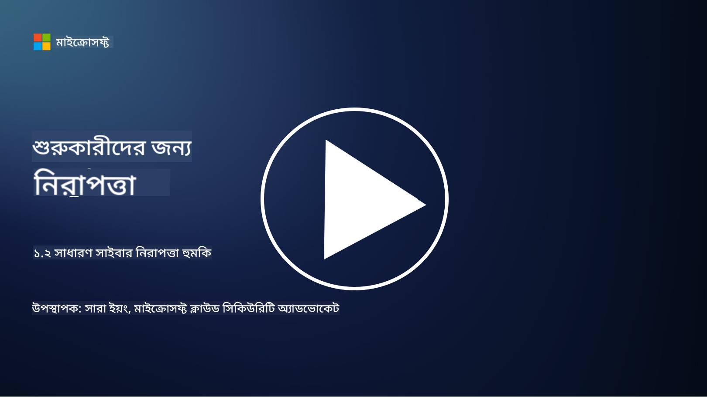

<!--
CO_OP_TRANSLATOR_METADATA:
{
  "original_hash": "6fc3030323139d7134a4ca9d03eccac9",
  "translation_date": "2025-09-03T20:09:17+00:00",
  "source_file": "1.2 Common cybersecurity threats.md",
  "language_code": "bn"
}
-->
# সাধারণ সাইবার নিরাপত্তা হুমকি

## ভূমিকা

এই পাঠে আমরা আলোচনা করব:

- সাইবার নিরাপত্তা হুমকি কী?

- ক্ষতিকারক ব্যক্তিরা কেন ডেটা এবং আইটি সিস্টেমের ক্ষতি করতে চায়?

- সবচেয়ে সাধারণ সাইবার নিরাপত্তা হুমকি কী কী?

- MITRE ATT&CK ফ্রেমওয়ার্ক কী?

- সাইবার নিরাপত্তা হুমকির বর্তমান পরিস্থিতি সম্পর্কে কোথায় আপডেট থাকা যায়?

## সাইবার নিরাপত্তা হুমকি কী?

সাইবার নিরাপত্তা হুমকি বলতে এমন কোনো সম্ভাব্য বিপদ বা ঝুঁকিকে বোঝায় যা ডেটা বা আইটি সিস্টেমের গোপনীয়তা, অখণ্ডতা বা প্রাপ্যতাকে ক্ষতিগ্রস্ত করতে পারে। এই হুমকিগুলি ক্ষতিকারক ব্যক্তিদের দ্বারা সৃষ্টি হয় যারা দুর্বলতাগুলি কাজে লাগিয়ে অননুমোদিত প্রবেশ, সংবেদনশীল তথ্য চুরি, কার্যক্রম ব্যাহত করা বা ব্যক্তি, প্রতিষ্ঠান বা এমনকি পুরো জাতির ক্ষতি করার চেষ্টা করে। সাইবার নিরাপত্তা হুমকি বিভিন্ন রূপ নিতে পারে এবং ডিজিটাল সিস্টেম ও ডেটার বিভিন্ন দিককে লক্ষ্য করতে পারে।

## ক্ষতিকারক ব্যক্তিরা কেন ডেটা এবং আইটি সিস্টেমের ক্ষতি করতে চায়?

ক্ষতিকারক ব্যক্তিরা বিভিন্ন কারণে ডেটা এবং আইটি সিস্টেমের ক্ষতি করে, যা সাধারণত ব্যক্তিগত লাভ, আদর্শগত উদ্দেশ্য বা বিশৃঙ্খলা সৃষ্টি করার ইচ্ছা দ্বারা চালিত হয়। এই উদ্দেশ্যগুলি বোঝা প্রতিষ্ঠান এবং ব্যক্তিদের সাইবার হুমকির বিরুদ্ধে আরও ভালোভাবে রক্ষা করতে সাহায্য করতে পারে। ক্ষতিকারক ব্যক্তিরা সাইবার আক্রমণে জড়িত হওয়ার কিছু সাধারণ কারণ হলো:

1. **আর্থিক লাভ**: অনেক আক্রমণ অর্থনৈতিক লাভের উদ্দেশ্যে চালিত হয়। ক্ষতিকারক ব্যক্তিরা ক্রেডিট কার্ড নম্বর, ব্যাংক অ্যাকাউন্টের বিবরণ বা ব্যক্তিগত পরিচয় তথ্য চুরি করে প্রতারণা, পরিচয় চুরি, মুক্তিপণ দাবি বা চুরি করা ডেটা ডার্ক ওয়েবে বিক্রি করতে পারে।

2. **গুপ্তচরবৃত্তি**: রাষ্ট্র, প্রতিযোগী বা অন্যান্য সংস্থা রাজনৈতিক, অর্থনৈতিক বা সামরিক সুবিধার জন্য সংবেদনশীল সরকারী, কর্পোরেট বা গবেষণা ডেটা চুরি করতে সাইবার গুপ্তচরবৃত্তি চালাতে পারে।

3. **বিঘ্ন এবং ধ্বংস**: কিছু আক্রমণের লক্ষ্য হলো রাজনৈতিক বা আদর্শগত কারণে গুরুত্বপূর্ণ অবকাঠামো, পরিষেবা বা কার্যক্রম ব্যাহত করা। এই ধরনের আক্রমণ ব্যাপক বিশৃঙ্খলা, আর্থিক ক্ষতি এবং সুনাম নষ্ট করতে পারে।

4. **আদর্শগত উদ্দেশ্য**: হ্যাকটিভিস্ট এবং আদর্শগত বা রাজনৈতিক উদ্দেশ্যসম্পন্ন গোষ্ঠীগুলি নির্দিষ্ট বিষয় সম্পর্কে সচেতনতা বাড়াতে, তাদের বিশ্বাস প্রচার করতে বা নির্দিষ্ট কার্যক্রম বা সংস্থার বিরুদ্ধে প্রতিবাদ করতে সিস্টেমের ক্ষতি করতে পারে।

5. **অনিচ্ছাকৃত কার্যক্রম**: সব ক্ষতিকারক কার্যক্রম ইচ্ছাকৃত নয়; কিছু ব্যক্তি সামাজিক প্রকৌশলের শিকার হয়ে বা একটি ক্ষতিগ্রস্ত নেটওয়ার্কের অংশ হয়ে অজান্তেই সাইবার হুমকিতে অবদান রাখতে পারে।

শেষ পর্যন্ত, ডেটা এবং আইটি সিস্টেমের ক্ষতি করার উদ্দেশ্যগুলি ব্যাপকভাবে পরিবর্তিত হতে পারে এবং এই আক্রমণের প্রভাব গুরুতর হতে পারে। ব্যক্তিদের, প্রতিষ্ঠানগুলির এবং সরকারের জন্য সাইবার নিরাপত্তাকে গুরুত্ব সহকারে নেওয়া এবং এই হুমকির বিরুদ্ধে সুরক্ষার ব্যবস্থা গ্রহণ করা গুরুত্বপূর্ণ।

## সবচেয়ে সাধারণ সাইবার নিরাপত্তা হুমকি কী কী?

ক্ষতিকারক ব্যক্তিরা সিস্টেমের ক্ষতি, ডেটা চুরি এবং বিঘ্ন ঘটানোর জন্য বিভিন্ন সাধারণ সাইবার আক্রমণের পদ্ধতি ব্যবহার করে। এখানে কিছু প্রচলিত আক্রমণের ধরন উল্লেখ করা হলো:

1. **ফিশিং**:

ফিশিং হলো প্রতারণামূলক ইমেল বা বার্তা পাঠানো যা বৈধ উৎস থেকে এসেছে বলে মনে হয়, যাতে প্রাপকদের সংবেদনশীল তথ্য যেমন পাসওয়ার্ড, ক্রেডিট কার্ড নম্বর বা ব্যক্তিগত বিবরণ প্রকাশ করতে প্রলুব্ধ করা যায়। ফিশিং শিকারদের ক্ষতিকারক ওয়েবসাইটে নিয়ে যেতে পারে বা ম্যালওয়্যার ডাউনলোড করতে বাধ্য করতে পারে।

2. **ম্যালওয়্যার**:

ম্যালওয়্যার (ক্ষতিকারক সফটওয়্যার) বিভিন্ন ধরনের ক্ষতিকারক প্রোগ্রামকে অন্তর্ভুক্ত করে যা সিস্টেমে সংক্রমণ ঘটায়, ডেটা চুরি করে বা ক্ষতি করে। ম্যালওয়ারের ধরনগুলির মধ্যে রয়েছে:

- **র‍্যানসমওয়্যার**: ফাইল এনক্রিপ্ট করে এবং ডিক্রিপশনের জন্য মুক্তিপণ দাবি করে।

- **ট্রোজান**: বৈধ সফটওয়্যার হিসেবে ছদ্মবেশ ধারণ করে, যা আক্রমণকারীদের অননুমোদিত প্রবেশাধিকার দেয়।

- **ভাইরাস**: স্বয়ংক্রিয়ভাবে পুনরুৎপাদনকারী প্রোগ্রাম যা ফাইলের সাথে সংযুক্ত হয়ে ছড়িয়ে পড়ে।

- **ওয়ার্ম**: স্বয়ংক্রিয়ভাবে পুনরুৎপাদনকারী প্রোগ্রাম যা নেটওয়ার্কের মাধ্যমে ছড়িয়ে পড়ে।

3. **ডিনায়াল অফ সার্ভিস (DoS) এবং ডিস্ট্রিবিউটেড ডিনায়াল অফ সার্ভিস (DDoS)**:

DoS আক্রমণ একটি লক্ষ্য সিস্টেমকে অতিরিক্ত চাপ দেয়, যা ব্যবহারকারীদের জন্য এটি অপ্রাপ্য করে তোলে। DDoS আক্রমণ একটি ক্ষতিগ্রস্ত ডিভাইসের নেটওয়ার্ক ব্যবহার করে একটি লক্ষ্যকে ট্রাফিক দিয়ে প্লাবিত করে, যার ফলে সিস্টেম সঠিকভাবে কাজ করতে পারে না বা সম্পূর্ণভাবে বন্ধ হয়ে যায়।

4. **SQL ইনজেকশন**:

এই আক্রমণে, আক্রমণকারীরা একটি ওয়েব অ্যাপ্লিকেশনের ইনপুট ক্ষেত্রগুলি ব্যবহার করে ক্ষতিকারক SQL প্রশ্ন যুক্ত করে, যা ডেটাবেস এবং সংবেদনশীল ডেটায় অননুমোদিত প্রবেশাধিকার পেতে পারে।

5. **ক্রস-সাইট স্ক্রিপ্টিং (XSS)**:

আক্রমণকারীরা ওয়েব অ্যাপ্লিকেশনে ক্ষতিকারক স্ক্রিপ্ট যুক্ত করে, যা ব্যবহারকারীদের ব্রাউজারে কার্যকর হয়। এটি ব্যবহারকারীর ডেটা চুরি বা ম্যালওয়্যার ছড়ানোর কারণ হতে পারে।

6. **সোশ্যাল ইঞ্জিনিয়ারিং**:

সোশ্যাল ইঞ্জিনিয়ারিং মানুষের মনস্তত্ত্বকে কাজে লাগিয়ে ব্যক্তিদের গোপনীয় তথ্য প্রকাশ করতে বা নিরাপত্তা ক্ষতিগ্রস্ত করার মতো কাজ করতে প্রলুব্ধ করে।

7. **জিরো-ডে (0day) এক্সপ্লয়েট**:

এই আক্রমণগুলি সফটওয়্যার বা হার্ডওয়্যারের এমন দুর্বলতাকে লক্ষ্য করে যা বিক্রেতা বা জনসাধারণের কাছে এখনও অজানা। আক্রমণকারীরা এই দুর্বলতাগুলি কাজে লাগায় যতক্ষণ না প্যাচ তৈরি হয়। যদিও জিরো-ডে আক্রমণগুলি খুব সাধারণ নয়, তবে যখন এটি আবিষ্কৃত হয়, নিরাপত্তা গবেষকরা দ্রুত প্যাচ তৈরি করার জন্য কাজ করেন। তাই জিরো-ডে সাধারণত স্বল্পস্থায়ী হয়।

8. **ক্রেডেনশিয়াল আক্রমণ**:

এই আক্রমণগুলির মধ্যে রয়েছে ব্রুট ফোর্স আক্রমণ, যেখানে আক্রমণকারীরা বারবার পাসওয়ার্ড অনুমান করে, এবং ক্রেডেনশিয়াল স্টাফিং আক্রমণ, যেখানে একটি সাইট থেকে চুরি করা ক্রেডেনশিয়াল অন্য সাইটে প্রবেশের চেষ্টা করতে ব্যবহার করা হয়।

## MITRE ATT&CK ফ্রেমওয়ার্ক কী?

[MITRE ATT&CK ফ্রেমওয়ার্ক](https://attack.mitre.org/) (Adversarial Tactics, Techniques, and Common Knowledge) হলো একটি কাঠামো যা সাইবার আক্রমণের সময় প্রতিপক্ষের ব্যবহৃত কৌশল, পদ্ধতি এবং প্রক্রিয়াগুলিকে শ্রেণীবদ্ধ করে। এই ফ্রেমওয়ার্কটি MITRE Corporation দ্বারা তৈরি করা হয়েছে, যা একটি অলাভজনক সংস্থা যা বিভিন্ন সরকারি সংস্থার জন্য গবেষণা ও উন্নয়ন কেন্দ্র পরিচালনা করে।

MITRE ATT&CK ফ্রেমওয়ার্ক সাইবার হুমকিগুলিকে বর্ণনা এবং বিশ্লেষণ করার জন্য একটি মানক পদ্ধতি প্রদান করে, যা সাইবার নিরাপত্তা পেশাদারদের বিভিন্ন আক্রমণ কৌশল সম্পর্কে আরও ভালোভাবে বুঝতে এবং প্রতিরোধ করতে সাহায্য করে। এটি নিরাপত্তা দল, থ্রেট হান্টার এবং ঘটনা প্রতিক্রিয়াকারীদের দ্বারা ব্যাপকভাবে ব্যবহৃত হয়:

1. **প্রতিপক্ষের আচরণ বোঝা**: ফ্রেমওয়ার্কটি বাস্তব-জীবনের আক্রমণের আচরণ নথিভুক্ত করে, আক্রমণকারীরা প্রাথমিক প্রবেশ থেকে তাদের লক্ষ্য অর্জন পর্যন্ত যে পদক্ষেপগুলি গ্রহণ করে তা তুলে ধরে। এটি বিভিন্ন হুমকি গোষ্ঠী দ্বারা ব্যবহৃত বিস্তৃত আক্রমণ কৌশলগুলি অন্তর্ভুক্ত করে।

2. **প্রতিরক্ষা কৌশল পরিকল্পনা এবং বাস্তবায়ন**: নিরাপত্তা দলগুলি ফ্রেমওয়ার্কটি ব্যবহার করে প্রতিরক্ষামূলক কৌশল তৈরি করতে পারে যা প্রতিপক্ষের সম্ভাব্য কৌশল এবং কৌশলগুলির সাথে সামঞ্জস্যপূর্ণ।

3. **ঘটনা প্রতিক্রিয়া এবং থ্রেট হান্টিং**: ঘটনা তদন্ত বা থ্রেট হান্টিংয়ের সময়, নিরাপত্তা পেশাদাররা ফ্রেমওয়ার্কটি উল্লেখ করতে পারে আক্রমণকারীদের ব্যবহৃত নির্দিষ্ট কৌশলগুলি চিহ্নিত এবং প্রশমিত করতে।

MITRE ATT&CK ফ্রেমওয়ার্কটি ম্যাট্রিক্সে সংগঠিত, যা নির্দিষ্ট প্ল্যাটফর্ম এবং পরিবেশের উপর ভিত্তি করে আক্রমণ কৌশলগুলিকে গোষ্ঠীবদ্ধ করে, যেমন Windows, macOS, Linux এবং ক্লাউড পরিষেবা। প্রতিটি ম্যাট্রিক্স কৌশল (উচ্চ-স্তরের লক্ষ্য) এবং কৌশল (এই লক্ষ্য অর্জনের জন্য ব্যবহৃত নির্দিষ্ট পদ্ধতি) দ্বারা বিভক্ত। প্রতিটি কৌশলের জন্য, ফ্রেমওয়ার্কটি কীভাবে এটি কাজ করে, সম্ভাব্য প্রশমন এবং সংশ্লিষ্ট বাস্তব-জীবনের হুমকি অভিনেতাদের সম্পর্কে তথ্য প্রদান করে।

ফ্রেমওয়ার্কটি ক্রমাগত আপডেট এবং প্রসারিত করা হয় কারণ নতুন হুমকি গোয়েন্দা তথ্য সংগ্রহ করা হয় এবং সাইবার নিরাপত্তার পরিস্থিতি বিকশিত হয়। এটি একটি মূল্যবান সম্পদ যা আক্রমণকারীরা কীভাবে কাজ করে এবং তাদের কৌশলগুলির বিরুদ্ধে কীভাবে প্রতিরোধ করা যায় তা গভীরভাবে বোঝার মাধ্যমে একটি প্রতিষ্ঠানের সাইবার নিরাপত্তা অবস্থান উন্নত করতে সাহায্য করে।

## সাইবার নিরাপত্তা হুমকির বর্তমান পরিস্থিতি সম্পর্কে কোথায় আপডেট থাকা যায়?

সাইবার নিরাপত্তা হুমকির বিষয়ে আপডেট থাকার জন্য অনেক উৎস রয়েছে। এখানে কিছু উল্লেখযোগ্য উৎস:

- [Open Web Application Security Project (OWASP) top 10 vulnerabilities](https://owasp.org/Top10/)
- [Common Vulnerabilities and Exposures (CVEs)](https://www.bing.com/ck/a?!&&p=53df6007f017bca2JmltdHM9MTY5MjU3NjAwMCZpZ3VpZD0zYmY4N2RiYS1jYWI1LTYwMDgtMWY1YS02ZmYyY2JjNjYxZWUmaW5zaWQ9NTc2OQ&ptn=3&hsh=3&fclid=3bf87dba-cab5-6008-1f5a-6ff2cbc661ee&psq=cve&u=a1aHR0cHM6Ly9iaW5nLmNvbS9hbGluay9saW5rP3VybD1odHRwcyUzYSUyZiUyZmN2ZS5taXRyZS5vcmclMmYmc291cmNlPXNlcnAtcnImaD1BZXN4S0VBWTNnbGhNZEFpd3daMlNSZkZQNTlrODhIUnYxRUtlSkY1RTk0JTNkJnA9a2NvZmZjaWFsd2Vic2l0ZQ&ntb=1 "Common Vulnerabilities and Exposures")
- [Microsoft Security Response Center blogs](https://msrc.microsoft.com/blog/)
- [National Institute of Standards and Technology (NIST)](https://www.dhs.gov/topics/cybersecurity): NIST সংস্থান, সতর্কতা এবং সম্ভাব্য সাইবার নিরাপত্তা হুমকির সর্বশেষ আপডেট প্রদান করে।
- [Cybersecurity and Infrastructure Security Agency (CISA)](https://www.cisa.gov/resources-tools/resources/free-cybersecurity-services-and-tools): CISA ব্যবসা, সরকারি সংস্থা এবং অন্যান্য সংস্থার জন্য সাইবার নিরাপত্তা সংস্থান এবং সেরা অনুশীলন প্রদান করে। CISA সম্প্রদায়ের উপর প্রভাব ফেলা উচ্চ-প্রভাবের নিরাপত্তা কার্যক্রম সম্পর্কে আপডেট তথ্য এবং নতুন এবং বিকশিত সাইবার হুমকির উপর গভীর বিশ্লেষণ শেয়ার করে।
- [National Cybersecurity Center of Excellence (NCCoE)](https://www.dhs.gov/topics/cybersecurity): NCCoE একটি কেন্দ্র যা বাস্তব জীবনের পরিস্থিতিতে প্রয়োগযোগ্য ব্যবহারিক সাইবার নিরাপত্তা সমাধান প্রদান করে।
- [US-CERT](https://www.cisa.gov/resources-tools/resources/free-cybersecurity-services-and-tools): যুক্তরাষ্ট্রের কম্পিউটার ইমার্জেন্সি রেডিনেস টিম (US-CERT) বিভিন্ন সাইবার নিরাপত্তা সংস্থান, সতর্কতা, টিপস এবং আরও অনেক কিছু প্রদান করে।
- আপনার দেশের Cyber Emergency Response Team (CERT)

---

**অস্বীকৃতি**:  
এই নথিটি AI অনুবাদ পরিষেবা [Co-op Translator](https://github.com/Azure/co-op-translator) ব্যবহার করে অনুবাদ করা হয়েছে। আমরা যথাসম্ভব সঠিক অনুবাদ প্রদানের চেষ্টা করি, তবে অনুগ্রহ করে মনে রাখবেন যে স্বয়ংক্রিয় অনুবাদে ত্রুটি বা অসঙ্গতি থাকতে পারে। মূল ভাষায় থাকা নথিটিকে প্রামাণিক উৎস হিসেবে বিবেচনা করা উচিত। গুরুত্বপূর্ণ তথ্যের জন্য, পেশাদার মানব অনুবাদ সুপারিশ করা হয়। এই অনুবাদ ব্যবহারের ফলে কোনো ভুল বোঝাবুঝি বা ভুল ব্যাখ্যা হলে আমরা তার জন্য দায়বদ্ধ থাকব না।