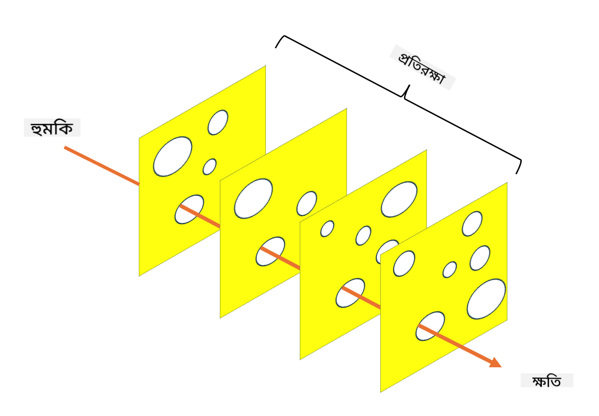

<!--
CO_OP_TRANSLATOR_METADATA:
{
  "original_hash": "75f77f972d2233c584f87c1eb96c983b",
  "translation_date": "2025-09-03T20:29:56+00:00",
  "source_file": "1.5 Zero trust.md",
  "language_code": "bn"
}
-->
# জিরো ট্রাস্ট

"জিরো ট্রাস্ট" শব্দটি বর্তমানে সাইবার নিরাপত্তা ক্ষেত্রে খুবই প্রচলিত। কিন্তু এর অর্থ কী? এটি কি শুধুই একটি ফ্যাশনেবল শব্দ? এই পাঠে, আমরা জিরো ট্রাস্ট কী তা গভীরভাবে বিশ্লেষণ করব।

## ভূমিকা

 - এই পাঠে আমরা আলোচনা করব:
   
   - জিরো ট্রাস্ট কী?

   - জিরো ট্রাস্ট কীভাবে ঐতিহ্যবাহী নিরাপত্তা স্থাপত্য থেকে আলাদা?

   - ডিফেন্স ইন ডেপথ কী?

## জিরো ট্রাস্ট

জিরো ট্রাস্ট একটি সাইবার নিরাপত্তা পদ্ধতি যা "বিশ্বাস করো এবং তারপর যাচাই করো" ধারণাটিকে চ্যালেঞ্জ করে এবং ধরে নেয় যে কোনো সত্তা, তা প্রতিষ্ঠানের নেটওয়ার্কের ভেতরে হোক বা বাইরে, স্বয়ংক্রিয়ভাবে বিশ্বাসযোগ্য নয়। বরং, জিরো ট্রাস্ট প্রতিটি ব্যবহারকারী, ডিভাইস এবং অ্যাপ্লিকেশনকে যাচাই করার পক্ষে, যারা সম্পদে প্রবেশের চেষ্টা করে, তাদের অবস্থান নির্বিশেষে। জিরো ট্রাস্টের মূল নীতি হলো "আক্রমণের পৃষ্ঠ" কমানো এবং নিরাপত্তা লঙ্ঘনের সম্ভাব্য প্রভাব হ্রাস করা।

জিরো ট্রাস্ট মডেলে নিম্নলিখিত নীতিগুলোকে গুরুত্ব দেওয়া হয়:

1. **পরিচয় যাচাই**: প্রত্যেক ব্যবহারকারী এবং ডিভাইসের জন্য কঠোর প্রমাণীকরণ এবং অনুমোদন প্রক্রিয়া প্রয়োগ করা হয়, তাদের অবস্থান যাই হোক না কেন। মনে রাখবেন, পরিচয় মানেই কেবল মানুষ নয়: এটি একটি ডিভাইস, অ্যাপ্লিকেশন ইত্যাদিও হতে পারে।

2. **ন্যূনতম অধিকার**: ব্যবহারকারী এবং ডিভাইসকে তাদের কাজ সম্পাদনের জন্য প্রয়োজনীয় সর্বনিম্ন স্তরের অ্যাক্সেস দেওয়া হয়, যাতে তারা ক্ষতিগ্রস্ত হলে সম্ভাব্য ক্ষতি কমানো যায়।

3. **মাইক্রো-সেগমেন্টেশন**: নেটওয়ার্ক সম্পদগুলোকে ছোট ছোট অংশে বিভক্ত করা হয়, যাতে কোনো লঙ্ঘন হলে নেটওয়ার্কের ভেতরে আড়াআড়ি চলাচল সীমিত থাকে।

4. **নিরবচ্ছিন্ন পর্যবেক্ষণ**: ব্যবহারকারী এবং ডিভাইসের আচরণের উপর চলমান পর্যবেক্ষণ এবং বিশ্লেষণ করা হয়, যাতে অস্বাভাবিকতা এবং সম্ভাব্য হুমকি শনাক্ত করা যায়। আধুনিক পর্যবেক্ষণ কৌশলগুলোর মধ্যে মেশিন লার্নিং, কৃত্রিম বুদ্ধিমত্তা এবং হুমকি গোয়েন্দা তথ্য ব্যবহার করে অতিরিক্ত বিশদ এবং প্রাসঙ্গিক তথ্য প্রদান করা হয়।

5. **ডেটা এনক্রিপশন**: ডেটা স্থানান্তর এবং সংরক্ষণের সময় এনক্রিপ্ট করা হয়, যাতে অননুমোদিত প্রবেশ প্রতিরোধ করা যায়।

6. **কঠোর অ্যাক্সেস নিয়ন্ত্রণ**: ব্যবহারকারীর ভূমিকা, ডিভাইসের স্বাস্থ্য এবং নেটওয়ার্ক অবস্থানের মতো প্রাসঙ্গিক তথ্যের ভিত্তিতে অ্যাক্সেস নিয়ন্ত্রণ প্রয়োগ করা হয়।

মাইক্রোসফট জিরো ট্রাস্টকে পাঁচটি স্তম্ভে ভাগ করেছে, যা আমরা পরবর্তী পাঠে আলোচনা করব।

## ঐতিহ্যবাহী নিরাপত্তা স্থাপত্য থেকে পার্থক্য

জিরো ট্রাস্ট ঐতিহ্যবাহী নিরাপত্তা স্থাপত্য, যেমন পেরিমিটার-ভিত্তিক মডেল, থেকে কয়েকটি গুরুত্বপূর্ণ উপায়ে আলাদা:

1. **পেরিমিটার বনাম পরিচয়-কেন্দ্রিক**: ঐতিহ্যবাহী মডেল নেটওয়ার্কের পেরিমিটার সুরক্ষিত করার উপর জোর দেয় এবং ধরে নেয় যে অভ্যন্তরীণ ব্যবহারকারী এবং ডিভাইসগুলো একবার ভেতরে প্রবেশ করলে বিশ্বাসযোগ্য। জিরো ট্রাস্ট ধরে নেয় যে হুমকি নেটওয়ার্কের ভেতর এবং বাইরেও হতে পারে এবং কঠোর পরিচয়-ভিত্তিক নিয়ন্ত্রণ প্রয়োগ করে।

2. **অন্তর্নিহিত বনাম স্পষ্ট বিশ্বাস**: ঐতিহ্যবাহী মডেল নেটওয়ার্কের ভেতরে ডিভাইস এবং ব্যবহারকারীদের স্বয়ংক্রিয়ভাবে বিশ্বাস করে যতক্ষণ না প্রমাণিত হয়। জিরো ট্রাস্ট স্পষ্টভাবে পরিচয় যাচাই করে এবং অস্বাভাবিকতার জন্য ক্রমাগত পর্যবেক্ষণ করে।

3. **সমতল বনাম বিভক্ত নেটওয়ার্ক**: ঐতিহ্যবাহী স্থাপত্যে সাধারণত সমতল নেটওয়ার্ক থাকে, যেখানে অভ্যন্তরীণ ব্যবহারকারীদের বিস্তৃত অ্যাক্সেস থাকে। জিরো ট্রাস্ট নেটওয়ার্ককে ছোট, বিচ্ছিন্ন অঞ্চলে বিভক্ত করার পক্ষে, যাতে সম্ভাব্য লঙ্ঘন সীমাবদ্ধ থাকে।

4. **প্রতিক্রিয়াশীল বনাম সক্রিয়**: ঐতিহ্যবাহী নিরাপত্তা সাধারণত প্রতিক্রিয়াশীল ব্যবস্থা, যেমন পেরিমিটার ফায়ারওয়াল এবং অনুপ্রবেশ শনাক্তকরণের উপর নির্ভর করে। জিরো ট্রাস্ট সক্রিয় পদ্ধতি গ্রহণ করে, ধরে নেয় যে লঙ্ঘন সম্ভব এবং এর প্রভাব কমানোর চেষ্টা করে।

## ডিফেন্স ইন ডেপথ

ডিফেন্স ইন ডেপথ, যা স্তরযুক্ত নিরাপত্তা নামেও পরিচিত, একটি সাইবার নিরাপত্তা কৌশল যেখানে একটি প্রতিষ্ঠানের সম্পদ রক্ষার জন্য একাধিক স্তরের নিরাপত্তা নিয়ন্ত্রণ এবং ব্যবস্থা স্থাপন করা হয়। এর লক্ষ্য হলো এমন ওভারল্যাপিং স্তর তৈরি করা, যাতে একটি স্তর ভেদ করা হলেও অন্য স্তরগুলো সুরক্ষা প্রদান করতে পারে। প্রতিটি স্তর নিরাপত্তার একটি ভিন্ন দিকের উপর ফোকাস করে এবং একটি প্রতিষ্ঠানের সামগ্রিক নিরাপত্তা অবস্থানকে শক্তিশালী করে।

ডিফেন্স ইন ডেপথে প্রযুক্তিগত, প্রক্রিয়াগত এবং শারীরিক নিরাপত্তা ব্যবস্থার সমন্বয় থাকে। এর মধ্যে ফায়ারওয়াল, অনুপ্রবেশ শনাক্তকরণ ব্যবস্থা, অ্যাক্সেস নিয়ন্ত্রণ, এনক্রিপশন, ব্যবহারকারী প্রশিক্ষণ, নিরাপত্তা নীতি ইত্যাদি অন্তর্ভুক্ত। ধারণাটি হলো একাধিক বাধা তৈরি করা, যা সম্মিলিতভাবে আক্রমণকারীদের জন্য একটি প্রতিষ্ঠানের সিস্টেম এবং নেটওয়ার্কে প্রবেশ করা কঠিন করে তোলে। এটি কখনও কখনও "সুইস চিজ" মডেল নামেও পরিচিত, যা অন্যান্য শিল্পে (যেমন পরিবহন) দুর্ঘটনা প্রতিরোধে ব্যবহৃত হয়।

## আরও পড়ুন

[জিরো ট্রাস্ট কী?](https://learn.microsoft.com/security/zero-trust/zero-trust-overview?WT.mc_id=academic-96948-sayoung)

[জিরো ট্রাস্টের বিবর্তন – মাইক্রোসফট পজিশন পেপার](https://query.prod.cms.rt.microsoft.com/cms/api/am/binary/RWJJdT?WT.mc_id=academic-96948-sayoung)

[জিরো ট্রাস্ট এবং বিয়ন্ড কর্প গুগল ক্লাউড | গুগল ক্লাউড ব্লগ](https://cloud.google.com/blog/topics/developers-practitioners/zero-trust-and-beyondcorp-google-cloud)

---

**অস্বীকৃতি**:  
এই নথিটি AI অনুবাদ পরিষেবা [Co-op Translator](https://github.com/Azure/co-op-translator) ব্যবহার করে অনুবাদ করা হয়েছে। আমরা যথাসম্ভব সঠিক অনুবাদ প্রদানের চেষ্টা করি, তবে অনুগ্রহ করে মনে রাখবেন যে স্বয়ংক্রিয় অনুবাদে ত্রুটি বা অসঙ্গতি থাকতে পারে। মূল ভাষায় থাকা নথিটিকে প্রামাণিক উৎস হিসেবে বিবেচনা করা উচিত। গুরুত্বপূর্ণ তথ্যের জন্য, পেশাদার মানব অনুবাদ সুপারিশ করা হয়। এই অনুবাদ ব্যবহারের ফলে কোনো ভুল বোঝাবুঝি বা ভুল ব্যাখ্যা হলে আমরা দায়বদ্ধ থাকব না।