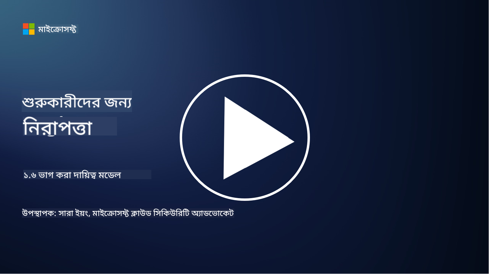

<!--
CO_OP_TRANSLATOR_METADATA:
{
  "original_hash": "a48db640d80c786b928ca178c414f084",
  "translation_date": "2025-09-03T21:02:46+00:00",
  "source_file": "1.6 Shared responsibility model.md",
  "language_code": "bn"
}
-->
# শেয়ারড রেসপনসিবিলিটি মডেল

শেয়ারড রেসপনসিবিলিটি আইটি-তে একটি নতুন ধারণা, যা ক্লাউড কম্পিউটিংয়ের আবির্ভাবের সাথে এসেছে। সাইবার নিরাপত্তার দৃষ্টিকোণ থেকে, কে কোন সিকিউরিটি কন্ট্রোল সরবরাহ করছে তা বোঝা অত্যন্ত গুরুত্বপূর্ণ, যাতে প্রতিরক্ষায় কোনো ফাঁক না থাকে।

## ভূমিকা

এই পাঠে আমরা আলোচনা করব:

 - সাইবার নিরাপত্তার প্রেক্ষাপটে শেয়ারড রেসপনসিবিলিটি কী?
   
 - IaaS, PaaS এবং SaaS-এর মধ্যে সিকিউরিটি কন্ট্রোলের শেয়ারড রেসপনসিবিলিটির পার্থক্য কী?

 - আপনার ক্লাউড প্ল্যাটফর্ম কোন সিকিউরিটি কন্ট্রোল সরবরাহ করছে তা কোথায় খুঁজে পাবেন?

 - "বিশ্বাস করুন কিন্তু যাচাই করুন" কী?

## সাইবার নিরাপত্তার প্রেক্ষাপটে শেয়ারড রেসপনসিবিলিটি কী?

সাইবার নিরাপত্তায় শেয়ারড রেসপনসিবিলিটি বলতে ক্লাউড সার্ভিস প্রোভাইডার (CSP) এবং তার গ্রাহকদের মধ্যে সিকিউরিটি দায়িত্বের বণ্টনকে বোঝায়। ক্লাউড কম্পিউটিং পরিবেশে, যেমন Infrastructure as a Service (IaaS), Platform as a Service (PaaS), এবং Software as a Service (SaaS), CSP এবং গ্রাহক উভয়েরই ডেটা, অ্যাপ্লিকেশন এবং সিস্টেমের নিরাপত্তা নিশ্চিত করার ভূমিকা থাকে।

## IaaS, PaaS এবং SaaS-এর মধ্যে সিকিউরিটি কন্ট্রোলের শেয়ারড রেসপনসিবিলিটির পার্থক্য কী?

দায়িত্বের বিভাজন সাধারণত ব্যবহৃত ক্লাউড সার্ভিসের প্রকারের উপর নির্ভর করে:

 - **IaaS (Infrastructure as a Service)**: CSP মৌলিক অবকাঠামো (সার্ভার, নেটওয়ার্কিং, স্টোরেজ) সরবরাহ করে, আর গ্রাহক সেই অবকাঠামোর উপর অপারেটিং সিস্টেম, অ্যাপ্লিকেশন এবং সিকিউরিটি কনফিগারেশন পরিচালনা করে।
   
 - **PaaS (Platform as a Service):** CSP একটি প্ল্যাটফর্ম সরবরাহ করে যেখানে গ্রাহকরা অ্যাপ্লিকেশন তৈরি এবং মোতায়েন করতে পারে। CSP অন্তর্নিহিত অবকাঠামো পরিচালনা করে, আর গ্রাহক অ্যাপ্লিকেশন ডেভেলপমেন্ট এবং ডেটার নিরাপত্তার উপর মনোযোগ দেয়।

 - **SaaS (Software as a Service)**: CSP সম্পূর্ণ কার্যকরী অ্যাপ্লিকেশন সরবরাহ করে যা ইন্টারনেটের মাধ্যমে অ্যাক্সেসযোগ্য। এই ক্ষেত্রে, CSP অ্যাপ্লিকেশন এবং অবকাঠামোর নিরাপত্তার জন্য দায়ী, আর গ্রাহক ব্যবহারকারীর অ্যাক্সেস এবং ডেটা ব্যবহারের পরিচালনা করে।

শেয়ারড রেসপনসিবিলিটি বোঝা গুরুত্বপূর্ণ কারণ এটি স্পষ্ট করে দেয় কোন সিকিউরিটি দিকগুলি CSP দ্বারা কভার করা হয়েছে এবং কোনগুলি গ্রাহককে সমাধান করতে হবে। এটি ভুল বোঝাবুঝি প্রতিরোধ করে এবং নিরাপত্তা ব্যবস্থা সামগ্রিকভাবে বাস্তবায়ন নিশ্চিত করে।

## আপনার ক্লাউড প্ল্যাটফর্ম কোন সিকিউরিটি কন্ট্রোল সরবরাহ করছে তা কোথায় খুঁজে পাবেন?

আপনার ক্লাউড প্ল্যাটফর্ম কোন সিকিউরিটি কন্ট্রোল সরবরাহ করছে তা জানতে, আপনাকে ক্লাউড সার্ভিস প্রোভাইডারের ডকুমেন্টেশন এবং রিসোর্সগুলো দেখতে হবে। এর মধ্যে রয়েছে:

 - **CSP-এর ওয়েবসাইট এবং ডকুমেন্টেশন**: CSP-এর ওয়েবসাইটে তাদের সার্ভিসের অংশ হিসেবে সরবরাহ করা সিকিউরিটি ফিচার এবং কন্ট্রোল সম্পর্কে তথ্য থাকবে। CSP সাধারণত বিস্তারিত ডকুমেন্টেশন প্রদান করে যা তাদের সিকিউরিটি পদ্ধতি, কন্ট্রোল এবং সুপারিশ ব্যাখ্যা করে। এর মধ্যে হোয়াইটপেপার, সিকিউরিটি গাইড এবং টেকনিক্যাল ডকুমেন্টেশন থাকতে পারে।
   
 - **সিকিউরিটি অ্যাসেসমেন্ট এবং অডিট**: বেশিরভাগ CSP তাদের সিকিউরিটি কন্ট্রোল স্বাধীন সিকিউরিটি বিশেষজ্ঞ এবং সংস্থাগুলোর দ্বারা মূল্যায়ন করায়। এই পর্যালোচনাগুলি CSP-এর সিকিউরিটি ব্যবস্থার গুণমান সম্পর্কে অন্তর্দৃষ্টি প্রদান করতে পারে। কখনও কখনও এটি CSP-কে একটি সিকিউরিটি কমপ্লায়েন্স সার্টিফিকেট পেতে সাহায্য করে (পরবর্তী পয়েন্ট দেখুন)।
   
 - **সিকিউরিটি কমপ্লায়েন্স সার্টিফিকেশন**: বেশিরভাগ CSP ISO:27001, SOC 2, এবং FedRAMP ইত্যাদি সার্টিফিকেশন অর্জন করে। এই সার্টিফিকেশনগুলি প্রমাণ করে যে প্রোভাইডার নির্দিষ্ট সিকিউরিটি এবং কমপ্লায়েন্স স্ট্যান্ডার্ড পূরণ করেছে।

মনে রাখবেন যে তথ্যের স্তর এবং প্রাপ্যতা ক্লাউড প্রোভাইডারদের মধ্যে ভিন্ন হতে পারে। সর্বদা নিশ্চিত করুন যে আপনি ক্লাউড সার্ভিস প্রোভাইডার দ্বারা সরবরাহিত অফিসিয়াল এবং আপডেটেড রিসোর্স পরামর্শ করছেন, যাতে আপনার ক্লাউড-ভিত্তিক সম্পদের নিরাপত্তা সম্পর্কে সঠিক সিদ্ধান্ত নিতে পারেন।

## "বিশ্বাস করুন কিন্তু যাচাই করুন" কী?

CSP, তৃতীয় পক্ষের সফটওয়্যার বা অন্যান্য আইটি সিকিউরিটি সার্ভিস ব্যবহারের ক্ষেত্রে, কোনো সংস্থা প্রথমে প্রোভাইডারের সিকিউরিটি ব্যবস্থার দাবিগুলিকে বিশ্বাস করতে পারে। তবে, তাদের ডেটা এবং সিস্টেমের নিরাপত্তা নিশ্চিত করতে, তারা এই দাবিগুলিকে সিকিউরিটি অ্যাসেসমেন্ট, পেনিট্রেশন টেস্টিং এবং বাহ্যিক পক্ষের সিকিউরিটি কন্ট্রোল পর্যালোচনার মাধ্যমে যাচাই করবে, সফটওয়্যার বা সার্ভিসকে তাদের কার্যক্রমে সম্পূর্ণভাবে সংযুক্ত করার আগে। সকল ব্যক্তি এবং সংস্থাকে তাদের দায়িত্বের বাইরে থাকা সিকিউরিটি কন্ট্রোলগুলিকে বিশ্বাস করুন কিন্তু যাচাই করুন।

## সংস্থার মধ্যে শেয়ারড রেসপনসিবিলিটি

মনে রাখবেন, সংস্থার মধ্যে বিভিন্ন দলের জন্য সিকিউরিটির শেয়ারড রেসপনসিবিলিটিও বিবেচনা করতে হবে। সিকিউরিটি টিম খুব কমই নিজেরাই সমস্ত কন্ট্রোল বাস্তবায়ন করে এবং অপারেশন টিম, ডেভেলপার এবং ব্যবসার অন্যান্য অংশের সাথে সহযোগিতা করতে হবে, যাতে একটি সংস্থাকে সুরক্ষিত রাখতে প্রয়োজনীয় সমস্ত সিকিউরিটি কন্ট্রোল বাস্তবায়ন করা যায়।

## আরও পড়ুন
- [Shared responsibility in the cloud - Microsoft Azure | Microsoft Learn](https://learn.microsoft.com/azure/security/fundamentals/shared-responsibility?WT.mc_id=academic-96948-sayoung)
- [What is shared responsibility model? – Definition from TechTarget.com](https://www.techtarget.com/searchcloudcomputing/definition/shared-responsibility-model)
- [The shared responsibility model explained and what it means for cloud security | CSO Online](https://www.csoonline.com/article/570779/the-shared-responsibility-model-explained-and-what-it-means-for-cloud-security.html)
- [Shared Responsibility for Cloud Security: What You Need to Know (cisecurity.org)](https://www.cisecurity.org/insights/blog/shared-responsibility-cloud-security-what-you-need-to-know)

---

**অস্বীকৃতি**:  
এই নথিটি AI অনুবাদ পরিষেবা [Co-op Translator](https://github.com/Azure/co-op-translator) ব্যবহার করে অনুবাদ করা হয়েছে। আমরা যথাসম্ভব সঠিকতার জন্য চেষ্টা করি, তবে অনুগ্রহ করে মনে রাখবেন যে স্বয়ংক্রিয় অনুবাদে ত্রুটি বা অসঙ্গতি থাকতে পারে। মূল ভাষায় থাকা নথিটিকে প্রামাণিক উৎস হিসেবে বিবেচনা করা উচিত। গুরুত্বপূর্ণ তথ্যের জন্য, পেশাদার মানব অনুবাদ সুপারিশ করা হয়। এই অনুবাদ ব্যবহারের ফলে কোনো ভুল বোঝাবুঝি বা ভুল ব্যাখ্যা হলে আমরা তার জন্য দায়ী থাকব না।