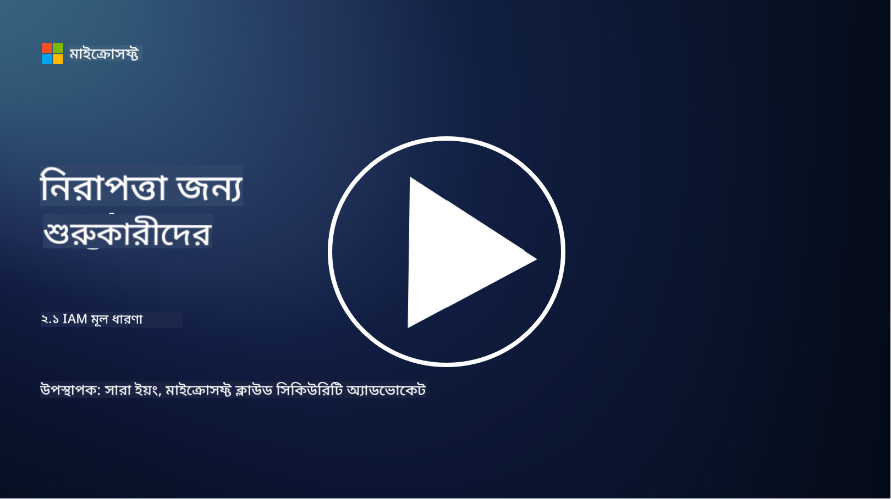

<!--
CO_OP_TRANSLATOR_METADATA:
{
  "original_hash": "2e3864e3d579f0dbb4ac2ec8c5f82acf",
  "translation_date": "2025-09-03T19:34:09+00:00",
  "source_file": "2.1 IAM key concepts.md",
  "language_code": "bn"
}
-->
# IAM মূল ধারণা

আপনি কি কখনও কোনো কম্পিউটার বা ওয়েবসাইটে লগইন করেছেন? অবশ্যই করেছেন! এর মানে আপনি ইতিমধ্যেই আপনার দৈনন্দিন জীবনে পরিচয় নিয়ন্ত্রণ ব্যবহার করেছেন। পরিচয় এবং অ্যাক্সেস ব্যবস্থাপনা (IAM) নিরাপত্তার একটি গুরুত্বপূর্ণ স্তম্ভ, যা আমরা পরবর্তী পাঠগুলোতে আরও বিস্তারিতভাবে শিখব।

**ভূমিকা**

এই পাঠে আমরা আলোচনা করব:

- সাইবার নিরাপত্তার প্রেক্ষাপটে পরিচয় এবং অ্যাক্সেস ব্যবস্থাপনা (IAM) বলতে আমরা কী বুঝি?
- সর্বনিম্ন অধিকার নীতির ধারণা কী?
- দায়িত্বের বিভাজন কী?
- প্রমাণীকরণ এবং অনুমোদন কী?

## সাইবার নিরাপত্তার প্রেক্ষাপটে পরিচয় এবং অ্যাক্সেস ব্যবস্থাপনা (IAM) বলতে আমরা কী বুঝি?

পরিচয় এবং অ্যাক্সেস ব্যবস্থাপনা (IAM) হলো প্রক্রিয়া, প্রযুক্তি এবং নীতিমালার একটি সেট যা নিশ্চিত করে যে সঠিক ব্যক্তিরা একটি প্রতিষ্ঠানের ডিজিটাল পরিবেশে উপযুক্ত সম্পদে অ্যাক্সেস পাচ্ছে। IAM ডিজিটাল পরিচয় (ব্যবহারকারী, কর্মচারী, অংশীদার) এবং তাদের সিস্টেম, অ্যাপ্লিকেশন, ডেটা এবং নেটওয়ার্কে অ্যাক্সেস পরিচালনা করে। IAM-এর প্রধান লক্ষ্য হলো নিরাপত্তা বৃদ্ধি করা, ব্যবহারকারীর অ্যাক্সেস সহজ করা এবং প্রতিষ্ঠানের নীতিমালা ও নিয়মাবলীর সাথে সামঞ্জস্য নিশ্চিত করা। IAM সমাধান সাধারণত ব্যবহারকারীর প্রমাণীকরণ, অনুমোদন, পরিচয় প্রদান, অ্যাক্সেস নিয়ন্ত্রণ এবং ব্যবহারকারীর জীবনচক্র ব্যবস্থাপনা অন্তর্ভুক্ত করে (যেমন, অ্যাকাউন্টগুলো আর ব্যবহার না হলে মুছে ফেলা নিশ্চিত করা)।

## সর্বনিম্ন অধিকার নীতির ধারণা কী?

সর্বনিম্ন অধিকার নীতি একটি মৌলিক ধারণা যা ব্যবহারকারী এবং সিস্টেমকে তাদের নির্ধারিত কাজ বা ভূমিকা সম্পাদনের জন্য শুধুমাত্র প্রয়োজনীয় ন্যূনতম অধিকার প্রদান করার পরামর্শ দেয়। এই নীতি নিরাপত্তা লঙ্ঘন বা অভ্যন্তরীণ হুমকির ক্ষেত্রে সম্ভাব্য ক্ষতি সীমিত করতে সাহায্য করে। সর্বনিম্ন অধিকার নীতির অনুসরণ করে, প্রতিষ্ঠানগুলো আক্রমণের ঝুঁকি কমায় এবং অননুমোদিত অ্যাক্সেস, ডেটা লঙ্ঘন এবং অধিকারগুলোর ভুল ব্যবহারের ঝুঁকি হ্রাস করে। বাস্তবে, এর অর্থ হলো ব্যবহারকারীদের শুধুমাত্র তাদের কাজের জন্য প্রয়োজনীয় নির্দিষ্ট সম্পদ এবং কার্যকারিতার অ্যাক্সেস প্রদান করা। উদাহরণস্বরূপ, যদি আপনার শুধুমাত্র একটি ডকুমেন্ট পড়ার প্রয়োজন হয়, তাহলে আপনাকে সেই ডকুমেন্টের পূর্ণ প্রশাসনিক অধিকার দেওয়া অপ্রয়োজনীয় হবে।

## দায়িত্বের বিভাজন কী?

দায়িত্বের বিভাজন একটি নীতি যা স্বার্থের সংঘাত প্রতিরোধ এবং প্রতারণা ও ভুলের ঝুঁকি কমানোর জন্য একটি প্রতিষ্ঠানের মধ্যে গুরুত্বপূর্ণ কাজ এবং দায়িত্বগুলো বিভিন্ন ব্যক্তির মধ্যে বিতরণ করার পরামর্শ দেয়। সাইবার নিরাপত্তার প্রেক্ষাপটে, দায়িত্বের বিভাজন নিশ্চিত করে যে কোনো একক ব্যক্তি একটি গুরুত্বপূর্ণ প্রক্রিয়া বা সিস্টেমের সমস্ত দিক নিয়ন্ত্রণ করতে পারে না। এর লক্ষ্য হলো একটি চেক এবং ব্যালেন্স ব্যবস্থা তৈরি করা যা নিশ্চিত করে যে কোনো একক ব্যক্তি প্রক্রিয়ার সেটআপ এবং অনুমোদন উভয় পর্যায় সম্পাদন করতে সক্ষম নয়। উদাহরণস্বরূপ, আর্থিক সিস্টেমে, এটি নির্দেশ করতে পারে যে যে ব্যক্তি লেনদেনগুলো সিস্টেমে প্রবেশ করায়, সে একই ব্যক্তি হতে পারে না যে লেনদেনগুলো অনুমোদন করে। এটি অননুমোদিত বা প্রতারণামূলক কার্যক্রমগুলো অদেখা থাকার ঝুঁকি কমায়।

## প্রমাণীকরণ এবং অনুমোদন কী?

প্রমাণীকরণ এবং অনুমোদন সাইবার নিরাপত্তার দুটি মৌলিক ধারণা যা কম্পিউটার সিস্টেম এবং ডেটার নিরাপত্তা ও অখণ্ডতা নিশ্চিত করতে গুরুত্বপূর্ণ ভূমিকা পালন করে। এগুলো প্রায়ই একসঙ্গে ব্যবহার করা হয় সম্পদে অ্যাক্সেস নিয়ন্ত্রণ এবং সংবেদনশীল তথ্য সুরক্ষার জন্য।

**1. প্রমাণীকরণ**:  
প্রমাণীকরণ হলো একটি ব্যবহারকারী, সিস্টেম বা সত্তার পরিচয় যাচাই করার প্রক্রিয়া, যারা একটি কম্পিউটার সিস্টেম বা নির্দিষ্ট সম্পদে অ্যাক্সেস করার চেষ্টা করছে। এটি নিশ্চিত করে যে দাবি করা পরিচয়টি সত্য এবং সঠিক। প্রমাণীকরণ পদ্ধতিগুলো সাধারণত নিম্নলিখিত উপাদানগুলোর এক বা একাধিক ব্যবহার করে:

   a. আপনি যা জানেন: এর মধ্যে পাসওয়ার্ড, পিন বা অন্য কোনো গোপন তথ্য অন্তর্ভুক্ত থাকে যা শুধুমাত্র অনুমোদিত ব্যবহারকারীর জানা উচিত।  
   b. আপনার কাছে যা আছে: এর মধ্যে শারীরিক টোকেন বা ডিভাইস যেমন স্মার্ট কার্ড, সিকিউরিটি টোকেন বা মোবাইল ফোন অন্তর্ভুক্ত থাকে যা ব্যবহারকারীর পরিচয় নিশ্চিত করতে ব্যবহৃত হয়।  
   c. আপনি যা: এর মধ্যে বায়োমেট্রিক উপাদান যেমন আঙুলের ছাপ, মুখের স্বীকৃতি বা রেটিনা স্ক্যান অন্তর্ভুক্ত থাকে যা একজন ব্যক্তির জন্য অনন্য।  

প্রমাণীকরণ প্রক্রিয়া ব্যবহারকারীর দাবি করা পরিচয় নিশ্চিত করে সিস্টেম বা সম্পদে অ্যাক্সেস দেওয়ার আগে। এটি অননুমোদিত অ্যাক্সেস প্রতিরোধ করে এবং নিশ্চিত করে যে শুধুমাত্র বৈধ ব্যবহারকারীরা সিস্টেমের মধ্যে কার্যক্রম সম্পাদন করতে পারে।

**2. অনুমোদন**:  
অনুমোদন হলো প্রমাণীকৃত ব্যবহারকারী বা সত্তার পরিচয় যাচাই করার পর নির্দিষ্ট অনুমতি এবং অধিকার প্রদান বা অস্বীকার করার প্রক্রিয়া। এটি নির্ধারণ করে যে ব্যবহারকারী একটি সিস্টেমের মধ্যে বা নির্দিষ্ট সম্পদে কী কার্যক্রম বা অপারেশন সম্পাদন করতে পারে। অনুমোদন সাধারণত পূর্বনির্ধারিত নীতিমালা, অ্যাক্সেস নিয়ন্ত্রণ নিয়ম এবং ব্যবহারকারীদের জন্য নির্ধারিত ভূমিকার উপর ভিত্তি করে।

অনুমোদনকে ভাবা যেতে পারে এই প্রশ্নের উত্তর হিসেবে: "একজন প্রমাণীকৃত ব্যবহারকারী কী করতে পারে?" এটি সংবেদনশীল ডেটা এবং সম্পদকে অননুমোদিত অ্যাক্সেস বা পরিবর্তন থেকে সুরক্ষিত রাখতে অ্যাক্সেস নিয়ন্ত্রণ নীতিমালা সংজ্ঞায়িত এবং প্রয়োগ করে।

**সংক্ষেপে:**

- প্রমাণীকরণ ব্যবহারকারী বা সত্তার পরিচয় প্রতিষ্ঠা করে।  
- অনুমোদন নির্ধারণ করে যে প্রমাণীকৃত ব্যবহারকারীরা কী কার্যক্রম এবং সম্পদে অ্যাক্সেস বা পরিবর্তন করতে পারে।

## আরও পড়ুন

- [Describe identity concepts - Training | Microsoft Learn](https://learn.microsoft.com/training/modules/describe-identity-principles-concepts/?WT.mc_id=academic-96948-sayoung)  
- [Introduction to identity - Microsoft Entra | Microsoft Learn](https://learn.microsoft.com/azure/active-directory/fundamentals/identity-fundamental-concepts?WT.mc_id=academic-96948-sayoung)  
- [What is Identity Access Management (IAM)? | Microsoft Security](https://www.microsoft.com/security/business/security-101/what-is-identity-access-management-iam?WT.mc_id=academic-96948-sayoung)  
- [What is IAM? Identity and access management explained | CSO Online](https://www.csoonline.com/article/518296/what-is-iam-identity-and-access-management-explained.html)  
- [What is IAM? (auth0.com)](https://auth0.com/blog/what-is-iam/)  
- [Security+: implementing Identity and Access Management (IAM) controls [updated 2021] | Infosec (infosecinstitute.com)](https://resources.infosecinstitute.com/certifications/securityplus/security-implementing-identity-and-access-management-iam-controls/)  
- [least privilege - Glossary | CSRC (nist.gov)](https://csrc.nist.gov/glossary/term/least_privilege)  
- [Security: The Principle of Least Privilege (POLP) - Microsoft Community Hub](https://techcommunity.microsoft.com/t5/azure-sql-blog/security-the-principle-of-least-privilege-polp/ba-p/2067390?WT.mc_id=academic-96948-sayoung)  
- [Principle of least privilege | CERT NZ](https://www.cert.govt.nz/it-specialists/critical-controls/principle-of-least-privilege/)  
- [Why is separation of duties required by NIST 800-171 and CMMC? - (totem.tech)](https://www.totem.tech/cmmc-separation-of-duties/)  

---

**অস্বীকৃতি**:  
এই নথিটি AI অনুবাদ পরিষেবা [Co-op Translator](https://github.com/Azure/co-op-translator) ব্যবহার করে অনুবাদ করা হয়েছে। আমরা যথাসাধ্য সঠিকতার জন্য চেষ্টা করি, তবে অনুগ্রহ করে মনে রাখবেন যে স্বয়ংক্রিয় অনুবাদে ত্রুটি বা অসঙ্গতি থাকতে পারে। মূল ভাষায় থাকা নথিটিকে প্রামাণিক উৎস হিসেবে বিবেচনা করা উচিত। গুরুত্বপূর্ণ তথ্যের জন্য, পেশাদার মানব অনুবাদ সুপারিশ করা হয়। এই অনুবাদ ব্যবহারের ফলে কোনো ভুল বোঝাবুঝি বা ভুল ব্যাখ্যা হলে আমরা তার জন্য দায়ী থাকব না।