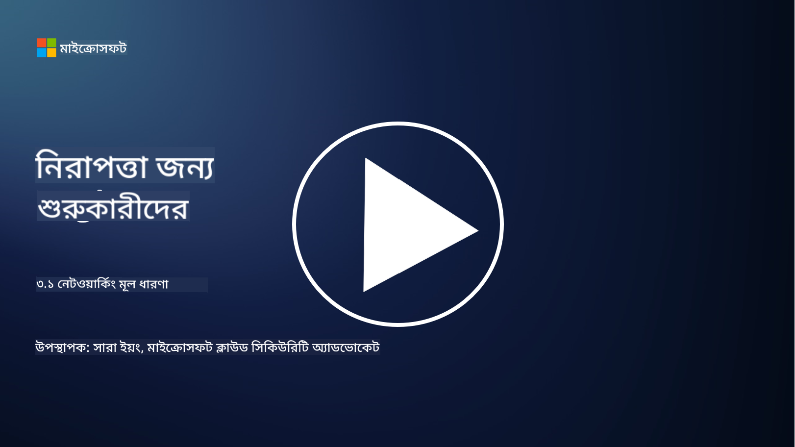
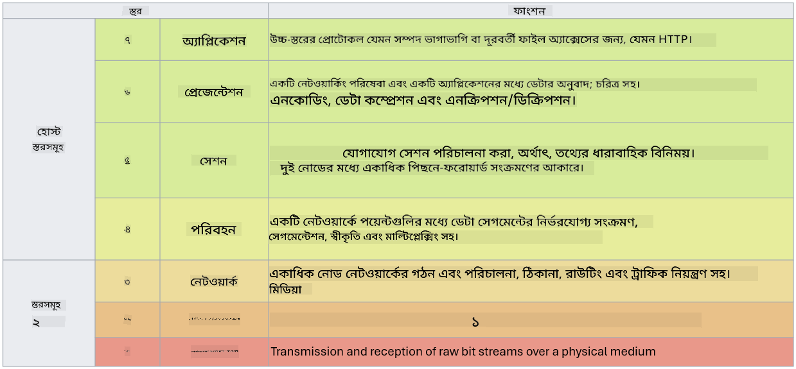

<!--
CO_OP_TRANSLATOR_METADATA:
{
  "original_hash": "252724eceeb183fb9018f88c5e1a3f0c",
  "translation_date": "2025-09-03T22:02:43+00:00",
  "source_file": "3.1 Networking key concepts.md",
  "language_code": "bn"
}
-->
# নেটওয়ার্কিং-এর মূল ধারণা

যদি আপনি আইটি-তে কাজ করে থাকেন, তাহলে সম্ভবত নেটওয়ার্কিং ধারণার সাথে পরিচিত। যদিও আধুনিক পরিবেশে আমরা পরিচয়কে আমাদের প্রধান সুরক্ষা নিয়ন্ত্রণ হিসেবে ব্যবহার করি, এর মানে এই নয় যে নেটওয়ার্ক নিয়ন্ত্রণ অপ্রয়োজনীয়। এটি একটি বিশাল বিষয়, তবে এই পাঠে আমরা কিছু গুরুত্বপূর্ণ নেটওয়ার্কিং ধারণা নিয়ে আলোচনা করব।

এই পাঠে আমরা আলোচনা করব:

 - আইপি অ্যাড্রেসিং কী?

 - ওএসআই মডেল কী?

 - TCP/UDP কী?

 - পোর্ট নম্বর কী?

 - "এট রেস্ট" এবং "ইন ট্রানজিট" এনক্রিপশন কী?

## আইপি অ্যাড্রেসিং কী?

আইপি অ্যাড্রেসিং, বা ইন্টারনেট প্রোটোকল অ্যাড্রেসিং, একটি সংখ্যাসূচক লেবেল যা প্রতিটি ডিভাইসে বরাদ্দ করা হয় যা ইন্টারনেট প্রোটোকল ব্যবহার করে একটি কম্পিউটার নেটওয়ার্কে সংযুক্ত থাকে। এটি একটি নেটওয়ার্কের মধ্যে ডিভাইসগুলির জন্য একটি অনন্য শনাক্তকারী হিসেবে কাজ করে, যা তাদের ইন্টারনেট বা অন্যান্য সংযুক্ত নেটওয়ার্কের মাধ্যমে ডেটা পাঠাতে এবং গ্রহণ করতে সক্ষম করে। আইপি অ্যাড্রেসিং-এর দুটি প্রধান সংস্করণ রয়েছে: IPv4 (ইন্টারনেট প্রোটোকল সংস্করণ 4) এবং IPv6 (ইন্টারনেট প্রোটোকল সংস্করণ 6)। একটি আইপি ঠিকানা সাধারণত IPv4 ফরম্যাটে (যেমন, 192.168.1.1) বা IPv6 ফরম্যাটে (যেমন, 2001:0db8:85a3:0000:0000:8a2e:0370:7334) উপস্থাপিত হয়।

## ওএসআই মডেল কী?

ওএসআই (ওপেন সিস্টেমস ইন্টারকানেকশন) মডেল একটি ধারণাগত কাঠামো যা একটি যোগাযোগ ব্যবস্থার কার্যক্রমকে সাতটি পৃথক স্তরে মানক করে। প্রতিটি স্তর নির্দিষ্ট কাজ সম্পাদন করে এবং ডিভাইসগুলির মধ্যে দক্ষ এবং নির্ভরযোগ্য ডেটা যোগাযোগ নিশ্চিত করতে পার্শ্ববর্তী স্তরগুলির সাথে যোগাযোগ করে। স্তরগুলি, নিচ থেকে উপরের দিকে:

 1. ফিজিক্যাল লেয়ার

 2. ডেটা লিংক লেয়ার

 3. নেটওয়ার্ক লেয়ার

 4. ট্রান্সপোর্ট লেয়ার

 5. সেশন লেয়ার

 6. প্রেজেন্টেশন লেয়ার

 7. অ্যাপ্লিকেশন লেয়ার

ওএসআই মডেল নেটওয়ার্কিং প্রোটোকল এবং প্রযুক্তিগুলি কীভাবে ইন্টারঅ্যাক্ট করে তা বোঝার জন্য একটি সাধারণ রেফারেন্স প্রদান করে, নির্দিষ্ট হার্ডওয়্যার বা সফটওয়্যার বাস্তবায়নের উপর নির্ভর না করে।

_উৎস: https://en.wikipedia.org/wiki/OSI_model_

## TCP/UDP কী?

TCP (ট্রান্সমিশন কন্ট্রোল প্রোটোকল) এবং UDP (ইউজার ডাটাগ্রাম প্রোটোকল) হল দুটি মৌলিক ট্রান্সপোর্ট লেয়ার প্রোটোকল যা কম্পিউটার নেটওয়ার্কে ডিভাইসগুলির মধ্যে যোগাযোগ সহজতর করতে ব্যবহৃত হয়। এগুলি ডেটাকে প্যাকেটে বিভক্ত করে প্রেরণ করে এবং প্রাপ্তির শেষে সেই প্যাকেটগুলিকে মূল ডেটায় পুনরায় একত্রিত করে। তবে, এগুলির বৈশিষ্ট্য এবং ব্যবহার ক্ষেত্রে পার্থক্য রয়েছে।

**TCP (ট্রান্সমিশন কন্ট্রোল প্রোটোকল)**:

TCP একটি সংযোগ-ভিত্তিক প্রোটোকল যা ডিভাইসগুলির মধ্যে নির্ভরযোগ্য এবং সুশৃঙ্খল ডেটা সরবরাহ নিশ্চিত করে। এটি ডেটা বিনিময় শুরু হওয়ার আগে প্রেরক এবং প্রাপক মধ্যে একটি সংযোগ স্থাপন করে। TCP নিশ্চিত করে যে ডেটা প্যাকেটগুলি সঠিক ক্রমে পৌঁছায় এবং ডেটার অখণ্ডতা এবং সম্পূর্ণতা নিশ্চিত করতে হারিয়ে যাওয়া প্যাকেটগুলির পুনঃপ্রেরণ পরিচালনা করতে পারে। এটি ওয়েব ব্রাউজিং, ইমেইল, ফাইল ট্রান্সফার (FTP), এবং ডাটাবেস যোগাযোগের মতো অ্যাপ্লিকেশনের জন্য উপযুক্ত।

**UDP (ইউজার ডাটাগ্রাম প্রোটোকল)**:

UDP একটি সংযোগহীন প্রোটোকল যা দ্রুত ডেটা প্রেরণ করে কিন্তু TCP-এর মতো নির্ভরযোগ্যতা প্রদান করে না। এটি ডেটা প্রেরণের আগে একটি আনুষ্ঠানিক সংযোগ স্থাপন করে না এবং হারিয়ে যাওয়া প্যাকেটগুলির জন্য স্বীকৃতি বা পুনঃপ্রেরণের ব্যবস্থা অন্তর্ভুক্ত করে না। UDP এমন অ্যাপ্লিকেশনের জন্য উপযুক্ত যেখানে গতি এবং দক্ষতা নির্ভরযোগ্য সরবরাহের চেয়ে বেশি গুরুত্বপূর্ণ, যেমন রিয়েল-টাইম যোগাযোগ, স্ট্রিমিং মিডিয়া, অনলাইন গেমিং, এবং DNS প্রশ্ন।

সংক্ষেপে, TCP নির্ভরযোগ্যতা এবং সুশৃঙ্খল সরবরাহকে অগ্রাধিকার দেয়, যা ডেটা সঠিকতার প্রয়োজনীয় অ্যাপ্লিকেশনের জন্য উপযুক্ত করে তোলে, যেখানে UDP গতি এবং দক্ষতাকে অগ্রাধিকার দেয়, যা এমন অ্যাপ্লিকেশনের জন্য উপযুক্ত যেখানে সামান্য ডেটা ক্ষতি বা ক্রম পুনর্বিন্যাস গ্রহণযোগ্য হয়। TCP এবং UDP-এর মধ্যে পছন্দ নির্ভর করে ব্যবহৃত অ্যাপ্লিকেশন বা পরিষেবার নির্দিষ্ট প্রয়োজনীয়তার উপর।

## পোর্ট নম্বর কী?

নেটওয়ার্কিং-এ, একটি পোর্ট নম্বর একটি সংখ্যাসূচক শনাক্তকারী যা একটি নেটওয়ার্কের মধ্যে একটি একক ডিভাইসে চলমান বিভিন্ন পরিষেবা বা অ্যাপ্লিকেশনগুলিকে আলাদা করতে ব্যবহৃত হয়। পোর্টগুলি ইনকামিং ডেটাকে সঠিক অ্যাপ্লিকেশনে রুট করতে সাহায্য করে। পোর্ট নম্বরগুলি 16-বিট আনসাইনড পূর্ণসংখ্যা, যার মানে এগুলির পরিসর 0 থেকে 65535। এগুলি তিনটি পরিসরে বিভক্ত:

- ওয়েল-নোন পোর্ট (0-1023): HTTP (পোর্ট 80) এবং FTP (পোর্ট 21)-এর মতো স্ট্যান্ডার্ড পরিষেবার জন্য সংরক্ষিত।

- রেজিস্টার্ড পোর্ট (1024-49151): এমন অ্যাপ্লিকেশন এবং পরিষেবার জন্য ব্যবহৃত হয় যা ওয়েল-নোন পরিসরের অংশ নয় কিন্তু আনুষ্ঠানিকভাবে নিবন্ধিত।

- ডায়নামিক/প্রাইভেট পোর্ট (49152-65535): অ্যাপ্লিকেশন দ্বারা অস্থায়ী বা ব্যক্তিগত ব্যবহারের জন্য উপলব্ধ।

## "এট রেস্ট" এবং "ইন ট্রানজিট" এনক্রিপশন কী?

এনক্রিপশন হল ডেটাকে একটি সুরক্ষিত ফরম্যাটে রূপান্তর করার প্রক্রিয়া, যাতে এটি অননুমোদিত অ্যাক্সেস বা পরিবর্তন থেকে সুরক্ষিত থাকে। এনক্রিপশন ডেটার উপর "এট রেস্ট" (যখন ডিভাইস বা সার্ভারে সংরক্ষিত থাকে) এবং "ইন ট্রানজিট" (যখন ডিভাইসগুলির মধ্যে বা নেটওয়ার্কের মাধ্যমে প্রেরণ করা হয়) উভয় ক্ষেত্রেই প্রয়োগ করা যেতে পারে।

এনক্রিপশন এট রেস্ট: এটি ডেটাকে এনক্রিপ্ট করার প্রক্রিয়া যা ডিভাইস, সার্ভার বা স্টোরেজ সিস্টেমে সংরক্ষিত থাকে। এমনকি যদি একজন আক্রমণকারী স্টোরেজ মিডিয়াতে শারীরিকভাবে অ্যাক্সেস পায়, তারা এনক্রিপশন কী ছাড়া ডেটা অ্যাক্সেস করতে পারে না। এটি ডিভাইস চুরি, ডেটা লঙ্ঘন, বা অননুমোদিত অ্যাক্সেসের ক্ষেত্রে সংবেদনশীল ডেটা রক্ষার জন্য গুরুত্বপূর্ণ।

এনক্রিপশন ইন ট্রানজিট: এটি ডেটাকে এনক্রিপ্ট করার প্রক্রিয়া যখন এটি ডিভাইসগুলির মধ্যে বা নেটওয়ার্কের মাধ্যমে ভ্রমণ করে। এটি ইন্টারসেপশন এবং অননুমোদিত ডেটা শোনার থেকে রক্ষা করে। ইন ট্রানজিট এনক্রিপশনের সাধারণ প্রোটোকলগুলির মধ্যে রয়েছে ওয়েব যোগাযোগের জন্য HTTPS এবং বিভিন্ন ধরণের নেটওয়ার্ক ট্রাফিক সুরক্ষিত করার জন্য TLS/SSL।

## আরও পড়ুন
- [আইপি ঠিকানা কীভাবে কাজ করে? (howtogeek.com)](https://www.howtogeek.com/341307/how-do-ip-addresses-work/)
- [আইপি ঠিকানা বোঝা: একটি প্রাথমিক গাইড (geekflare.com)](https://geekflare.com/understanding-ip-address/)
- [ওএসআই মডেল কী? ওএসআই-এর ৭টি স্তর ব্যাখ্যা (techtarget.com)](https://www.techtarget.com/searchnetworking/definition/OSI)
- [ওএসআই মডেল – নেটওয়ার্কিং-এর ৭টি স্তর সহজ ভাষায় ব্যাখ্যা (freecodecamp.org)](https://www.freecodecamp.org/news/osi-model-networking-layers-explained-in-plain-english/)
- [TCP/IP প্রোটোকল - IBM ডকুমেন্টেশন](https://www.ibm.com/docs/en/aix/7.3?topic=protocol-tcpip-protocols)
- [কমন পোর্টস চিট শিট: চূড়ান্ত পোর্টস এবং প্রোটোকল তালিকা (stationx.net)](https://www.stationx.net/common-ports-cheat-sheet/)
- [অ্যাজুর ডেটা এনক্রিপশন-এট-রেস্ট - অ্যাজুর সিকিউরিটি | Microsoft Learn](https://learn.microsoft.com/azure/security/fundamentals/encryption-atrest?WT.mc_id=academic-96948-sayoung)

---

**অস্বীকৃতি**:  
এই নথিটি AI অনুবাদ পরিষেবা [Co-op Translator](https://github.com/Azure/co-op-translator) ব্যবহার করে অনুবাদ করা হয়েছে। আমরা যথাসম্ভব সঠিক অনুবাদ প্রদানের চেষ্টা করি, তবে অনুগ্রহ করে মনে রাখবেন যে স্বয়ংক্রিয় অনুবাদে ত্রুটি বা অসঙ্গতি থাকতে পারে। মূল ভাষায় থাকা নথিটিকে প্রামাণিক উৎস হিসেবে বিবেচনা করা উচিত। গুরুত্বপূর্ণ তথ্যের জন্য, পেশাদার মানব অনুবাদ সুপারিশ করা হয়। এই অনুবাদ ব্যবহারের ফলে কোনো ভুল বোঝাবুঝি বা ভুল ব্যাখ্যা হলে আমরা দায়বদ্ধ থাকব না।